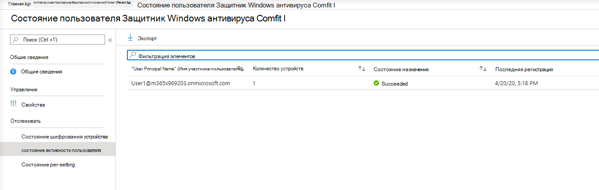
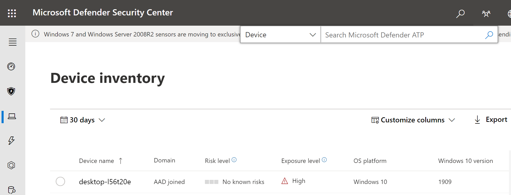

# Подключение с помощью Microsoft Endpoint Manager

[!INCLUDE [Microsoft 365 Defender rebranding](../../includes/microsoft-defender.md)]

**Область применения:**
- [Microsoft Defender для конечной точки](https://go.microsoft.com/fwlink/p/?linkid=2154037)
- [Microsoft 365 Defender](https://go.microsoft.com/fwlink/?linkid=2118804)

> Хотите испытать Microsoft Defender для конечной точки? [Зарегистрився для бесплатной пробной.](https://www.microsoft.com/microsoft-365/windows/microsoft-defender-atp?ocid=docs-wdatp-exposedapis-abovefoldlink)

Эта статья является частью руководства по развертыванию и выступает в качестве примера бортового метода. 

В разделе [Планирование](deployment-strategy.md) для бортовых устройств для службы было предоставлено несколько методов. В этом разделе описывается облачная архитектура. 

 *Схема архитектуры среды*

Несмотря на то, что Defender для конечной точки поддерживает вовсю различные конечные точки и средства, эта статья не охватывает их. Сведения об общей онбордации с помощью других поддерживаемых средств развертывания и методов см. в [обзоре onboarding.](onboarding.md)

[Microsoft Endpoint Manager](https://docs.microsoft.com/mem/endpoint-manager-overview) — это платформа решений, которая объединяет несколько служб. Она включает [Microsoft Intune для](https://docs.microsoft.com/mem/intune/fundamentals/what-is-intune) управления облачными устройствами.

В этом разделе данная тема направляет пользователей в:
- Шаг 1. Создание группы в Microsoft Endpoint Manager (MEM) для назначения конфигураций на службе.
- Шаг 2. Настройка функций Defender для конечных точек с помощью Microsoft Endpoint Manager

Это руководство по учету поможет вам пройти следующие основные действия, которые необходимо предпринять при использовании Microsoft Endpoint Manager:

-   [Определение целевых устройств или пользователей](#identify-target-devices-or-users)

    -   Создание группы Azure Active Directory (пользователь или устройство)

-   [Создание профиля конфигурации](#step-2-create-configuration-policies-to-configure-microsoft-defender-for-endpoint-capabilities)

    -   В Microsoft Endpoint Manager мы назначим вам создание отдельной политики для каждой возможности.

## Ресурсы

Вот ссылки, необходимые для остальной части процесса:

-   [Портал MEM](https://aka.ms/memac)

-   [Центр безопасности](https://securitycenter.windows.com/)

-   [Базовые показатели безопасности Intune](https://docs.microsoft.com/mem/intune/protect/security-baseline-settings-defender-atp#microsoft-defender)

Дополнительные сведения о Microsoft Endpoint Manager ознакомьтесь с этими ресурсами:
- [Страница Microsoft Endpoint Manager](https://docs.microsoft.com/mem/)
- [Сообщение в блоге о схождении Intune и ConfigMgr](https://www.microsoft.com/microsoft-365/blog/2019/11/04/use-the-power-of-cloud-intelligence-to-simplify-and-accelerate-it-and-the-move-to-a-modern-workplace/)
- [Введение видео на MEM](https://www.microsoft.com/microsoft-365/blog/2019/11/04/use-the-power-of-cloud-intelligence-to-simplify-and-accelerate-it-and-the-move-to-a-modern-workplace)

## Шаг 1. На борту устройств путем создания группы в MEM для назначения конфигураций на
### Определение целевых устройств или пользователей
В этом разделе мы создадим тестовую группу для назначения конфигураций.

>[!NOTE]
>Intune использует группы Azure Active Directory (Azure AD) для управления устройствами и пользователями. В качестве администратора Intune можно настроить группы в соответствии с вашими организационными потребностями. 
Дополнительные сведения см. в [добавлении групп для организации пользователей и устройств.](https://docs.microsoft.com/mem/intune/fundamentals/groups-add)

### Создание группы

1.  Откройте портал MEM.

2.  Open **Groups > New Group**.

    > [!div class="mx-imgBorder"]
    > 

3.  Введите сведения и создайте новую группу.

    > [!div class="mx-imgBorder"]
    > 

4.  Добавьте тестовый пользователь или устройство.

5.  Откройте новую **группу из > групп.**

6.  Выберите  **члены > добавить членов**.

7.  Найдите тестовый пользователь или устройство и выберите его.

    > [!div class="mx-imgBorder"]
    > 

8.  Теперь в группе тестирования есть член, который необходимо протестировать.

## Шаг 2. Создание политик конфигурации для настройки возможностей Microsoft Defender для конечных точек
В следующем разделе будет создаваться ряд политик конфигурации.

Во-первых, это политика конфигурации, чтобы выбрать, какие группы пользователей или устройств будут на борту в Defender для конечной точки:

- [Обнаружение и устранение угроз на конечных точках](#endpoint-detection-and-response) 

Затем вы продолжите создание нескольких различных типов политик безопасности конечных точек:

- [Защита нового поколения](#next-generation-protection)
- [Сокращение направлений атак](#attack-surface-reduction--attack-surface-reduction-rules)

### Обнаружение и устранение угроз на конечных точках

1.  Откройте портал MEM.

2.  Перейдите к **службе безопасности > endpoint detection and response**. Нажмите **кнопку Создать профиль**.

    > [!div class="mx-imgBorder"]
    > 

3.  В **платформе выберите Windows 10 и более поздние версии Profile - Endpoint detection and response > Create**.

4.  Введите имя и описание, а затем выберите  **Далее**.

    > [!div class="mx-imgBorder"]
    > 

5.  Выберите параметры по мере необходимости, а затем выберите  **Далее**.

    > [!div class="mx-imgBorder"]
    > 

    > [!NOTE]
    > В этом примере это было автоматически заполнено, так как Defender для конечной точки уже интегрирован с Intune. Дополнительные сведения об интеграции см. в дополнительных сведениях [включить Microsoft Defender для конечной точки в Intune.](https://docs.microsoft.com/mem/intune/protect/advanced-threat-protection-configure#to-enable-microsoft-defender-atp)
    > 
    > Ниже приводится пример того, что вы увидите, когда Microsoft Defender для конечной точки не интегрирована с Intune:
    >
    > 

6.  При необходимости добавьте теги области, а затем выберите  **Далее**.

    > [!div class="mx-imgBorder"]
    > 

7.  Добавьте тестовую группу, нажав на **Выберите группы,** чтобы включить и выбрать группу, а затем выберите  **Далее**.

    > [!div class="mx-imgBorder"]
    > 

8.  Просмотрите и примите, а затем выберите  **Create**.

    > [!div class="mx-imgBorder"]
    > 

9.  Вы можете просмотреть завершенную политику.

    > [!div class="mx-imgBorder"]
    > 

### Защита нового поколения

1.  Откройте портал MEM.

2.  Перейдите в **конечную > антивирусную > создать политику**.

    > [!div class="mx-imgBorder"]
    > 

3.  Выберите **платформу — Windows 10 и более поздние версии — Windows и Profile — антивирус Microsoft Defender > Create**.

4.  Введите имя и описание, а затем выберите  **Далее**.

    > [!div class="mx-imgBorder"]
    > 

5.  На странице **Параметры** конфигурации : Установите конфигурации, необходимые для антивируса Microsoft Defender (облачная защита, исключения, Real-Time защита и исправление).

    > [!div class="mx-imgBorder"]
    > 

6.  При необходимости добавьте теги области, а затем выберите  **Далее**.

    > [!div class="mx-imgBorder"]
    > 

7.  Выберите группы, которые необходимо включить, назначьте тестовой группе, а затем выберите  **Далее**.

    > [!div class="mx-imgBorder"]
    > 

8.  Просмотрите и создайте, а затем выберите  **Create**.

    > [!div class="mx-imgBorder"]
    > 

9.  Вы увидите созданную политику конфигурации.

    > [!div class="mx-imgBorder"]
    > 

### Уменьшение поверхности атаки — правила уменьшения поверхности атаки

1.  Откройте портал MEM.

2.  Перейдите к **области безопасности конечных точек > для уменьшения поверхности Attack.**

3.  Выберите  **создать политику**.

4.  Выберите **платформу — Windows 10 и более поздние — Правила** уменьшения поверхности атаки > Создать .

    > [!div class="mx-imgBorder"]
    > 

5.  Введите имя и описание, а затем выберите  **Далее**.

    > [!div class="mx-imgBorder"]
    > 

6.  На странице **Параметры конфигурации:** Установите конфигурации, необходимые для правил уменьшения поверхности Атаки, а затем выберите  **Далее**.

    > [!NOTE]
    > Мы настроим все правила снижения поверхности атаки на аудит.
    > 
    > Дополнительные сведения см. в [правилах уменьшения поверхности Attack.](attack-surface-reduction.md)

    > [!div class="mx-imgBorder"]
    > 

7.  Добавьте теги области по мере необходимости, а затем выберите  **Далее**.

    > [!div class="mx-imgBorder"]
    > 

8.  Выберите группы, включив и назначив группе тестирования, а затем выберите  **Далее**.

    > [!div class="mx-imgBorder"]
    > 

9. Просмотрите сведения, а затем выберите  **Создать**.

    > [!div class="mx-imgBorder"]
    > 

10. Просмотр политики.

    > [!div class="mx-imgBorder"]
    > 

### Уменьшение поверхности атаки — веб-защита

1.  Откройте портал MEM.

2.  Перейдите к **области безопасности конечных точек > для уменьшения поверхности Attack.**

3.  Выберите  **создать политику**.

4.  Выберите **Windows 10 и более поздние версии — веб> создать**.

    > [!div class="mx-imgBorder"]
    > 

5.  Введите имя и описание, а затем выберите  **Далее**.

    > [!div class="mx-imgBorder"]
    > 

6.  На странице **Параметры конфигурации**: Установите конфигурации, необходимые для веб-защиты, а затем выберите  **Далее**.

    > [!NOTE]
    > Мы настраиваем веб-защиту для блокировки.
    > 
    > Дополнительные сведения см. в [веб-защите.](web-protection-overview.md)

    > [!div class="mx-imgBorder"]
    > 

7.  Добавьте теги области по мере **необходимости > Далее**.

    > [!div class="mx-imgBorder"]
    > 

8.  Выберите **Назначение для тестирования группы > Далее**.

    > [!div class="mx-imgBorder"]
    > 

9.  Выберите **обзор и создайте > создать**.

    > [!div class="mx-imgBorder"]
    > 

10. Просмотр политики.

    > [!div class="mx-imgBorder"]
    > 

## Проверка параметров конфигурации

### Подтверждение примененных политик

После того, как политика конфигурации назначена, на ее применение уйма времени займет некоторое время.

Сведения о сроках см. в [сведениях о конфигурации Intune.](https://docs.microsoft.com/mem/intune/configuration/device-profile-troubleshoot#how-long-does-it-take-for-devices-to-get-a-policy-profile-or-app-after-they-are-assigned)

Чтобы подтвердить, что политика конфигурации применена к тестовом устройству, выполните следующий процесс для каждой политики конфигурации.

1.  Откройте портал MEM и перейдите к соответствующей политике, как показано на шагах выше. В следующем примере показаны параметры защиты следующего поколения.

    > [!div class="mx-imgBorder"]
    > 

2.  Выберите политику **конфигурации,** чтобы просмотреть состояние политики.

    > [!div class="mx-imgBorder"]
    > 

3.  Чтобы  **увидеть состояние,** выберите состояние устройства.

    > [!div class="mx-imgBorder"]
    > 

4.  Чтобы  **увидеть** состояние, выберите состояние пользователя.

    > [!div class="mx-imgBorder"]
    > 

5.  Выберите  **состояние per-setting,** чтобы увидеть состояние.

    >[!TIP]
    >Это представление очень полезно для определения параметров, которые конфликтуют с другой политикой.

    > [!div class="mx-imgBorder"]
    > 

### Обнаружение и устранение угроз на конечных точках

1.  Перед применением конфигурации не следует задействовать службу защиты конечных точек Defender для конечной точки.

    > [!div class="mx-imgBorder"]
    > 

2.  После того, как конфигурация будет применена, следует начать работу службы защиты конечных точек Defender для конечных точек.

    > [!div class="mx-imgBorder"]
    > 

3.  После запуска служб на устройстве устройство отображается в центре безопасности Microsoft Defender.

    > [!div class="mx-imgBorder"]
    > 

### Защита нового поколения

1.  Прежде чем применять политику на тестовом устройстве, вы должны иметь возможность вручную управлять настройками, как показано ниже.

    > [!div class="mx-imgBorder"]
    > 

2.  После того, как политика будет применена, вы не сможете вручную управлять настройками.

    > [!NOTE]
    > На следующем изображении **включаем облачную защиту** и включаем защиту в режиме реального времени. 

    > [!div class="mx-imgBorder"]
    > 

### Уменьшение поверхности атаки — правила уменьшения поверхности атаки

1.  Перед тем как применить политику на тестовом устройстве, введите окно PowerShell и введите `Get-MpPreference` .

2.  Это должно отвечать следующими строками без контента:

    > AttackSurfaceReductionOnlyExclusions:
    > 
    > AttackSurfaceReductionRules_Actions:
    > 
    > AttackSurfaceReductionRules_Ids:

    

3.  После применения политики на тестовом устройстве откройте Windows PowerShell и введите `Get-MpPreference` .

4.  Это должно отвечать следующими строками содержимым, как показано ниже:

    

### Уменьшение поверхности атаки — веб-защита

1.  На тестовом устройстве откройте Windows PowerShell и введите `(Get-MpPreference).EnableNetworkProtection` .

2.  Это должно отвечать с 0, как показано ниже.

    

3.  После применения политики откройте Windows PowerShell и введите `(Get-MpPreference).EnableNetworkProtection` .

4.  Это должно отвечать с 1, как показано ниже.

    
