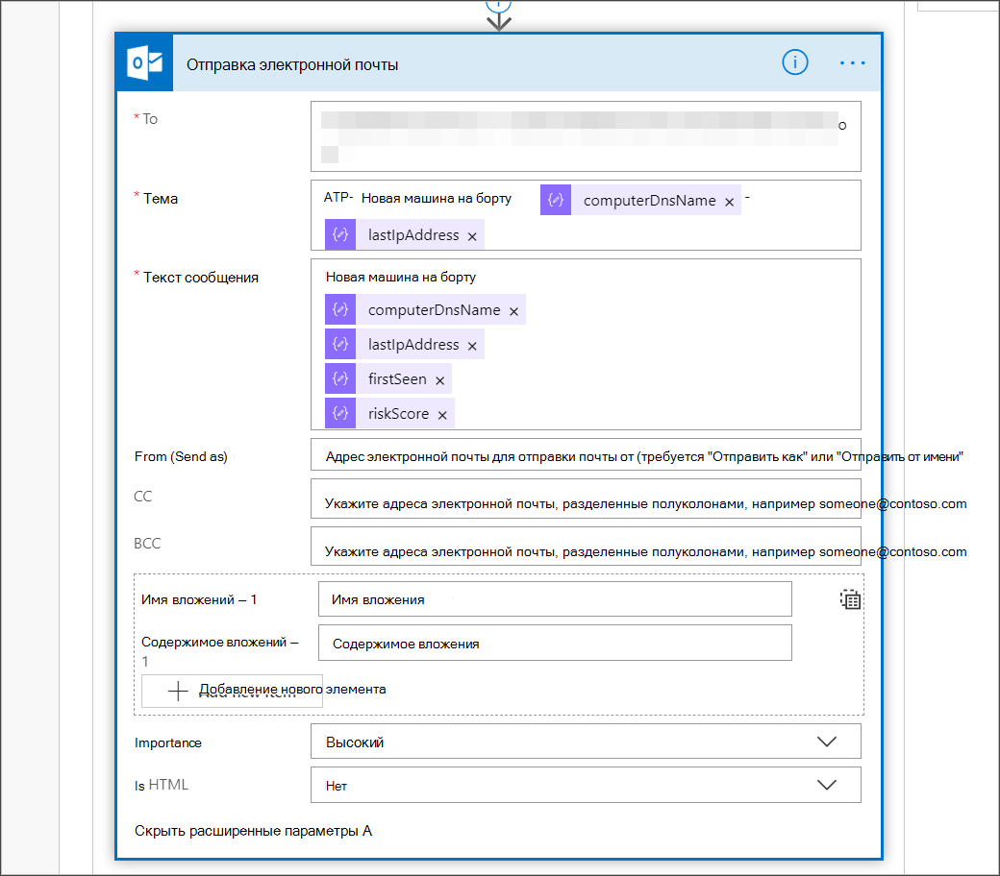

# <a name="create-a-notification-rule-when-a-local-onboarding-or-offboarding-script-is-used"></a>Создание правила уведомлений при локальном сценарии бортового или offboarding

[!INCLUDE [Microsoft 365 Defender rebranding](../../includes/microsoft-defender.md)]


**Область применения:**
- [Microsoft Defender для конечной точки](https://go.microsoft.com/fwlink/p/?linkid=2154037)
- [Microsoft 365 Defender](https://go.microsoft.com/fwlink/?linkid=2118804)


> Хотите испытать Microsoft Defender для конечной точки? [Зарегистрився для бесплатной пробной.](https://www.microsoft.com/microsoft-365/windows/microsoft-defender-atp?ocid=docs-wdatp-exposedapis-abovefoldlink)

[!include[Microsoft Defender for Endpoint API URIs for US Government](../../includes/microsoft-defender-api-usgov.md)]

[!include[Improve request performance](../../includes/improve-request-performance.md)]


Создайте правило уведомлений, чтобы при создании локального сценария включив или отключаясь, вы будете уведомлены. 

## <a name="before-you-begin"></a>Прежде чем начать
Необходимо иметь доступ к:
 - Microsoft Flow (Flow план 1 как минимум). Дополнительные сведения см. [в Flow странице ценообразования.](https://flow.microsoft.com/pricing/)
 - Azure Table или SharePoint список или библиотека / SQL DB

## <a name="create-the-notification-flow"></a>Создание потока уведомлений

1. В [flow.microsoft.com](https://flow.microsoft.com/).

2. Перейдите **к потоку > New > Scheduled - из пустого**. 

    


3. Создайте запланированный поток.
   1. Введите имя потока.
   2. Укажите начало и время.
   3. Укажите частоту. Например, каждые 5 минут.

    

4. Выберите кнопку +, чтобы добавить новое действие. Новое действие будет http-запросом для API центра безопасности Defender для конечных точек. Кроме того, его можно заменить на внедорожный соединителка WDATP (действие: "Machines - Get list of machines"). 

    


5. Введите следующие поля HTTP:

   - Метод: "GET" в качестве значения для получения списка устройств.
   - URI. Введите `https://api.securitycenter.microsoft.com/api/machines` .
   - Проверка подлинности. Выберите "Active Directory OAuth".
   - Клиент. Войдите и перейдите Azure Active Directory > регистрации приложений и получите значение https://portal.azure.com Tenant ID. 
   - Аудитория: `https://securitycenter.onmicrosoft.com/windowsatpservice\`
   - Client ID. Войдите и перейдите Azure Active Directory > регистрации приложений и получите значение https://portal.azure.com Client ID. 
   - Тип учетных данных. Выберите "Секрет".
   - Секрет: войдите и перейдите Azure Active Directory > регистрации приложений и получите значение https://portal.azure.com Tenant ID. 

    


6. Добавьте новый шаг, выбрав **Добавить новое действие,** а затем **ищите** операции данных и выберите **Parse JSON**.

    

7. Добавление body в **поле контента.**

    

8. Выберите пример **полезной нагрузки Use для создания ссылки схемы.**

    

9. Скопируйте и вклеите следующий фрагмент JSON:

    ```
    {
        "type": "object",
        "properties": {
            "@@odata.context": {
                "type": "string"
            },
            "value": {
                "type": "array",
                "items": {
                    "type": "object",
                    "properties": {
                        "id": {
                            "type": "string"
                        },
                        "computerDnsName": {
                            "type": "string"
                        },
                        "firstSeen": {
                            "type": "string"
                        },
                        "lastSeen": {
                            "type": "string"
                        },
                        "osPlatform": {
                            "type": "string"
                        },
                        "osVersion": {},
                        "lastIpAddress": {
                            "type": "string"
                        },
                        "lastExternalIpAddress": {
                            "type": "string"
                        },
                        "agentVersion": {
                            "type": "string"
                        },
                        "osBuild": {
                            "type": "integer"
                        },
                        "healthStatus": {
                            "type": "string"
                        },
                        "riskScore": {
                            "type": "string"
                        },
                        "exposureScore": {
                            "type": "string"
                        },
                        "aadDeviceId": {},
                        "machineTags": {
                            "type": "array"
                        }
                    },
                    "required": [
                        "id",
                        "computerDnsName",
                        "firstSeen",
                        "lastSeen",
                        "osPlatform",
                        "osVersion",
                        "lastIpAddress",
                        "lastExternalIpAddress",
                        "agentVersion",
                        "osBuild",
                        "healthStatus",
                        "rbacGroupId",
                        "rbacGroupName",
                        "riskScore",
                        "exposureScore",
                        "aadDeviceId",
                        "machineTags"
                    ]
                }
            }
        }
    }

    ```

10.  Извлечение значений из вызова JSON и проверка того, зарегистрировано ли в списке SharePoint в качестве примера:
- Если да, уведомление не запускается
- Если нет, зарегистрирует новое бортовом устройстве (ы) в списке SharePoint и уведомление будет отправлено администратору Defender for Endpoint

    

    

11. В **condition** добавьте следующее выражение: "length(body('Get_items'???'' значение'])" и установите условие равно 0.

      
     
       
    

## <a name="alert-notification"></a>Оповещение
Следующее изображение является примером уведомления по электронной почте.


## <a name="tips"></a>Советы 

- Здесь можно фильтровать только lastSeen:
    - Каждые 60 минут:
      - Возьмите все устройства, которые последний раз видели в течение последних 7 дней. 

- Для каждого устройства: 
    - Если последнее увиденное свойство находится с интервалом в один час [-7 дней, -7days + 60 минут] -> оповещение о возможности отключения.
    - Если вы впервые увидели в последний час - > оповещение для бортового.

В этом решении не будет дублироваться оповещений: есть клиенты с многочисленными устройствами. Получение всех этих устройств может быть очень дорогим и может потребовать paging.

Вы можете разделить его на два запроса: 
1.  Для offboarding возьмите только этот интервал с помощью OData $filter только уведомить, если условия выполнены.
2.  Возьмите все устройства, которые последний раз видели в течение последнего часа, и проверьте впервые увиденное свойство для них (если первое увиденное свойство находится в последний час, последний вид должен быть там). 

