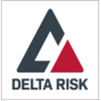
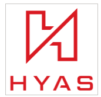

# Партнерские приложения в Microsoft Defender для конечной точки 

[!INCLUDE [Microsoft 365 Defender rebranding](../../includes/microsoft-defender.md)]

**Область применения:**
- [Microsoft Defender для конечной точки](https://go.microsoft.com/fwlink/p/?linkid=2154037)
- [Microsoft 365 Defender](https://go.microsoft.com/fwlink/?linkid=2118804)

> Хотите испытать Microsoft Defender для конечной точки? [Зарегистрився для бесплатной пробной.](https://www.microsoft.com/microsoft-365/windows/microsoft-defender-atp?ocid=docs-wdatp-exposedapis-abovefoldlink)

Defender for Endpoint поддерживает сторонние приложения, которые помогают повысить возможности обнаружения, расследования и обнаружения угроз платформы.

Поддержка сторонних решений помогает в дальнейшем упорядочить, интегрировать и организовать защиту от других поставщиков с помощью Microsoft Defender для endpoint; позволяет группам безопасности эффективнее реагировать на современные угрозы.

Microsoft Defender для конечной точки легко интегрируется с существующими решениями безопасности. Интеграция обеспечивает интеграцию со следующими решениями, такими как:

- SIEM
- Решения для управления билетами и ИТ-службами
- Управляемые поставщики служб безопасности (MSSP)
- Показатели IoC для ingestions и сопо-
- Автоматическое исследование и исправление устройств на основе внешних оповещений
- Интеграция с системами управления безопасностью и автоматизацией (SOAR)

## Поддерживаемые приложения

### Сведения о безопасности и аналитика

Логотип |Имя партнера   | Описание 
:---|:---|:---
| [Платформа AttackIQ](https://go.microsoft.com/fwlink/?linkid=2103502) | Платформа AttackIQ проверяет правильность настройки Defender для конечной точки, безопасно запуская непрерывные атаки на производственные активы
| [AzureSentinel](https://go.microsoft.com/fwlink/?linkid=2135705) | Поток оповещений из Microsoft Defender для конечной точки в Azure Sentinel 
 | [Cymulate](https://go.microsoft.com/fwlink/?linkid=2135574)| Сопоставление выводов Defender для конечной точки с имитацией атак для проверки точного обнаружения и эффективных действий реагирования
 | [Эластичная безопасность](https://go.microsoft.com/fwlink/?linkid=2139303) | Elastic Security — это свободное и открытое решение для предотвращения, обнаружения и реагирования на угрозы
 | [IBM QRadar](https://go.microsoft.com/fwlink/?linkid=2113903) | Настройка IBM QRadar для сбора обнаружения в Defender для конечной точки 
 | [Micro Focus ArcSight](https://go.microsoft.com/fwlink/?linkid=2113548) | Используйте Micro Focus ArcSight, чтобы вытащить Defender для обнаружения конечных точек
 | [RSA NetWitness](https://go.microsoft.com/fwlink/?linkid=2118566) | Защитник потока для оповещений конечных точек rSA NetWitness с помощью API Graph безопасности Microsoft
 | [SafeBreach](https://go.microsoft.com/fwlink/?linkid=2114114)| Получение видимости событий безопасности Defender для конечных точек, которые автоматически коррелируются с моделированием SafeBreach
 | [Управление уязвимостью Skybox](https://go.microsoft.com/fwlink/?linkid=2127467) | Управление уязвимостью Skybox сокращает шум управление уязвимостями, сопоставляет бизнес, сеть и контекст угроз, чтобы выявить самые рискованные уязвимости
 | [Splunk](https://go.microsoft.com/fwlink/?linkid=2129805) | Надстройка Defender для конечной точки позволяет пользователям Splunk гнать все оповещений и вспомогательные сведения в их Splunk
 | [XM Cyber](https://go.microsoft.com/fwlink/?linkid=2136700) | Приоритизация ответа на оповещение с учетом факторов риска и высокой стоимости активов

### Оркестровка и автоматизация

Логотип |Имя партнера   | Описание 
:---|:---|:---
 | [CyberSponse CyOps](https://go.microsoft.com/fwlink/?linkid=2115943) | CyOps интегрируется с Defender для конечной точки, чтобы автоматизировать высокоскоростные книги ответов на инциденты клиентов
 | [Delta Risk ActiveEye](https://go.microsoft.com/fwlink/?linkid=2127468) | Delta Risk, ведущий поставщик soC-as-a-Service и служб безопасности, интегрирует Defender for Endpoint со своей облачной платформой SOAR ActiveEye.
 | [Demisto, a Palo Alto Networks Company](https://go.microsoft.com/fwlink/?linkid=2108414) | Demisto интегрируется с Defender для конечной точки, чтобы позволить группам безопасности организовать и автоматизировать мониторинг безопасности конечной точки, обогащение и реагирование
 | [Microsoft Flow & Azure Functions](https://go.microsoft.com/fwlink/?linkid=2114300) | Используйте соединители Defender для конечной точки для Azure Logic Apps & Microsoft Flow для автоматизации процедур безопасности
 | [Rapid7 InsightConnect](https://go.microsoft.com/fwlink/?linkid=2116040) | InsightConnect интегрируется с Defender для конечной точки для ускорения, оптимизации и интеграции процессов безопасности с большим временем
 | [ServiceNow](https://go.microsoft.com/fwlink/?linkid=2135621) | Ingest alerts into ServiceNow Security Operations solution based on Microsoft Graph API integration
 | [Swimlane](https://go.microsoft.com/fwlink/?linkid=2113902) | Максимальное использование возможностей реагирования на инциденты с использованием Swimlane и Defender для конечной точки вместе

### Сведения об угрозах

Логотип |Имя партнера   | Описание 
:---|:---|:---
 | [MISP (Платформа обмена информацией о вредоносных программах)](https://go.microsoft.com/fwlink/?linkid=2127543) | Интеграция индикаторов угроз из платформы обмена сведениями об угрозах с открытым исходным кодом в среду Defender для конечной точки
 | [Palo Alto Networks](https://go.microsoft.com/fwlink/?linkid=2099582) | Обогащение защиты конечной точки путем расширения автофокуса и других каналов угроз в Defender для конечной точки с помощью MineMeld
 | [ThreatConnect](https://go.microsoft.com/fwlink/?linkid=2114115) | Оповещение и/или блокировка пользовательских сведений об угрозах из playbooks ThreatConnect с помощью индикаторов Defender для конечных точек

### Сетевая безопасность
Логотип |Имя партнера   | Описание 
:---|:---|:---
 | [Менеджер политики ClearPass Aruba](https://go.microsoft.com/fwlink/?linkid=2127544) | Убедитесь, что Defender для конечной точки установлен и обновляется на каждой конечной точке, прежде чем разрешить доступ к сети
 | [Blue Hexagon for Network](https://go.microsoft.com/fwlink/?linkid=2104613) | Blue Hexagon построила первую в отрасли платформу глубокого обучения в режиме реального времени для защиты от сетевых угроз
 | [CyberMDX](https://go.microsoft.com/fwlink/?linkid=2135620) | Cyber MDX интегрирует всеобъемлющую видимость активов здравоохранения, предотвращение угроз и отработку в среде Defender for Endpoint
 | [Защита HYAS](https://go.microsoft.com/fwlink/?linkid=2156763) | Защита HYAS использует авторитетные знания инфраструктуры злоумышленников для активной защиты конечных точек Microsoft Defender для конечных точек конечных точек от кибератак
 |[Обнаружение и реагирование сети Vectra (NDR)](https://go.microsoft.com/fwlink/?linkid=866934)| Vectra применяет исследования & безопасности для обнаружения и реагирования на кибератаки в режиме реального времени

### Межплатформенная поддержка
Логотип |Имя партнера   | Описание 
:---|:---|:---
| [Bitdefender](https://go.microsoft.com/fwlink/?linkid=860032)| Bitdefender GravityZone — это многоуровневая платформа защиты конечных точек следующего поколения, предлагающая комплексную защиту от всего спектра сложных киберугроз
 | [Better Mobile](https://go.microsoft.com/fwlink/?linkid=2086214)| Решение MTD на основе AI для остановки мобильных угроз & фишинга. Частный просмотр интернета для защиты конфиденциальности пользователей 
| [Corrata](https://go.microsoft.com/fwlink/?linkid=2081148) | Мобильное решение — защита мобильных устройств с помощью детализации и управления от Corrata 
| [Lookout](https://go.microsoft.com/fwlink/?linkid=866935)| Получить телеметрию защиты от мобильных угроз для мобильных устройств Android и iOS
 | [Symantec Endpoint Protection Mobile](https://go.microsoft.com/fwlink/?linkid=2090992)| SEP Mobile помогает предприятиям прогнозировать, обнаруживать и предотвращать угрозы безопасности и уязвимости на мобильных устройствах 
| [Zimperium](https://go.microsoft.com/fwlink/?linkid=2118044)|Расширение защитника для конечной точки на iOS и Android с помощью Машинное обучение мобильной защиты от угроз

## Другие интеграции

Логотип |Имя партнера   | Описание 
:---|:---|:---
| [Веб-фильтр Cyren](https://go.microsoft.com/fwlink/?linkid=2108221)| Расширение защитника для конечной точки с помощью расширенной веб-фильтрации
| [Morphisec](https://go.microsoft.com/fwlink/?linkid=2086215)| Обеспечивает движущиеся целевые системы защиты с расширенным питанием от угроз. Интегрирует данные судебной экспертизы непосредственно в панели мониторинга центра безопасности WD, чтобы помочь определить приоритеты оповещений, определить оценку риска устройства и визуализировать полную хронологию атак, включая внутренние сведения о памяти.
| [Облако THOR](https://go.microsoft.com/fwlink/?linkid=862988)| Обеспечивает проверку в прямом эфире по запросу с помощью базы подписей с упором на постоянные угрозы

## Интеграция SIEM
Defender for Endpoint поддерживает интеграцию SIEM с помощью различных методов. Это может включать специализированный системный интерфейс SIEM с вне соединителем полей, общий API оповещения, позволяющий настраивать реализацию, и API действий, позволяющий управление состоянием оповещений.  Дополнительные сведения см. в [дополнительных сведениях о интеграции SIEM.](enable-siem-integration.md)

## Управление билетами и ИТ-службами 
Интеграция решений по продаже билетов помогает реализовать процессы ручного и автоматического ответа. Defender for Endpoint может автоматически создавать билеты при создании оповещений и устранять оповещения при закрытии билетов с помощью API оповещений. 

## Интеграция системы управления безопасностью и автоматизации (SOAR) 
Решения для оркестровки могут помочь в создании книг и интеграции богатой модели данных и действий, которые API Defender для конечных точек предоставляет для оркестровки ответов, таких как запрос данных устройств, изоляция устройства, блок/разрешение, устранение оповещения и другие. 

## Внешняя корреляция оповещений и автоматическое расследование и исправление  
Defender for Endpoint предлагает уникальные возможности автоматического расследования и устранения последствий для масштабирования реагирования на инциденты.
  
Интеграция функций автоматического расследования и реагирования с другими решениями, такими как IDS и брандмауэры, помогает устранять оповещения и минимизировать сложности, связанные с корреляцией сигналов сети и устройств, эффективно упрощая действия по устранению и устранению угроз на устройствах.  

Внешние оповещений можно навести в Defender для конечной точки. Эти оповещений показаны бок о бок с дополнительными оповещениями на основе устройств из Defender для конечной точки. Это представление обеспечивает полный контекст оповещения и может раскрыть полную версию атаки.  

## Показатели, совпадающие
Для поддержания и использования индикаторов компрометации (IOCs) можно использовать сведения об угрозах от поставщиков и агрегаторов.

Defender for Endpoint позволяет интегрироваться с этими решениями и действовать на IoCs, сопоставляет богатую телеметрию для создания оповещений.  Кроме того, можно использовать возможности предотвращения и автоматического реагирования, чтобы заблокировать выполнение и принять меры по исправлению при совпадении.

Защитник для конечной точки в настоящее время поддерживает соответствие МОК и исправление для файлов и сетевых индикаторов. Блокировка поддерживается для индикаторов файлов.  

## Поддержка нестандартных Windows платформ
Defender for Endpoint предоставляет централизованную службу безопасности для Windows и Windows, включая мобильные устройства. Вы сможете видеть оповещения из различных поддерживаемых операционных систем (ОС) на портале и лучше защищать сеть организации. 
