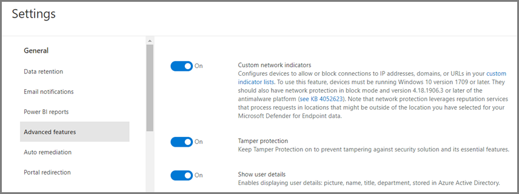
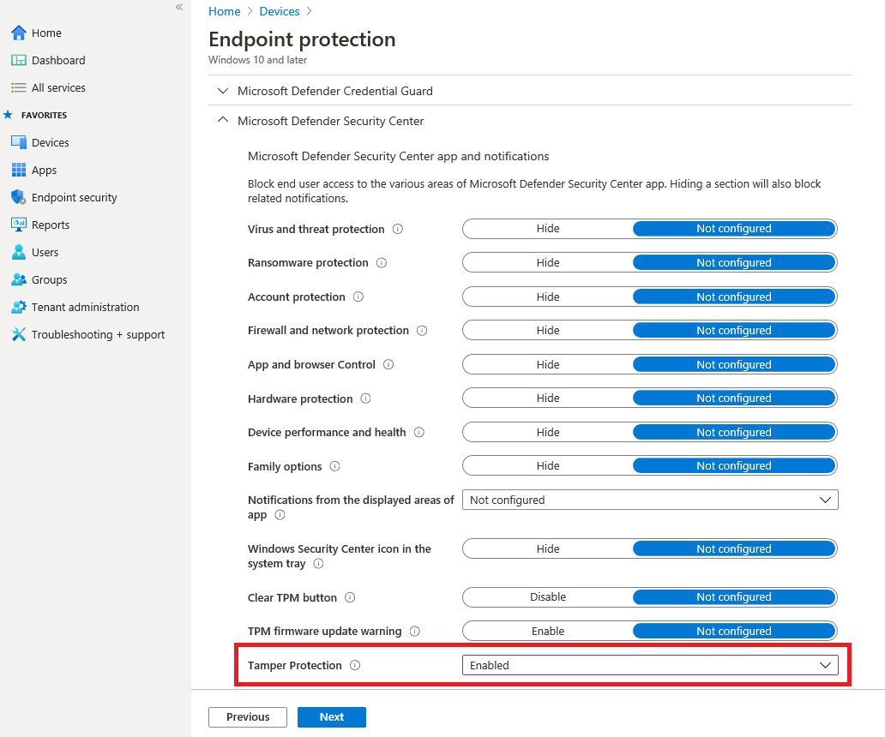
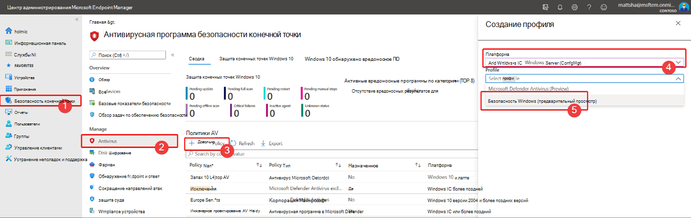

# Защита параметров безопасности с помощью защиты от подделки

[!INCLUDE [Microsoft 365 Defender rebranding](../../includes/microsoft-defender.md)]

**Область применения:**

- [Microsoft Defender для конечной точки](/microsoft-365/security/defender-endpoint/)

Защита от взлома доступна для устройств с одной из следующих версий Windows:

- Windows 10
- Windows Server 2019
- Windows Server, версия 1803 или более поздней версии
- Windows Server 2016

## Обзор

Во время некоторых видов кибератак злоумышленники пытаются отключить функции безопасности, такие как антивирусная защита, на компьютерах. Злоумышленникам нравится отключать функции безопасности, чтобы упростить доступ к данным, установить вредоносные программы или иным образом использовать данные, удостоверения и устройства. Защита от взлома помогает предотвратить подобные вещи.

С защитой от взлома вредоносные приложения не могут принимать такие действия, как:

- Отключение защиты от вирусов и угроз
- Отключение защиты в режиме реального времени
- Отключение мониторинга поведения
- Отключение антивируса (например, IOfficeAntivirus (IOAV))
- Отключение облачной защиты
- Удаление обновлений разведки безопасности

### Принципы работы

Защита от взлома по сути блокирует антивирус Microsoft Defender и предотвращает изменения параметров безопасности с помощью приложений и методов, таких как:

- Настройка параметров редактора реестра на устройстве Windows
- Изменение параметров с помощью cmdlets PowerShell
- Редактирование или удаление параметров безопасности с помощью групповых политик

Защита от взлома не мешает вам просматривать параметры безопасности. Защита от взлома не влияет на регистрацию сторонних антивирусных приложений в приложении Windows Security. Если ваша организация использует Windows 10 Enterprise E5, отдельные пользователи не могут изменить параметр защиты от взлома; в этих случаях защита от взлома управляется вашей командой безопасности.

### Что нужно сделать

| Для выполнения этой задачи... | См. в этом разделе... |
|:---|:---|
| Включите защиту от взлома (или отключение) в Центре безопасности Защитника Майкрософт 
Управление защитой от взлома в клиенте | [Управление защитой от взлома для организации с помощью Центра безопасности Защитника Майкрософт](#manage-tamper-protection-for-your-organization-using-the-microsoft-defender-security-center) |
| Включите защиту от взлома (или отключение) для всех или части организации с помощью Intune 
Настройка параметров защиты от взлома в организации | [Управление защитой от взлома для организации с помощью Intune](#manage-tamper-protection-for-your-organization-using-intune) |
| Включите защиту от взлома (или отключение) для организации с помощью диспетчера конфигурации | [Управление защитой от взлома для организации с помощью присоединений клиента к Configuration Manager версии 2006](#manage-tamper-protection-for-your-organization-with-configuration-manager-version-2006) |
| Включите защиту от взлома (или выключение) для отдельного устройства | [Управление защитой от взлома на отдельном устройстве](#manage-tamper-protection-on-an-individual-device) |
| Просмотр сведений о попытках фальсификации на устройствах | [Просмотр сведений о попытках фальсификации](#view-information-about-tampering-attempts) |
| Просмотрите рекомендации по безопасности | [Обзор рекомендаций по безопасности](#review-your-security-recommendations) |
| Просмотрите список часто задаваемого вопроса (часто задаваемой вопросы) | [Просмотр задаваемой темы](#view-information-about-tampering-attempts) |

## Управление защитой от взлома для организации с помощью Центра безопасности Защитника Майкрософт

Защита от взлома может быть включена или отключена для клиента с помощью Центра безопасности Защитника Майкрософт ( [https://securitycenter.windows.com](https://securitycenter.windows.com) ). Вот несколько моментов, которые необходимо иметь в виду:

- В настоящее время для новых развертывания по умолчанию работает возможность управления защитой от взлома в Центре безопасности Защитника Майкрософт. В существующих развертываниях защита от взлома доступна на основе выбора, и в ближайшее время планируется сделать этот метод по умолчанию. (Чтобы выбрать в Центре безопасности Защитника Майкрософт, выберите **Параметры**  >  **Расширенные функции**  >  **Защита tamper**.) 

- При использовании Центра безопасности Защитника Майкрософт для управления защитой от взлома не нужно использовать метод Intune или присоединение клиента.

- При управлении защитой от взлома в Центре безопасности Защитника Microsoft параметр применяется широко, затрагивая все устройства с Windows 10, Windows Server 2016 или Windows Server 2019. Чтобы настроить защиту от взлома (например, на некоторых устройствах есть защита от взлома, но отключена для других), используйте [intune](#manage-tamper-protection-for-your-organization-using-intune) или Configuration Manager с присоединением [клиента.](#manage-tamper-protection-for-your-organization-with-configuration-manager-version-2006)

- Если у вас гибридная среда, параметры защиты от взлома, настроенные в Intune, имеют приоритет над настройками, настроенными в Центре безопасности Защитника Майкрософт. 

### Требования по управлению защитой от взлома в Центре безопасности Защитника Майкрософт

- Вы должны иметь соответствующие [разрешения,](/microsoft-365/security/defender-endpoint/assign-portal-access)такие как глобальный администратор, администратор безопасности или операции безопасности.

- На устройствах Windows должна быть запущена одна из следующих версий Windows:
   - Windows 10
   - [Windows Server 2019](/windows-server/get-started-19/whats-new-19)
   - Windows Server, версия [1803 или](/windows/release-health/status-windows-10-1803) более поздней версии
   - [Windows Server 2016](/windows-server/get-started/whats-new-in-windows-server-2016)
   - Дополнительные сведения о выпусках см. в [сведениях о выпуске Windows 10.](/windows/release-health/release-information)

- Ваши устройства должны быть на борту в [Microsoft Defender для конечной точки](/microsoft-365/security/defender-endpoint/onboarding).

- Устройства должны использовать платформу для антивирусных программ версии 4.18.2010.7 (или выше) и версию 1.1.17600.5 (или выше). ([Управление обновлениями антивируса Microsoft Defender и применение базовых показателей](manage-updates-baselines-microsoft-defender-antivirus.md).)

- [Необходимо включить](enable-cloud-protection-microsoft-defender-antivirus.md) облачную защиту.

### Включите защиту от взлома (или отключение) в Центре безопасности Защитника Майкрософт 

1. Перейдите в Центр безопасности защитника Майкрософт [https://securitycenter.windows.com](https://securitycenter.windows.com) () и войдите.

2. Выбор **параметров**.

3. Перейдите **к функциям General**  >  **Advanced** и включи защиту от взлома.

## Управление защитой от взлома для организации с помощью Intune

Если вы входите в группу безопасности организации, а ваша подписка включает [Intune,](/intune/fundamentals/what-is-intune)вы можете включить (или отключить) защиту от взлома для организации на портале центра администрирования [Microsoft Endpoint Manager.](https://endpoint.microsoft.com) Используйте Intune для настройки параметров защиты от взлома. Например, если вы хотите включить защиту от взлома на некоторых устройствах, но не на всех, используйте Intune.

### Требования к управлению защитой от взлома в Intune

- Вы должны иметь соответствующие [разрешения,](/microsoft-365/security/defender-endpoint/assign-portal-access)такие как глобальный администратор, администратор безопасности или операции безопасности.

- Ваша организация использует [Intune для управления устройствами.](/intune/fundamentals/what-is-device-management) ([Требуются лицензии intune;](/intune/fundamentals/licenses) Intune включен в Microsoft 365 E5.)

- Устройства Windows должны работать под управлением Windows [10 OS 1709](/windows/release-health/status-windows-10-1709), [1803](/windows/release-health/status-windows-10-1803), [1809](/windows/release-health/status-windows-10-1809-and-windows-server-2019) или более поздней версии. Дополнительные сведения о выпусках см. в [сведениях о выпуске Windows 10.)](/windows/release-health/release-information)

- Необходимо использовать службу безопасности Windows [с](https://www.microsoft.com/wdsi/definitions) обновленной аналитикой безопасности до версии 1.287.60.0 (или выше).

- Устройства должны использовать платформу для антивирусных программ версии 4.18.1906.3 (или выше) и версию 1.1.15500.X (или выше). ([Управление обновлениями антивируса Microsoft Defender и применение базовых показателей](manage-updates-baselines-microsoft-defender-antivirus.md).)

### Включите защиту от взлома (или отключение) в Intune

1. Перейдите в [центр администрирования конечной точки](https://endpoint.microsoft.com) Microsoft Manager и войдите в свою работу или учетную запись школы.

2. Выберите   >  **профили конфигурации устройств.**

3. Создайте профиль, который включает следующие параметры:
    - **Платформа: Windows 10 и более поздние версии**
    - **Тип профиля: защита конечной точки**
    - **Категория: Центр безопасности Защитника Майкрософт**
    - **Защита от взлома: включена**

4. Назначьте профиль одной или несколько групп.

### Используете ли вы Windows OS 1709, 1803 или 1809?

Если вы используете Windows 10 OS [1709](/windows/release-health/status-windows-10-1709), [1803](/windows/release-health/status-windows-10-1803)или [1809,](/windows/release-health/status-windows-10-1809-and-windows-server-2019)вы не увидите защиту **tamper в** приложении Безопасности Windows. Вместо этого с помощью PowerShell можно определить, включена ли защита от взлома.

#### Используйте PowerShell, чтобы определить, включена ли защита от взлома

1. Откройте приложение Windows PowerShell.

2. Используйте [комлет Get-MpComputerStatus](/powershell/module/defender/get-mpcomputerstatus?preserve-view=true&view=win10-ps) PowerShell.

3. В списке результатов и посмотрите `IsTamperProtected` . (Значение true *означает,* что включена защита от взлома.)

## Управление защитой от взлома для организации с помощью Configuration Manager, версия 2006

Если вы используете версию [2006](/mem/configmgr/core/plan-design/changes/whats-new-in-version-2006)configuration Manager, вы можете управлять настройками защиты от взлома в Windows 10, Windows Server 2016 и Windows Server 2019 с помощью метода, называемого присоединением *клиента.* Присоединение к клиенту позволяет синхронизировать локальное устройство Configuration Manager в центр администрирования Microsoft Endpoint Manager, а затем доставить политики конфигурации безопасности конечных точек в локальное & устройства.

> [!NOTE]
> Эта процедура может использоваться для расширения защиты от взлома на устройства под управлением Windows 10 и Windows Server 2019. Обязательно просмотрите необходимые условия и другие сведения в ресурсах, указанных в этой процедуре.

1. Настройка присоединений клиента. Чтобы получить помощь в этом, см. в [справке к клиенту Microsoft Endpoint Manager: синхронизация](/mem/configmgr/tenant-attach/device-sync-actions)устройств и действия устройства.

2. В центре [администрирования microsoft Endpoint Manager](https://go.microsoft.com/fwlink/?linkid=2109431)перейдите в **антивирус безопасности endpoint,** а затем выберите  >  + Создать **политику**.  
   - В **списке Платформы** выберите **Windows 10 и Windows Server (ConfigMgr).**  
   - В **списке профилей** выберите **windows Security experience (предварительная версия).**  

3. Развертывание политики в коллекции устройств.

### Нужна помощь с этим методом? 

См. следующие ресурсы:

- [Параметры профиля windows Security в Microsoft Intune](/mem/intune/protect/antivirus-security-experience-windows-settings)
- [Блог сообщества технологий: объявление о защите от взлома для клиентов присоединений к клиенту диспетчера конфигурации](https://techcommunity.microsoft.com/t5/microsoft-endpoint-manager-blog/announcing-tamper-protection-for-configuration-manager-tenant/ba-p/1700246#.X3QLR5Ziqq8.linkedin)

## Управление защитой от взлома на отдельном устройстве

> [!NOTE]
> Защита от взлома блокирует попытки изменить параметры антивируса Microsoft Defender через реестр.
>
> Чтобы защита от взлома не мешала сторонним продуктам безопасности или корпоративным сценариям установки, которые  изменяют эти параметры, перейдите к **Windows Security** и обновив сведения о безопасности до версии 1.287.60.0 или более поздней версии. [(См. обновления разведки безопасности.)](https://www.microsoft.com/wdsi/definitions)
>
> После этого обновления защита от взлома продолжает защищать параметры реестра, и журналы пытаются изменить их, не возвращая ошибок.

Если вы домашний пользователь или не подвержены настройкам, управляемым командой безопасности, вы можете использовать приложение Windows Security для управления защитой от взлома. Для изменения параметров безопасности, таких как защита от взлома, на устройстве должны быть соответствующие разрешения администратора.

Вот что вы видите в приложении Windows Security:

1. Выберите **Начните** и начните вводить *безопасность.* В результатах поиска выберите **Windows Security**.

2. Выберите **параметры защиты &**  >  **вирусов & угрозы.**

3. Установите **защиту от взлома** **для включаемой** или **отключенной.**

## Просмотр сведений о попытках фальсификации

Попытки взлома обычно указывают на крупные кибератаки. Плохие субъекты пытаются изменить параметры безопасности в качестве способа сохраняться и оставаться незамеченными. Если вы входите в команду безопасности организации, вы можете просматривать сведения о таких попытках, а затем принимать соответствующие меры для уменьшения угроз.

При обнаружении попытки взлома в Центре безопасности [Защитника Майкрософт (Microsoft Defender Security Center)](/microsoft-365/security/defender-endpoint/portal-overview) повышается оповещение. [https://securitycenter.windows.com](https://securitycenter.windows.com)

Используя [возможности обнаружения конечных](/microsoft-365/security/defender-endpoint/overview-endpoint-detection-response) точек и реагирования, а также расширенные возможности охоты в Microsoft Defender for Endpoint, группа операций безопасности может исследовать и решать такие попытки. 

## Просмотрите рекомендации по безопасности

Защита от взлома интегрируется с [возможностями управления & уязвимостей.](/microsoft-365/security/defender-endpoint/next-gen-threat-and-vuln-mgt) [Рекомендации по безопасности включают](/microsoft-365/security/defender-endpoint/tvm-security-recommendation) обеспечение включенной защиты от взлома. Например, можно искать в *подделывателье,* как показано на следующем изображении:

В результатах можно выбрать **включить защиту от взлома,** чтобы узнать больше и включить ее.

Дополнительные информацию об управлении & уязвимостей см. в & Управления уязвимостей в Центре безопасности [Защитника Майкрософт.](/microsoft-365/security/defender-endpoint/tvm-dashboard-insights#threat--vulnerability-management-in-microsoft-defender-security-center)

## Вопросы и ответы

### К какой версии ОС Windows применяется настройка защиты от взлома?

Windows 10 OS [1709](/windows/release-health/status-windows-10-1709), [1803](/windows/release-health/status-windows-10-1803), [1809](/windows/release-health/status-windows-10-1809-and-windows-server-2019), или позже вместе с [Microsoft Defender для конечной точки](/microsoft-365/security/defender-endpoint).

Если вы используете Configuration Manager, версию 2006 с присоединением клиента, защита от взлома может быть расширена до Windows Server 2019. См. присоединение к клиенту: Создание и развертывание политики антивирусной защиты конечной точки из [центра администрирования (предварительный просмотр).](/mem/configmgr/tenant-attach/deploy-antivirus-policy)

### Повлияет ли защита от взлома на регистрацию сторонних антивирусов?

Нет. Сторонние антивирусные предложения будут продолжать регистрироваться в приложении Windows Security.

### Что произойдет, если антивирус Microsoft Defender не активен на устройстве?

Устройства, которые находятся в Microsoft Defender для конечной точки, будут иметь антивирус Microsoft Defender, работающий в пассивном режиме. Защита от взлома будет по-прежнему защищать службу и ее функции. 

### Как включить/отключить защиту от взлома?

Если вы домашний пользователь, см. в статью Управление защитой от взлома [на отдельном устройстве.](#manage-tamper-protection-on-an-individual-device)

Если вы — организация, использующая [Microsoft Defender для конечной](/microsoft-365/security/defender-endpoint)точки, вы должны иметь возможность управлять защитой от взлома в Intune, аналогично тому, как вы управляете другими функциями защиты конечных точек. См. следующие разделы этой статьи: 

- [Управление защитой от взлома с помощью Intune](#manage-tamper-protection-for-your-organization-using-intune)
- [Управление защитой от взлома с помощью Configuration Manager, версия 2006](#manage-tamper-protection-for-your-organization-with-configuration-manager-version-2006)
- [Управление защитой от взлома с помощью Центра безопасности Защитника Майкрософт](#manage-tamper-protection-for-your-organization-using-the-microsoft-defender-security-center) (в настоящее время находится в предварительном режиме)

### Как настройка защиты от взлома в Intune влияет на управление антивирусом Microsoft Defender с помощью групповой политики?

Обычная политика группы не применяется к защите от взлома, и при внесения изменений в параметры антивируса Microsoft Defender игнорируются. 

### Для Microsoft Defender для конечной точки настройка защиты от взлома в Intune ориентирована только на всю организацию?

Настройка защиты от взлома в Intune или Microsoft Endpoint Manager может быть ориентирована на всю организацию, а также на определенные устройства и группы пользователей.

### Можно ли настроить защиту tamper в Microsoft Endpoint Configuration Manager?

Если вы используете присоединение клиента, вы можете использовать Microsoft Endpoint Configuration Manager. См. следующие ресурсы:
- [Управление защитой от взлома для организации с помощью Configuration Manager, версия 2006](#manage-tamper-protection-for-your-organization-with-configuration-manager-version-2006)
- [Блог сообщества технологий: объявление о защите от взлома для клиентов присоединений к клиенту диспетчера конфигурации](https://techcommunity.microsoft.com/t5/microsoft-endpoint-manager-blog/announcing-tamper-protection-for-configuration-manager-tenant/ba-p/1700246#.X3QLR5Ziqq8.linkedin)

### У меня есть регистрация Windows E3. Можно ли использовать настройку защиты от взлома в Intune?

В настоящее время настройка защиты от взлома в Intune доступна только для клиентов с [Microsoft Defender для конечной точки.](/microsoft-365/security/defender-endpoint)

### Что произойдет, если я попытаюсь изменить параметры Microsoft Defender для конечных точек в Intune, Microsoft Endpoint Configuration Manager и инструментарии управления Windows, когда на устройстве включена защита от взлома?

Вы не сможете изменить функции, защищенные защитой от взлома; такие запросы на изменение игнорируются.

### Я корпоративный клиент. Могут ли местные администраторы изменить защиту от взлома на своих устройствах?

Нет. Местные администраторы не могут изменять или изменять параметры защиты от взлома.

### Что произойдет, если устройство находится на борту с Microsoft Defender для конечной точки, а затем переходит в отключенное состояние?

Если устройство отключено от Microsoft Defender для конечной точки, включена защита от взлома, что является состоянием по умолчанию для неукомплектоваемых устройств. 

### Будет ли уведомление об изменении состояния защиты от взлома в Центре безопасности Защитника Майкрософт?

Да. Оповещение отображается в [https://securitycenter.microsoft.com](https://securitycenter.microsoft.com) под **оповещении**.

Группа операций безопасности также может использовать поисковые запросы, например следующий пример:

`DeviceAlertEvents | where Title == "Tamper Protection bypass"`

[Просмотр сведений о попытках фальсификации.](#view-information-about-tampering-attempts)

## См. также

[Помощь в обеспечении безопасности компьютеров Windows с помощью защиты конечных точек для Microsoft Intune](/intune/help-secure-windows-pcs-with-endpoint-protection-for-microsoft-intune)

[Получить обзор Microsoft Defender для конечной точки](/microsoft-365/security/defender-endpoint)

[Вместе лучше: антивирусная программа в Microsoft Defender и Microsoft Defender для конечной точки](why-use-microsoft-defender-antivirus.md)