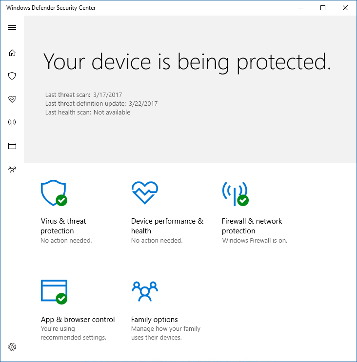

# Запретить пользователям видеть и взаимодействовать с пользовательским интерфейсом антивируса Microsoft Defender

[!INCLUDE [Microsoft 365 Defender rebranding](../../includes/microsoft-defender.md)]

**Область применения:**

- [Microsoft Defender для конечной точки](/microsoft-365/security/defender-endpoint/)

Можно использовать групповую политику, чтобы запретить пользователям конечных точек видеть антивирусный интерфейс Microsoft Defender. Вы также можете запретить им прио паузу в проверке.

## Скрыть антивирусный интерфейс Microsoft Defender

В Windows 10 версии 1703 скрытие интерфейса скроет уведомления о антивирусе Microsoft Defender и предотвратит & защиты от угрозы в приложении Windows Security.

С набором параметров **включен:**

С набором параметра **Отключено или** не настроено:

>[!NOTE]
>Сокрытие интерфейса также предотвратит появления антивирусных уведомлений Microsoft Defender на конечной точке. Уведомления Microsoft Defender для конечной точки по-прежнему будут отображаться. Кроме того, можно настроить уведомления, которые отображаются [в конечных точках.](configure-notifications-microsoft-defender-antivirus.md)

В более ранних версиях Windows 10 параметр будет скрывать Защитник Windows клиентского интерфейса. Если пользователь по пытается открыть его, ему будет объявлено предупреждение: "Администратор системы имеет ограниченный доступ к этому приложению".

## Использование групповой политики для сокрытия интерфейса av-интерфейса Microsoft Defender от пользователей

1. На компьютере управления групповой политикой откройте консоль управления групповой политикой [правой](/previous-versions/windows/desktop/gpmc/group-policy-management-console-portal)кнопкой мыши объект групповой политики, который необходимо настроить, и нажмите **кнопку Изменить**.

2. С помощью **редактора управления групповой политикой** перейдите к **конфигурации компьютера.**

3. Щелкните **административные шаблоны**.

4. Расширь дерево до **компонентов Windows и > антивируса Microsoft Defender > клиентского интерфейса.**

5. Дважды щелкните **параметр Включить безголевую настройку пользовательского интерфейса** и установите параметр **Включено.** Нажмите кнопку **ОК**. 

Подробнее [о том,](configure-local-policy-overrides-microsoft-defender-antivirus.md) как запретить пользователям изменять параметры политики на локальном уровне, см. в руб. Предотвращение изменения защиты пользователей на пк.

## Запретить пользователям прио паузу в проверке

Вы можете запретить пользователям прерывать проверки, которые могут быть полезны для обеспечения того, чтобы запланированные или по требованию проверки не прерывались пользователями.

> [!NOTE]
> Этот параметр не поддерживается в Windows 10.

### Использование групповой политики, чтобы запретить пользователям прио паузу в проверке

1. На компьютере управления групповой политикой откройте консоль управления групповой политикой [правой](/previous-versions/windows/desktop/gpmc/group-policy-management-console-portal)кнопкой мыши объект групповой политики, который необходимо настроить, и нажмите **кнопку Изменить**.

2. С помощью **редактора управления групповой политикой** перейдите к **конфигурации компьютера.**

3. Щелкните **административные шаблоны**.

4. Расширь дерево до **компонентов**  >  **Антивирусной проверки Microsoft Defender**  >  **Microsoft** Defender.

5. Дважды щелкните **кнопку Разрешить пользователям приостанавлить** параметр сканирования и установить параметр **Отключен.** Нажмите кнопку **ОК**. 

## Статьи по теме

- [Настройка уведомлений, которые отображаются в конечных точках](configure-notifications-microsoft-defender-antivirus.md)

- [Настройка взаимодействия между конечными пользователями с антивирусом Microsoft Defender](configure-end-user-interaction-microsoft-defender-antivirus.md)

- [Антивирус Microsoft Defender в Windows 10](microsoft-defender-antivirus-in-windows-10.md)