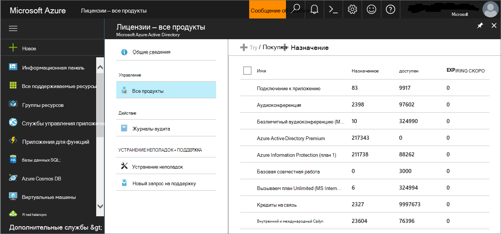
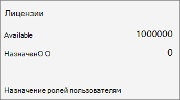
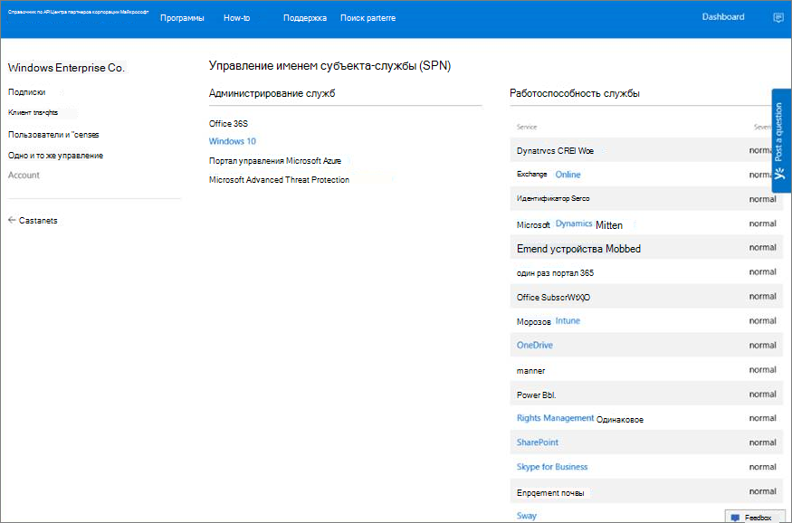
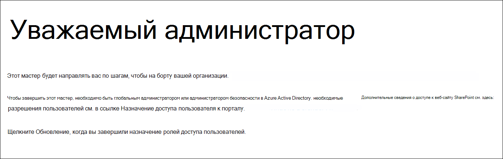
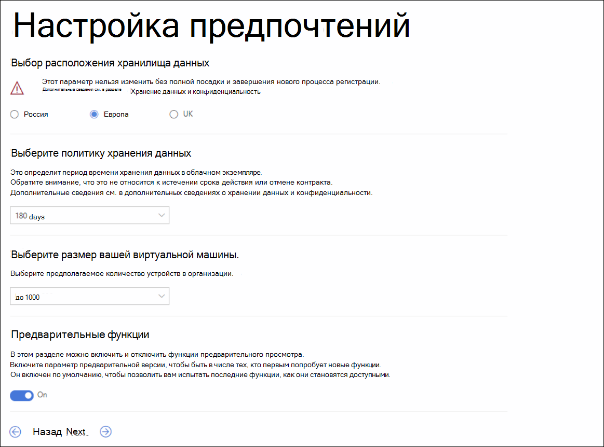
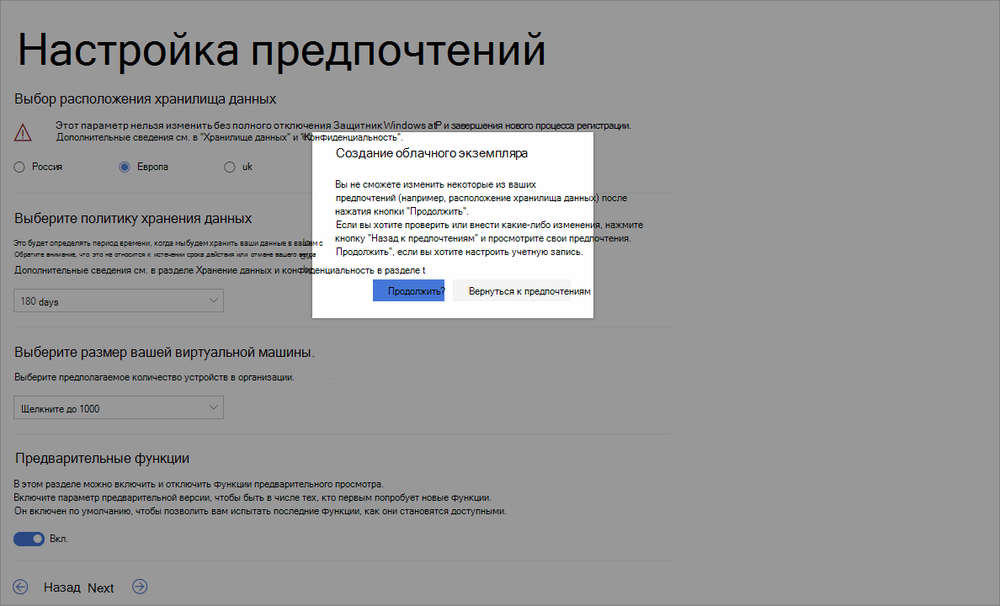
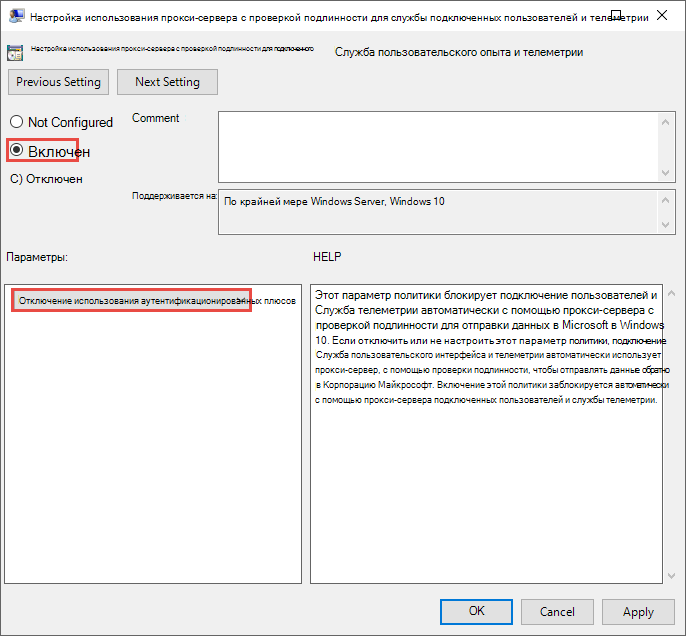
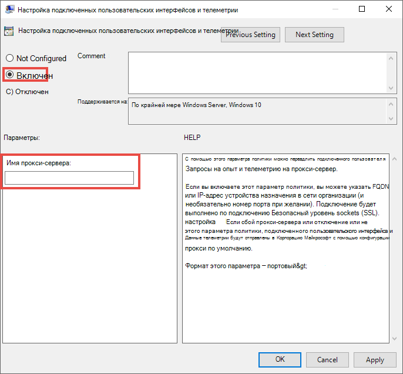

# <a name="set-up-microsoft-defender-for-endpoint-deployment"></a><span data-ttu-id="0580d-104">Настройка microsoft Defender для развертывания конечных точек</span><span class="sxs-lookup"><span data-stu-id="0580d-104">Set up Microsoft Defender for Endpoint deployment</span></span>

[!INCLUDE [Microsoft 365 Defender rebranding](../../includes/microsoft-defender.md)]


<span data-ttu-id="0580d-105">**Область применения:**</span><span class="sxs-lookup"><span data-stu-id="0580d-105">**Applies to:**</span></span>
- [<span data-ttu-id="0580d-106">Microsoft Defender для конечной точки</span><span class="sxs-lookup"><span data-stu-id="0580d-106">Microsoft Defender for Endpoint</span></span>](https://go.microsoft.com/fwlink/p/?linkid=2146631)
- [<span data-ttu-id="0580d-107">Microsoft 365 Defender</span><span class="sxs-lookup"><span data-stu-id="0580d-107">Microsoft 365 Defender</span></span>](https://go.microsoft.com/fwlink/?linkid=2118804)

> <span data-ttu-id="0580d-108">Хотите испытать Microsoft Defender для конечной точки?</span><span class="sxs-lookup"><span data-stu-id="0580d-108">Want to experience Microsoft Defender for Endpoint?</span></span> [<span data-ttu-id="0580d-109">Зарегистрився для бесплатной пробной.</span><span class="sxs-lookup"><span data-stu-id="0580d-109">Sign up for a free trial.</span></span>](https://www.microsoft.com/microsoft-365/windows/microsoft-defender-atp?ocid=docs-wdatp-exposedapis-abovefoldlink)

<span data-ttu-id="0580d-110">Развертывание Defender для конечной точки — это трех этапный процесс:</span><span class="sxs-lookup"><span data-stu-id="0580d-110">Deploying Defender for Endpoint is a three-phase process:</span></span>

| <span data-ttu-id="0580d-111">[](prepare-deployment.md)</span><span class="sxs-lookup"><span data-stu-id="0580d-111">[](prepare-deployment.md)</span></span><br>[<span data-ttu-id="0580d-112">Этап 1. Подготовка</span><span class="sxs-lookup"><span data-stu-id="0580d-112">Phase 1: Prepare</span></span>](prepare-deployment.md) | <br><span data-ttu-id="0580d-114">Этап 2. Установка</span><span class="sxs-lookup"><span data-stu-id="0580d-114">Phase 2: Setup</span></span> | <span data-ttu-id="0580d-115">[](onboarding.md)</span><span class="sxs-lookup"><span data-stu-id="0580d-115">[](onboarding.md)</span></span><br>[<span data-ttu-id="0580d-116">Этап 3. На борту</span><span class="sxs-lookup"><span data-stu-id="0580d-116">Phase 3: Onboard</span></span>](onboarding.md) |
| ----- | ----- | ----- |
| | <span data-ttu-id="0580d-117">*Вы здесь!*</span><span class="sxs-lookup"><span data-stu-id="0580d-117">*You are here!*</span></span>||

<span data-ttu-id="0580d-118">В настоящее время вы находитесь на этапе настройка.</span><span class="sxs-lookup"><span data-stu-id="0580d-118">You are currently in the set-up phase.</span></span>

<span data-ttu-id="0580d-119">В этом сценарии развертывания вы будете руководствоваться действиями по:</span><span class="sxs-lookup"><span data-stu-id="0580d-119">In this deployment scenario, you'll be guided through the steps on:</span></span>
- <span data-ttu-id="0580d-120">Проверка лицензирования</span><span class="sxs-lookup"><span data-stu-id="0580d-120">Licensing validation</span></span>
- <span data-ttu-id="0580d-121">Конфигурация клиента</span><span class="sxs-lookup"><span data-stu-id="0580d-121">Tenant configuration</span></span>
- <span data-ttu-id="0580d-122">Конфигурация сети</span><span class="sxs-lookup"><span data-stu-id="0580d-122">Network configuration</span></span>


>[!NOTE]
><span data-ttu-id="0580d-123">Для того чтобы направлять вас через типичное развертывание, этот сценарий будет охватывать только использование Microsoft Endpoint Configuration Manager.</span><span class="sxs-lookup"><span data-stu-id="0580d-123">For the purpose of guiding you through a typical deployment, this scenario will only cover the use of Microsoft Endpoint Configuration Manager.</span></span> <span data-ttu-id="0580d-124">Defender for Endpoint поддерживает использование других средств бортовой связи, но не покрывает эти сценарии в руководстве по развертыванию.</span><span class="sxs-lookup"><span data-stu-id="0580d-124">Defender for Endpoint supports the use of other onboarding tools but will not cover those scenarios in the deployment guide.</span></span> <span data-ttu-id="0580d-125">Дополнительные сведения см. в таблице [Onboard devices to Microsoft Defender for Endpoint.](onboard-configure.md)</span><span class="sxs-lookup"><span data-stu-id="0580d-125">For more information, see [Onboard devices to Microsoft Defender for Endpoint](onboard-configure.md).</span></span>

## <a name="check-license-state"></a><span data-ttu-id="0580d-126">Проверка состояния лицензии</span><span class="sxs-lookup"><span data-stu-id="0580d-126">Check license state</span></span>

<span data-ttu-id="0580d-127">Проверка состояния лицензии и правильного ее состояния можно сделать через центр администрирования или на **портале Microsoft Azure.**</span><span class="sxs-lookup"><span data-stu-id="0580d-127">Checking for the license state and whether it got properly provisioned, can be done through the admin center or through the **Microsoft Azure portal**.</span></span>

1. <span data-ttu-id="0580d-128">Чтобы просмотреть лицензии, перейдите на портал **Microsoft Azure** и перейдите в раздел лицензии на портал [Microsoft Azure.](https://portal.azure.com/#blade/Microsoft_AAD_IAM/LicensesMenuBlade/Products)</span><span class="sxs-lookup"><span data-stu-id="0580d-128">To view your licenses, go to the **Microsoft Azure portal** and navigate to the [Microsoft Azure portal license section](https://portal.azure.com/#blade/Microsoft_AAD_IAM/LicensesMenuBlade/Products).</span></span>

   

1. <span data-ttu-id="0580d-130">Поочередно в центре администрирования перейдите к **подпискам на**  >  **биллинг.**</span><span class="sxs-lookup"><span data-stu-id="0580d-130">Alternately, in the admin center, navigate to **Billing** > **Subscriptions**.</span></span>

    <span data-ttu-id="0580d-131">На экране вы увидите все предварительные лицензии и их текущее **состояние.**</span><span class="sxs-lookup"><span data-stu-id="0580d-131">On the screen, you will see all the provisioned licenses and their current **Status**.</span></span>

    


## <a name="cloud-service-provider-validation"></a><span data-ttu-id="0580d-133">Проверка поставщика облачных услуг</span><span class="sxs-lookup"><span data-stu-id="0580d-133">Cloud Service Provider validation</span></span>

<span data-ttu-id="0580d-134">Чтобы получить доступ к лицензиям вашей компании и проверить состояние лицензий, перейдите в центр администрирования.</span><span class="sxs-lookup"><span data-stu-id="0580d-134">To gain access into which licenses are provisioned to your company, and to check the state of the licenses, go to the admin center.</span></span>

1. <span data-ttu-id="0580d-135">На **портале Partner** выберите **администрирование служб > Office 365**.</span><span class="sxs-lookup"><span data-stu-id="0580d-135">From the **Partner portal**, select **Administer services > Office 365**.</span></span>

2. <span data-ttu-id="0580d-136">Щелкнув ссылку **на портал Партнер,** вы откроете параметр **Admin** от имени и откроет доступ к центру администрирования клиентов.</span><span class="sxs-lookup"><span data-stu-id="0580d-136">Clicking on the **Partner portal** link will open the **Admin on behalf** option and will give you access to the customer admin center.</span></span>

   


## <a name="tenant-configuration"></a><span data-ttu-id="0580d-138">Конфигурация клиента</span><span class="sxs-lookup"><span data-stu-id="0580d-138">Tenant Configuration</span></span>

<span data-ttu-id="0580d-139">При первом доступе к Центру безопасности Защитника Майкрософт мастер, который проведет вас по некоторым начальным шагам.</span><span class="sxs-lookup"><span data-stu-id="0580d-139">When accessing Microsoft Defender Security Center for the first time, a wizard that will guide you through some initial steps.</span></span> <span data-ttu-id="0580d-140">В конце мастера настройки будет создан специальный облачный экземпляр Defender для конечной точки.</span><span class="sxs-lookup"><span data-stu-id="0580d-140">At the end of the setup wizard, there will be a dedicated cloud instance of Defender for Endpoint created.</span></span> <span data-ttu-id="0580d-141">Самый простой метод — выполнить эти действия с клиентского устройства Windows 10.</span><span class="sxs-lookup"><span data-stu-id="0580d-141">The easiest method is to perform these steps from a Windows 10 client device.</span></span>

1. <span data-ttu-id="0580d-142">Из веб-браузера перейдите на <https://securitycenter.windows.com> .</span><span class="sxs-lookup"><span data-stu-id="0580d-142">From a web browser, navigate to <https://securitycenter.windows.com>.</span></span>

    

2. <span data-ttu-id="0580d-144">Если вы проходите через лицензию TRIAL, перейдите по ссылке ( <https://signup.microsoft.com/Signup?OfferId=6033e4b5-c320-4008-a936-909c2825d83c&dl=WIN_DEF_ATP&pc=xxxxxxx-xxxxxx-xxx-x> )</span><span class="sxs-lookup"><span data-stu-id="0580d-144">If going through a TRIAL license, go to the link (<https://signup.microsoft.com/Signup?OfferId=6033e4b5-c320-4008-a936-909c2825d83c&dl=WIN_DEF_ATP&pc=xxxxxxx-xxxxxx-xxx-x>)</span></span>

    <span data-ttu-id="0580d-145">После завершения шага авторизации будет отображаться экран **Welcome.**</span><span class="sxs-lookup"><span data-stu-id="0580d-145">Once the authorization step is completed, the **Welcome** screen will be displayed.</span></span>
3. <span data-ttu-id="0580d-146">Пройдите этапы авторизации.</span><span class="sxs-lookup"><span data-stu-id="0580d-146">Go through the authorization steps.</span></span>

    

4. <span data-ttu-id="0580d-148">Настройка предпочтений.</span><span class="sxs-lookup"><span data-stu-id="0580d-148">Set up preferences.</span></span>

   <span data-ttu-id="0580d-149">**Расположение хранилища данных** . Важно настроить это правильно.</span><span class="sxs-lookup"><span data-stu-id="0580d-149">**Data storage location** - It's important to set this up correctly.</span></span> <span data-ttu-id="0580d-150">Определите, где клиент хочет быть главным образом хост-сайтом: США, ЕС или Великобритании.</span><span class="sxs-lookup"><span data-stu-id="0580d-150">Determine where the customer wants to be primarily hosted: US, EU, or UK.</span></span> <span data-ttu-id="0580d-151">Вы не можете изменить расположение после этого настройка, и Корпорация Майкрософт не будет передавать данные из указанной геолокации.</span><span class="sxs-lookup"><span data-stu-id="0580d-151">You cannot change the location after this set up and Microsoft will not transfer the data from the specified geolocation.</span></span> 

    <span data-ttu-id="0580d-152">**Хранение данных** . По умолчанию — шесть месяцев.</span><span class="sxs-lookup"><span data-stu-id="0580d-152">**Data retention** - The default is six months.</span></span>

    <span data-ttu-id="0580d-153">**Включить функции предварительного** просмотра — по умолчанию можно изменить позже.</span><span class="sxs-lookup"><span data-stu-id="0580d-153">**Enable preview features** - The default is on, can be changed later.</span></span>

    

5. <span data-ttu-id="0580d-155">Нажмите кнопку **Далее**.</span><span class="sxs-lookup"><span data-stu-id="0580d-155">Select **Next**.</span></span>

     

6. <span data-ttu-id="0580d-157">Выберите **Продолжить**.</span><span class="sxs-lookup"><span data-stu-id="0580d-157">Select **Continue**.</span></span>


## <a name="network-configuration"></a><span data-ttu-id="0580d-158">Конфигурация сети</span><span class="sxs-lookup"><span data-stu-id="0580d-158">Network configuration</span></span>
<span data-ttu-id="0580d-159">Если организации не требуется использовать прокси-сервер для доступа к Интернету, пропустите этот раздел.</span><span class="sxs-lookup"><span data-stu-id="0580d-159">If the organization does not require the endpoints to use a Proxy to access the Internet, skip this section.</span></span>

<span data-ttu-id="0580d-160">Для использования датчика Microsoft Defender для конечной точки требуется Microsoft Windows HTTP (WinHTTP), чтобы передавать данные датчика и общаться со службой Microsoft Defender для конечной точки.</span><span class="sxs-lookup"><span data-stu-id="0580d-160">The Microsoft Defender for Endpoint sensor requires Microsoft Windows HTTP (WinHTTP) to report sensor data and communicate with the Microsoft Defender for Endpoint service.</span></span> <span data-ttu-id="0580d-161">Встроенный датчик Microsoft Defender для конечной точки запускается в системном контексте с помощью учетной записи LocalSystem.</span><span class="sxs-lookup"><span data-stu-id="0580d-161">The embedded Microsoft Defender for Endpoint sensor runs in the system context using the LocalSystem account.</span></span> <span data-ttu-id="0580d-162">Датчик использует Microsoft Windows HTTP Services (WinHTTP), чтобы обеспечить взаимодействие с облачной службой Microsoft Defender для конечной точки.</span><span class="sxs-lookup"><span data-stu-id="0580d-162">The sensor uses Microsoft Windows HTTP Services (WinHTTP) to enable communication with the Microsoft Defender for Endpoint cloud service.</span></span> <span data-ttu-id="0580d-163">Параметр конфигурации WinHTTP не зависит от параметров прокси-сервера для просмотра прокси-серверов Windows Internet (WinINet) и может открывать прокси-сервер только с помощью следующих методов обнаружения:</span><span class="sxs-lookup"><span data-stu-id="0580d-163">The WinHTTP configuration setting is independent of the Windows Internet (WinINet) internet browsing proxy settings and can only discover a proxy server by using the following discovery methods:</span></span>

<span data-ttu-id="0580d-164">**Методы автооткрытия:**</span><span class="sxs-lookup"><span data-stu-id="0580d-164">**Autodiscovery methods:**</span></span>

-   <span data-ttu-id="0580d-165">Прозрачный прокси</span><span class="sxs-lookup"><span data-stu-id="0580d-165">Transparent proxy</span></span>

-   <span data-ttu-id="0580d-166">Протокол автообнаружия веб-прокси (WPAD)</span><span class="sxs-lookup"><span data-stu-id="0580d-166">Web Proxy Autodiscovery Protocol (WPAD)</span></span>

<span data-ttu-id="0580d-167">Если в топологии сети реализован прозрачный прокси или WPAD, нет необходимости в специальных параметрах конфигурации.</span><span class="sxs-lookup"><span data-stu-id="0580d-167">If a Transparent proxy or WPAD has been implemented in the network topology, there is no need for special configuration settings.</span></span> <span data-ttu-id="0580d-168">Дополнительные сведения об исключениях URL-адресов Microsoft Defender для конечной точки в прокси-сервере см. в разделе Приложение в этом документе для url-адресов разрешить список или в [Microsoft Docs.](https://docs.microsoft.com/windows/security/threat-protection/windows-defender-atp/configure-proxy-internet-windows-defender-advanced-threat-protection#enable-access-to-windows-defender-atp-service-urls-in-the-proxy-server)</span><span class="sxs-lookup"><span data-stu-id="0580d-168">For more information on Microsoft Defender for Endpoint URL exclusions in the proxy, see the Appendix section in this document for the URLs allow list or on [Microsoft Docs](https://docs.microsoft.com/windows/security/threat-protection/windows-defender-atp/configure-proxy-internet-windows-defender-advanced-threat-protection#enable-access-to-windows-defender-atp-service-urls-in-the-proxy-server).</span></span>

> [!NOTE]
> <span data-ttu-id="0580d-169">Подробный список URL-адресов, которые необходимо разрешить, см. в [этой статье.](https://docs.microsoft.com/windows/security/threat-protection/microsoft-defender-antivirus/configure-network-connections-microsoft-defender-antivirus)</span><span class="sxs-lookup"><span data-stu-id="0580d-169">For a detailed list of URLs that need to be allowed, please see [this article](https://docs.microsoft.com/windows/security/threat-protection/microsoft-defender-antivirus/configure-network-connections-microsoft-defender-antivirus).</span></span>

<span data-ttu-id="0580d-170">**Конфигурация статического прокси вручную:**</span><span class="sxs-lookup"><span data-stu-id="0580d-170">**Manual static proxy configuration:**</span></span>

-   <span data-ttu-id="0580d-171">Конфигурация на основе реестра</span><span class="sxs-lookup"><span data-stu-id="0580d-171">Registry-based configuration</span></span>

-   <span data-ttu-id="0580d-172">WinHTTP, настроенный с помощью команды netsh</span><span class="sxs-lookup"><span data-stu-id="0580d-172">WinHTTP configured using netsh command</span></span> <br> <span data-ttu-id="0580d-173">Подходит только для настольных компьютеров в стабильной топологии (например: рабочий стол в корпоративной сети за одним прокси-сервером)</span><span class="sxs-lookup"><span data-stu-id="0580d-173">Suitable only for desktops in a stable topology (for example: a desktop in a corporate network behind the same proxy)</span></span>

### <a name="configure-the-proxy-server-manually-using-a-registry-based-static-proxy"></a><span data-ttu-id="0580d-174">Настройка прокси-сервера вручную с использованием статического прокси-сервера на основе реестра</span><span class="sxs-lookup"><span data-stu-id="0580d-174">Configure the proxy server manually using a registry-based static proxy</span></span>

<span data-ttu-id="0580d-175">Настройка статического прокси-сервера на основе реестра, чтобы разрешить только датчику Microsoft Defender для конечных точек сообщать диагностические данные и общаться с службами Microsoft Defender для конечных точек, если компьютеру не разрешено подключение к Интернету.</span><span class="sxs-lookup"><span data-stu-id="0580d-175">Configure a registry-based static proxy to allow only Microsoft Defender for Endpoint sensor to report diagnostic data and communicate with Microsoft Defender for Endpoint services if a computer is not permitted to connect to the Internet.</span></span> <span data-ttu-id="0580d-176">Статический прокси-сервер можно настроить с помощью групповой политики (GP).</span><span class="sxs-lookup"><span data-stu-id="0580d-176">The static proxy is configurable through Group Policy (GP).</span></span> <span data-ttu-id="0580d-177">Групповые политики можно найти в следующих статьях:</span><span class="sxs-lookup"><span data-stu-id="0580d-177">The group policy can be found under:</span></span>

 - <span data-ttu-id="0580d-178">Административные \> шаблоны Windows Components \> Data Collection and Preview Builds \> Configure Authenticated Proxy use for the Connected User Experience and Telemetry Service</span><span class="sxs-lookup"><span data-stu-id="0580d-178">Administrative Templates \> Windows Components \> Data Collection and Preview Builds \> Configure Authenticated Proxy usage for the Connected User Experience and Telemetry Service</span></span>
     - <span data-ttu-id="0580d-179">Установите его для **включения и** выберите отключение использования **прокси-сервера с проверкой подлинности**</span><span class="sxs-lookup"><span data-stu-id="0580d-179">Set it to **Enabled** and select **Disable Authenticated Proxy usage**</span></span>

1. <span data-ttu-id="0580d-180">Откройте консоль управления групповыми политиками.</span><span class="sxs-lookup"><span data-stu-id="0580d-180">Open the Group Policy Management Console.</span></span>
2. <span data-ttu-id="0580d-181">Создайте политику или отредактировать существующую политику, основанную на организационных практиках.</span><span class="sxs-lookup"><span data-stu-id="0580d-181">Create a policy or edit an existing policy based off the organizational practices.</span></span>
3. <span data-ttu-id="0580d-182">Изменить групповую политику и перейти к сбору данных о компонентах Windows для административных шаблонов и сборкам предварительного просмотра Настройте использование прокси-серверов для службы подключенных пользователей и **\> \> \> телеметрии.**</span><span class="sxs-lookup"><span data-stu-id="0580d-182">Edit the Group Policy and navigate to **Administrative Templates \> Windows Components \> Data Collection and Preview Builds \> Configure Authenticated Proxy usage for the Connected User Experience and Telemetry Service**.</span></span> 
    <span data-ttu-id="0580d-183"></span><span class="sxs-lookup"><span data-stu-id="0580d-183"></span></span>

4. <span data-ttu-id="0580d-184">Щелкните **Включено**.</span><span class="sxs-lookup"><span data-stu-id="0580d-184">Select **Enabled**.</span></span>
5. <span data-ttu-id="0580d-185">Выберите **отключение использования прокси-сервера с проверкой подлинности.**</span><span class="sxs-lookup"><span data-stu-id="0580d-185">Select **Disable Authenticated Proxy usage**.</span></span>
   
6. <span data-ttu-id="0580d-186">Перейдите **к административным шаблонам \> Windows Components Data Collection and Preview \> Builds \> Configure connected user experiences and telemetry.**</span><span class="sxs-lookup"><span data-stu-id="0580d-186">Navigate to **Administrative Templates \> Windows Components \> Data Collection and Preview Builds \> Configure connected user experiences and telemetry**.</span></span>
    <span data-ttu-id="0580d-187"></span><span class="sxs-lookup"><span data-stu-id="0580d-187"></span></span>
7. <span data-ttu-id="0580d-188">Щелкните **Включено**.</span><span class="sxs-lookup"><span data-stu-id="0580d-188">Select **Enabled**.</span></span>
8. <span data-ttu-id="0580d-189">Введите **имя прокси-сервера**.</span><span class="sxs-lookup"><span data-stu-id="0580d-189">Enter the **Proxy Server Name**.</span></span>

<span data-ttu-id="0580d-190">Политика устанавливает два значения реестра: `TelemetryProxyServer` как REG_SZ и `DisableEnterpriseAuthProxy` как REG_DWORD в разделе реестра `HKLM\Software\Policies\Microsoft\Windows\DataCollection`.</span><span class="sxs-lookup"><span data-stu-id="0580d-190">The policy sets two registry values `TelemetryProxyServer` as REG_SZ and `DisableEnterpriseAuthProxy` as REG_DWORD under the registry key `HKLM\Software\Policies\Microsoft\Windows\DataCollection`.</span></span>

<span data-ttu-id="0580d-191">Значение реестра принимает `TelemetryProxyServer` следующий формат строки:</span><span class="sxs-lookup"><span data-stu-id="0580d-191">The registry value `TelemetryProxyServer` takes the following string format:</span></span>

```text
<server name or ip>:<port>
```

<span data-ttu-id="0580d-192">Например, 10.0.0.6:8080</span><span class="sxs-lookup"><span data-stu-id="0580d-192">For example: 10.0.0.6:8080</span></span>

<span data-ttu-id="0580d-193">Следует назначить значение реестра `DisableEnterpriseAuthProxy` — 1.</span><span class="sxs-lookup"><span data-stu-id="0580d-193">The registry value `DisableEnterpriseAuthProxy` should be set to 1.</span></span>

###  <a name="configure-the-proxy-server-manually-using-netsh-command"></a><span data-ttu-id="0580d-194">Настройка прокси-сервера вручную с помощью команды netsh</span><span class="sxs-lookup"><span data-stu-id="0580d-194">Configure the proxy server manually using netsh command</span></span>

<span data-ttu-id="0580d-195">Используйте команду netsh для настройки статического прокси на уровне системы.</span><span class="sxs-lookup"><span data-stu-id="0580d-195">Use netsh to configure a system-wide static proxy.</span></span>

> [!NOTE]
> - <span data-ttu-id="0580d-196">Это повлияет на все приложения, в том числе службы Windows, которые используют WinHTTP с прокси по умолчанию.</span><span class="sxs-lookup"><span data-stu-id="0580d-196">This will affect all applications including Windows services which use WinHTTP with default proxy.</span></span></br>
> - <span data-ttu-id="0580d-197">Ноутбуки, которые меняют топологию (например, из офиса в дом), будут неисправными с сеткой.</span><span class="sxs-lookup"><span data-stu-id="0580d-197">Laptops that are changing topology (for example: from office to home) will malfunction with netsh.</span></span> <span data-ttu-id="0580d-198">Используйте настройку статических прокси-серверов на основе реестра.</span><span class="sxs-lookup"><span data-stu-id="0580d-198">Use the registry-based static proxy configuration.</span></span>

1. <span data-ttu-id="0580d-199">Откройте повышенную командную строку:</span><span class="sxs-lookup"><span data-stu-id="0580d-199">Open an elevated command line:</span></span>

    1. <span data-ttu-id="0580d-200">В меню **Пуск** введите **cmd**.</span><span class="sxs-lookup"><span data-stu-id="0580d-200">Go to **Start** and type **cmd**.</span></span>

    1. <span data-ttu-id="0580d-201">Щелкните правой кнопкой мыши пункт **Командная строка** и выберите команду **Запуск от имени администратора**.</span><span class="sxs-lookup"><span data-stu-id="0580d-201">Right-click **Command prompt** and select **Run as administrator**.</span></span>

2. <span data-ttu-id="0580d-202">Введите следующую команду и нажмите клавишу **ВВОД**:</span><span class="sxs-lookup"><span data-stu-id="0580d-202">Enter the following command and press **Enter**:</span></span>

   ```PowerShell
   netsh winhttp set proxy <proxy>:<port>
   ```

   <span data-ttu-id="0580d-203">Например, netsh winhttp set proxy 10.0.0.6:8080</span><span class="sxs-lookup"><span data-stu-id="0580d-203">For example: netsh winhttp set proxy 10.0.0.6:8080</span></span>


###  <a name="proxy-configuration-for-down-level-devices"></a><span data-ttu-id="0580d-204">Конфигурация прокси для устройств с уровнем ниже уровня</span><span class="sxs-lookup"><span data-stu-id="0580d-204">Proxy Configuration for down-level devices</span></span>

<span data-ttu-id="0580d-205">Down-Level устройства включают рабочие станции Windows 7 SP1 и Windows 8.1, а также Windows Server 2008 R2, Windows Server 2012, Windows Server 2012 R2 и версии Windows Server 2016 до Windows Server CB 1803.</span><span class="sxs-lookup"><span data-stu-id="0580d-205">Down-Level devices include Windows 7 SP1 and Windows 8.1 workstations as well as Windows Server 2008 R2, Windows Server 2012, Windows Server 2012 R2, and versions of Windows Server 2016 prior to Windows Server CB 1803.</span></span> <span data-ttu-id="0580d-206">Эти операционные системы будут иметь прокси-сервер, настроенный в составе агента управления Майкрософт для обработки связи с конечной точки до Azure.</span><span class="sxs-lookup"><span data-stu-id="0580d-206">These operating systems will have the proxy configured as part of the Microsoft Management Agent to handle communication from the endpoint to Azure.</span></span> <span data-ttu-id="0580d-207">Сведения о настройке прокси-сервера на этих устройствах можно найти в руководстве по быстрому развертыванию агента Майкрософт.</span><span class="sxs-lookup"><span data-stu-id="0580d-207">Refer to the Microsoft Management Agent Fast Deployment Guide for information on how a proxy is configured on these devices.</span></span>

### <a name="proxy-service-urls"></a><span data-ttu-id="0580d-208">URL-адреса службы прокси</span><span class="sxs-lookup"><span data-stu-id="0580d-208">Proxy Service URLs</span></span>
<span data-ttu-id="0580d-209">URL-адреса, которые включают в них v20, необходимы только в том случае, если у вас есть устройства с Windows 10, версии 1803 или более поздних версий.</span><span class="sxs-lookup"><span data-stu-id="0580d-209">URLs that include v20 in them are only needed if you have Windows 10, version 1803 or later devices.</span></span> <span data-ttu-id="0580d-210">Например, это необходимо только в том случае, если устройство находится ```us-v20.events.data.microsoft.com``` в Windows 10 версии 1803 или более поздней версии.</span><span class="sxs-lookup"><span data-stu-id="0580d-210">For example, ```us-v20.events.data.microsoft.com``` is only needed if the device is on Windows 10, version 1803 or later.</span></span>
 

<span data-ttu-id="0580d-211">Если прокси-сервер или брандмауэр блокирует анонимный трафик, так как датчик Microsoft Defender для конечных точек подключается из системного контекста, убедитесь, что анонимный трафик разрешен в указанных URL-адресах.</span><span class="sxs-lookup"><span data-stu-id="0580d-211">If a proxy or firewall is blocking anonymous traffic, as Microsoft Defender for Endpoint sensor is connecting from system context, make sure anonymous traffic is permitted in the listed URLs.</span></span>

<span data-ttu-id="0580d-212">В следующей загружаемой таблице перечислены службы и связанные с ними URL-адреса, к которые должна подключаться ваша сеть.</span><span class="sxs-lookup"><span data-stu-id="0580d-212">The following downloadable spreadsheet lists the services and their associated URLs that your network must be able to connect to.</span></span> <span data-ttu-id="0580d-213">Убедитесь, что нет брандмауэра или правил фильтрации сети, которые бы  отказывали в доступе к этим URL-адресам, или вам может потребоваться создать правило разрешить специально для них.</span><span class="sxs-lookup"><span data-stu-id="0580d-213">Ensure that there are no firewall or network filtering rules that would deny access to these URLs, or you may need to create an *allow* rule specifically for them.</span></span>

|<span data-ttu-id="0580d-214">**Таблица списка доменов**</span><span class="sxs-lookup"><span data-stu-id="0580d-214">**Spreadsheet of domains list**</span></span>|<span data-ttu-id="0580d-215">**Описание**</span><span class="sxs-lookup"><span data-stu-id="0580d-215">**Description**</span></span>|
|:-----|:-----|
|<br/>  | <span data-ttu-id="0580d-217">Таблица определенных DNS-записей для расположения служб, географических местоположений и ОС.</span><span class="sxs-lookup"><span data-stu-id="0580d-217">Spreadsheet of specific DNS records for service locations, geographic locations, and OS.</span></span> <br><br>[<span data-ttu-id="0580d-218">Скачайте таблицу здесь.</span><span class="sxs-lookup"><span data-stu-id="0580d-218">Download the spreadsheet here.</span></span>](https://download.microsoft.com/download/8/a/5/8a51eee5-cd02-431c-9d78-a58b7f77c070/mde-urls.xlsx) 


###  <a name="microsoft-defender-for-endpoint-service-backend-ip-range"></a><span data-ttu-id="0580d-219">Microsoft Defender для backend IP-диапазона службы конечных точек</span><span class="sxs-lookup"><span data-stu-id="0580d-219">Microsoft Defender for Endpoint service backend IP range</span></span>

<span data-ttu-id="0580d-220">Если сетевые устройства не поддерживают URL-адреса, указанные в предыдущем разделе, можно использовать следующие сведения.</span><span class="sxs-lookup"><span data-stu-id="0580d-220">If you network devices don't support the URLs listed in the prior section, you can use the following information.</span></span>

<span data-ttu-id="0580d-221">Defender for Endpoint построен на облаке Azure, развернутом в следующих регионах:</span><span class="sxs-lookup"><span data-stu-id="0580d-221">Defender for Endpoint is built on Azure cloud, deployed in the following regions:</span></span>

- \+\<Region Name="uswestcentral">
- \+\<Region Name="useast2">
- \+\<Region Name="useast">
- \+\<Region Name="europenorth">
- \+\<Region Name="europewest">
- \+\<Region Name="uksouth">
- \+\<Region Name="ukwest">

<span data-ttu-id="0580d-222">Диапазон IP Azure можно найти в IP-диапазонах [Microsoft Azure Datacenter.](https://www.microsoft.com/en-us/download/details.aspx?id=41653)</span><span class="sxs-lookup"><span data-stu-id="0580d-222">You can find the Azure IP range on [Microsoft Azure Datacenter IP Ranges](https://www.microsoft.com/en-us/download/details.aspx?id=41653).</span></span>

> [!NOTE]
> <span data-ttu-id="0580d-223">В качестве облачного решения диапазон IP-адресов может изменяться.</span><span class="sxs-lookup"><span data-stu-id="0580d-223">As a cloud-based solution, the IP address range can change.</span></span> <span data-ttu-id="0580d-224">Рекомендуется перейти к параметру разрешения DNS.</span><span class="sxs-lookup"><span data-stu-id="0580d-224">It's recommended you move to DNS resolving setting.</span></span>

## <a name="next-step"></a><span data-ttu-id="0580d-225">Следующий шаг</span><span class="sxs-lookup"><span data-stu-id="0580d-225">Next step</span></span>

<span data-ttu-id="0580d-226"></span><span class="sxs-lookup"><span data-stu-id="0580d-226"></span></span> <br><span data-ttu-id="0580d-227">[Этап 3. На](onboarding.md)борту: бортовые устройства для службы, чтобы служба Microsoft Defender для конечных точек может получать данные датчиков от них.</span><span class="sxs-lookup"><span data-stu-id="0580d-227">[Phase 3: Onboard](onboarding.md): Onboard devices to the service so that the Microsoft Defender for Endpoint service can get sensor data from them.</span></span> 
