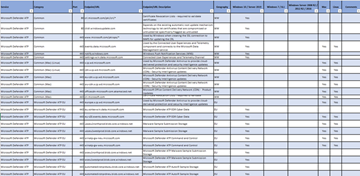

# <a name="set-up-microsoft-defender-for-endpoint-deployment"></a>Настройка microsoft Defender для развертывания конечных точек

[!INCLUDE [Microsoft 365 Defender rebranding](../../includes/microsoft-defender.md)]


**Область применения:**
- [Microsoft Defender для конечной точки](https://go.microsoft.com/fwlink/p/?linkid=2146631)
- [Microsoft 365 Defender](https://go.microsoft.com/fwlink/?linkid=2118804)

> Хотите испытать Microsoft Defender для конечной точки? [Зарегистрився для бесплатной пробной.](https://www.microsoft.com/microsoft-365/windows/microsoft-defender-atp?ocid=docs-wdatp-exposedapis-abovefoldlink)

Развертывание Defender для конечной точки — это трех этапный процесс:

| [](prepare-deployment.md)<br>[Этап 1. Подготовка](prepare-deployment.md) | <br>Этап 2. Установка | [](onboarding.md)<br>[Этап 3. На борту](onboarding.md) |
| ----- | ----- | ----- |
| | *Вы здесь!*||

В настоящее время вы находитесь на этапе настройка.

В этом сценарии развертывания вы будете руководствоваться действиями по:
- Проверка лицензирования
- Конфигурация клиента
- Конфигурация сети


>[!NOTE]
>Для того чтобы направлять вас через типичное развертывание, этот сценарий будет охватывать только использование Microsoft Endpoint Configuration Manager. Defender for Endpoint поддерживает использование других средств бортовой связи, но не покрывает эти сценарии в руководстве по развертыванию. Дополнительные сведения см. в таблице [Onboard devices to Microsoft Defender for Endpoint.](onboard-configure.md)

## <a name="check-license-state"></a>Проверка состояния лицензии

Проверка состояния лицензии и правильного ее состояния можно сделать через центр администрирования или на **портале Microsoft Azure.**

1. Чтобы просмотреть лицензии, перейдите на портал **Microsoft Azure** и перейдите в раздел лицензии на портал [Microsoft Azure.](https://portal.azure.com/#blade/Microsoft_AAD_IAM/LicensesMenuBlade/Products)

   

1. Поочередно в центре администрирования перейдите к **подпискам на**  >  **биллинг.**

    На экране вы увидите все предварительные лицензии и их текущее **состояние.**

    


## <a name="cloud-service-provider-validation"></a>Проверка поставщика облачных услуг

Чтобы получить доступ к лицензиям вашей компании и проверить состояние лицензий, перейдите в центр администрирования.

1. На **портале Partner** выберите **администрирование служб > Office 365**.

2. Щелкнув ссылку **на портал Партнер,** вы откроете параметр **Admin** от имени и откроет доступ к центру администрирования клиентов.

   


## <a name="tenant-configuration"></a>Конфигурация клиента

При первом доступе к Центру безопасности Защитника Майкрософт мастер, который проведет вас по некоторым начальным шагам. В конце мастера настройки будет создан специальный облачный экземпляр Defender для конечной точки. Самый простой метод — выполнить эти действия с клиентского устройства Windows 10.

1. Из веб-браузера перейдите на <https://securitycenter.windows.com> .

    

2. Если вы проходите через лицензию TRIAL, перейдите по ссылке ( <https://signup.microsoft.com/Signup?OfferId=6033e4b5-c320-4008-a936-909c2825d83c&dl=WIN_DEF_ATP&pc=xxxxxxx-xxxxxx-xxx-x> )

    После завершения шага авторизации будет отображаться экран **Welcome.**
3. Пройдите этапы авторизации.

    

4. Настройка предпочтений.

   **Расположение хранилища данных** . Важно настроить это правильно. Определите, где клиент хочет быть главным образом хост-сайтом: США, ЕС или Великобритании. Вы не можете изменить расположение после этого настройка, и Корпорация Майкрософт не будет передавать данные из указанной геолокации. 

    **Хранение данных** . По умолчанию — шесть месяцев.

    **Включить функции предварительного** просмотра — по умолчанию можно изменить позже.

    

5. Нажмите кнопку **Далее**.

     

6. Выберите **Продолжить**.


## <a name="network-configuration"></a>Конфигурация сети
Если организации не требуется использовать прокси-сервер для доступа к Интернету, пропустите этот раздел.

Для использования датчика Microsoft Defender для конечной точки требуется Microsoft Windows HTTP (WinHTTP), чтобы передавать данные датчика и общаться со службой Microsoft Defender для конечной точки. Встроенный датчик Microsoft Defender для конечной точки запускается в системном контексте с помощью учетной записи LocalSystem. Датчик использует Microsoft Windows HTTP Services (WinHTTP), чтобы обеспечить взаимодействие с облачной службой Microsoft Defender для конечной точки. Параметр конфигурации WinHTTP не зависит от параметров прокси-сервера для просмотра прокси-серверов Windows Internet (WinINet) и может открывать прокси-сервер только с помощью следующих методов обнаружения:

**Методы автооткрытия:**

-   Прозрачный прокси

-   Протокол автообнаружия веб-прокси (WPAD)

Если в топологии сети реализован прозрачный прокси или WPAD, нет необходимости в специальных параметрах конфигурации. Дополнительные сведения об исключениях URL-адресов Microsoft Defender для конечной точки в прокси-сервере см. в разделе Приложение в этом документе для url-адресов разрешить список или в [Microsoft Docs.](https://docs.microsoft.com/windows/security/threat-protection/windows-defender-atp/configure-proxy-internet-windows-defender-advanced-threat-protection#enable-access-to-windows-defender-atp-service-urls-in-the-proxy-server)

> [!NOTE]
> Подробный список URL-адресов, которые необходимо разрешить, см. в [этой статье.](https://docs.microsoft.com/windows/security/threat-protection/microsoft-defender-antivirus/configure-network-connections-microsoft-defender-antivirus)

**Конфигурация статического прокси вручную:**

-   Конфигурация на основе реестра

-   WinHTTP, настроенный с помощью команды netsh <br> Подходит только для настольных компьютеров в стабильной топологии (например: рабочий стол в корпоративной сети за одним прокси-сервером)

### <a name="configure-the-proxy-server-manually-using-a-registry-based-static-proxy"></a>Настройка прокси-сервера вручную с использованием статического прокси-сервера на основе реестра

Настройка статического прокси-сервера на основе реестра, чтобы разрешить только датчику Microsoft Defender для конечных точек сообщать диагностические данные и общаться с службами Microsoft Defender для конечных точек, если компьютеру не разрешено подключение к Интернету. Статический прокси-сервер можно настроить с помощью групповой политики (GP). Групповые политики можно найти в следующих статьях:

 - Административные \> шаблоны Windows Components \> Data Collection and Preview Builds \> Configure Authenticated Proxy use for the Connected User Experience and Telemetry Service
     - Установите его для **включения и** выберите отключение использования **прокси-сервера с проверкой подлинности**

1. Откройте консоль управления групповыми политиками.
2. Создайте политику или отредактировать существующую политику, основанную на организационных практиках.
3. Изменить групповую политику и перейти к сбору данных о компонентах Windows для административных шаблонов и сборкам предварительного просмотра Настройте использование прокси-серверов для службы подключенных пользователей и **\> \> \> телеметрии.** 
    

4. Щелкните **Включено**.
5. Выберите **отключение использования прокси-сервера с проверкой подлинности.**
   
6. Перейдите **к административным шаблонам \> Windows Components Data Collection and Preview \> Builds \> Configure connected user experiences and telemetry.**
    
7. Щелкните **Включено**.
8. Введите **имя прокси-сервера**.

Политика устанавливает два значения реестра: `TelemetryProxyServer` как REG_SZ и `DisableEnterpriseAuthProxy` как REG_DWORD в разделе реестра `HKLM\Software\Policies\Microsoft\Windows\DataCollection`.

Значение реестра принимает `TelemetryProxyServer` следующий формат строки:

```text
<server name or ip>:<port>
```

Например, 10.0.0.6:8080

Следует назначить значение реестра `DisableEnterpriseAuthProxy` — 1.

###  <a name="configure-the-proxy-server-manually-using-netsh-command"></a>Настройка прокси-сервера вручную с помощью команды netsh

Используйте команду netsh для настройки статического прокси на уровне системы.

> [!NOTE]
> - Это повлияет на все приложения, в том числе службы Windows, которые используют WinHTTP с прокси по умолчанию.</br>
> - Ноутбуки, которые меняют топологию (например, из офиса в дом), будут неисправными с сеткой. Используйте настройку статических прокси-серверов на основе реестра.

1. Откройте повышенную командную строку:

    1. В меню **Пуск** введите **cmd**.

    1. Щелкните правой кнопкой мыши пункт **Командная строка** и выберите команду **Запуск от имени администратора**.

2. Введите следующую команду и нажмите клавишу **ВВОД**:

   ```PowerShell
   netsh winhttp set proxy <proxy>:<port>
   ```

   Например, netsh winhttp set proxy 10.0.0.6:8080


###  <a name="proxy-configuration-for-down-level-devices"></a>Конфигурация прокси для устройств с уровнем ниже уровня

Down-Level устройства включают рабочие станции Windows 7 SP1 и Windows 8.1, а также Windows Server 2008 R2, Windows Server 2012, Windows Server 2012 R2 и версии Windows Server 2016 до Windows Server CB 1803. Эти операционные системы будут иметь прокси-сервер, настроенный в составе агента управления Майкрософт для обработки связи с конечной точки до Azure. Сведения о настройке прокси-сервера на этих устройствах можно найти в руководстве по быстрому развертыванию агента Майкрософт.

### <a name="proxy-service-urls"></a>URL-адреса службы прокси
URL-адреса, которые включают в них v20, необходимы только в том случае, если у вас есть устройства с Windows 10, версии 1803 или более поздних версий. Например, это необходимо только в том случае, если устройство находится ```us-v20.events.data.microsoft.com``` в Windows 10 версии 1803 или более поздней версии.
 

Если прокси-сервер или брандмауэр блокирует анонимный трафик, так как датчик Microsoft Defender для конечных точек подключается из системного контекста, убедитесь, что анонимный трафик разрешен в указанных URL-адресах.

В следующей загружаемой таблице перечислены службы и связанные с ними URL-адреса, к которые должна подключаться ваша сеть. Убедитесь, что нет брандмауэра или правил фильтрации сети, которые бы  отказывали в доступе к этим URL-адресам, или вам может потребоваться создать правило разрешить специально для них.

|**Таблица списка доменов**|**Описание**|
|:-----|:-----|
|<br/>  | Таблица определенных DNS-записей для расположения служб, географических местоположений и ОС. <br><br>[Скачайте таблицу здесь.](https://download.microsoft.com/download/8/a/5/8a51eee5-cd02-431c-9d78-a58b7f77c070/mde-urls.xlsx) 


###  <a name="microsoft-defender-for-endpoint-service-backend-ip-range"></a>Microsoft Defender для backend IP-диапазона службы конечных точек

Если сетевые устройства не поддерживают URL-адреса, указанные в предыдущем разделе, можно использовать следующие сведения.

Defender for Endpoint построен на облаке Azure, развернутом в следующих регионах:

- \+\<Region Name="uswestcentral">
- \+\<Region Name="useast2">
- \+\<Region Name="useast">
- \+\<Region Name="europenorth">
- \+\<Region Name="europewest">
- \+\<Region Name="uksouth">
- \+\<Region Name="ukwest">

Диапазон IP Azure можно найти в IP-диапазонах [Microsoft Azure Datacenter.](https://www.microsoft.com/en-us/download/details.aspx?id=41653)

> [!NOTE]
> В качестве облачного решения диапазон IP-адресов может изменяться. Рекомендуется перейти к параметру разрешения DNS.

## <a name="next-step"></a>Следующий шаг

 <br>[Этап 3. На](onboarding.md)борту: бортовые устройства для службы, чтобы служба Microsoft Defender для конечных точек может получать данные датчиков от них. 
