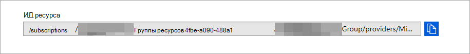

# <a name="configure-microsoft-defender-for-endpoint-to-stream-advanced-hunting-events-to-your-azure-event-hubs"></a>Настройка Microsoft Defender для конечной точки для потоковой передачи событий предварительной охоты в центры событий Azure

[!INCLUDE [Microsoft 365 Defender rebranding](../../includes/microsoft-defender.md)]


**Область применения:**

- [Microsoft Defender для конечной точки](https://go.microsoft.com/fwlink/?linkid=2154037)

> Хотите испытать Defender для конечной точки? [Зарегистрився для бесплатной пробной.](https://www.microsoft.com/microsoft-365/windows/microsoft-defender-atp?ocid=docs-wdatp-configuresiem-abovefoldlink) 

## <a name="before-you-begin"></a>Подготовка

1. Создайте [центр событий в](/azure/event-hubs/) клиенте.

2. Войдите в клиент [Azure,](https://ms.portal.azure.com/)перейдите в **Subscriptions > Поставщики > ресурсов > зарегистрируйтесь в **Microsoft.insights****.

## <a name="enable-raw-data-streaming"></a>Включить потоковую передачу необработанных данных

1. Войдите в [Центр безопасности в Microsoft Defender](https://securitycenter.windows.com) как **глобальный** администратор _ или _*_Администратор_ безопасности **.

2. Перейдите на [страницу Параметры экспорта](https://securitycenter.windows.com/interoperability/dataexport) данных на Центр безопасности в Microsoft Defender.

3. Нажмите **кнопку Добавить параметры экспорта данных.**

4. Выберите имя для новых параметров.

5. Выберите **перенаступив события в концентраторы событий Azure.**

6. Введите **имя концентраторов событий** и свой **ИД ресурса Event Hubs.**

   Чтобы получить ИД ресурса **Event Hubs,** перейдите на страницу пространства имен Azure Event Hubs на вкладке Свойства [Azure](https://ms.portal.azure.com/) > > скопируйте текст в статье **Resource ID:**

   

7. Выберите события, которые необходимо транслировать, и нажмите кнопку **Сохранить**.

## <a name="the-schema-of-the-events-in-azure-event-hubs"></a>Схема событий в центрах событий Azure

```
{
    "records": [
                    {
                        "time": "<The time WDATP received the event>"
                        "tenantId": "<The Id of the tenant that the event belongs to>"
                        "category": "<The Advanced Hunting table name with 'AdvancedHunting-' prefix>"
                        "properties": { <WDATP Advanced Hunting event as Json> }
                    }
                    ...
                ]
}
```

- Каждое сообщение концентратора событий в центрах событий Azure содержит список записей.

- Каждая запись содержит имя события, время получения события Microsoft Defender для конечной точки, его место клиента (вы получите события только от клиента) и событие в формате JSON в свойстве под названием **"свойства".**

- Дополнительные сведения о схеме событий Microsoft Defender для конечных точек см. в [обзоре Advanced Hunting.](advanced-hunting-overview.md)

- В таблице Advanced Hunting **в таблице DeviceInfo** имеется столбец **MachineGroup,** содержащий группу устройства. Здесь каждое событие также будет украшено этим столбцом. Дополнительные [сведения см.](machine-groups.md) в группе устройств.

## <a name="data-types-mapping"></a>Сопоставление типов данных

Чтобы получить типы данных для свойств событий, сделайте следующее:

1. Войдите в [Центр безопасности в Microsoft Defender](https://securitycenter.windows.com) и перейдите на [страницу Расширенный поиск](https://securitycenter.windows.com/hunting-package).

2. Запустите следующий запрос, чтобы получить сопоставление типов данных для каждого события:
 
   ```
   {EventType}
   | getschema
   | project ColumnName, ColumnType 
   ```

- Вот пример события "Информация о устройстве": 

  

## <a name="related-topics"></a>Связанные статьи
- [Обзор расширенных охоты](advanced-hunting-overview.md)
- [Microsoft Defender для API потоковой передачи конечных точек](raw-data-export.md)
- [Поток событий Microsoft Defender для событий конечной точки в учетную запись хранилища Azure](raw-data-export-storage.md)
- [Документация по центрам событий Azure](/azure/event-hubs/)
- [Устранение неполадок с подключением — концентраторы событий Azure](/azure/event-hubs/troubleshooting-guide)