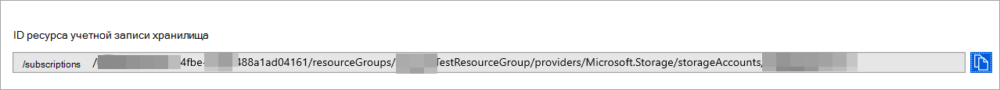
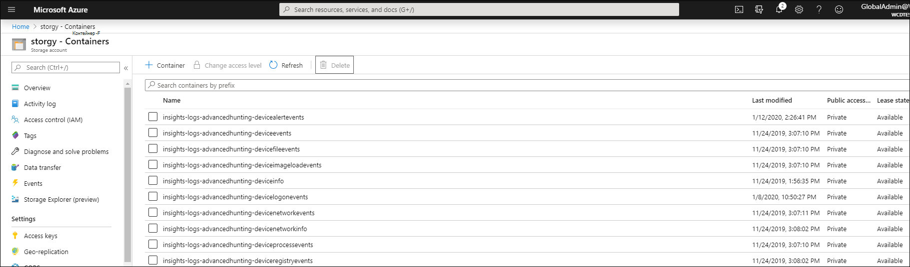

# <a name="configure-microsoft-defender-for-endpoint-to-stream-advanced-hunting-events-to-your-storage-account"></a>Настройка Microsoft Defender для конечной точки для потоковой передачи событий advanced Hunting в свою служба хранилища учетную запись

[!INCLUDE [Microsoft 365 Defender rebranding](../../includes/microsoft-defender.md)]


**Область применения:**
- [Microsoft Defender для конечной точки](https://go.microsoft.com/fwlink/?linkid=2154037)

> Хотите испытать Defender для конечной точки? [Зарегистрився для бесплатной пробной.](https://www.microsoft.com/microsoft-365/windows/microsoft-defender-atp?ocid=docs-wdatp-configuresiem-abovefoldlink) 

## <a name="before-you-begin"></a>Подготовка

1. Создайте [служба хранилища учетную запись](/azure/storage/common/storage-account-overview) в клиенте.

2. Войдите в клиент [Azure,](https://ms.portal.azure.com/)перейдите на подписки > подписки > поставщиков ресурсов **> в Microsoft.insights**.

## <a name="enable-raw-data-streaming"></a>Включить потоковую передачу необработанных данных

1. Войдите на [портал Microsoft Defender для конечных точек](https://securitycenter.windows.com) в качестве ***Глобального** администратора _ или _*_Администратора_ безопасности **.

2. Перейдите [на страницу Параметры экспорта](https://securitycenter.windows.com/interoperability/dataexport) данных на Центр безопасности в Microsoft Defender.

3. Нажмите **кнопку Добавить параметры экспорта данных.**

4. Выберите имя для новых параметров.

5. Выберите **события Forward для служба хранилища Azure**.

6. Введите **служба хранилища ИД ресурса учетной записи.** Чтобы получить служба хранилища ресурса учетной записи, перейдите на страницу служба хранилища учетной записи на вкладке Свойств [Azure](https://ms.portal.azure.com/) > > скопируйте текст под ИД ресурса служба хранилища учетной записи: 

   

7. Выберите события, которые необходимо транслировать, и нажмите кнопку **Сохранить**.

## <a name="the-schema-of-the-events-in-the-storage-account"></a>Схема событий в служба хранилища учетной записи

- Для каждого типа событий будет создан контейнер blob: 

  

- Схема каждой строки в blob является следующей JSON: 

  ```
  {
          "time": "<The time WDATP received the event>"
          "tenantId": "<Your tenant ID>"
          "category": "<The Advanced Hunting table name with 'AdvancedHunting-' prefix>"
          "properties": { <WDATP Advanced Hunting event as Json> }
  }               
  ```

- Каждый blob содержит несколько строк.

- Каждая строка содержит имя события, время получения события Defender для Конечной точки, его место для клиента (вы получите события только от клиента) и событие в формате JSON в свойстве под названием "свойства".

- Дополнительные сведения о схеме событий Microsoft Defender для конечных точек см. в [обзоре Advanced Hunting.](advanced-hunting-overview.md)

- В таблице Advanced Hunting **в таблице DeviceInfo** имеется столбец **MachineGroup,** содержащий группу устройства. Здесь каждое событие также будет украшено этим столбцом. Дополнительные [сведения см.](machine-groups.md) в группе устройств.

## <a name="data-types-mapping"></a>Сопоставление типов данных

Чтобы получить типы данных для свойств событий, сделайте следующее:

1. Войдите в [Центр безопасности в Microsoft Defender](https://securitycenter.windows.com) и перейдите на [страницу Расширенный поиск](https://securitycenter.windows.com/hunting-package).

2. Запустите следующий запрос, чтобы получить сопоставление типов данных для каждого события: 

   ```
   {EventType}
   | getschema
   | project ColumnName, ColumnType 
   ```

- Вот пример события "Информация о устройстве": 

  

## <a name="related-topics"></a>Связанные статьи
- [Обзор расширенных охоты](advanced-hunting-overview.md)
- [Microsoft Defender для API потоковой передачи конечных точек](raw-data-export.md)
- [Поток событий Microsoft Defender для событий конечной точки в учетную запись хранилища Azure](raw-data-export-storage.md)
- [служба хранилища Azure Документация по учетной записи](/azure/storage/common/storage-account-overview)