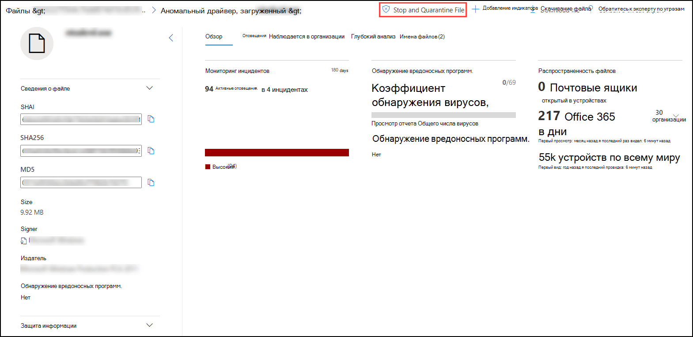
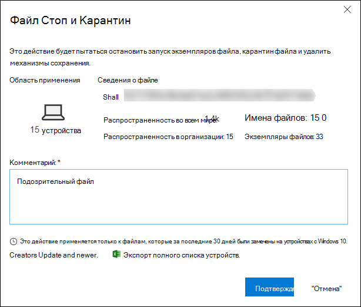
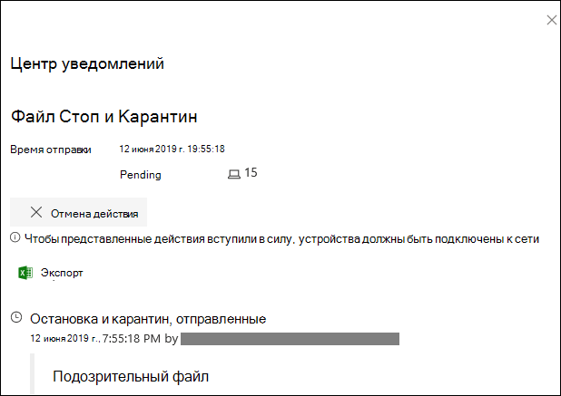
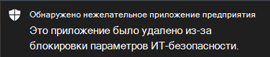
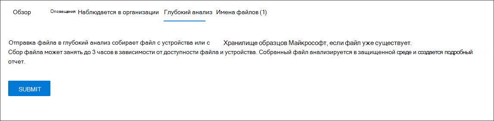
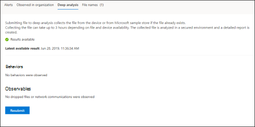

# <a name="take-response-actions-on-a-file"></a>Выполнение действий ответов в файле

[!INCLUDE [Microsoft 365 Defender rebranding](../../includes/microsoft-defender.md)]


**Область применения:**
- [Microsoft Defender для конечной точки](https://go.microsoft.com/fwlink/?linkid=2154037)

[!include[Prerelease information](../../includes/prerelease.md)]

> Хотите испытать Defender для конечной точки? [Зарегистрився для бесплатной пробной.](https://www.microsoft.com/microsoft-365/windows/microsoft-defender-atp?ocid=docs-wdatp-responddile-abovefoldlink)

Быстро реагируйте на обнаруженные атаки, останавливая и карантиновая файлы или блокируя файл. После принятия действий по файлам можно проверить сведения о действиях в центре действий.

Действия реагирования доступны на странице подробный профиль файла. Оказавшись на этой странице, вы можете переключаться между макетами новых и старых страниц, переключая новую страницу **File.** В остальной части этой статьи описывается более новая схема страницы.

Действия реагирования, которые запускают по верхней части страницы файла, включают в себя:

- Файл Стоп и Карантин
- Добавление индикатора
- Скачивание файла
- Обратитесь к эксперту по угрозам
- Центр уведомлений

Вы также можете отправить файлы для глубокого анализа, чтобы запустить файл в безопасной облачной песочнице. По завершению анализа вы получите подробный отчет, который содержит сведения о поведении файла. Вы можете отправить файлы для глубокого анализа и прочитать прошлые отчеты, выбрав вкладку **Глубокий** анализ. Он расположен ниже карт данных файлов.

Некоторые действия требуют определенных разрешений. В следующей таблице описывается, какие действия могут принимать определенные разрешения для переносных исполняемых (PE) и не pe-файлов:

| Разрешение             | ФАЙЛЫ PE | Файлы non-PE |
| :--------------------- | :------: | :----------: |
| Просмотр данных              |     X    |       X      |
| Расследование оповещений   | &#x2611; |       X      |
| Основной ответ в прямом эфире    |     X    |       X      |
| Расширенный ответ в прямом эфире | &#x2611; |   &#x2611;   |

Дополнительные сведения о ролях см. в дополнительных сведениях о создании и управлении ролями для управления [доступом на](user-roles.md)основе ролей.

## <a name="stop-and-quarantine-files-in-your-network"></a>Остановка и помещение на карантин файлов в сети

Вы можете содержать атаку в организации, останавливая вредоносный процесс и карантин файла, в котором он был замечен.

> [!IMPORTANT]
> Вы можете принять это действие только в том случае, если:
>
> - Устройство, на которое вы принимаете действие, работает Windows 10 версии 1703 или более поздней версии
> - Файл не принадлежит доверенным сторонним издателям или не подписан Корпорацией Майкрософт
> - антивирусная программа в Microsoft Defender по крайней мере должен работать в пассивном режиме. Дополнительные сведения см. [в антивирусная программа в Microsoft Defender совместимости.](/windows/security/threat-protection/microsoft-defender-antivirus/microsoft-defender-antivirus-compatibility)

Действие **Stop and Quarantine File** включает остановку запущенных процессов, карантин файлов и удаление сохраняющихся данных, таких как ключи реестра.

Это действие действует на устройствах Windows 10 версии 1703 или более поздней версии, где файл был замечен в течение последних 30 дней.

> [!NOTE]
> Вы сможете восстановить файл из карантина в любое время.

### <a name="stop-and-quarantine-files"></a>Файлы остановки и карантина

1. Выберите файл, который необходимо остановить, и карантин. Вы можете выбрать файл из любого из следующих представлений или использовать поле Поиска:

   - **Оповещений** — щелкните соответствующие ссылки из описания или подробных сведений в временной шкале Оповещения
   - **Поле поиска** — выберите **Файл** из выпадаемого меню и введите имя файла

   > [!NOTE]
   > Действие файла стопа и карантина ограничено не более 1000 устройств. Чтобы остановить файл на большом количестве устройств, см. в добавлении индикатора [для блокировки или допуска файла.](#add-indicator-to-block-or-allow-a-file)

2. Перейдите в верхнюю планку и выберите **файл Стоп и Карантин.**

   

3. Укажите причину, а затем выберите **Подтверждение**.

   

   Центр действий показывает сведения о отправке:
   
   

   - **Время отправки** — показывает, когда было отправлено действие.
   - **Успех** — показывает количество устройств, на которых был остановлен файл и введен карантин.
   - **Сбой** — показывает количество устройств, на которых не удалось действие, и сведения о сбое.
   - **Ожидание** — показывает количество устройств, с которых файл еще не остановлен и отложен на карантин. Это может занять время для случаев, когда устройство отключено или не подключено к сети.

4. Выберите любой из индикаторов состояния, чтобы просмотреть дополнительные сведения о действии. Например, выберите **Не удалось увидеть,** где действие не удалось.

**Уведомление пользователя устройства:**</br>
При удалении файла с устройства отображается следующее уведомление:



В временной шкале устройства для каждого устройства, где файл был остановлен и карантин, добавляется новое событие.

Перед реализацией действия для файлов, широко используемых в организации, отображается предупреждение. Это проверка того, что операция предназначена.

## <a name="restore-file-from-quarantine"></a>Восстановление файла из карантина

Вы можете откатить и удалить файл из карантина, если вы определили, что он чист после расследования. Запустите следующую команду на каждом устройстве, где файл был карантин.

1. Откройте на устройстве повышенную командную строку:

   1. В меню **Пуск** введите _cmd_.

   1. Щелкните правой **кнопкой мыши командную подсказку** и выберите **Выполнить в качестве администратора.**

2. Введите следующую команду и нажмите **кнопку Ввод:**

   ```console
   “%ProgramFiles%\Windows Defender\MpCmdRun.exe” –Restore –Name EUS:Win32/CustomEnterpriseBlock –All
   ```

   > [!NOTE]
   > В некоторых сценариях **имя угрозы может** отображаться как: EUS:Win32/CustomEnterpriseBlock!cl.
   >
   > Defender for Endpoint восстановит все настраиваемые заблокированные файлы, которые были на карантине на этом устройстве за последние 30 дней.

> [!IMPORTANT]
> Файл, который был на карантине в качестве потенциальной сетевой угрозы, может не быть восстановлен. Если пользователь пытается восстановить файл после карантина, этот файл может быть недоступным. Это может быть связано с тем, что система больше не имеет сетевых учетных данных для доступа к файлу. Как правило, это результат временного входа в систему или общую папку, а срок действия маркеров доступа истек.

## <a name="download-or-collect-file"></a>Скачивание или сбор файла

Выбор файла **Загрузка** из ответных действий позволяет скачать локальный архив, защищенный паролем, .zip файл. Появится вылет, в котором можно записать причину загрузки файла и установить пароль.

По умолчанию вы не сможете скачивать файлы, которые находятся в карантине.


### <a name="collect-files"></a>Сбор файлов

Если файл еще не хранится в Microsoft Defender для конечной точки, его нельзя скачать. Вместо этого вы увидите кнопку **Сбор файлов** в том же расположении. Если файл не был замечен в организации за последние 30 дней, **файл Collect** будет отключен.
> [!Important]
> Файл, который был на карантине в качестве потенциальной сетевой угрозы, может не быть восстановлен. Если пользователь пытается восстановить файл после карантина, этот файл может быть недоступным. Это может быть связано с тем, что система больше не имеет сетевых учетных данных для доступа к файлу. Как правило, это результат временного входа в систему или общую папку, а срок действия маркеров доступа истек.

## <a name="add-indicator-to-block-or-allow-a-file"></a>Добавление индикатора для блокировки или допуска файла

Предотвращение дальнейшего распространения атаки в организации, запретив потенциально вредоносные файлы или подозрительные вредоносные программы. Если вы знаете потенциально вредоносный переносной файл(PE), его можно заблокировать. Эта операция предотвратит чтение, написание или выполнение на устройствах в организации.

> [!IMPORTANT]
>
> - Эта функция доступна, если в организации используется антивирусная программа в Microsoft Defender и включена защита от облачной доставки. Дополнительные сведения см. в [сведениях Manage cloud-delivered protection.](/windows/security/threat-protection/microsoft-defender-antivirus/deploy-manage-report-microsoft-defender-antivirus)
>
> - Клиентская версия antimalware должна быть 4.18.1901.x или более поздней версии.
> - Эта функция предназначена для предотвращения скачивания из Интернета подозрительных вредоносных программ (или потенциально вредоносных файлов). В настоящее время он поддерживает переносные исполняемые (PE) файлы, включая _.exe_ _и.dllфайлы._ Со временем охват будет расширен.
> - Это действие отклика доступно для устройств на Windows 10 версии 1703 или более поздней версии.
> - Функция разрешить или заблокировать не может быть сделана в файлах, если классификация файла существует в кэше устройства до действия разрешить или заблокировать.

> [!NOTE]
> Файл PE должен быть в временной шкале устройства, чтобы вы могли принять это действие.
>
> Между временем действия и фактическим заблокированным файлом может потребоваться несколько минут задержки.

### <a name="enable-the-block-file-feature"></a>Включить функцию файла блока

Чтобы начать блокировать файлы, [  ](advanced-features.md) сначала необходимо включить блок или включить функцию Параметры.
### <a name="allow-or-block-file"></a>Разрешить или заблокировать файл

При добавлении hash индикатора для файла можно поднять оповещение и заблокировать файл всякий раз, когда устройство в организации пытается запустить его.

Файлы, автоматически заблокированные индикатором, не будут показываться в центре действий файла, но оповещения по-прежнему будут видны в очереди Оповещения.

Дополнительные [сведения о блокировке](manage-indicators.md) и поднятии оповещений по файлам см. в материале "Управление индикаторами".

Чтобы остановить блокировку файла, удалите индикатор. Это можно сделать с помощью действия **Edit Indicator** на странице профиля файла. Это действие будет видно в том же положении, что и действие **Add Indicator** перед добавлением индикатора.

Вы также можете изменить индикаторы со **страницы Параметры,** в статье **Индикаторы**  >  **правил**. Индикаторы перечислены в этой области по hash их файла.

## <a name="consult-a-threat-expert"></a>Обратитесь к эксперту по угрозам

Дополнительные сведения о потенциально скомпрометированном устройстве или уже скомпрометированном устройстве обратитесь к эксперту по угрозам Майкрософт. эксперты Майкрософт по угрозам непосредственно изнутри Центр безопасности в Microsoft Defender для быстрого и точного ответа. Эксперты предоставляют сведения о потенциально скомпрометированном устройстве и помогают разобраться в сложных угрозах и целевых уведомлениях об атаке. Они также могут предоставлять сведения о оповещениях или контексте разведки угроз, которые вы видите на панели мониторинга портала.

Подробные [сведения см. в материале Consult a Microsoft Threat Expert.](/microsoft-365/security/defender-endpoint/configure-microsoft-threat-experts#consult-a-microsoft-threat-expert-about-suspicious-cybersecurity-activities-in-your-organization)

## <a name="check-activity-details-in-action-center"></a>Проверка сведений о действиях в центре действий

Центр **действий** предоставляет сведения о действиях, принятых на устройстве или файле. Вы можете просмотреть следующие сведения:

- Коллекция пакетов исследований
- Антивирусное сканирование
- Ограничение приложения
- Изоляция устройств

Также показаны все другие связанные сведения, такие как дата отправки/время, отправка пользователя, а также успешное действие или сбой.


## <a name="deep-analysis"></a>Подробный анализ

Расследования кибербезопасности обычно вызываются оповещением. Оповещения связаны с одним или более наблюдаемым файлом, которые часто являются новыми или неизвестными. При выборе файла вы сможете просмотреть метаданные файла. Чтобы обогатить данные, связанные с файлом, вы можете отправить файл для глубокого анализа.

Функция Глубокого анализа выполняет файл в безопасной, полностью оборудованной облачной среде. Результаты глубокого анализа показывают действия файла, наблюдаемое поведение и связанные артефакты, такие как отброшенные файлы, изменения реестра и связь с ИП.
Глубокий анализ в настоящее время поддерживает обширный анализ переносных исполняемых (PE) файлов _(в_ том числе.exe _и.dllфайлов)._

Глубокий анализ файла занимает несколько минут. После завершения анализа файлов вкладка Deep Analysis будет обновляться, чтобы отобразить сводку и дату и время последних доступных результатов.

В сводке глубокого анализа содержится список наблюдаемых действий, некоторые из которых могут указывать на вредоносную активность, а также наблюдаемые, включая контактируемые IPs и файлы, созданные на диске.  Если ничего не найдено, в этих разделах будет отображаться краткое сообщение.

Результаты глубокого анализа соответствуют сведениям об угрозах, и любые совпадения будут создавать соответствующие оповещения.

Используйте функцию глубокого анализа для изучения сведений о любом файле, как правило, во время расследования оповещения или по любой другой причине, по которой вы подозреваете вредоносное поведение. Эта функция доступна в **вкладке Глубокий** анализ на странице профиля файла.<br/>
<br/>

> [!VIDEO https://www.microsoft.com/en-us/videoplayer/embed/RE4aAYy?rel=0]

**Отправка** для глубокого анализа включена, когда файл доступен в коллекции backend Defender для конечной точки, или если он был замечен на устройстве Windows 10, которое поддерживает отправку на глубокий анализ.

> [!NOTE]
> Автоматически можно Windows 10 файлы из других стран.

Вы также можете отправить [](https://www.microsoft.com/security/portal/submission/submit.aspx) образец через портал Центра безопасности Майкрософт, если файл не был замечен на устройстве Windows 10, и подождать, пока кнопка **Отправка** глубокого анализа станет доступной.

> [!NOTE]
> Из-за потоков обработки backend на портале Центра безопасности Майкрософт может быть до 10 минут задержки между отправкой файлов и доступностью функции глубокого анализа в Defender for Endpoint.

### <a name="submit-files-for-deep-analysis"></a>Отправка файлов для глубокого анализа

1. Выберите файл, который необходимо отправить для глубокого анализа. Вы можете выбрать или поискать файл из любого из следующих представлений:

    - **Оповещений** — выберите ссылки на файл из описания **или** **подробные** сведения в временной шкале Оповещения
    - **Список устройств** — выберите ссылки на файл из **раздела Описание** **или** Сведения в разделе Устройство **в организации**
    - **Поле поиска** — выберите **Файл** из выпадаемого меню и введите имя файла

2. В **вкладке Глубокий анализ** представления файла выберите **Отправить**.

   

   > [!NOTE]
   > Поддерживаются только файлы PE, в том числе _.exe_ _и.dll_ файлы.

   Отображается планка прогресса и предоставляет сведения о различных этапах анализа. Затем можно просмотреть отчет, когда будет проведен анализ.

> [!NOTE]
> В зависимости от доступности устройства время сбора образцов может отличаться. Существует 3-часовой период времени для коллекции образцов. Коллекция не работает, и операция прервается, если в Windows 10 нет отчетов об устройстве. Вы можете повторно отправить файлы для глубокого анализа, чтобы получить свежие данные в файле.

### <a name="view-deep-analysis-reports"></a>Просмотр отчетов о глубоком анализе

Просмотр предоставленного отчета глубокого анализа, чтобы просмотреть более глубокие сведения о файле, который вы отправили. Эта функция доступна в контексте представления файлов.

Вы можете просмотреть полный отчет, в который приводится подробная информация по следующим разделам:

- Behaviors
- Observables

Предоставленные сведения помогут вам разобраться, есть ли признаки потенциальной атаки.

1. Выберите файл, который вы отправили для глубокого анализа.
2. Выберите **вкладку Глубокий** анализ. Если есть какие-либо предыдущие отчеты, на этой вкладке появится сводка отчета.

    

#### <a name="troubleshoot-deep-analysis"></a>Устранение неполадок при глубоком анализе

Если при попытке отправки файла возникла проблема, попробуйте каждый из следующих действий по устранению неполадок.

1. Убедитесь, что этот файл является файлом PE. Файлы PE обычно имеют _.exe_ _или.dll_ расширения (исполняемые программы или приложения).

2. Убедитесь, что служба имеет доступ к файлу, который все еще существует и не был поврежден или изменен.

3. Подождите некоторое время и попробуйте отправить файл еще раз. Очередь может быть заполнена, или была временная ошибка подключения или связи.

4. Если политика сбора образцов не настроена, по умолчанию необходимо разрешить коллекцию образцов. Если он настроен, убедитесь, что параметр политики позволяет пример коллекции перед отправкой файла снова. При настройке коллекции образцов проверьте следующее значение реестра:

    ```console
    Path: HKLM\SOFTWARE\Policies\Microsoft\Windows Advanced Threat Protection
    Name: AllowSampleCollection
    Type: DWORD
    Hexadecimal value :
      Value = 0 – block sample collection
      Value = 1 – allow sample collection
    ```

1. Изменение организационного подразделения с помощью групповой политики. Дополнительные сведения см. в [перенастройке с групповой политикой.](configure-endpoints-gp.md)

1. Если эти действия не устраняют проблему, свяжитесь [с](mailto:winatp@microsoft.com)winatp@microsoft.com .

## <a name="related-topics"></a>Статьи по теме

- [Выполнение действий ответов на устройстве](respond-machine-alerts.md)
- [Исследование файлов](investigate-files.md)
