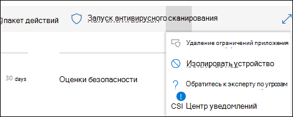
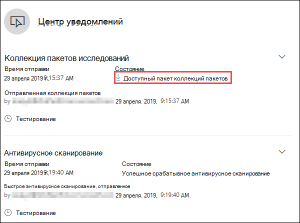
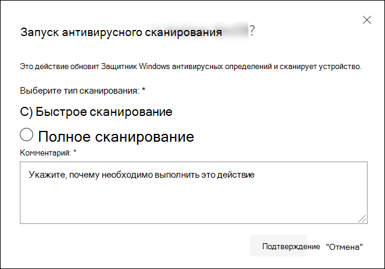
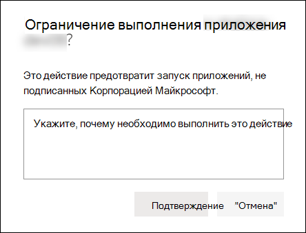
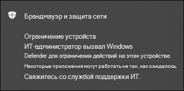
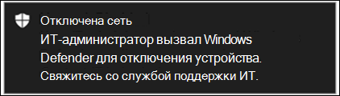
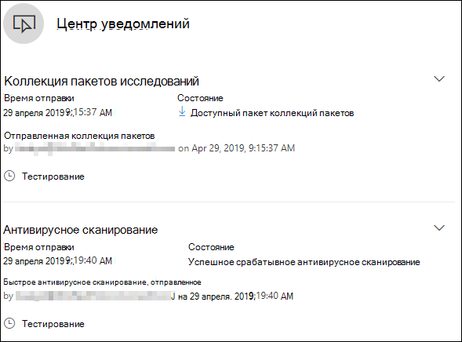

# Действия реагирования на устройствеTake response actions on a device

[!INCLUDE [Microsoft 365 Defender rebranding](../../includes/microsoft-defender.md)]

**Область применения:****Applies to:**
- [Microsoft Defender для конечной точкиMicrosoft Defender for Endpoint](https://go.microsoft.com/fwlink/?linkid=2154037)

>Хотите испытать Defender для конечной точки?Want to experience Defender for Endpoint? [Зарегистрився для бесплатной пробной.Sign up for a free trial.](https://www.microsoft.com/microsoft-365/windows/microsoft-defender-atp?ocid=docs-wdatp-respondmachine-abovefoldlink) 

Быстро реагируйте на обнаруженные атаки путем изоляции устройств или сбора пакета расследований.Quickly respond to detected attacks by isolating devices or collecting an investigation package. После принятия действий на устройствах можно проверить сведения о действиях в центре действий.After taking action on devices, you can check activity details on the Action center.

Действия ответа, которые запускают по верхней части определенной страницы устройства и включают в себя:Response actions run along the top of a specific device page and include:

- Управление тегамиManage tags
- Инициировать автоматическое расследованиеInitiate Automated Investigation
- Инициировать сеанс живого ответаInitiate Live Response Session
- Сбор пакета расследованийCollect investigation package
- Запуск антивирусного сканированияRun antivirus scan
- Ограничение выполнения приложенияRestrict app execution
- Изолировать устройствоIsolate device
- Обратитесь к эксперту по угрозамConsult a threat expert
- Центр уведомленийAction center

 Страницы устройств можно найти в любом из следующих представлений:You can find device pages from any of the following views:

- **Панель мониторинга операций безопасности** — выберите имя устройства из карты "Устройства с риском".**Security operations dashboard** - Select a device name from the Devices at risk card.
- **Очередь оповещений** . Выберите имя устройства рядом с значком устройства из очереди оповещений.**Alerts queue** - Select the device name beside the device icon from the alerts queue.
- **Список устройств** . Выберите заголовки имени устройства из списка устройств.**Devices list** - Select the heading of the device name from the devices list.
- **Поле поиска** — выберите устройство из выпадающее меню и введите имя устройства.**Search box** - Select Device from the drop-down menu and enter the device name.

>[!IMPORTANT]
> - Эти действия ответа доступны только для устройств в Windows 10, версии 1703 или более поздней версии.These response actions are only available for devices on Windows 10, version  1703 or later. 
> - Для не-платформ Windows возможности ответа (например, изоляция устройств) зависят от сторонних возможностей.For non-Windows platforms, response capabilities (such as Device isolation) are dependent on the third-party capabilities.

## Управление тегамиManage tags

Добавление или управление тегами для создания логической групповой принадлежности.Add or manage tags to create a logical group affiliation. Теги устройств поддерживают правильное сопоставление сети, позволяя прикреплять различные теги для захвата контекста и включения динамического создания списка в рамках инцидента.Device tags support proper mapping of the network, enabling you to attach different tags to capture context and to enable dynamic list creation as part of an incident.

Дополнительные сведения о тегах устройств см. в дополнительных сведениях [о создании и управлении тегами устройств.](machine-tags.md)For more information on device tagging, see [Create and manage device tags](machine-tags.md).

## Инициировать автоматическое расследованиеInitiate Automated Investigation

При необходимости можно приступить к новому автоматическому расследованию общего назначения на устройстве.You can start a new general purpose automated investigation on the device if needed. В ходе расследования любое другое оповещение, сгенерированное с устройства, будет добавлено в текущее автоматическое расследование до завершения этого расследования.While an investigation is running, any other alert generated from the device will be added to an ongoing Automated investigation until that investigation is completed. Кроме того, если такая же угроза видна на других устройствах, эти устройства добавляются в исследование.In addition, if the same threat is seen on other devices, those devices are added to the investigation.

Дополнительные сведения об автоматизированных расследованиях см. в [обзоре автоматизированных расследований.](automated-investigations.md)For more information on automated investigations, see [Overview of Automated investigations](automated-investigations.md).

## Инициировать сеанс живого ответаInitiate Live Response Session

Live response — это возможность мгновенного доступа к устройству с помощью удаленного подключения к оболочке.Live response is a capability that gives you instantaneous access to a device by using a remote shell connection. Это дает вам возможность делать углубленные следственные действия и принимать срочные меры реагирования для оперативного сдерживания выявленных угроз — в режиме реального времени.This gives you the power to do in-depth investigative work and take immediate response actions to promptly contain identified threats — real time.

Live response предназначен для повышения эффективности расследований, позволяя собирать судебно-медицинские данные, запускать сценарии, отправлять подозрительные объекты для анализа, устранения угроз и активной охоты на возникающие угрозы.Live response is designed to enhance investigations by enabling you to collect forensic data, run scripts, send suspicious entities for analysis, remediate threats, and proactively hunt for emerging threats.

Дополнительные сведения об ответах в прямом эфире см. в [сайте Investigate entities on devices using live response.](live-response.md)For more information on live response, see [Investigate entities on devices using live response](live-response.md).

## Сбор пакета исследований с устройствCollect investigation package from devices

В рамках процесса расследования или ответа можно собрать пакет исследований с устройства.As part of the investigation or response process, you can collect an investigation package from a device. Собирая пакет исследований, вы можете определить текущее состояние устройства и дополнительно понять инструменты и методы, используемые злоумышленником.By collecting the investigation package, you can identify the current state of the device and further understand the tools and techniques used by the attacker.

Для загрузки пакета (zip-файла) и изучения событий, произошедших на устройствеTo download the package (Zip file) and investigate the events that occurred on a device

1. Выберите **пакет Сбора расследований** из строки ответных действий в верхней части страницы устройства.Select **Collect investigation package** from the row of response actions at the top of the device page.
2. Укажите в текстовом окне, зачем нужно выполнить это действие.Specify in the text box why you want to perform this action. Выберите **Подтвердить**.Select **Confirm**.
3. Файл zip будет скачиватьThe zip file will download

Альтернативный способ:Alternate way:

1. Выберите **центр действий** из раздела действия отклика на странице устройства.Select **Action center** from the response actions section of the device page.

    

3. В центре действий выберите пакет коллекции **пакетов, доступный для** скачивания почтового файла.In the Action center fly-out, select **Package collection package available** to download the zip file.
  
    

Пакет содержит следующие папки:The package contains the following folders:

| FolderFolder | ОписаниеDescription |
|:---|:---------|
|AutorunsAutoruns | Содержит набор файлов, каждый из которых представляет содержимое реестра известной точки автоматического входа (ASEP), чтобы помочь определить сохраняемость злоумышленника на устройстве.Contains a set of files that each represent the content of the registry of a known auto start entry point (ASEP) to help identify attacker’s persistency on the device.    
<b>ПРИМЕЧАНИЕ:</b> Если ключ реестра не найден, файл будет содержать следующее сообщение: "ERROR: система не смогла найти указанный ключ реестра или значение".<b>NOTE:</b> If the registry key is not found, the file will contain the following message: “ERROR: The system was unable to find the specified registry key or value.”
                                                                                                                                |
|Установленные программыInstalled programs | Это . CSV-файл содержит список установленных программ, которые могут помочь определить, что установлено в настоящее время на устройстве.This .CSV file contains the list of installed programs that can help identify what is currently installed on the device. Дополнительные сведения см. [в Win32_Product класса](https://go.microsoft.com/fwlink/?linkid=841509).For more information, see [Win32_Product class](https://go.microsoft.com/fwlink/?linkid=841509).                                                                                  |
|Сетевые соединения.Network connections | Эта папка содержит набор точек данных, связанных с данными о подключении, которые могут помочь в определении подключения к подозрительным URL-адресам, инфраструктуре команды и управления злоумышленника (C&C), любому дальнейшему движению или удаленным подключениям.This folder contains a set of data points related to the connectivity information which can help in identifying connectivity to suspicious URLs, attacker’s command and control (C&C) infrastructure, any lateral movement, or remote connections.   - ActiveNetConnections.txt — отображает статистику протоколов и текущие подключения к сети TCP/IP.- ActiveNetConnections.txt – Displays protocol statistics and current TCP/IP network connections. Предоставляет возможность искать подозрительные подключения, сделанные в процессе.Provides the ability to look for suspicious connectivity made by a process.    - Arp.txt — отображает таблицы кэша текущего протокола разрешения адресов (ARP) для всех интерфейсов.- Arp.txt – Displays the current address resolution protocol (ARP) cache tables for all interfaces.    Кэш ARP может выявить дополнительные хосты в сети, которые были скомпрометированы или подозрительные системы в сети, которые могли быть использованы для запуска внутренней атаки.ARP cache can reveal additional hosts on a network that have been compromised or suspicious systems on the network that might have been used to run an internal attack.   - DnsCache.txt - отображает содержимое кэша клиентского разрешения DNS, который включает в себя как записи, предварительно загруженные из локального файла Хостс, так и все недавно полученные записи ресурсов для запросов имен, разрешенных компьютером.- DnsCache.txt - Displays the contents of the DNS client resolver cache, which includes both entries preloaded from the local Hosts file and any recently obtained resource records for name queries resolved by the computer. Это может помочь в выявлении подозрительных подключений.This can help in identifying suspicious connections.    - IpConfig.txt — отображает полную конфигурацию TCP/IP для всех адаптеров.- IpConfig.txt – Displays the full TCP/IP configuration for all adapters. Адаптеры могут представлять физические интерфейсы, такие как установленные сетевые адаптеры или логические интерфейсы, такие как подключение к диалогу.Adapters can represent physical interfaces, such as installed network adapters, or logical interfaces, such as dial-up connections.    - FirewallExecutionLog.txt и pfirewall.log- FirewallExecutionLog.txt and pfirewall.log                                                                                  |
| Файлы prefetchPrefetch files| Файлы предварительной загрузки Windows предназначены для ускорения процесса запуска приложений.Windows Prefetch files are designed to speed up the application startup process. Он может использоваться для отслеживания всех файлов, недавно используемых в системе, и поиска следов для приложений, которые могли быть удалены, но все еще можно найти в списке файлов prefetch.It can be used to track all the files recently used in the system and find traces for applications that might have been deleted but can still be found in the prefetch file list.    - Папка Prefetch — содержит копию файлов prefetch из `%SystemRoot%\Prefetch` .- Prefetch folder –  Contains a copy of the prefetch files from `%SystemRoot%\Prefetch`. ПРИМЕЧАНИЕ. Для просмотра файлов предварительной загрузки предлагается скачать файл предварительной загрузки.NOTE: It is suggested to download a prefetch file viewer to view the prefetch files.    — PrefetchFilesList.txt — содержит список всех скопированные файлы, которые можно использовать для отслеживания сбоев копирования в папке prefetch.- PrefetchFilesList.txt – Contains the list of all the copied files which can be used to track if there were any copy failures to the prefetch folder.                                                                                                      |
| ПроцессыProcesses| Содержит . CSV-файл с перечислением запущенных процессов, который предоставляет возможность определять текущие процессы, запущенные на устройстве.Contains a .CSV file listing the running processes, which provides the ability to identify current processes running on the device. Это может быть полезно при выявлении подозрительного процесса и его состояния.This can be useful when identifying a suspicious process and its state.                                                                                                                                                                                                       |
| Запланированные задачиScheduled tasks| Содержит . CSV-файл перечисляет запланированные задачи, которые можно использовать для идентификации процедур, выполняемых автоматически на выбранном устройстве, чтобы искать подозрительный код, который должен был выполняться автоматически.Contains a .CSV file listing the scheduled tasks, which can be used to identify routines performed automatically on a chosen device to look for suspicious code which was set to run automatically.                                                                                                                                                                                                      |
| Журнал событий безопасностиSecurity event log| Содержит журнал событий безопасности, содержащий записи действий входа или входа или других событий, связанных с безопасностью, определенных политикой аудита системы.Contains the security event log, which contains records of login or logout activity, or other security-related events specified by the system's audit policy.   
<b>ПРИМЕЧАНИЕ:</b> Откройте файл журнала событий с помощью просмотра событий.<b>NOTE:</b> Open the event log file using Event viewer.
                                                                                    |
| СлужбыServices| Содержит . CSV-файл, в который перечислены службы и их состояния.Contains a .CSV file that lists services and their states.                                                                                      |
| Сеансы блока сообщений Windows Server (SMB)Windows Server Message Block (SMB) sessions | Списки общего доступа к файлам, принтерам и серийным портам и различные сообщения между узлами в сети.Lists shared access to files, printers, and serial ports and miscellaneous communications between nodes on a network. Это может помочь определить эксфильтрации данных или поодальное перемещение.This can help identify data exfiltration or lateral movement.    Содержит файлы для SMBInboundSessions и SMBOutboundSession.Contains files for SMBInboundSessions and SMBOutboundSession.    
<b>ПРИМЕЧАНИЕ:</b> Если сеансов нет (входящие или исходящие), вы получите текстовый файл, в котором сообщается, что сеансы SMB не найдены.<b>NOTE:</b> If there are no sessions (inbound or outbound), you'll get a text file which tell you that there are no SMB sessions found.
                                                                                                                          |
| Сведения о системеSystem Information| Содержит файл SystemInformation.txt, в котором перечислены системные сведения, такие как версия ОС и сетевые карты.Contains a SystemInformation.txt file which lists system information such as OS version and network cards.                                                                                     |
| Каталоги tempTemp Directories| Содержит набор текстовых файлов, которые перечислены файлы, расположенные в %Temp% для каждого пользователя в системе.Contains a set of text files that lists the files located in %Temp% for every user in the system.    Это может помочь отслеживать подозрительные файлы, которые злоумышленник мог уронить в системе.This can help to track suspicious files that an attacker may have dropped on the system.    
<b>ПРИМЕЧАНИЕ:</b> Если файл содержит следующее сообщение: "Система не может найти указанный путь", это означает, что для этого пользователя нет каталога temp, а может быть, потому, что пользователь не входил в систему.<b>NOTE:</b> If the file contains the following message: “The system cannot find the path specified”, it means that there is no temp directory for this user, and might be because the user didn’t log in to the system.
                                                                                                                                         |
| Пользователи и группыUsers and Groups| Предоставляет список файлов, каждый из которых представляет группу и ее членов.Provides a list of files that each represent a group and its members.                                                                                                                   |
|WdSupportLogsWdSupportLogs| Предоставляет MpCmdRunLog.txt и MPSupportFiles.cabProvides the MpCmdRunLog.txt and MPSupportFiles.cab     
<b>ПРИМЕЧАНИЕ:</b> Эта папка будет создана только в Windows 10, версии 1709 или более поздней версии с обновлением в феврале 2020 г. или более поздним установкой:<b>NOTE:</b> This folder will only be created on Windows 10, version 1709 or later with February 2020 update rollup or more recent installed:  Win10 1709 (RS3) Сборка 16299.1717 : [KB4537816](https://support.microsoft.com/en-us/help/4537816/windows-10-update-kb4537816)Win10 1709 (RS3) Build 16299.1717 : [KB4537816](https://support.microsoft.com/en-us/help/4537816/windows-10-update-kb4537816)   Win10 1803 (RS4) Сборка 17134.1345 : [KB4537795](https://support.microsoft.com/en-us/help/4537795/windows-10-update-kb4537795)Win10 1803 (RS4) Build 17134.1345 : [KB4537795](https://support.microsoft.com/en-us/help/4537795/windows-10-update-kb4537795)   Win10 1809 (RS5) Сборка 17763.1075 : [KB4537818](https://support.microsoft.com/en-us/help/4537818/windows-10-update-kb4537818)Win10 1809 (RS5) Build 17763.1075 : [KB4537818](https://support.microsoft.com/en-us/help/4537818/windows-10-update-kb4537818)   Win10 1903/1909 (19h1/19h2) Сборки 18362.693 и 18363.693 : [KB4535996](https://support.microsoft.com/en-us/help/4535996/windows-10-update-kb4535996)Win10 1903/1909 (19h1/19h2) Builds 18362.693 and 18363.693 : [KB4535996](https://support.microsoft.com/en-us/help/4535996/windows-10-update-kb4535996) 
                                                                                                                    |
| CollectionSummaryReport.xlsCollectionSummaryReport.xls| Этот файл — сводка коллекции пакетов расследований, содержит список точек данных, команду, используемую для извлечения данных, состояние выполнения и код ошибки в случае сбоя.This file is a summary of the investigation package collection, it contains the list of data points, the command used to extract the data, the execution status, and the error code in case of failure. Этот отчет можно использовать для отслеживания, включает ли пакет все ожидаемые данные и определяет, были ли ошибки.You can use this report to track if the package includes all the expected data and identify if there were any errors. |

## Запуск антивирусной проверки Microsoft Defender на устройствахRun Microsoft Defender Antivirus scan on devices

В рамках процесса расследования или реагирования можно удаленно инициировать антивирусное сканирование, чтобы помочь определить и устранять вредоносные программы, которые могут присутствовать на скомпрометированной устройстве.As part of the investigation or response process, you can remotely initiate an antivirus scan to help identify and remediate malware that might be present on a compromised device.

>[!IMPORTANT]
>- Это действие доступно для устройств в Windows 10, версии 1709 или более поздней версии.This action is available for devices on Windows 10, version  1709 or later.
>- Антивирусная проверка Microsoft Defender (Microsoft Defender AV) может работать вместе с другими антивирусными решениями, независимо от того, является ли Microsoft Defender AV активным антивирусным решением или нет.A Microsoft Defender Antivirus (Microsoft Defender AV) scan can run alongside other antivirus solutions, whether Microsoft Defender AV is the active antivirus solution or not. Microsoft Defender AV может быть в пассивном режиме.Microsoft Defender AV can be in Passive mode. Дополнительные сведения см. в [веб-сайте Совместимость антивирусных программ Microsoft Defender.](https://docs.microsoft.com/windows/security/threat-protection/microsoft-defender-antivirus/microsoft-defender-antivirus-compatibility.md)For more information, see [Microsoft Defender Antivirus compatibility](https://docs.microsoft.com/windows/security/threat-protection/microsoft-defender-antivirus/microsoft-defender-antivirus-compatibility.md).

Один из них, выбранный для сканирования антивируса **Run,** выберите тип сканирования, который необходимо выполнить (быстрый или полный) и добавьте комментарий перед подтверждением проверки.One you have selected **Run antivirus scan**, select the scan type that you'd like to run (quick or full) and add a comment before confirming the scan.

Центр действий покажет сведения о проверке, а временная шкала устройства будет включать новое событие, отражающее, что на устройстве было отправлено действие сканирования.The Action center will show the scan information and the device timeline will include a new event, reflecting that a scan action was submitted on the device. Оповещения av Microsoft Defender будут отражать все обнаружения, которые всплыли во время проверки.Microsoft Defender AV alerts will reflect any detections that surfaced during the scan.

>[!NOTE]
>При запуске сканирования с помощью действия ответа Defender для конечной точки значение антивируса Microsoft Defender "ScanAvgCPULoadFactor" по-прежнему применяется и ограничивает влияние ЦП проверки.When triggering a scan using Defender for Endpoint response action, Microsoft Defender antivirus 'ScanAvgCPULoadFactor' value still applies and limits the CPU impact of the scan.  Если ScanAvgCPULoadFactor не настроен, значение по умолчанию — это ограничение максимальной нагрузки ЦП в 50% во время сканирования.If ScanAvgCPULoadFactor is not configured, the default value is a limit of 50% maximum CPU load during a scan. 
>Дополнительные сведения см. [в веб-сайте configure-advanced-scan-types-microsoft-defender-antivirus](https://docs.microsoft.com/windows/security/threat-protection/microsoft-defender-antivirus/configure-advanced-scan-types-microsoft-defender-antivirus).For more information, see [configure-advanced-scan-types-microsoft-defender-antivirus](https://docs.microsoft.com/windows/security/threat-protection/microsoft-defender-antivirus/configure-advanced-scan-types-microsoft-defender-antivirus).

## Ограничение выполнения приложенияRestrict app execution

Помимо сдерживания атаки путем остановки вредоносных процессов можно заблокировать устройство и предотвратить последующие попытки запуска потенциально вредоносных программ.In addition to containing an attack by stopping malicious processes, you can also lock down a device and prevent subsequent attempts of potentially malicious programs from running.

>[!IMPORTANT]
> - Это действие доступно для устройств в Windows 10, версии 1709 или более поздней версии.This action is available for devices on Windows 10, version  1709 or later.
> - Эта функция доступна, если в организации используется антивирус Microsoft Defender.This feature is available if your organization uses Microsoft Defender Antivirus.
> - Это действие должно соответствовать форматам политики целостности кода Защитник Windows application Control и требованиям к подписанию.This action needs to meet the Windows Defender Application Control code integrity policy formats and signing requirements. Дополнительные сведения см. в виде форматов политики целостности кода [и подписи.](https://docs.microsoft.com/windows/device-security/device-guard/requirements-and-deployment-planning-guidelines-for-device-guard#code-integrity-policy-formats-and-signing)For more information, see [Code integrity policy formats and signing](https://docs.microsoft.com/windows/device-security/device-guard/requirements-and-deployment-planning-guidelines-for-device-guard#code-integrity-policy-formats-and-signing).

Чтобы ограничить запуск приложения, применяется политика целостности кода, которая позволяет запускать файлы только в том случае, если они подписаны сертификатом Майкрософт.To restrict an application from running, a code integrity policy is applied that only allows files to run if they are signed by a Microsoft issued certificate. Этот метод ограничения может помочь злоумышленнику контролировать скомпрометированную устройства и выполнять дальнейшие вредоносные действия.This method of restriction can help prevent an attacker from controlling compromised devices and performing further malicious activities.

>[!NOTE]
>Вы сможете в любое время отменить ограничение работы приложений.You’ll be able to reverse the restriction of applications from running at any time. Кнопка на странице устройства будет изменяться, чтобы сказать **Удалить** ограничения приложений, а затем вы принимаете те же действия, что и ограничение выполнения приложения.The button on the device page will change to say **Remove app restrictions**, and then you take the same steps as restricting app execution.

После выбора ограничения выполнения **приложения** на странице устройства введите комментарий и выберите **Подтверждение.**Once you have selected **Restrict app execution** on the device page, type a comment and select **Confirm**. Центр действий покажет сведения о проверке, а временная шкала устройства будет включать новое событие.The Action center will show the scan information and the device timeline will include a new event.

**Уведомление пользователя устройства:****Notification on device user**: 
Если приложение ограничено, отображается следующее уведомление, чтобы сообщить пользователю о том, что приложению запрещено работать:When an app is restricted, the following notification is displayed to inform the user that an app is being restricted from running:

## Изолирование устройств из сетиIsolate devices from the network

В зависимости от серьезности атаки и чувствительности устройства может потребоваться изолировать устройство от сети.Depending on the severity of the attack and the sensitivity of the device, you might want to isolate the device from the network. Это действие может помочь злоумышленнику предотвратить управление скомпрометированным устройством и выполнение дальнейших действий, таких как эксфильтрация данных и последующее перемещение.This action can help prevent the attacker from controlling the compromised device and performing further activities such as data exfiltration and lateral movement.

>[!IMPORTANT]
>- Полная изоляция доступна для устройств в Windows 10 версии 1703.Full isolation is available for devices on Windows 10, version 1703.
>- Выборочная изоляция доступна для устройств в Windows 10, версии 1709 или более поздней версии.Selective isolation is available for devices on Windows 10, version 1709 or later.

Эта функция изоляции устройства отключает скомпрометированное устройство от сети, сохраняя подключение к службе Defender для конечных точек, которая продолжает отслеживать устройство.This device isolation feature disconnects the compromised device from the network while retaining connectivity to the Defender for Endpoint service, which continues to monitor the device.

В Windows 10 версии 1709 или более поздней версии вы получите дополнительный контроль над уровнем изоляции сети.On Windows 10, version 1709 or later, you'll have additional control over the network isolation level. Вы также можете включить подключение Outlook, Microsoft Teams и Skype для бизнеса (например, "Селективной изоляции").You can also choose to enable Outlook, Microsoft Teams, and Skype for Business connectivity (a.k.a 'Selective Isolation').

>[!NOTE]
>Вы сможете повторно подключить устройство к сети в любое время.You’ll be able to reconnect the device back to the network at any time. Кнопка на странице устройства будет изменяться, чтобы сказать **"Освобождение** от изоляции", после чего вы будете делать те же действия, что и изолирование устройства.The button on the device page will change to say **Release from isolation**, and then you take the same steps as isolating the device.

После выбора устройства **Isolate на** странице устройства введите комментарий и выберите **Подтверждение.**Once you have selected **Isolate device** on the device page, type a comment and select **Confirm**. Центр действий покажет сведения о проверке, а временная шкала устройства будет включать новое событие.The Action center will show the scan information and the device timeline will include a new event.

>[!NOTE]
>Устройство будет подключено к службе Defender для конечной точки, даже если оно изолировано от сети.The device will remain connected to the Defender for Endpoint service even if it is isolated from the network. Если вы решили включить связь Outlook и Skype для бизнеса, вы сможете общаться с пользователем, пока устройство изолировано.If you've chosen to enable Outlook and Skype for Business communication, then you'll be able to communicate to the user while the device is isolated.

**Уведомление пользователя устройства:****Notification on device user**: 
Когда устройство изолировано, отображается следующее уведомление, информирующее пользователя о том, что устройство изолировано от сети:When a device is being isolated, the following notification is displayed to inform the user that the device is being isolated from the network:

## Обратитесь к эксперту по угрозамConsult a threat expert

Дополнительные сведения о потенциально скомпрометированном устройстве или уже скомпрометированном устройстве можно получить у эксперта по угрозам Майкрософт.You can consult a Microsoft threat expert for more insights regarding a potentially compromised device or already compromised ones. Эксперты microsoft Threat могут быть вовлечены непосредственно из Центра безопасности Защитника Майкрософт для быстрого и точного ответа.Microsoft Threat Experts can be engaged directly from within the Microsoft Defender Security Center for timely and accurate response. Эксперты предоставляют сведения не только о потенциально скомпрометированном устройстве, но и для лучшего понимания сложных угроз, целевых уведомлений об атаках, которые вы получаете, или если вам требуется больше сведений о оповещениях или контексте сведении об угрозах, которые вы видите на панели мониторинга портала.Experts provide insights not just regarding a potentially compromised device, but also to better understand complex threats, targeted attack notifications that you get, or if you need more information about the alerts, or a threat intelligence context that you see on your portal dashboard.

Подробные [сведения см. в материале Consult a Microsoft Threat Expert.](https://docs.microsoft.com/microsoft-365/security/defender-endpoint/configure-microsoft-threat-experts#consult-a-microsoft-threat-expert-about-suspicious-cybersecurity-activities-in-your-organization)See [Consult a Microsoft Threat Expert](https://docs.microsoft.com/microsoft-365/security/defender-endpoint/configure-microsoft-threat-experts#consult-a-microsoft-threat-expert-about-suspicious-cybersecurity-activities-in-your-organization) for details.

## Проверка сведений о действиях в Центре действийCheck activity details in Action center

Центр **действий** предоставляет сведения о действиях, принятых на устройстве или файле.The **Action center** provides information on actions that were taken on a device or file. Вы сможете просмотреть следующие сведения:You’ll be able to view the following details:

- Коллекция пакетов исследованийInvestigation package collection
- Антивирусное сканированиеAntivirus scan
- Ограничение приложенияApp restriction
- Изоляция устройствDevice isolation

Все другие связанные сведения также показаны, например, дата отправки/время отправки пользователя, а также если действие было успешным или неудачным.All other related details are also shown, for example, submission date/time, submitting user, and if the action succeeded or failed.

## Связанная темаRelated topic
- [Действия отклика в файлеTake response actions on a file](respond-file-alerts.md)
- [Неточность отчетаReport inaccuracy](https://docs.microsoft.com/microsoft-365/security/defender-endpoint/tvm-security-recommendation#report-inaccuracy)
