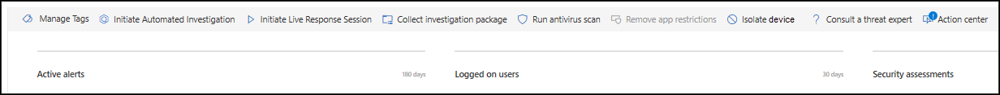

# Выполнение действий ответов на устройстве

[!INCLUDE [Microsoft 365 Defender rebranding](../../includes/microsoft-defender.md)]

**Область применения:**
- [Microsoft Defender для конечной точки](https://go.microsoft.com/fwlink/?linkid=2154037)

>Хотите испытать Defender для конечной точки? [Зарегистрився для бесплатной пробной.](https://www.microsoft.com/microsoft-365/windows/microsoft-defender-atp?ocid=docs-wdatp-respondmachine-abovefoldlink) 

Быстро реагируйте на обнаруженные атаки путем изоляции устройств или сбора пакета расследований. После принятия действий на устройствах можно проверить сведения о действиях в центре действий.

Действия ответа, которые запускают по верхней части определенной страницы устройства и включают в себя:

- Управление тегами
- Инициировать автоматическое расследование
- Инициировать сеанс живого ответа
- Сбор пакета исследования
- Запуск проверки на вирусы
- Ограничить выполнение приложения
- Изолировать устройство
- Обратитесь к эксперту по угрозам
- Центр уведомлений

 Страницы устройств можно найти в любом из следующих представлений:

- **Панель мониторинга операций безопасности** — выберите имя устройства из карты "Устройства с риском".
- **Очередь оповещений** . Выберите имя устройства рядом с значком устройства из очереди оповещений.
- **Список устройств** . Выберите заголовки имени устройства из списка устройств.
- **Поле поиска** — выберите устройство из выпадающее меню и введите имя устройства.

>[!IMPORTANT]
> - Эти действия ответа доступны только для устройств на Windows 10 версии 1703 или более поздней версии. 
> - Для не Windows платформ возможности отклика (например, изоляция устройств) зависят от сторонних возможностей.

## Управление тегами

Добавление или управление тегами для создания логической групповой принадлежности. Теги устройств поддерживают правильное сопоставление сети, позволяя прикреплять различные теги для захвата контекста и включения динамического создания списка в рамках инцидента.

Дополнительные сведения о тегах устройств см. в дополнительных сведениях [о создании и управлении тегами устройств.](machine-tags.md)

## Инициировать автоматическое расследование

При необходимости можно приступить к новому автоматическому расследованию общего назначения на устройстве. В ходе расследования любое другое оповещение, сгенерированное с устройства, будет добавлено в текущее автоматическое расследование до завершения этого расследования. Кроме того, если такая же угроза видна на других устройствах, эти устройства добавляются в исследование.

Дополнительные сведения об автоматизированных расследованиях см. в [обзоре автоматизированных расследований.](automated-investigations.md)

## Инициировать сеанс живого ответа

Live response — это возможность мгновенного доступа к устройству с помощью удаленного подключения к оболочке. Это дает вам возможность делать углубленные следственные действия и принимать срочные меры реагирования для оперативного сдерживания выявленных угроз — в режиме реального времени.

Live response предназначен для повышения эффективности расследований, позволяя собирать судебно-медицинские данные, запускать сценарии, отправлять подозрительные объекты для анализа, устранения угроз и активной охоты на возникающие угрозы.

Дополнительные сведения об ответах в прямом эфире см. в [сайте Investigate entities on devices using live response.](live-response.md)

## Сбор пакета исследований с устройств

В рамках процесса расследования или ответа можно собрать пакет исследований с устройства. Собирая пакет исследований, вы можете определить текущее состояние устройства и дополнительно понять инструменты и методы, используемые злоумышленником.

Для загрузки пакета (zip-файла) и изучения событий, произошедших на устройстве

1. Выберите **пакет Сбора расследований** из строки ответных действий в верхней части страницы устройства.
2. Укажите в текстовом окне, зачем нужно выполнить это действие. Выберите **Подтвердить**.
3. Файл zip будет скачивать

Альтернативный способ:

1. Выберите **центр действий** из раздела действия отклика на странице устройства.

    

3. В центре действий выберите пакет коллекции **пакетов, доступный для** скачивания почтового файла.
  
    

Пакет содержит следующие папки:

| Folder | Описание |
|:---|:---------|
|Autoruns | Содержит набор файлов, каждый из которых представляет содержимое реестра известной точки автоматического входа (ASEP), чтобы помочь определить сохраняемость злоумышленника на устройстве.    
<b>ПРИМЕЧАНИЕ:</b> Если ключ реестра не найден, файл будет содержать следующее сообщение: "ERROR: система не смогла найти указанный ключ реестра или значение".
                                                                                                                                |
|Установленные программы | Этот .CSV содержит список установленных программ, которые могут помочь определить, что установлено в настоящее время на устройстве. Дополнительные сведения см. [в Win32_Product класса](https://go.microsoft.com/fwlink/?linkid=841509).                                                                                  |
|Сетевые соединения. | Эта папка содержит набор точек данных, связанных с данными о подключении, которые могут помочь в определении подключения к подозрительным URL-адресам, инфраструктуре команды и управления злоумышленника (C&C), любому дальнейшему движению или удаленным подключениям.   - ActiveNetConnections.txt — отображает статистику протоколов и текущие подключения к сети TCP/IP. Предоставляет возможность искать подозрительные подключения, сделанные в процессе.    - Arp.txt — отображает таблицы кэша текущего протокола разрешения адресов (ARP) для всех интерфейсов.    Кэш ARP может выявить дополнительные хосты в сети, которые были скомпрометированы или подозрительные системы в сети, которые могли быть использованы для запуска внутренней атаки.   - DnsCache.txt - отображает содержимое кэша клиентского разрешения DNS, который включает в себя как записи, предварительно загруженные из локального файла Хостс, так и все недавно полученные записи ресурсов для запросов имен, разрешенных компьютером. Это может помочь в выявлении подозрительных подключений.    - IpConfig.txt — отображает полную конфигурацию TCP/IP для всех адаптеров. Адаптеры могут представлять физические интерфейсы, такие как установленные сетевые адаптеры или логические интерфейсы, такие как подключение к диалогу.    - FirewallExecutionLog.txt и pfirewall.log                                                                                  |
| Файлы prefetch| Windows Файлы prefetch предназначены для ускорения процесса запуска приложения. Он может использоваться для отслеживания всех файлов, недавно используемых в системе, и поиска следов для приложений, которые могли быть удалены, но все еще можно найти в списке файлов prefetch.    - Папка Prefetch — содержит копию файлов prefetch из `%SystemRoot%\Prefetch` . ПРИМЕЧАНИЕ. Для просмотра файлов предварительной загрузки предлагается скачать файл предварительной загрузки.    — PrefetchFilesList.txt — содержит список всех скопированные файлы, которые можно использовать для отслеживания сбоев копирования в папке prefetch.                                                                                                      |
| Процессы| Содержит .CSV файл с перечислением запущенных процессов, который предоставляет возможность определять текущие процессы, запущенные на устройстве. Это может быть полезно при выявлении подозрительного процесса и его состояния.                                                                                                                                                                                                       |
| Запланированные задачи| Содержит .CSV с перечислением запланированных задач, которые можно использовать для определения процедур, выполняемых автоматически на выбранном устройстве, чтобы искать подозрительный код, который был задат автоматически.                                                                                                                                                                                                      |
| Журнал событий безопасности| Содержит журнал событий безопасности, содержащий записи действий входа или входа или других событий, связанных с безопасностью, определенных политикой аудита системы.   
<b>ПРИМЕЧАНИЕ:</b> Откройте файл журнала событий с помощью просмотра событий.
                                                                                    |
| Службы| Содержит файл .CSV, в который перечислены службы и их состояния.                                                                                      |
| Windows Сеансы блока сообщений сервера (SMB) | Списки общего доступа к файлам, принтерам и серийным портам и различные сообщения между узлами в сети. Это может помочь определить эксфильтрации данных или поодальное перемещение.    Содержит файлы для SMBInboundSessions и SMBOutboundSession.    
<b>ПРИМЕЧАНИЕ:</b> Если сеансов нет (входящие или исходящие), вы получите текстовый файл, в котором сообщается, что сеансы SMB не найдены.
                                                                                                                          |
| Сведения о системе| Содержит файл SystemInformation.txt, в котором перечислены системные сведения, такие как версия ОС и сетевые карты.                                                                                     |
| Каталоги temp| Содержит набор текстовых файлов, которые перечислены файлы, расположенные в %Temp% для каждого пользователя в системе.    Это может помочь отслеживать подозрительные файлы, которые злоумышленник мог уронить в системе.    
<b>ПРИМЕЧАНИЕ:</b> Если файл содержит следующее сообщение: "Система не может найти указанный путь", это означает, что для этого пользователя нет каталога temp, а может быть, потому, что пользователь не входил в систему.
                                                                                                                                         |
| Пользователи и группы| Предоставляет список файлов, каждый из которых представляет группу и ее членов.                                                                                                                   |
|WdSupportLogs| Предоставляет MpCmdRunLog.txt и MPSupportFiles.cab     
<b>ПРИМЕЧАНИЕ:</b> Эта папка будет создана только на Windows 10 версии 1709 или более поздней версии с обновлением в феврале 2020 г. или более поздней установкой:  Win10 1709 (RS3) Сборка 16299.1717 : [KB4537816](https://support.microsoft.com/en-us/help/4537816/windows-10-update-kb4537816)   Win10 1803 (RS4) Сборка 17134.1345 : [KB4537795](https://support.microsoft.com/en-us/help/4537795/windows-10-update-kb4537795)   Win10 1809 (RS5) Сборка 17763.1075 : [KB4537818](https://support.microsoft.com/en-us/help/4537818/windows-10-update-kb4537818)   Win10 1903/1909 (19h1/19h2) Сборки 18362.693 и 18363.693 : [KB4535996](https://support.microsoft.com/en-us/help/4535996/windows-10-update-kb4535996) 
                                                                                                                    |
| CollectionSummaryReport.xls| Этот файл — сводка коллекции пакетов расследований, содержит список точек данных, команду, используемую для извлечения данных, состояние выполнения и код ошибки в случае сбоя. Этот отчет можно использовать для отслеживания, включает ли пакет все ожидаемые данные и определяет, были ли ошибки. |

## Запуск антивирусная программа в Microsoft Defender на устройствах

В рамках процесса расследования или реагирования можно удаленно инициировать антивирусное сканирование, чтобы помочь определить и устранять вредоносные программы, которые могут присутствовать на скомпрометированной устройстве.

>[!IMPORTANT]
>- Это действие доступно для устройств на Windows 10 версии 1709 или более поздней версии.
>- Проверка антивирусная программа в Microsoft Defender (Microsoft Defender AV) может работать вместе с другими антивирусными решениями, независимо от того, является ли Microsoft Defender AV активным антивирусным решением или нет. Microsoft Defender AV может быть в пассивном режиме. Дополнительные сведения см. [в антивирусная программа в Microsoft Defender совместимости.](https://docs.microsoft.com/windows/security/threat-protection/microsoft-defender-antivirus/microsoft-defender-antivirus-compatibility.md)

Один из них, выбранный для сканирования антивируса **Run,** выберите тип сканирования, который необходимо выполнить (быстрый или полный) и добавьте комментарий перед подтверждением проверки.

Центр действий покажет сведения о проверке, а временная шкала устройства будет включать новое событие, отражающее, что на устройстве было отправлено действие сканирования. Оповещения av Microsoft Defender будут отражать все обнаружения, которые всплыли во время проверки.

>[!NOTE]
>При запуске сканирования с помощью действия ответа Defender для конечной точки значение антивируса Microsoft Defender "ScanAvgCPULoadFactor" по-прежнему применяется и ограничивает влияние ЦП проверки.  Если ScanAvgCPULoadFactor не настроен, значение по умолчанию — это ограничение максимальной нагрузки ЦП в 50% во время сканирования. 
>Дополнительные сведения см. [в веб-сайте configure-advanced-scan-types-microsoft-defender-antivirus](https://docs.microsoft.com/windows/security/threat-protection/microsoft-defender-antivirus/configure-advanced-scan-types-microsoft-defender-antivirus).

## Ограничить выполнение приложения

Помимо сдерживания атаки путем остановки вредоносных процессов можно заблокировать устройство и предотвратить последующие попытки запуска потенциально вредоносных программ.

>[!IMPORTANT]
> - Это действие доступно для устройств на Windows 10 версии 1709 или более поздней версии.
> - Эта функция доступна, если ваша организация использует антивирусная программа в Microsoft Defender.
> - Это действие должно соответствовать форматам политики целостности кода Защитник Windows application Control и требованиям к подписанию. Дополнительные сведения см. в виде форматов политики целостности кода [и подписи.](https://docs.microsoft.com/windows/device-security/device-guard/requirements-and-deployment-planning-guidelines-for-device-guard#code-integrity-policy-formats-and-signing)

Чтобы ограничить запуск приложения, применяется политика целостности кода, которая позволяет запускать файлы только в том случае, если они подписаны сертификатом Майкрософт. Этот метод ограничения может помочь злоумышленнику контролировать скомпрометированную устройства и выполнять дальнейшие вредоносные действия.

>[!NOTE]
>Вы сможете в любое время отменить ограничение работы приложений. Кнопка на странице устройства будет изменяться, чтобы сказать **Удалить** ограничения приложений, а затем вы принимаете те же действия, что и ограничение выполнения приложения.

После выбора ограничения выполнения **приложения** на странице устройства введите комментарий и выберите **Подтверждение.** Центр действий покажет сведения о проверке, а временная шкала устройства будет включать новое событие.

**Уведомление пользователя устройства:** 
Если приложение ограничено, отображается следующее уведомление, чтобы сообщить пользователю о том, что приложению запрещено работать:

## Изолировать устройства от сети

В зависимости от серьезности атаки и чувствительности устройства может потребоваться изолировать устройство от сети. Это действие может помочь злоумышленнику предотвратить управление скомпрометированным устройством и выполнение дальнейших действий, таких как эксфильтрация данных и последующее перемещение.

>[!IMPORTANT]
>- Полная изоляция доступна для устройств Windows 10 версии 1703.
>- Выборочная изоляция доступна для устройств Windows 10 версии 1709 или более поздней версии.
>- При изоляции устройства допускаются только определенные процессы и назначения. Поэтому устройства, которые находятся за полным VPN-туннелем, не смогут достичь облачной службы Microsoft Defender для конечной точки после изоляции устройства. Рекомендуется использовать VPN для раздельного туннелинга для Microsoft Defender для конечной точки и антивирусная программа в Microsoft Defender облачного трафика, связанного с защитой.

Эта функция изоляции устройства отключает скомпрометированное устройство от сети, сохраняя подключение к службе Defender для конечных точек, которая продолжает отслеживать устройство.

В Windows 10 версии 1709 или более поздней версии вы получите дополнительный контроль над уровнем изоляции сети. Вы также можете включить подключение Outlook, Microsoft Teams и Skype для бизнеса (например, &quot;Селективной изоляции").

>[!NOTE]
>Вы сможете повторно подключить устройство к сети в любое время. Кнопка на странице устройства будет изменяться, чтобы сказать **"Освобождение** от изоляции", после чего вы будете делать те же действия, что и изолирование устройства.

После выбора устройства **Isolate на** странице устройства введите комментарий и выберите **Подтверждение.** Центр действий покажет сведения о проверке, а временная шкала устройства будет включать новое событие.

>[!NOTE]
>Устройство будет подключено к службе Defender для конечной точки, даже если оно изолировано от сети. Если вы решили включить Outlook и Skype для бизнеса связи, вы сможете общаться с пользователем, пока устройство изолировано.

**Уведомление пользователя устройства:** 
Когда устройство изолировано, отображается следующее уведомление, информирующее пользователя о том, что устройство изолировано от сети:

## Обратитесь к эксперту по угрозам

Дополнительные сведения о потенциально скомпрометированном устройстве или уже скомпрометированном устройстве можно получить у эксперта по угрозам Майкрософт. эксперты Майкрософт по угрозам могут быть задействованы непосредственно из Центр безопасности в Microsoft Defender для быстрого и точного ответа. Эксперты предоставляют сведения не только о потенциально скомпрометированном устройстве, но и для лучшего понимания сложных угроз, целевых уведомлений об атаках, которые вы получаете, или если вам требуется больше сведений о оповещениях или контексте сведении об угрозах, которые вы видите на панели мониторинга портала.

Подробные [сведения см. в материале Consult a Microsoft Threat Expert.](https://docs.microsoft.com/microsoft-365/security/defender-endpoint/configure-microsoft-threat-experts#consult-a-microsoft-threat-expert-about-suspicious-cybersecurity-activities-in-your-organization)

## Проверка сведений о действиях в центре действий

Центр **действий** предоставляет сведения о действиях, принятых на устройстве или файле. Вы сможете просмотреть следующие сведения:

- Коллекция пакетов исследований
- Антивирусное сканирование
- Ограничение приложения
- Изоляция устройств

Все другие связанные сведения также показаны, например, дата отправки/время отправки пользователя, а также если действие было успешным или неудачным.

## Связанная тема
- [Выполнение действий ответов в файле](respond-file-alerts.md)
- [Неточность отчета](https://docs.microsoft.com/microsoft-365/security/defender-endpoint/tvm-security-recommendation#report-inaccuracy)
