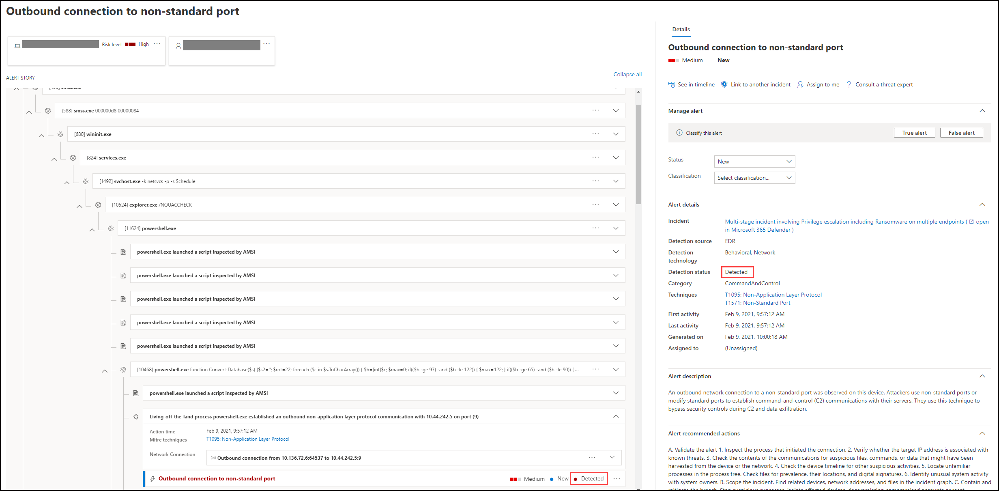
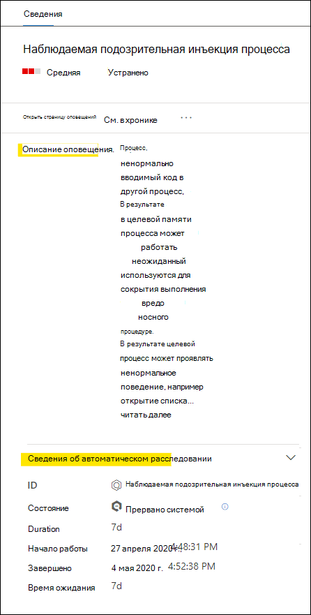
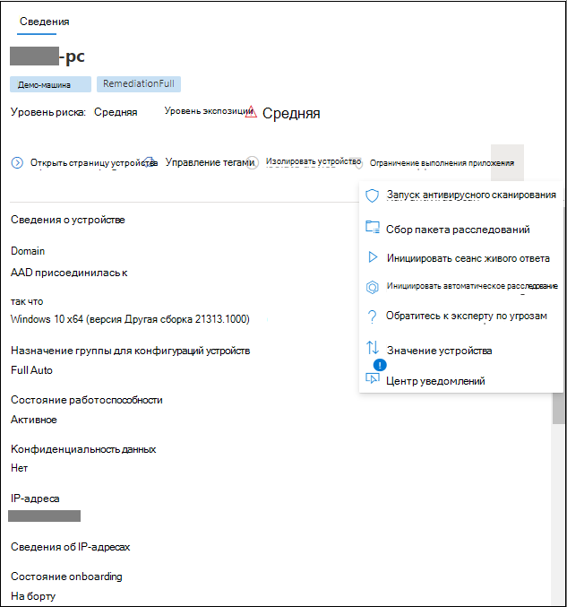

# Просмотр оповещений в Microsoft Defender для конечной точкиReview alerts in Microsoft Defender for Endpoint

[!INCLUDE [Microsoft 365 Defender rebranding](../../includes/microsoft-defender.md)]

**Область применения:****Applies to:**
- [Microsoft Defender для конечной точкиMicrosoft Defender for Endpoint](https://go.microsoft.com/fwlink/?linkid=2154037)

>Хотите испытать Defender для конечной точки?Want to experience Defender for Endpoint? [Зарегистрився для бесплатной пробной.Sign up for a free trial.](https://www.microsoft.com/microsoft-365/windows/microsoft-defender-atp?ocid=docs-wdatp-managealerts-abovefoldlink)

Страница оповещений в Microsoft Defender для конечной точки обеспечивает полный контекст оповещения, объединяя сигналы атаки и оповещения, связанные с выбранным оповещением, для создания подробной истории оповещения.The alert page in Microsoft Defender for Endpoint provides full context to the alert, by combining attack signals and alerts related to the selected alert, to construct a detailed alert story.

Быстрое изучение, исследование и эффективное действие оповещений, влияющих на организацию.Quickly triage, investigate, and take effective action on alerts that affect your organization. Понять, почему они были вызваны, и их влияние из одного расположения.Understand why they were triggered, and their impact from one location. Дополнительные сведения в этом обзоре.Learn more in this overview.

> [!VIDEO https://www.microsoft.com/videoplayer/embed/RE4yiO5]

## Начало работы с оповещениемGetting started with an alert

Выбор имени оповещений в Защитнике для конечной точки высадит вас на его странице оповещений.Selecting an alert's name in Defender for Endpoint will land you on its alert page. На странице оповещения вся информация будет показана в контексте выбранного оповещения.On the alert page, all the information will be shown in context of the selected alert. Каждая страница оповещения состоит из 4 разделов:Each alert page consists of 4 sections:

1. **В заголовке** оповещений указывается имя оповещений, которое напоминает о том, какое предупреждение началось ваше текущее расследование независимо от выбранного на странице.**The alert title** shows the alert's name and is there to remind you which alert started your current investigation regardless of what you have selected on the page.
2. [**Затронутые активы**](#review-affected-assets) перечисляют карточки устройств и пользователей, затронутых этим оповещением, которые можно щелкнуть для получения дополнительных сведений и действий.[**Affected assets**](#review-affected-assets) lists cards of devices and users affected by this alert that are clickable for further information and actions.
3. В **истории оповещений** отображаются все объекты, связанные с оповещением, связанные представлением дерева.The **alert story** displays all entities related to the alert, interconnected by a tree view. Оповещение в заголовке будет в центре внимания при первой посадке на выбранной странице оповещения.The alert in the title will be the one in focus when you first land on your selected alert's page. Сущностями в истории оповещения являются расширяемыми и щелкаемыми, чтобы предоставить дополнительные сведения и ускорить ответ, позволяя вам принимать меры прямо в контексте страницы оповещения.Entities in the alert story are expandable and clickable, to provide additional information and expedite response by allowing you to take actions right in the context of the alert page. Используйте историю оповещений, чтобы начать расследование.Use the alert story to start your investigation. Узнайте, как исследовать [оповещения в Microsoft Defender для конечной точки.](/microsoft-365/security/defender-endpoint/investigate-alerts)Learn how in [Investigate alerts in Microsoft Defender for Endpoint](/microsoft-365/security/defender-endpoint/investigate-alerts).
4. На **области сведений** сначала покажутся сведения об выбранном оповещении с подробными сведениями и действиями, связанными с этим оповещением.The **details pane** will show the details of the selected alert at first, with details and actions related to this alert. Если выбрать какой-либо из затронутых активов или сущностях в истории оповещений, области сведений изменятся, чтобы предоставить контекстную информацию и действия для выбранного объекта.If you select any of the affected assets or entities in the alert story, the details pane will change to provide contextual information and actions for the selected object.

Обратите внимание на состояние обнаружения оповещений.Note the detection status for your alert. 
- Предотвращено. Попытка подозрительных действий была предотвращена.Prevented – The attempted suspicious action was avoided. Например, файл не был написан на диск или выполнен.For example, a file either wasn’t written to disk or executed.

- Заблокировано — подозрительное поведение было выполнено, а затем заблокировано.Blocked – Suspicious behavior was executed and then blocked. Например, был выполнен процесс, но поскольку впоследствии он выставил подозрительные действия, процесс был прекращен.For example, a process was executed but because it subsequently exhibited suspicious behaviors, the process was terminated.

- Обнаружено. Обнаружена атака, которая, возможно, по-прежнему активна.Detected – An attack was detected and is possibly still active.

Затем вы также  можете просмотреть сведения об автоматическом расследовании в области сведений оповещений, чтобы узнать, какие действия уже приняты, а также прочитать описание оповещений о рекомендуемых действиях.You can then also review the *automated investigation details* in your alert's details pane, to see which actions were already taken, as well as reading the alert's description for recommended actions.

Другие сведения, доступные в области сведений при открываемом оповещении, включают методы MITRE, исходные и дополнительные контекстные сведения.Other information available in the details pane when the alert opens includes MITRE techniques, source, and additional contextual details.

## Просмотр затронутых активовReview affected assets

Выбор устройства или карточки пользователя в разделах с затронутыми активами переключается на сведения об устройстве или пользователе в области сведений.Selecting a device or a user card in the affected assets sections will switch to the details of the device or user in the details pane.

- **Для устройств** область данных будет отображать сведения о самом устройстве, например домене, операционной системе и IP.**For devices**, the details pane will display information about the device itself, like Domain, Operating System, and IP. Также доступны активные оповещений и зарегистрированные на этом устройстве пользователи.Active alerts and the logged on users on that device are also available. Вы можете принять незамедлительных действий, изолировать устройство, ограничить выполнение приложения или запуск антивирусного сканирования.You can take immediate action by isolating the device, restricting app execution, or running an antivirus scan. Кроме того, можно собрать пакет исследований, инициировать автоматическое расследование или перейти на страницу устройства для изучения с точки зрения устройства.Alternatively, you could collect an investigation package, initiate an automated investigation, or go to the device page to investigate from the device's point of view.

   

- **Для пользователей** в области сведений будут отображаться подробные сведения о пользователе, такие как имя пользователя SAM и SID, а также типы логотипов, выполняемые этим пользователем, а также любые оповещения и инциденты, связанные с ним.**For users**, the details pane will display detailed user information, such as the user's SAM name and SID, as well as logon types performed by this user and any alerts and incidents related to it. Чтобы продолжить исследование с точки зрения этого пользователя, можно выбрать страницу *Open* user.You can select *Open user page* to continue the investigation from that user's point of view.

   

## Статьи по темеRelated topics

- [Просмотр и организация очереди инцидентовView and organize the incidents queue](view-incidents-queue.md)
- [Исследование инцидентовInvestigate incidents](investigate-incidents.md)
- [Управление инцидентамиManage incidents](manage-incidents.md)
