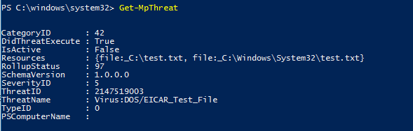

# <a name="review-microsoft-defender-antivirus-scan-results"></a><span data-ttu-id="be941-104">Проверка антивирусная программа в Microsoft Defender результатов сканирования</span><span class="sxs-lookup"><span data-stu-id="be941-104">Review Microsoft Defender Antivirus scan results</span></span>

[!INCLUDE [Microsoft 365 Defender rebranding](../../includes/microsoft-defender.md)]


<span data-ttu-id="be941-105">**Область применения:**</span><span class="sxs-lookup"><span data-stu-id="be941-105">**Applies to:**</span></span>

- [<span data-ttu-id="be941-106">Microsoft Defender для конечной точки</span><span class="sxs-lookup"><span data-stu-id="be941-106">Microsoft Defender for Endpoint</span></span>](/microsoft-365/security/defender-endpoint/)

<span data-ttu-id="be941-107">После завершения антивирусная программа в Microsoft Defender проверки, будь то по [](run-scan-microsoft-defender-antivirus.md) требованию или запланированное [сканирование,](scheduled-catch-up-scans-microsoft-defender-antivirus.md)результаты записывают, и вы можете просмотреть результаты.</span><span class="sxs-lookup"><span data-stu-id="be941-107">After a Microsoft Defender Antivirus scan completes, whether it is an [on-demand](run-scan-microsoft-defender-antivirus.md) or [scheduled scan](scheduled-catch-up-scans-microsoft-defender-antivirus.md), the results are recorded and you can view the results.</span></span> 


## <a name="use-configuration-manager-to-review-scan-results"></a><span data-ttu-id="be941-108">Использование диспетчера конфигурации для проверки результатов сканирования</span><span class="sxs-lookup"><span data-stu-id="be941-108">Use Configuration Manager to review scan results</span></span>

<span data-ttu-id="be941-109">Узнайте, [как отслеживать состояние Endpoint Protection.](/configmgr/protect/deploy-use/monitor-endpoint-protection)</span><span class="sxs-lookup"><span data-stu-id="be941-109">See [How to monitor Endpoint Protection status](/configmgr/protect/deploy-use/monitor-endpoint-protection).</span></span>

## <a name="use-powershell-cmdlets-to-review-scan-results"></a><span data-ttu-id="be941-110">Использование cmdlets PowerShell для проверки результатов сканирования</span><span class="sxs-lookup"><span data-stu-id="be941-110">Use PowerShell cmdlets to review scan results</span></span>

<span data-ttu-id="be941-111">Следующий кодлет возвращает каждое обнаружение на конечной точке.</span><span class="sxs-lookup"><span data-stu-id="be941-111">The following cmdlet will return each detection on the endpoint.</span></span> <span data-ttu-id="be941-112">Если существует несколько обнаружения одной и той же угрозы, каждое обнаружение будет перечислены отдельно, в зависимости от времени каждого обнаружения:</span><span class="sxs-lookup"><span data-stu-id="be941-112">If there are multiple detections of the same threat, each detection will be listed separately, based on the time of each detection:</span></span>

```PowerShell
Get-MpThreatDetection
```


<span data-ttu-id="be941-114">Можно указать, чтобы ограничить выход только для обнаружения `-ThreatID` определенной угрозы.</span><span class="sxs-lookup"><span data-stu-id="be941-114">You can specify `-ThreatID` to limit the output to only show the detections for a specific threat.</span></span>

<span data-ttu-id="be941-115">Если вы хотите перечислить обнаружения угроз, но объединить обнаружения одной и той же угрозы в один элемент, можно использовать следующий cmdlet:</span><span class="sxs-lookup"><span data-stu-id="be941-115">If you want to list threat detections, but combine detections of the same threat into a single item, you can use the following cmdlet:</span></span>

```PowerShell
Get-MpThreat
```



<span data-ttu-id="be941-117">Дополнительные сведения об использовании PowerShell с антивирусной программой в Microsoft Defender см. в разделах [Использование командлетов PowerShell для настройки и запуска антивирусной программы в Microsoft Defender](use-powershell-cmdlets-microsoft-defender-antivirus.md) и [Командлеты Defender](/powershell/module/defender/).</span><span class="sxs-lookup"><span data-stu-id="be941-117">See [Use PowerShell cmdlets to configure and run Microsoft Defender Antivirus](use-powershell-cmdlets-microsoft-defender-antivirus.md) and [Defender cmdlets](/powershell/module/defender/) for more information on how to use PowerShell with Microsoft Defender Antivirus.</span></span>

## <a name="use-windows-management-instruction-wmi-to-review-scan-results"></a><span data-ttu-id="be941-118">Используйте Windows управления (WMI) для проверки результатов сканирования</span><span class="sxs-lookup"><span data-stu-id="be941-118">Use Windows Management Instruction (WMI) to review scan results</span></span>

<span data-ttu-id="be941-119">Используйте [ **метод Get** классов **MSFT_MpThreat** **MSFT_MpThreatDetection.**](/previous-versions/windows/desktop/defender/windows-defender-wmiv2-apis-portal)</span><span class="sxs-lookup"><span data-stu-id="be941-119">Use the [**Get** method of the **MSFT_MpThreat** and **MSFT_MpThreatDetection**](/previous-versions/windows/desktop/defender/windows-defender-wmiv2-apis-portal) classes.</span></span>


## <a name="related-articles"></a><span data-ttu-id="be941-120">Статьи по теме</span><span class="sxs-lookup"><span data-stu-id="be941-120">Related articles</span></span>

- [<span data-ttu-id="be941-121">Настройка, инициирование и проверка результатов антивирусная программа в Microsoft Defender и исправлений</span><span class="sxs-lookup"><span data-stu-id="be941-121">Customize, initiate, and review the results of Microsoft Defender Antivirus scans and remediation</span></span>](customize-run-review-remediate-scans-microsoft-defender-antivirus.md)
- [<span data-ttu-id="be941-122">антивирусная программа в Microsoft Defender в Windows 10</span><span class="sxs-lookup"><span data-stu-id="be941-122">Microsoft Defender Antivirus in Windows 10</span></span>](microsoft-defender-antivirus-in-windows-10.md)