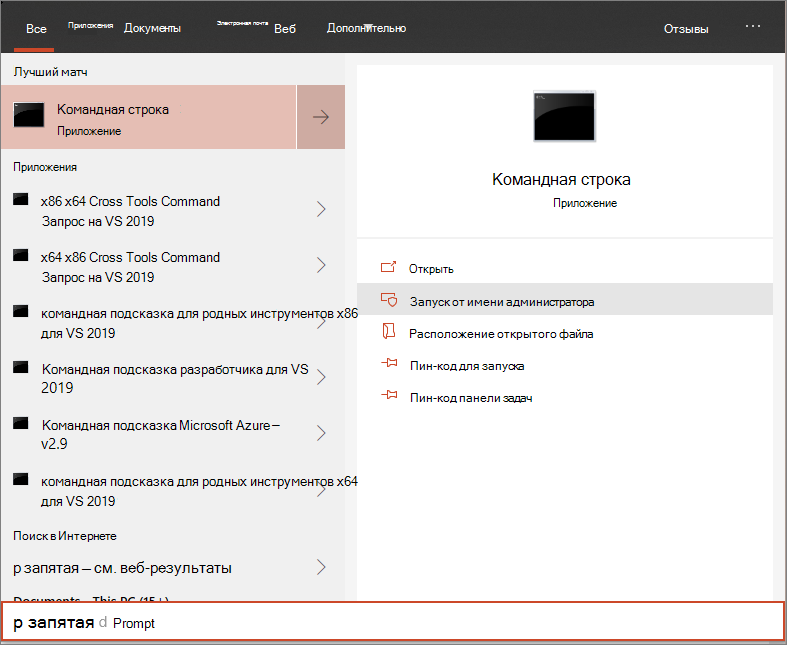

# <a name="run-a-detection-test-on-a-newly-onboarded-microsoft-defender-for-endpoint-device"></a><span data-ttu-id="1dc8b-104">Запустите тест обнаружения на недавно созданном устройстве Microsoft Defender для конечных точек</span><span class="sxs-lookup"><span data-stu-id="1dc8b-104">Run a detection test on a newly onboarded Microsoft Defender for Endpoint device</span></span> 

[!INCLUDE [Microsoft 365 Defender rebranding](../../includes/microsoft-defender.md)]


<span data-ttu-id="1dc8b-105">**Область применения:**</span><span class="sxs-lookup"><span data-stu-id="1dc8b-105">**Applies to:**</span></span>
- <span data-ttu-id="1dc8b-106">Поддерживаемые Windows 10 версии</span><span class="sxs-lookup"><span data-stu-id="1dc8b-106">Supported Windows 10 versions</span></span>
- <span data-ttu-id="1dc8b-107">Windows Server 2012 R2</span><span class="sxs-lookup"><span data-stu-id="1dc8b-107">Windows Server 2012 R2</span></span>
- <span data-ttu-id="1dc8b-108">Windows Server 2016</span><span class="sxs-lookup"><span data-stu-id="1dc8b-108">Windows Server 2016</span></span>
- <span data-ttu-id="1dc8b-109">Windows Сервер, версия 1803</span><span class="sxs-lookup"><span data-stu-id="1dc8b-109">Windows Server, version 1803</span></span>
- <span data-ttu-id="1dc8b-110">Windows Server, 2019</span><span class="sxs-lookup"><span data-stu-id="1dc8b-110">Windows Server, 2019</span></span>
- [<span data-ttu-id="1dc8b-111">Microsoft Defender для конечной точки</span><span class="sxs-lookup"><span data-stu-id="1dc8b-111">Microsoft Defender for Endpoint</span></span>](https://go.microsoft.com/fwlink/?linkid=2154037)
- [<span data-ttu-id="1dc8b-112">Microsoft 365 Defender</span><span class="sxs-lookup"><span data-stu-id="1dc8b-112">Microsoft 365 Defender</span></span>](https://go.microsoft.com/fwlink/?linkid=2118804)

> <span data-ttu-id="1dc8b-113">Хотите испытать Microsoft Defender для конечной точки?</span><span class="sxs-lookup"><span data-stu-id="1dc8b-113">Want to experience Microsoft Defender for Endpoint?</span></span> [<span data-ttu-id="1dc8b-114">Зарегистрився для бесплатной пробной.</span><span class="sxs-lookup"><span data-stu-id="1dc8b-114">Sign up for a free trial.</span></span>](https://www.microsoft.com/microsoft-365/windows/microsoft-defender-atp?ocid=docs-wdatp-exposedapis-abovefoldlink)

<span data-ttu-id="1dc8b-115">Запустите следующий скрипт PowerShell на новом устройстве, чтобы убедиться, что он должным образом передается в службу Защитник для конечных точек.</span><span class="sxs-lookup"><span data-stu-id="1dc8b-115">Run the following PowerShell script on a newly onboarded device to verify that it is properly reporting to the Defender for Endpoint service.</span></span>

1. <span data-ttu-id="1dc8b-116">Создайте папку: "C:\test-MDATP-test".</span><span class="sxs-lookup"><span data-stu-id="1dc8b-116">Create a folder:  'C:\test-MDATP-test'.</span></span>
2. <span data-ttu-id="1dc8b-117">Откройте повышенную командную строку на устройстве и запустите сценарий:</span><span class="sxs-lookup"><span data-stu-id="1dc8b-117">Open an elevated command-line prompt on the device and run the script:</span></span>

   1. <span data-ttu-id="1dc8b-118">В меню **Пуск** введите **cmd**.</span><span class="sxs-lookup"><span data-stu-id="1dc8b-118">Go to **Start** and type **cmd**.</span></span>

   1. <span data-ttu-id="1dc8b-119">Щелкните правой **кнопкой мыши командный запрос** и выберите **Выполнить в качестве администратора.**</span><span class="sxs-lookup"><span data-stu-id="1dc8b-119">Right-click **Command Prompt** and select **Run as administrator**.</span></span>

      

3. <span data-ttu-id="1dc8b-121">По запросу скопируйте и запустите следующую команду:</span><span class="sxs-lookup"><span data-stu-id="1dc8b-121">At the prompt, copy and run the following command:</span></span>

   ```powershell
   powershell.exe -NoExit -ExecutionPolicy Bypass -WindowStyle Hidden $ErrorActionPreference = 'silentlycontinue';(New-Object System.Net.WebClient).DownloadFile('http://127.0.0.1/1.exe', 'C:\\test-MDATP-test\\invoice.exe');Start-Process 'C:\\test-MDATP-test\\invoice.exe'
   ```

<span data-ttu-id="1dc8b-122">Окно Командная подсказка закрывается автоматически.</span><span class="sxs-lookup"><span data-stu-id="1dc8b-122">The Command Prompt window will close automatically.</span></span> <span data-ttu-id="1dc8b-123">В случае успешного завершения тест обнаружения будет отмечен как завершенный, и через 10 минут на портале для бортового устройства появится новое оповещение.</span><span class="sxs-lookup"><span data-stu-id="1dc8b-123">If successful, the detection test will be marked as completed and a new alert will appear in the portal for the onboarded device in approximately 10 minutes.</span></span>

## <a name="related-topics"></a><span data-ttu-id="1dc8b-124">Статьи по теме</span><span class="sxs-lookup"><span data-stu-id="1dc8b-124">Related topics</span></span>
- [<span data-ttu-id="1dc8b-125">Подключение устройств Windows 10</span><span class="sxs-lookup"><span data-stu-id="1dc8b-125">Onboard Windows 10 devices</span></span>](configure-endpoints.md)
- [<span data-ttu-id="1dc8b-126">Серверы на борту</span><span class="sxs-lookup"><span data-stu-id="1dc8b-126">Onboard servers</span></span>](configure-server-endpoints.md)
- [<span data-ttu-id="1dc8b-127">Устранение неполадок в Microsoft Defender для проблем с бортовой точкой конечной точки</span><span class="sxs-lookup"><span data-stu-id="1dc8b-127">Troubleshoot Microsoft Defender for Endpoint onboarding issues</span></span>](/microsoft-365/security/defender-endpoint/troubleshoot-onboarding)
