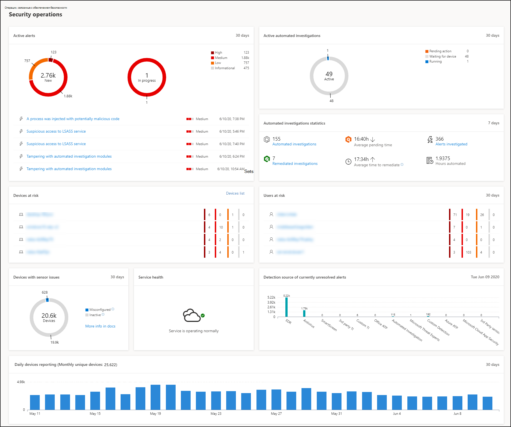
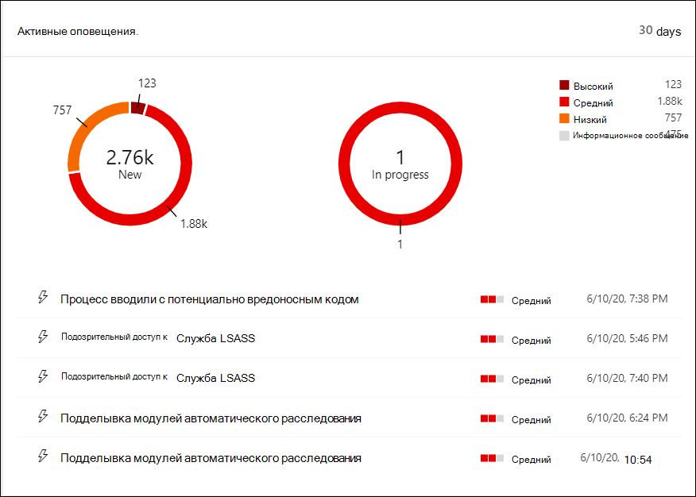
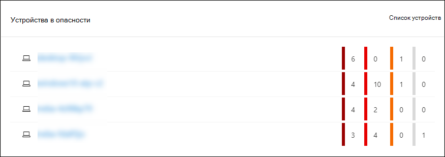
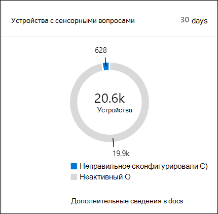
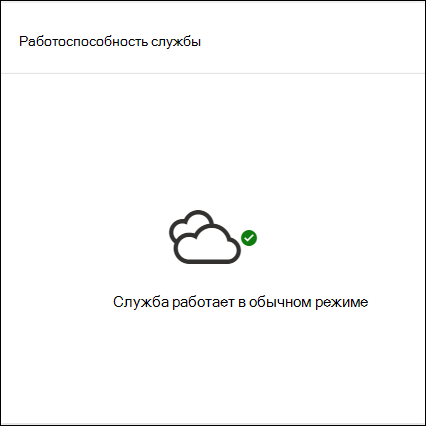
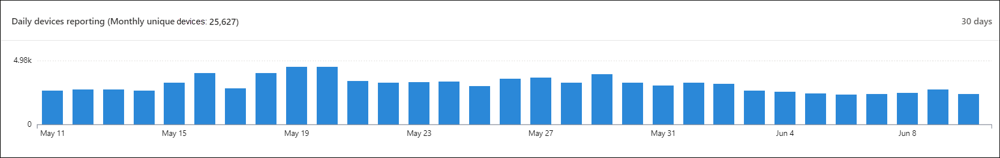
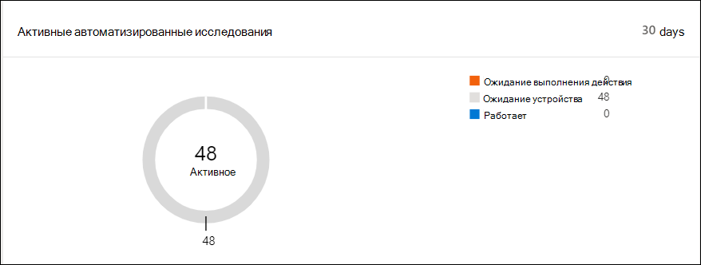
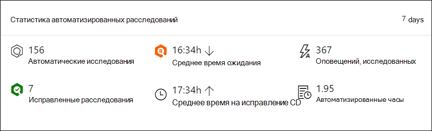
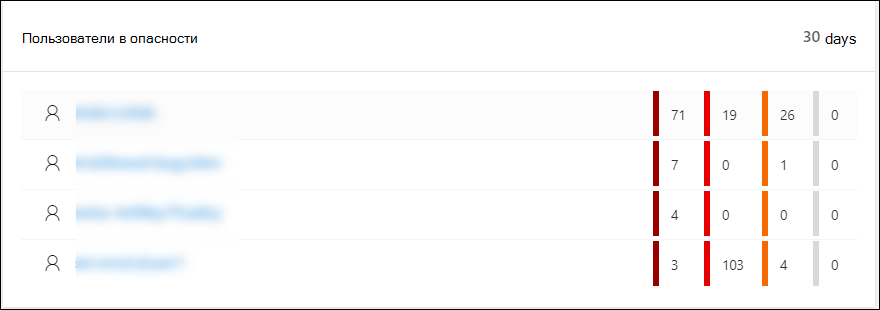

# Центр безопасности в Microsoft Defender Панель мониторинга операций безопасностиMicrosoft Defender Security Center Security operations dashboard

[!INCLUDE [Microsoft 365 Defender rebranding](../../includes/microsoft-defender.md)]

**Область применения:****Applies to:**
- [Microsoft Defender для конечной точкиMicrosoft Defender for Endpoint](https://go.microsoft.com/fwlink/?linkid=2154037)

>Хотите испытать Microsoft Defender для конечной точки?Want to experience Microsoft Defender for Endpoint? [Зарегистрився для бесплатной пробной.Sign up for a free trial.](https://www.microsoft.com/microsoft-365/windows/microsoft-defender-atp?ocid=docs-wdatp-secopsdashboard-abovefoldlink) 

Панель **мониторинга операций** безопасности — это обнаружение и нейтрализация атак на конечные точки возможности.The **Security operations dashboard** is where the endpoint detection and response capabilities are surfaced. Он предоставляет обзор на высоком уровне, где были замечены обнаружения, и основные моменты, в которых необходимы действия реагирования.It provides a high level overview of where detections were seen and highlights where response actions are needed. 

Панель мониторинга отображает снимок:The dashboard displays a snapshot of:

- Активные оповещенияActive alerts
- Устройства в опасностиDevices at risk
- Здоровье датчикаSensor health
- Работоспособность службыService health
- Ежедневные отчеты о устройствахDaily devices reporting
- Активные автоматизированные исследованияActive automated investigations
- Статистика автоматизированных расследованийAutomated investigations statistics
- Пользователи в опасностиUsers at risk
- Подозрительные действияSuspicious activities

Вы можете исследовать и исследовать оповещения и устройства, чтобы быстро определить, если, где и когда в вашей сети произошли подозрительные действия, чтобы помочь вам понять контекст, в котором они появились.You can explore and investigate alerts and devices to quickly determine if, where, and when suspicious activities occurred in your network to help you understand the context they appeared in.

На панели **мониторинга операций безопасности** вы увидите агрегированные события, облегчающие идентификацию важных событий или поведения на устройстве.From the **Security operations dashboard** you will see aggregated events to facilitate the identification of significant events or behaviors on a device. Вы также можете сверлить детализацию событий и низкоуровневых индикаторов.You can also drill down into granular events and low-level indicators.

Он также имеет щелкаемые плитки, которые дают визуальные сигналы об общем состоянии здоровья вашей организации.It also has clickable tiles that give visual cues on the overall health state of your organization. Каждая плитка открывает подробное представление соответствующего обзора.Each tile opens a detailed view of the corresponding overview.

## Активные оповещенияActive alerts
Общее число активных оповещений за последние 30 дней в сети можно просмотреть из плитки.You can view the overall number of active alerts from the last 30 days in your network from the tile. Оповещений сгруппировать в **новые и** **в процессе**.Alerts are grouped into **New** and **In progress**.

Каждая группа дополнительно классифицируются в соответствующие уровни серьезности оповещений.Each group is further sub-categorized into their corresponding alert severity levels. Щелкните число оповещений внутри каждого кольца оповещения, чтобы просмотреть сортировку очереди этой категории **(New** или **In progress).**Click the number of alerts inside each alert ring to see a sorted view of that category's queue (**New** or **In progress**).

Дополнительные сведения см. в [обзоре Оповещений.](alerts-queue.md)For more information see, [Alerts overview](alerts-queue.md).

Каждая строка содержит категорию серьезности оповещений и краткое описание оповещения.Each row includes an alert severity category and a short description of the alert. Вы можете щелкнуть оповещение, чтобы просмотреть его подробное представление.You can click an alert to see its detailed view. Дополнительные сведения см. в обзоре Обзор оповещений и оповещений [Microsoft Defender для конечных](investigate-alerts.md) [точек.](alerts-queue.md)For more information see,  [Investigate Microsoft Defender for Endpoint alerts](investigate-alerts.md) and [Alerts overview](alerts-queue.md).

## Устройства в опасностиDevices at risk
На этой плитке показан список устройств с самым большим количеством активных оповещений.This tile shows you a list of devices with the highest number of active alerts. Общее число оповещений для каждого устройства отображается в круге рядом с именем устройства, а затем далее классифицируются по уровням серьезности в дальнем конце плитки (наведите курсор на каждую планку серьезности, чтобы увидеть его метку).The total number of alerts for each device is shown in a circle next to the device name, and then further categorized by severity levels at the far end of the tile (hover over each severity bar to see its label).

Щелкните имя устройства, чтобы узнать подробности об этом устройстве.Click the name of the device to see details about that device. Дополнительные сведения см. в [списке Microsoft Defender for Endpoint Devices.](investigate-machines.md)For more information see, [Investigate devices in the Microsoft Defender for Endpoint Devices list](investigate-machines.md).

Вы также можете щелкнуть список **Устройств** в верхней части плитки, чтобы перейти непосредственно к списку **Устройств,** отсортировали по количеству активных оповещений.You can also click **Devices list** at the top of the tile to go directly to the **Devices list**, sorted by the number of active alerts. Дополнительные сведения см. в [списке Microsoft Defender for Endpoint Devices.](investigate-machines.md)For more information see, [Investigate devices in the Microsoft Defender for Endpoint Devices list](investigate-machines.md).

## Устройства с сенсорными вопросамиDevices with sensor issues
Плитка **Устройств с проблемными** датчиками предоставляет сведения о способности отдельного устройства предоставлять данные датчиков службе Microsoft Defender для конечной точки.The **Devices with sensor issues** tile provides information on the individual device’s ability to provide sensor data to the Microsoft Defender for Endpoint service. Он сообщает, сколько устройств требует внимания и помогает выявлять проблемные устройства.It reports how many devices require attention and helps you identify problematic devices.

Существует два индикатора состояния, которые предоставляют сведения о количестве устройств, которые должным образом не сообщаются службе:There are two status indicators that provide information on the number of devices that are not reporting properly to the service:
- **Неправильное** представление — эти устройства могут частично сообщать данные датчиков службе Microsoft Defender для конечных точек и могут иметь ошибки конфигурации, которые необходимо исправить.**Misconfigured** – These devices might partially be reporting sensor data to the Microsoft Defender for Endpoint service and might have configuration errors that need to be corrected.
- **Неактивные** устройства, которые перестали отчитываться в службе Microsoft Defender для конечных точек более семи дней в прошлом месяце.**Inactive** - Devices that have stopped reporting to the Microsoft Defender for Endpoint service for more than seven days in the past month.

При нажатии любой из групп вы будете направлены в список устройств, отфильтрованный в соответствии с вашим выбором.When you click any of the groups, you’ll be directed to devices list, filtered according to your choice. Дополнительные сведения см. в [дополнительных сведениях, которые см.](check-sensor-status.md) в "Проверить состояние датчика" и ["Исследовать устройства".](investigate-machines.md)For more information, see [Check sensor state](check-sensor-status.md) and [Investigate devices](investigate-machines.md).

## Работоспособность службыService health
Плитка **здоровья** службы информирует вас о том, активна ли служба или есть ли проблемы.The **Service health** tile informs you if the service is active or if there are issues.

Дополнительные сведения о состоянии службы см. в [веб-сайте Check the Microsoft Defender for Endpoint service health.](service-status.md)For more information on the service health, see [Check the Microsoft Defender for Endpoint service health](service-status.md).

## Ежедневные отчеты о устройствахDaily devices reporting
Плитка **отчетов** о ежедневных устройствах отображает диаграмму панели, которая представляет количество устройств, ежедневно сообщая о них за последние 30 дней.The **Daily devices reporting** tile shows a bar graph that represents the number of devices reporting daily in the last 30 days. Наведите курсор над отдельными барами на графике, чтобы увидеть точное число устройств, сообщаящих в каждый день.Hover over individual bars on the graph to see the exact number of devices reporting in each day.

## Активные автоматизированные исследованияActive automated investigations
Общее число автоматических расследований за последние 30 дней в сети можно просмотреть из плитки **Active automated investigations.**You can view the overall number of automated investigations from the last 30 days in your network from the **Active automated investigations** tile. Исследования сгруппировали в **Ожидающее действие,** **ожидание устройства** и **запуск.**Investigations are grouped into **Pending action**, **Waiting for device**, and **Running**.

## Статистика автоматизированных расследованийAutomated investigations statistics
На этой плитке показана статистика, связанная с автоматическими расследованиями за последние семь дней.This tile shows statistics related to automated investigations in the last seven days. В нем показано количество завершенных расследований, количество успешно исправленных расследований, среднее время ожидания, необходимое для начала расследования, среднее время, необходимое для устранения оповещений, количество исследованных оповещений и количество часов автоматизации, сэкономленных при обычном ручном расследовании.It shows the number of investigations completed, the number of successfully remediated investigations, the average pending time it takes for an investigation to be initiated, the average time it takes to remediate an alert, the number of alerts investigated, and the number of hours of automation saved from a typical manual investigation. 

Вы можете **щелкнуть** по автоматическим расследованиям,  исправленным расследованиям и оповещений, исследуемой для перемещения на страницу **Исследования,** фильтруемую соответствующей категорией.You can click on **Automated investigations**, **Remediated investigations**, and **Alerts investigated** to navigate to the **Investigations** page, filtered by the appropriate category. Это позволяет увидеть подробный анализ расследований в контексте.This lets you see a detailed breakdown of investigations in context.

## Пользователи в опасностиUsers at risk
На плитке показан список учетных записей пользователей с наиболее активными оповещений и количество оповещений высокого, среднего или низкого уровня оповещений.The tile shows you a list of user accounts with the most active alerts and the number of alerts seen on high, medium, or low alerts. 

Щелкните учетную запись пользователя, чтобы узнать подробности об учетной записи пользователя.Click the user account to see details about the user account. Дополнительные сведения см. [в дополнительных сведениях: Исследование учетной записи пользователя.](investigate-user.md)For more information see [Investigate a user account](investigate-user.md).

>Хотите испытать Microsoft Defender для конечной точки?Want to experience Microsoft Defender for Endpoint? [Зарегистрився для бесплатной пробной.Sign up for a free trial.](https://www.microsoft.com/microsoft-365/windows/microsoft-defender-atp?ocid=docs-wdatp-secopsdashboard-belowfoldlink)

## Статьи по темеRelated topics
- [Понимание портала Microsoft Defender для конечных точекUnderstand the Microsoft Defender for Endpoint portal](use.md)
- [Обзор порталаPortal overview](portal-overview.md)
- [Просмотр панели управления & уязвимостейView the Threat & Vulnerability Management dashboard](tvm-dashboard-insights.md)
- [Просмотр панели мониторинга аналитики угроз и рекомендуемые действия по смягчению последствийView the Threat analytics dashboard and take recommended mitigation actions](threat-analytics.md)
