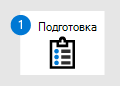

# <a name="migrate-from-symantec---phase-2-set-up-microsoft-defender-for-endpoint"></a><span data-ttu-id="c0abc-104">Миграция из Symantec — этап 2. Настройка Microsoft Defender для конечной точки</span><span class="sxs-lookup"><span data-stu-id="c0abc-104">Migrate from Symantec - Phase 2: Set up Microsoft Defender for Endpoint</span></span>

<span data-ttu-id="c0abc-105">**Область применения:**</span><span class="sxs-lookup"><span data-stu-id="c0abc-105">**Applies to:**</span></span>
- [<span data-ttu-id="c0abc-106">Microsoft Defender для конечной точки</span><span class="sxs-lookup"><span data-stu-id="c0abc-106">Microsoft Defender for Endpoint</span></span>](https://go.microsoft.com/fwlink/p/?linkid=2154037)
- [<span data-ttu-id="c0abc-107">Microsoft 365 Defender</span><span class="sxs-lookup"><span data-stu-id="c0abc-107">Microsoft 365 Defender</span></span>](https://go.microsoft.com/fwlink/?linkid=2118804)

|<span data-ttu-id="c0abc-108">[](symantec-to-microsoft-defender-atp-prepare.md)</span><span class="sxs-lookup"><span data-stu-id="c0abc-108">[](symantec-to-microsoft-defender-atp-prepare.md)</span></span><br/>[<span data-ttu-id="c0abc-109">Этап 1. Подготовка</span><span class="sxs-lookup"><span data-stu-id="c0abc-109">Phase 1: Prepare</span></span>](symantec-to-microsoft-defender-atp-prepare.md) |<br/><span data-ttu-id="c0abc-111">Этап 2. Настройка</span><span class="sxs-lookup"><span data-stu-id="c0abc-111">Phase 2: Set up</span></span> |<span data-ttu-id="c0abc-112">[](symantec-to-microsoft-defender-atp-onboard.md)</span><span class="sxs-lookup"><span data-stu-id="c0abc-112">[](symantec-to-microsoft-defender-atp-onboard.md)</span></span><br/>[<span data-ttu-id="c0abc-113">Этап 3. На борту</span><span class="sxs-lookup"><span data-stu-id="c0abc-113">Phase 3: Onboard</span></span>](symantec-to-microsoft-defender-atp-onboard.md) |
|--|--|--|
||<span data-ttu-id="c0abc-114">*Вы здесь!*</span><span class="sxs-lookup"><span data-stu-id="c0abc-114">*You are here!*</span></span> | |


<span data-ttu-id="c0abc-115">Добро пожаловать на этап установки перехода из **[Symantec в Microsoft Defender для конечной точки.](symantec-to-microsoft-defender-endpoint-migration.md#the-migration-process)**</span><span class="sxs-lookup"><span data-stu-id="c0abc-115">**Welcome to the Setup phase of [migrating from Symantec to Microsoft Defender for Endpoint](symantec-to-microsoft-defender-endpoint-migration.md#the-migration-process)**.</span></span> <span data-ttu-id="c0abc-116">Этот этап включает в себя следующие действия:</span><span class="sxs-lookup"><span data-stu-id="c0abc-116">This phase includes the following steps:</span></span>
1. <span data-ttu-id="c0abc-117">[Включить или переустановить антивирус Microsoft Defender (для определенных версий Windows).](#enable-or-reinstall-microsoft-defender-antivirus-for-certain-versions-of-windows)</span><span class="sxs-lookup"><span data-stu-id="c0abc-117">[Enable or reinstall Microsoft Defender Antivirus (for certain versions of Windows)](#enable-or-reinstall-microsoft-defender-antivirus-for-certain-versions-of-windows).</span></span>
2. <span data-ttu-id="c0abc-118">[Включить антивирус Microsoft Defender.](#enable-microsoft-defender-antivirus)</span><span class="sxs-lookup"><span data-stu-id="c0abc-118">[Enable Microsoft Defender Antivirus](#enable-microsoft-defender-antivirus).</span></span>
3. <span data-ttu-id="c0abc-119">[Получите обновления антивируса Microsoft Defender.](#get-updates-for-microsoft-defender-antivirus)</span><span class="sxs-lookup"><span data-stu-id="c0abc-119">[Get updates for Microsoft Defender Antivirus](#get-updates-for-microsoft-defender-antivirus).</span></span>
4. <span data-ttu-id="c0abc-120">[Добавьте Microsoft Defender для конечной точки в список исключений для Symantec.](#add-microsoft-defender-for-endpoint-to-the-exclusion-list-for-symantec)</span><span class="sxs-lookup"><span data-stu-id="c0abc-120">[Add Microsoft Defender for Endpoint to the exclusion list for Symantec](#add-microsoft-defender-for-endpoint-to-the-exclusion-list-for-symantec).</span></span>
5. <span data-ttu-id="c0abc-121">[Добавьте Symantec в список исключений для антивируса Microsoft Defender.](#add-symantec-to-the-exclusion-list-for-microsoft-defender-antivirus)</span><span class="sxs-lookup"><span data-stu-id="c0abc-121">[Add Symantec to the exclusion list for Microsoft Defender Antivirus](#add-symantec-to-the-exclusion-list-for-microsoft-defender-antivirus).</span></span>
6. <span data-ttu-id="c0abc-122">[Добавьте Symantec в список исключений для Microsoft Defender для конечной точки.](#add-symantec-to-the-exclusion-list-for-microsoft-defender-for-endpoint)</span><span class="sxs-lookup"><span data-stu-id="c0abc-122">[Add Symantec to the exclusion list for Microsoft Defender for Endpoint](#add-symantec-to-the-exclusion-list-for-microsoft-defender-for-endpoint).</span></span>
7. <span data-ttu-id="c0abc-123">[Настройка групп устройств, коллекций устройств и подразделений организации.](#set-up-your-device-groups-device-collections-and-organizational-units)</span><span class="sxs-lookup"><span data-stu-id="c0abc-123">[Set up your device groups, device collections, and organizational units](#set-up-your-device-groups-device-collections-and-organizational-units).</span></span>
8. <span data-ttu-id="c0abc-124">[Настройка политик антивирусного обеспечения и защиты в режиме реального времени.](#configure-antimalware-policies-and-real-time-protection)</span><span class="sxs-lookup"><span data-stu-id="c0abc-124">[Configure antimalware policies and real-time protection](#configure-antimalware-policies-and-real-time-protection).</span></span>

## <a name="enable-or-reinstall-microsoft-defender-antivirus-for-certain-versions-of-windows"></a><span data-ttu-id="c0abc-125">Включить или переустановить антивирус Microsoft Defender (для определенных версий Windows)</span><span class="sxs-lookup"><span data-stu-id="c0abc-125">Enable or reinstall Microsoft Defender Antivirus (for certain versions of Windows)</span></span>

> [!TIP]
> <span data-ttu-id="c0abc-126">Если вы работаете с Windows 10, вам не нужно выполнять эту задачу.</span><span class="sxs-lookup"><span data-stu-id="c0abc-126">If you're running Windows 10, you do not need to perform this task.</span></span> <span data-ttu-id="c0abc-127">Приступить к **[включить антивирус Microsoft Defender](#enable-microsoft-defender-antivirus)**.</span><span class="sxs-lookup"><span data-stu-id="c0abc-127">Proceed to **[Enable Microsoft Defender Antivirus](#enable-microsoft-defender-antivirus)**.</span></span>

<span data-ttu-id="c0abc-128">В некоторых версиях Windows антивирус Microsoft Defender мог быть отключен или отключен.</span><span class="sxs-lookup"><span data-stu-id="c0abc-128">On certain versions of Windows, Microsoft Defender Antivirus might have been uninstalled or disabled.</span></span> <span data-ttu-id="c0abc-129">Это происходит из-за того, что антивирус Microsoft Defender не входит в пассивный или отключенный режим при установке сторонного антивирусного продукта, например Symantec.</span><span class="sxs-lookup"><span data-stu-id="c0abc-129">This is because Microsoft Defender Antivirus does not enter passive or disabled mode when you install a third-party antivirus product, such as Symantec.</span></span> <span data-ttu-id="c0abc-130">Дополнительные дополнительные возможности см. в [веб-сайте Совместимость антивирусных программ Microsoft Defender.](https://docs.microsoft.com/windows/security/threat-protection/microsoft-defender-antivirus/microsoft-defender-antivirus-compatibility)</span><span class="sxs-lookup"><span data-stu-id="c0abc-130">To learn more, see [Microsoft Defender Antivirus compatibility](https://docs.microsoft.com/windows/security/threat-protection/microsoft-defender-antivirus/microsoft-defender-antivirus-compatibility).</span></span> 

<span data-ttu-id="c0abc-131">Теперь, когда вы переходите из Symantec в Microsoft Defender для конечной точки, необходимо включить или переустановить антивирус Microsoft Defender и настроить его на пассивный режим.</span><span class="sxs-lookup"><span data-stu-id="c0abc-131">Now that you're moving from Symantec to Microsoft Defender for Endpoint, you'll need to enable or reinstall Microsoft Defender Antivirus, and set it to passive mode.</span></span> 

### <a name="reinstall-microsoft-defender-antivirus-on-windows-server"></a><span data-ttu-id="c0abc-132">Переустановка антивируса Microsoft Defender на Windows Server</span><span class="sxs-lookup"><span data-stu-id="c0abc-132">Reinstall Microsoft Defender Antivirus on Windows Server</span></span>

> [!NOTE]
> <span data-ttu-id="c0abc-133">Следующая процедура применяется только к конечным точкам или устройствам, работающим в следующих версиях Windows:</span><span class="sxs-lookup"><span data-stu-id="c0abc-133">The following procedure applies only to endpoints or devices that are running the following versions of Windows:</span></span>
> - <span data-ttu-id="c0abc-134">Windows Server 2019</span><span class="sxs-lookup"><span data-stu-id="c0abc-134">Windows Server 2019</span></span>
> - <span data-ttu-id="c0abc-135">Windows Server, версия 1803 (режим только для ядра)</span><span class="sxs-lookup"><span data-stu-id="c0abc-135">Windows Server, version 1803 (core-only mode)</span></span>
> - <span data-ttu-id="c0abc-136">Windows Server 2016</span><span class="sxs-lookup"><span data-stu-id="c0abc-136">Windows Server 2016</span></span>
> 
> <span data-ttu-id="c0abc-137">Антивирус Microsoft Defender встроен в Windows 10, но может быть отключен.</span><span class="sxs-lookup"><span data-stu-id="c0abc-137">Microsoft Defender Antivirus is built into Windows 10, but it might be disabled.</span></span> <span data-ttu-id="c0abc-138">В этом случае приступить к [включить антивирус Microsoft Defender](#enable-microsoft-defender-antivirus).</span><span class="sxs-lookup"><span data-stu-id="c0abc-138">In this case, proceed to [Enable Microsoft Defender Antivirus](#enable-microsoft-defender-antivirus).</span></span>

1. <span data-ttu-id="c0abc-139">Как локальный администратор на конечной точке или устройстве откройте Windows PowerShell.</span><span class="sxs-lookup"><span data-stu-id="c0abc-139">As a local administrator on the endpoint or device, open Windows PowerShell.</span></span>
2. <span data-ttu-id="c0abc-140">Запустите следующие cmdlets PowerShell: `Dism /online /Get-FeatureInfo /FeatureName:Windows-Defender-Features`</span><span class="sxs-lookup"><span data-stu-id="c0abc-140">Run the following PowerShell cmdlets: `Dism /online /Get-FeatureInfo /FeatureName:Windows-Defender-Features`</span></span> <br/>
   `Dism /online /Get-FeatureInfo /FeatureName:Windows-Defender`

   > [!NOTE]
   > <span data-ttu-id="c0abc-141">При использовании команды DISM в последовательности задач под управлением PS требуется следующий путь к cmd.exe.</span><span class="sxs-lookup"><span data-stu-id="c0abc-141">When using the DISM command within a task sequence running PS, the following path to cmd.exe is required.</span></span>
   > <span data-ttu-id="c0abc-142">Пример.</span><span class="sxs-lookup"><span data-stu-id="c0abc-142">Example:</span></span><br/>
   > `c:\windows\sysnative\cmd.exe /c Dism /online /Get-FeatureInfo /FeatureName:Windows-Defender-Features`<br/>
   > `c:\windows\sysnative\cmd.exe /c Dism /online /Get-FeatureInfo /FeatureName:Windows-Defender`<br/>
3. <span data-ttu-id="c0abc-143">Чтобы убедиться, что антивирус Microsoft Defender запущен, используйте следующий cmdlet PowerShell:</span><span class="sxs-lookup"><span data-stu-id="c0abc-143">To verify Microsoft Defender Antivirus is running, use the following PowerShell cmdlet:</span></span> <br/>
   `Get-Service -Name windefend`

#### <a name="are-you-using-windows-server-2016"></a><span data-ttu-id="c0abc-144">Используете ли вы Windows Server 2016?</span><span class="sxs-lookup"><span data-stu-id="c0abc-144">Are you using Windows Server 2016?</span></span>

<span data-ttu-id="c0abc-145">Если вы используете Windows Server 2016 и у вас возникли проблемы с включением антивируса Microsoft Defender, используйте следующий cmdlet PowerShell:</span><span class="sxs-lookup"><span data-stu-id="c0abc-145">If you're using Windows Server 2016 and are having trouble enabling Microsoft Defender Antivirus, use the following PowerShell cmdlet:</span></span>

`mpcmdrun -wdenable`

> [!TIP]
> <span data-ttu-id="c0abc-146">Требуется дополнительная помощь?</span><span class="sxs-lookup"><span data-stu-id="c0abc-146">Still need help?</span></span> <span data-ttu-id="c0abc-147">См. [антивирус Microsoft Defender на Windows Server 2016 и 2019](https://docs.microsoft.com/windows/security/threat-protection/microsoft-defender-antivirus/microsoft-defender-antivirus-on-windows-server-2016).</span><span class="sxs-lookup"><span data-stu-id="c0abc-147">See [Microsoft Defender Antivirus on Windows Server 2016 and 2019](https://docs.microsoft.com/windows/security/threat-protection/microsoft-defender-antivirus/microsoft-defender-antivirus-on-windows-server-2016).</span></span>

### <a name="set-microsoft-defender-antivirus-to-passive-mode-on-windows-server"></a><span data-ttu-id="c0abc-148">Установите антивирус Microsoft Defender в пассивный режим на Windows Server</span><span class="sxs-lookup"><span data-stu-id="c0abc-148">Set Microsoft Defender Antivirus to passive mode on Windows Server</span></span>

<span data-ttu-id="c0abc-149">Так как ваша организация по-прежнему использует Symantec, необходимо настроить антивирус Microsoft Defender в пассивный режим.</span><span class="sxs-lookup"><span data-stu-id="c0abc-149">Because your organization is still using Symantec, you must set Microsoft Defender Antivirus to passive mode.</span></span> <span data-ttu-id="c0abc-150">Таким образом, антивирус Symantec и Microsoft Defender может работать бок о бок, пока не закончится запись в Microsoft Defender для конечной точки.</span><span class="sxs-lookup"><span data-stu-id="c0abc-150">That way, Symantec and Microsoft Defender Antivirus can run side by side until you have finished onboarding to Microsoft Defender for Endpoint.</span></span>

1. <span data-ttu-id="c0abc-151">Откройте редактор реестра и перейдите к</span><span class="sxs-lookup"><span data-stu-id="c0abc-151">Open Registry Editor, and then navigate to</span></span> <br/>
   <span data-ttu-id="c0abc-152">`Computer\HKEY_LOCAL_MACHINE\SOFTWARE\Policies\Microsoft\Windows Advanced Threat Protection`.</span><span class="sxs-lookup"><span data-stu-id="c0abc-152">`Computer\HKEY_LOCAL_MACHINE\SOFTWARE\Policies\Microsoft\Windows Advanced Threat Protection`.</span></span>
2. <span data-ttu-id="c0abc-153">Изменить (или создать) запись DWORD под названием **ForceDefenderPassiveMode** и указать следующие параметры:</span><span class="sxs-lookup"><span data-stu-id="c0abc-153">Edit (or create) a DWORD entry called **ForceDefenderPassiveMode**, and specify the following settings:</span></span>
   - <span data-ttu-id="c0abc-154">Установите значение DWORD в **1**.</span><span class="sxs-lookup"><span data-stu-id="c0abc-154">Set the DWORD's value to **1**.</span></span>
   - <span data-ttu-id="c0abc-155">В **базовой** статье выберите **Hexadecimal**.</span><span class="sxs-lookup"><span data-stu-id="c0abc-155">Under **Base**, select **Hexadecimal**.</span></span>

> [!NOTE]
> <span data-ttu-id="c0abc-156">Для набора ключа реестра можно использовать другие методы, например следующие:</span><span class="sxs-lookup"><span data-stu-id="c0abc-156">You can use other methods to set the registry key, such as the following:</span></span>
>- <span data-ttu-id="c0abc-157">[Предпочтения групповой политики](https://docs.microsoft.com/previous-versions/windows/it-pro/windows-server-2012-R2-and-2012/dn581922(v=ws.11))</span><span class="sxs-lookup"><span data-stu-id="c0abc-157">[Group Policy Preference](https://docs.microsoft.com/previous-versions/windows/it-pro/windows-server-2012-R2-and-2012/dn581922(v=ws.11))</span></span>
>- [<span data-ttu-id="c0abc-158">Локальный объект групповой политики</span><span class="sxs-lookup"><span data-stu-id="c0abc-158">Local Group Policy Object tool</span></span>](https://docs.microsoft.com/windows/security/threat-protection/security-compliance-toolkit-10#what-is-the-local-group-policy-object-lgpo-tool)
>- [<span data-ttu-id="c0abc-159">Пакет в диспетчере конфигурации</span><span class="sxs-lookup"><span data-stu-id="c0abc-159">A package in Configuration Manager</span></span>](https://docs.microsoft.com/mem/configmgr/apps/deploy-use/packages-and-programs)

## <a name="enable-microsoft-defender-antivirus"></a><span data-ttu-id="c0abc-160">Включить антивирус Microsoft Defender</span><span class="sxs-lookup"><span data-stu-id="c0abc-160">Enable Microsoft Defender Antivirus</span></span>

<span data-ttu-id="c0abc-161">Так как ваша организация использует Symantec в качестве основного антивирусного решения, антивирус Microsoft Defender, скорее всего, отключен на устройствах Windows организации.</span><span class="sxs-lookup"><span data-stu-id="c0abc-161">Because your organization has been using Symantec as your primary antivirus solution, Microsoft Defender Antivirus is most likely disabled on your organization's Windows devices.</span></span> <span data-ttu-id="c0abc-162">Этот этап процесса миграции включает включение антивируса Microsoft Defender.</span><span class="sxs-lookup"><span data-stu-id="c0abc-162">This step of the migration process involves enabling Microsoft Defender Antivirus.</span></span> 

<span data-ttu-id="c0abc-163">Чтобы включить антивирус Microsoft Defender, рекомендуется использовать Intune.</span><span class="sxs-lookup"><span data-stu-id="c0abc-163">To enable Microsoft Defender Antivirus, we recommend using Intune.</span></span> <span data-ttu-id="c0abc-164">Однако вы можете использовать любые методы, перечисленные в следующей таблице:</span><span class="sxs-lookup"><span data-stu-id="c0abc-164">However, you can any of the methods that are listed in the following table:</span></span>

|<span data-ttu-id="c0abc-165">Метод</span><span class="sxs-lookup"><span data-stu-id="c0abc-165">Method</span></span>  |<span data-ttu-id="c0abc-166">Действия</span><span class="sxs-lookup"><span data-stu-id="c0abc-166">What to do</span></span>  |
|---------|---------|
|[<span data-ttu-id="c0abc-167">Intune</span><span class="sxs-lookup"><span data-stu-id="c0abc-167">Intune</span></span>](https://docs.microsoft.com/mem/intune/fundamentals/tutorial-walkthrough-endpoint-manager) <br/><span data-ttu-id="c0abc-168">**ПРИМЕЧАНИЕ.** Intune теперь является Microsoft Endpoint Manager.</span><span class="sxs-lookup"><span data-stu-id="c0abc-168">**NOTE**: Intune is now Microsoft Endpoint Manager.</span></span> |<span data-ttu-id="c0abc-169">1. Перейдите в центр администрирования [конечной](https://go.microsoft.com/fwlink/?linkid=2109431) точки Microsoft Manager и войдите.</span><span class="sxs-lookup"><span data-stu-id="c0abc-169">1. Go to the [Microsoft Endpoint Manager admin center](https://go.microsoft.com/fwlink/?linkid=2109431) and sign in.</span></span><br/><span data-ttu-id="c0abc-170">2. **Выберите профили конфигурации** устройств и выберите тип профиля, который  >  необходимо настроить.</span><span class="sxs-lookup"><span data-stu-id="c0abc-170">2. Select **Devices** > **Configuration profiles**, and then select the profile type you want to configure.</span></span> <span data-ttu-id="c0abc-171">Если вы еще не  создали тип профиля ограничения устройств или хотите создать новый, см. в странице Настройка параметров ограничения устройств в [Microsoft Intune.](https://docs.microsoft.com/intune/device-restrictions-configure)</span><span class="sxs-lookup"><span data-stu-id="c0abc-171">If you haven't yet created a **Device restrictions** profile type, or if you want to create a new one, see [Configure device restriction settings in Microsoft Intune](https://docs.microsoft.com/intune/device-restrictions-configure).</span></span><br/><span data-ttu-id="c0abc-172">3. Выберите **свойства,** а затем выберите **параметры конфигурации: Изменить**.</span><span class="sxs-lookup"><span data-stu-id="c0abc-172">3. Select **Properties**, and then select **Configuration settings: Edit**.</span></span><br/><span data-ttu-id="c0abc-173">4. Расширение **антивируса Microsoft Defender**.</span><span class="sxs-lookup"><span data-stu-id="c0abc-173">4. Expand **Microsoft Defender Antivirus**.</span></span> <br/><span data-ttu-id="c0abc-174">5. Включить **облачную защиту.**</span><span class="sxs-lookup"><span data-stu-id="c0abc-174">5. Enable **Cloud-delivered protection**.</span></span><br/><span data-ttu-id="c0abc-175">6. В **запросных пользователях перед** отсевом образца отправки выберите отправку всех **образцов автоматически.**</span><span class="sxs-lookup"><span data-stu-id="c0abc-175">6. In the **Prompt users before sample submission** dropdown, select **Send all samples automatically**.</span></span><br/><span data-ttu-id="c0abc-176">7. При **обнаружении потенциально нежелательных** приложений при отсеве выберите **Включить** или **Аудит.**</span><span class="sxs-lookup"><span data-stu-id="c0abc-176">7. In the **Detect potentially unwanted applications** dropdown, select **Enable** or **Audit**.</span></span><br/><span data-ttu-id="c0abc-177">8. **Выберите обзор + сохранить,** а затем выберите **Сохранить**.</span><span class="sxs-lookup"><span data-stu-id="c0abc-177">8. Select **Review + save**, and then choose **Save**.</span></span><br/><span data-ttu-id="c0abc-178">Дополнительные сведения о профилях устройств Intune, в том числе о создании и настройке параметров, см. в странице [What are Microsoft Intune device profiles?.](https://docs.microsoft.com/intune/device-profiles)</span><span class="sxs-lookup"><span data-stu-id="c0abc-178">For more information about Intune device profiles, including how to create and configure their settings, see [What are Microsoft Intune device profiles?](https://docs.microsoft.com/intune/device-profiles).</span></span>|
|<span data-ttu-id="c0abc-179">Панель управления в Windows</span><span class="sxs-lookup"><span data-stu-id="c0abc-179">Control Panel in Windows</span></span>     |<span data-ttu-id="c0abc-180">Следуйте указаниям здесь: [Включи антивирус Microsoft Defender](https://docs.microsoft.com/mem/intune/user-help/turn-on-defender-windows).</span><span class="sxs-lookup"><span data-stu-id="c0abc-180">Follow the guidance here: [Turn on Microsoft Defender Antivirus](https://docs.microsoft.com/mem/intune/user-help/turn-on-defender-windows).</span></span> <br/><span data-ttu-id="c0abc-181">**ПРИМЕЧАНИЕ.** В некоторых версиях *Windows Защитник Windows* антивирус, а не антивирус *Microsoft Defender.*</span><span class="sxs-lookup"><span data-stu-id="c0abc-181">**NOTE**: You might see *Windows Defender Antivirus* instead of *Microsoft Defender Antivirus* in some versions of Windows.</span></span>        |
|[<span data-ttu-id="c0abc-182">Расширенное управление групповыми политиками</span><span class="sxs-lookup"><span data-stu-id="c0abc-182">Advanced Group Policy Management</span></span>](https://docs.microsoft.com/microsoft-desktop-optimization-pack/agpm/) <br/><span data-ttu-id="c0abc-183">или</span><span class="sxs-lookup"><span data-stu-id="c0abc-183">or</span></span><br/>[<span data-ttu-id="c0abc-184">Консоль управления групповой политикой</span><span class="sxs-lookup"><span data-stu-id="c0abc-184">Group Policy Management Console</span></span>](https://docs.microsoft.com/windows/security/threat-protection/microsoft-defender-antivirus/use-group-policy-microsoft-defender-antivirus)  |<span data-ttu-id="c0abc-185">1. Перейдите к `Computer configuration > Administrative templates > Windows components > Microsoft Defender Antivirus` .</span><span class="sxs-lookup"><span data-stu-id="c0abc-185">1. Go to `Computer configuration > Administrative templates > Windows components > Microsoft Defender Antivirus`.</span></span> <br/><span data-ttu-id="c0abc-186">2. Найди политику, называемую **отключением антивируса Microsoft Defender.**</span><span class="sxs-lookup"><span data-stu-id="c0abc-186">2. Look for a policy called **Turn off Microsoft Defender Antivirus**.</span></span><br/><span data-ttu-id="c0abc-187">3. **Выберите параметр политики редактирования** и убедитесь, что политика отключена.</span><span class="sxs-lookup"><span data-stu-id="c0abc-187">3. Choose **Edit policy setting**, and make sure that policy is disabled.</span></span> <span data-ttu-id="c0abc-188">Это позволяет антивирус Microsoft Defender.</span><span class="sxs-lookup"><span data-stu-id="c0abc-188">This enables Microsoft Defender Antivirus.</span></span> <br/><span data-ttu-id="c0abc-189">**ПРИМЕЧАНИЕ.** В некоторых версиях *Windows Защитник Windows* антивирус, а не антивирус *Microsoft Defender.*</span><span class="sxs-lookup"><span data-stu-id="c0abc-189">**NOTE**: You might see *Windows Defender Antivirus* instead of *Microsoft Defender Antivirus* in some versions of Windows.</span></span> |

### <a name="verify-that-microsoft-defender-antivirus-is-in-passive-mode"></a><span data-ttu-id="c0abc-190">Убедитесь, что антивирус Microsoft Defender находится в пассивном режиме</span><span class="sxs-lookup"><span data-stu-id="c0abc-190">Verify that Microsoft Defender Antivirus is in passive mode</span></span>

<span data-ttu-id="c0abc-191">Антивирус Microsoft Defender может работать вместе с Symantec, если настроить антивирус Microsoft Defender в пассивный режим.</span><span class="sxs-lookup"><span data-stu-id="c0abc-191">Microsoft Defender Antivirus can run alongside Symantec if you set Microsoft Defender Antivirus to passive mode.</span></span> <span data-ttu-id="c0abc-192">Для выполнения этой задачи можно использовать командную подсказку или PowerShell, как описано в следующей таблице:</span><span class="sxs-lookup"><span data-stu-id="c0abc-192">You can use either Command Prompt or PowerShell to perform this task, as described in the following table:</span></span>

|<span data-ttu-id="c0abc-193">Метод</span><span class="sxs-lookup"><span data-stu-id="c0abc-193">Method</span></span>  |<span data-ttu-id="c0abc-194">Действия</span><span class="sxs-lookup"><span data-stu-id="c0abc-194">What to do</span></span>  |
|---------|---------|
|<span data-ttu-id="c0abc-195">Командная строка</span><span class="sxs-lookup"><span data-stu-id="c0abc-195">Command Prompt</span></span>     |<span data-ttu-id="c0abc-196">1. На устройстве Windows откройте командную подсказку в качестве администратора.</span><span class="sxs-lookup"><span data-stu-id="c0abc-196">1. On a Windows device, open Command Prompt as an administrator.</span></span> <br/><span data-ttu-id="c0abc-197">2. Введите `sc query windefend` и нажмите кнопку Ввод.</span><span class="sxs-lookup"><span data-stu-id="c0abc-197">2. Type `sc query windefend`, and then press Enter.</span></span><br/><span data-ttu-id="c0abc-198">3. Просмотрите результаты, чтобы подтвердить, что антивирус Microsoft Defender работает в пассивном режиме.</span><span class="sxs-lookup"><span data-stu-id="c0abc-198">3. Review the results to confirm that Microsoft Defender Antivirus is running in passive mode.</span></span>         |
|<span data-ttu-id="c0abc-199">PowerShell</span><span class="sxs-lookup"><span data-stu-id="c0abc-199">PowerShell</span></span>     |<span data-ttu-id="c0abc-200">1. На устройстве Windows откройте Windows PowerShell в качестве администратора.</span><span class="sxs-lookup"><span data-stu-id="c0abc-200">1. On a Windows device, open Windows PowerShell as an administrator.</span></span><br/><span data-ttu-id="c0abc-201">2. Запустите [комлет Get-MpComputerStatus.](https://docs.microsoft.com/powershell/module/defender/Get-MpComputerStatus)</span><span class="sxs-lookup"><span data-stu-id="c0abc-201">2. Run the [Get-MpComputerStatus](https://docs.microsoft.com/powershell/module/defender/Get-MpComputerStatus) cmdlet.</span></span> <br/><span data-ttu-id="c0abc-202">3. В списке результатов найди **amRunningMode: Пассивный режим** или **AMRunningMode: пассивный режим SxS.**</span><span class="sxs-lookup"><span data-stu-id="c0abc-202">3. In the list of results, look for either **AMRunningMode: Passive Mode** or **AMRunningMode: SxS Passive Mode**.</span></span>|

> [!NOTE]
> <span data-ttu-id="c0abc-203">В некоторых версиях *Windows Защитник Windows* *антивирус,* а не антивирус Microsoft Defender.</span><span class="sxs-lookup"><span data-stu-id="c0abc-203">You might see *Windows Defender Antivirus* instead of *Microsoft Defender Antivirus* in some versions of Windows.</span></span>

## <a name="get-updates-for-microsoft-defender-antivirus"></a><span data-ttu-id="c0abc-204">Получать обновления антивируса Microsoft Defender</span><span class="sxs-lookup"><span data-stu-id="c0abc-204">Get updates for Microsoft Defender Antivirus</span></span>

<span data-ttu-id="c0abc-205">Обновление антивируса Microsoft Defender имеет решающее значение для обеспечения того, чтобы устройства были оснащены новейшими технологиями и функциями, необходимыми для защиты от новых вредоносных программ и методов атак, даже если антивирус Microsoft Defender работает в пассивном [режиме.](https://docs.microsoft.com/windows/security/threat-protection/microsoft-defender-antivirus/microsoft-defender-antivirus-compatibility)</span><span class="sxs-lookup"><span data-stu-id="c0abc-205">Keeping Microsoft Defender Antivirus up to date is critical to assure your devices have the latest technology and features needed to protect against new malware and attack techniques, even if Microsoft Defender Antivirus is running in [passive mode](https://docs.microsoft.com/windows/security/threat-protection/microsoft-defender-antivirus/microsoft-defender-antivirus-compatibility).</span></span>

<span data-ttu-id="c0abc-206">Существует два типа обновлений, связанных с обновлением антивируса Microsoft Defender:</span><span class="sxs-lookup"><span data-stu-id="c0abc-206">There are two types of updates related to keeping Microsoft Defender Antivirus up to date:</span></span>
- <span data-ttu-id="c0abc-207">Обновления аналитики безопасности</span><span class="sxs-lookup"><span data-stu-id="c0abc-207">Security intelligence updates</span></span>
- <span data-ttu-id="c0abc-208">Обновления продукта</span><span class="sxs-lookup"><span data-stu-id="c0abc-208">Product updates</span></span>

<span data-ttu-id="c0abc-209">Чтобы получить обновления, следуйте указаниям в управлении обновлениями антивирусного антивируса Microsoft Defender и [применяйте базовые показатели.](https://docs.microsoft.com/windows/security/threat-protection/microsoft-defender-antivirus/manage-updates-baselines-microsoft-defender-antivirus)</span><span class="sxs-lookup"><span data-stu-id="c0abc-209">To get your updates, follow the guidance in [Manage Microsoft Defender Antivirus updates and apply baselines](https://docs.microsoft.com/windows/security/threat-protection/microsoft-defender-antivirus/manage-updates-baselines-microsoft-defender-antivirus).</span></span>

## <a name="add-microsoft-defender-for-endpoint-to-the-exclusion-list-for-symantec"></a><span data-ttu-id="c0abc-210">Добавление Защитника Майкрософт для конечной точки в список исключений для Symantec</span><span class="sxs-lookup"><span data-stu-id="c0abc-210">Add Microsoft Defender for Endpoint to the exclusion list for Symantec</span></span>

<span data-ttu-id="c0abc-211">Этот этап процесса настройки включает добавление Microsoft Defender для конечной точки в список исключений для Symantec и любых других продуктов безопасности, которые использует ваша организация.</span><span class="sxs-lookup"><span data-stu-id="c0abc-211">This step of the setup process involves adding Microsoft Defender for Endpoint to the exclusion list for Symantec and any other security products your organization is using.</span></span> <span data-ttu-id="c0abc-212">Конкретные исключения, которые необходимо настроить, зависят от того, какая версия Windows работает с конечными точками или устройствами, и указаны в следующей таблице:</span><span class="sxs-lookup"><span data-stu-id="c0abc-212">The specific exclusions to configure depend on which version of Windows your endpoints or devices are running, and are listed in the following table:</span></span>

|<span data-ttu-id="c0abc-213">OS</span><span class="sxs-lookup"><span data-stu-id="c0abc-213">OS</span></span> |<span data-ttu-id="c0abc-214">Исключения</span><span class="sxs-lookup"><span data-stu-id="c0abc-214">Exclusions</span></span> |
|--|--|
|<span data-ttu-id="c0abc-215">- Windows 10, [версия 1803 или](https://docs.microsoft.com/windows/release-health/status-windows-10-1803) более поздней версии (см. сведения о выпуске [Windows 10)](https://docs.microsoft.com/windows/release-health/release-information)</span><span class="sxs-lookup"><span data-stu-id="c0abc-215">- Windows 10, [version 1803](https://docs.microsoft.com/windows/release-health/status-windows-10-1803) or later (See [Windows 10 release information](https://docs.microsoft.com/windows/release-health/release-information))</span></span><br/><span data-ttu-id="c0abc-216">- Windows 10, версия 1703 или [1709](https://docs.microsoft.com/windows/release-health/status-windows-10-1709) с [установленным KB4493441](https://support.microsoft.com/help/4493441)</span><span class="sxs-lookup"><span data-stu-id="c0abc-216">- Windows 10, version 1703 or [1709](https://docs.microsoft.com/windows/release-health/status-windows-10-1709) with [KB4493441](https://support.microsoft.com/help/4493441) installed</span></span> <br/><span data-ttu-id="c0abc-217">- [Windows Server 2019](https://docs.microsoft.com/windows/release-health/status-windows-10-1809-and-windows-server-2019)</span><span class="sxs-lookup"><span data-stu-id="c0abc-217">- [Windows Server 2019](https://docs.microsoft.com/windows/release-health/status-windows-10-1809-and-windows-server-2019)</span></span><br/><span data-ttu-id="c0abc-218">- [Windows Server, версия 1803](https://docs.microsoft.com/windows-server/get-started/whats-new-in-windows-server-1803)</span><span class="sxs-lookup"><span data-stu-id="c0abc-218">- [Windows Server, version 1803](https://docs.microsoft.com/windows-server/get-started/whats-new-in-windows-server-1803)</span></span> |`C:\Program Files\Windows Defender Advanced Threat Protection\MsSense.exe`<br/>`C:\Program Files\Windows Defender Advanced Threat Protection\SenseCncProxy.exe`<br/>`C:\Program Files\Windows Defender Advanced Threat Protection\SenseSampleUploader.exe`<br/>`C:\Program Files\Windows Defender Advanced Threat Protection\SenseIR.exe`<br/>  |
|<span data-ttu-id="c0abc-219">- [Windows 8.1](https://docs.microsoft.com/windows/release-health/status-windows-8.1-and-windows-server-2012-r2)</span><span class="sxs-lookup"><span data-stu-id="c0abc-219">- [Windows 8.1](https://docs.microsoft.com/windows/release-health/status-windows-8.1-and-windows-server-2012-r2)</span></span> <br/><span data-ttu-id="c0abc-220">- [Windows 7](https://docs.microsoft.com/windows/release-health/status-windows-7-and-windows-server-2008-r2-sp1)</span><span class="sxs-lookup"><span data-stu-id="c0abc-220">- [Windows 7](https://docs.microsoft.com/windows/release-health/status-windows-7-and-windows-server-2008-r2-sp1)</span></span><br/><span data-ttu-id="c0abc-221">- [Windows Server 2016](https://docs.microsoft.com/windows/release-health/status-windows-10-1607-and-windows-server-2016)</span><span class="sxs-lookup"><span data-stu-id="c0abc-221">- [Windows Server 2016](https://docs.microsoft.com/windows/release-health/status-windows-10-1607-and-windows-server-2016)</span></span><br/><span data-ttu-id="c0abc-222">- [Windows Server 2012 R2](https://docs.microsoft.com/windows/release-health/status-windows-8.1-and-windows-server-2012-r2)</span><span class="sxs-lookup"><span data-stu-id="c0abc-222">- [Windows Server 2012 R2](https://docs.microsoft.com/windows/release-health/status-windows-8.1-and-windows-server-2012-r2)</span></span><br/><span data-ttu-id="c0abc-223">- [Windows Server 2008 R2 SP1](https://docs.microsoft.com/windows/release-health/status-windows-7-and-windows-server-2008-r2-sp1)</span><span class="sxs-lookup"><span data-stu-id="c0abc-223">- [Windows Server 2008 R2 SP1](https://docs.microsoft.com/windows/release-health/status-windows-7-and-windows-server-2008-r2-sp1)</span></span> |`C:\Program Files\Microsoft Monitoring Agent\Agent\Health Service State\Monitoring Host Temporary Files 6\45\MsSenseS.exe`<br/><span data-ttu-id="c0abc-224">**ПРИМЕЧАНИЕ.** В тех случаях, когда мониторинг временных файлов 6\45 может быть различным про номерами подмостки.</span><span class="sxs-lookup"><span data-stu-id="c0abc-224">**NOTE**: Where Monitoring Host Temporary Files 6\45 can be different numbered subfolders.</span></span><br/>`C:\Program Files\Microsoft Monitoring Agent\Agent\AgentControlPanel.exe`<br/>`C:\Program Files\Microsoft Monitoring Agent\Agent\HealthService.exe`<br/>`C:\Program Files\Microsoft Monitoring Agent\Agent\HSLockdown.exe`<br/>`C:\Program Files\Microsoft Monitoring Agent\Agent\MOMPerfSnapshotHelper.exe`<br/>`C:\Program Files\Microsoft Monitoring Agent\Agent\MonitoringHost.exe`<br/>`C:\Program Files\Microsoft Monitoring Agent\Agent\TestCloudConnection.exe` |

## <a name="add-symantec-to-the-exclusion-list-for-microsoft-defender-antivirus"></a><span data-ttu-id="c0abc-225">Добавление Symantec в список исключений для антивируса Microsoft Defender</span><span class="sxs-lookup"><span data-stu-id="c0abc-225">Add Symantec to the exclusion list for Microsoft Defender Antivirus</span></span>

<span data-ttu-id="c0abc-226">На этом этапе процесса настройки вы добавляете Symantec и другие решения безопасности в список исключений антивируса Microsoft Defender.</span><span class="sxs-lookup"><span data-stu-id="c0abc-226">During this step of the setup process, you add Symantec and your other security solutions to the Microsoft Defender Antivirus exclusion list.</span></span> 

> [!NOTE]
> <span data-ttu-id="c0abc-227">Чтобы получить представление о том, какие процессы и службы исключить, см. в примере Broadcom's [Processes and services used by Endpoint Protection 14.](https://knowledge.broadcom.com/external/article/170706/processes-and-services-used-by-endpoint.html)</span><span class="sxs-lookup"><span data-stu-id="c0abc-227">To get an idea of which processes and services to exclude, see Broadcom's [Processes and services used by Endpoint Protection 14](https://knowledge.broadcom.com/external/article/170706/processes-and-services-used-by-endpoint.html).</span></span>

<span data-ttu-id="c0abc-228">При [добавлении исключений в антивирусные](https://docs.microsoft.com/windows/security/threat-protection/microsoft-defender-antivirus/configure-exclusions-microsoft-defender-antivirus)проверки Microsoft Defender необходимо добавить исключения пути и процесса.</span><span class="sxs-lookup"><span data-stu-id="c0abc-228">When you add [exclusions to Microsoft Defender Antivirus scans](https://docs.microsoft.com/windows/security/threat-protection/microsoft-defender-antivirus/configure-exclusions-microsoft-defender-antivirus), you should add path and process exclusions.</span></span> <span data-ttu-id="c0abc-229">Имейте в виду следующие моменты:</span><span class="sxs-lookup"><span data-stu-id="c0abc-229">Keep the following points in mind:</span></span>
- <span data-ttu-id="c0abc-230">Исключения пути исключают определенные файлы и все, к каким именно файлам можно получить доступ.</span><span class="sxs-lookup"><span data-stu-id="c0abc-230">Path exclusions exclude specific files and whatever those files access.</span></span>
- <span data-ttu-id="c0abc-231">Исключения процесса исключают все, что касается процесса, но не исключают самого процесса.</span><span class="sxs-lookup"><span data-stu-id="c0abc-231">Process exclusions exclude whatever a process touches, but does not exclude the process itself.</span></span>
- <span data-ttu-id="c0abc-232">Если вы перечислите каждый исполняемый (.exe) как исключение пути, так и исключение процесса, процесс и все, к чем он прикасается, исключаются.</span><span class="sxs-lookup"><span data-stu-id="c0abc-232">If you list each executable (.exe) as both a path exclusion and a process exclusion, the process and whatever it touches are excluded.</span></span>
- <span data-ttu-id="c0abc-233">Список исключений процесса с использованием полного пути, а не только их имени.</span><span class="sxs-lookup"><span data-stu-id="c0abc-233">List your process exclusions using their full path and not by their name only.</span></span> <span data-ttu-id="c0abc-234">(Метод только для имен менее безопасен.)</span><span class="sxs-lookup"><span data-stu-id="c0abc-234">(The name-only method is less secure.)</span></span>

<span data-ttu-id="c0abc-235">Вы можете выбрать один из нескольких способов добавления исключений в антивирус Microsoft Defender, как указано в следующей таблице:</span><span class="sxs-lookup"><span data-stu-id="c0abc-235">You can choose from several methods to add your exclusions to Microsoft Defender Antivirus, as listed in the following table:</span></span>

|<span data-ttu-id="c0abc-236">Метод</span><span class="sxs-lookup"><span data-stu-id="c0abc-236">Method</span></span> | <span data-ttu-id="c0abc-237">Действия</span><span class="sxs-lookup"><span data-stu-id="c0abc-237">What to do</span></span>|
|--|--|
|[<span data-ttu-id="c0abc-238">Intune</span><span class="sxs-lookup"><span data-stu-id="c0abc-238">Intune</span></span>](https://docs.microsoft.com/mem/intune/fundamentals/tutorial-walkthrough-endpoint-manager) <br/><span data-ttu-id="c0abc-239">**ПРИМЕЧАНИЕ.** Intune теперь является Microsoft Endpoint Manager.</span><span class="sxs-lookup"><span data-stu-id="c0abc-239">**NOTE**: Intune is now Microsoft Endpoint Manager.</span></span> |<span data-ttu-id="c0abc-240">1. Перейдите в центр администрирования [конечной](https://go.microsoft.com/fwlink/?linkid=2109431) точки Microsoft Manager и войдите.</span><span class="sxs-lookup"><span data-stu-id="c0abc-240">1. Go to the [Microsoft Endpoint Manager admin center](https://go.microsoft.com/fwlink/?linkid=2109431) and sign in.</span></span><br/><span data-ttu-id="c0abc-241">2. **Выберите профили**  >  **конфигурации устройств,** а затем выберите профиль, который необходимо настроить.</span><span class="sxs-lookup"><span data-stu-id="c0abc-241">2. Select **Devices** > **Configuration profiles**, and then select the profile that you want to configure.</span></span><br/><span data-ttu-id="c0abc-242">3. В **соответствии с управлением** выберите **свойства**.</span><span class="sxs-lookup"><span data-stu-id="c0abc-242">3. Under **Manage**, select **Properties**.</span></span> <br/><span data-ttu-id="c0abc-243">4. Выберите **параметры конфигурации: Изменить**.</span><span class="sxs-lookup"><span data-stu-id="c0abc-243">4. Select **Configuration settings: Edit**.</span></span><br/><span data-ttu-id="c0abc-244">5. Расширение **антивируса Microsoft Defender,** а затем расширение **исключений антивируса Microsoft Defender.**</span><span class="sxs-lookup"><span data-stu-id="c0abc-244">5. Expand **Microsoft Defender Antivirus**, and then expand **Microsoft Defender Antivirus Exclusions**.</span></span><br/><span data-ttu-id="c0abc-245">6. Укажите файлы и папки, расширения и процессы, чтобы исключить из антивирусного сканирования Microsoft Defender.</span><span class="sxs-lookup"><span data-stu-id="c0abc-245">6. Specify the files and folders, extensions, and processes to exclude from Microsoft Defender Antivirus scans.</span></span> <span data-ttu-id="c0abc-246">Для справки см. [исключения антивируса Microsoft Defender.](https://docs.microsoft.com/mem/intune/configuration/device-restrictions-windows-10#microsoft-defender-antivirus-exclusions)</span><span class="sxs-lookup"><span data-stu-id="c0abc-246">For reference, see [Microsoft Defender Antivirus exclusions](https://docs.microsoft.com/mem/intune/configuration/device-restrictions-windows-10#microsoft-defender-antivirus-exclusions).</span></span><br/><span data-ttu-id="c0abc-247">7. **Выберите обзор + сохранить**, а затем выбрать **сохранить**.</span><span class="sxs-lookup"><span data-stu-id="c0abc-247">7. Choose **Review + save**, and then choose **Save**.</span></span>  |
|[<span data-ttu-id="c0abc-248">Microsoft Endpoint Configuration Manager</span><span class="sxs-lookup"><span data-stu-id="c0abc-248">Microsoft Endpoint Configuration Manager</span></span>](https://docs.microsoft.com/mem/configmgr/) |<span data-ttu-id="c0abc-249">1. С помощью консоли Configuration  [Manager](https://docs.microsoft.com/mem/configmgr/core/servers/manage/admin-console)перейдите к политикам защиты от конечной точки и активов и защите соответствия требованиям, а затем выберите политику, которую необходимо  >    >  изменить.</span><span class="sxs-lookup"><span data-stu-id="c0abc-249">1. Using the [Configuration Manager console](https://docs.microsoft.com/mem/configmgr/core/servers/manage/admin-console), go to **Assets and Compliance** > **Endpoint Protection** > **Antimalware Policies**, and then select the policy that you want to modify.</span></span> <br/><span data-ttu-id="c0abc-250">2. Укажите параметры исключения для файлов и папок, расширений и процессов, чтобы исключить из антивирусного сканирования Microsoft Defender.</span><span class="sxs-lookup"><span data-stu-id="c0abc-250">2. Specify exclusion settings for files and folders, extensions, and processes to exclude from Microsoft Defender Antivirus scans.</span></span> |
|[<span data-ttu-id="c0abc-251">Объект групповой политики</span><span class="sxs-lookup"><span data-stu-id="c0abc-251">Group Policy Object</span></span>](https://docs.microsoft.com/previous-versions/windows/desktop/Policy/group-policy-objects) | <span data-ttu-id="c0abc-252">1. На компьютере управления групповой политикой откройте консоль управления групповой политикой [правой](https://technet.microsoft.com/library/cc731212.aspx)кнопкой мыши объект групповой политики, который необходимо настроить, и нажмите **кнопку Изменить**.</span><span class="sxs-lookup"><span data-stu-id="c0abc-252">1. On your Group Policy management computer, open the [Group Policy Management Console](https://technet.microsoft.com/library/cc731212.aspx), right-click the Group Policy Object you want to configure and click **Edit**.</span></span><br/><span data-ttu-id="c0abc-253">2. В **редакторе управления групповой политикой** перейдите к **конфигурации компьютера** и щелкните **административные шаблоны.**</span><span class="sxs-lookup"><span data-stu-id="c0abc-253">2. In the **Group Policy Management Editor**, go to **Computer configuration** and click **Administrative templates**.</span></span><br/><span data-ttu-id="c0abc-254">3. Расширь дерево до компонентов Windows > **антивируса Microsoft Defender > исключений.**</span><span class="sxs-lookup"><span data-stu-id="c0abc-254">3. Expand the tree to **Windows components > Microsoft Defender Antivirus > Exclusions**.</span></span><br/><span data-ttu-id="c0abc-255">**ПРИМЕЧАНИЕ.** В некоторых версиях *Windows Защитник Windows* антивирус, а не антивирус *Microsoft Defender.*</span><span class="sxs-lookup"><span data-stu-id="c0abc-255">**NOTE**: You might see *Windows Defender Antivirus* instead of *Microsoft Defender Antivirus* in some versions of Windows.</span></span><br/><span data-ttu-id="c0abc-256">4. Дважды щелкните параметр **"Исключения** пути" и добавьте исключения.</span><span class="sxs-lookup"><span data-stu-id="c0abc-256">4. Double-click the **Path Exclusions** setting and add the exclusions.</span></span><br/><span data-ttu-id="c0abc-257">- Установите параметр **Включено**.</span><span class="sxs-lookup"><span data-stu-id="c0abc-257">- Set the option to **Enabled**.</span></span><br/><span data-ttu-id="c0abc-258">- В разделе **Параметры** щелкните **Показать...**.</span><span class="sxs-lookup"><span data-stu-id="c0abc-258">- Under the **Options** section, click **Show...**.</span></span><br/><span data-ttu-id="c0abc-259">- Укажите каждую папку по своей строке в столбце **Имя значения.**</span><span class="sxs-lookup"><span data-stu-id="c0abc-259">- Specify each folder on its own line under the **Value name** column.</span></span><br/><span data-ttu-id="c0abc-260">- Если вы указываете файл, убедитесь, что введите полностью квалифицированный путь к файлу, включая письмо диска, путь папки, имя файла и расширение.</span><span class="sxs-lookup"><span data-stu-id="c0abc-260">- If you specify a file, make sure to enter a fully qualified path to the file, including the drive letter, folder path, filename, and extension.</span></span> <span data-ttu-id="c0abc-261">Введите **0** в **столбце Значение.**</span><span class="sxs-lookup"><span data-stu-id="c0abc-261">Enter **0** in the **Value** column.</span></span><br/><span data-ttu-id="c0abc-262">5. Нажмите **кнопку ОК**.</span><span class="sxs-lookup"><span data-stu-id="c0abc-262">5. Click **OK**.</span></span><br/><span data-ttu-id="c0abc-263">6. Дважды щелкните параметр **Исключения расширения** и добавьте исключения.</span><span class="sxs-lookup"><span data-stu-id="c0abc-263">6. Double-click the **Extension Exclusions** setting and add the exclusions.</span></span><br/><span data-ttu-id="c0abc-264">- Установите параметр **Включено**.</span><span class="sxs-lookup"><span data-stu-id="c0abc-264">- Set the option to **Enabled**.</span></span><br/><span data-ttu-id="c0abc-265">- В разделе **Параметры** щелкните **Показать...**.</span><span class="sxs-lookup"><span data-stu-id="c0abc-265">- Under the **Options** section, click **Show...**.</span></span><br/><span data-ttu-id="c0abc-266">- Введите каждое расширение файла по своей строке в столбце **Имя значения.**</span><span class="sxs-lookup"><span data-stu-id="c0abc-266">- Enter each file extension on its own line under the **Value name** column.</span></span>  <span data-ttu-id="c0abc-267">Введите **0** в **столбце Значение.**</span><span class="sxs-lookup"><span data-stu-id="c0abc-267">Enter **0** in the **Value** column.</span></span><br/><span data-ttu-id="c0abc-268">7. Нажмите **кнопку ОК**.</span><span class="sxs-lookup"><span data-stu-id="c0abc-268">7. Click **OK**.</span></span> |
|<span data-ttu-id="c0abc-269">Объект локальной групповой политики</span><span class="sxs-lookup"><span data-stu-id="c0abc-269">Local group policy object</span></span> |<span data-ttu-id="c0abc-270">1. На конечной точке или устройстве откройте редактор локальной групповой политики.</span><span class="sxs-lookup"><span data-stu-id="c0abc-270">1. On the endpoint or device, open the Local Group Policy Editor.</span></span> <br/><span data-ttu-id="c0abc-271">2. Перейдите к **административным** шаблонам конфигурации  >    >  **компьютеров Windows Components**  >  **Антивирусные**  >  **исключения** Microsoft Defender .</span><span class="sxs-lookup"><span data-stu-id="c0abc-271">2. Go to **Computer Configuration** > **Administrative Templates** > **Windows Components** > **Microsoft Defender Antivirus** > **Exclusions**.</span></span> <br/><span data-ttu-id="c0abc-272">**ПРИМЕЧАНИЕ.** В некоторых версиях *Windows Защитник Windows* антивирус, а не антивирус *Microsoft Defender.*</span><span class="sxs-lookup"><span data-stu-id="c0abc-272">**NOTE**: You might see *Windows Defender Antivirus* instead of *Microsoft Defender Antivirus* in some versions of Windows.</span></span><br/><span data-ttu-id="c0abc-273">3. Укажите пути и исключения процесса.</span><span class="sxs-lookup"><span data-stu-id="c0abc-273">3. Specify your path and process exclusions.</span></span> |
|<span data-ttu-id="c0abc-274">Раздел реестра</span><span class="sxs-lookup"><span data-stu-id="c0abc-274">Registry key</span></span> |<span data-ttu-id="c0abc-275">1. Экспорт следующего ключа реестра: `HKEY_LOCAL_MACHINE\SOFTWARE\Policies\Microsoft\Windows Defender\exclusions` .</span><span class="sxs-lookup"><span data-stu-id="c0abc-275">1. Export the following registry key: `HKEY_LOCAL_MACHINE\SOFTWARE\Policies\Microsoft\Windows Defender\exclusions`.</span></span><br/><span data-ttu-id="c0abc-276">2. Импорт ключа реестра.</span><span class="sxs-lookup"><span data-stu-id="c0abc-276">2. Import the registry key.</span></span> <span data-ttu-id="c0abc-277">Далее приведено два примера.</span><span class="sxs-lookup"><span data-stu-id="c0abc-277">Here are two examples:</span></span><br/><span data-ttu-id="c0abc-278">- Локальный путь: `regedit.exe /s c:\temp\ MDAV_Exclusion.reg`</span><span class="sxs-lookup"><span data-stu-id="c0abc-278">- Local path: `regedit.exe /s c:\temp\ MDAV_Exclusion.reg`</span></span> <br/><span data-ttu-id="c0abc-279">- Доля сети: `regedit.exe /s \\FileServer\ShareName\MDAV_Exclusion.reg`</span><span class="sxs-lookup"><span data-stu-id="c0abc-279">- Network share: `regedit.exe /s \\FileServer\ShareName\MDAV_Exclusion.reg`</span></span> |

## <a name="add-symantec-to-the-exclusion-list-for-microsoft-defender-for-endpoint"></a><span data-ttu-id="c0abc-280">Добавление Symantec в список исключений для Microsoft Defender для конечной точки</span><span class="sxs-lookup"><span data-stu-id="c0abc-280">Add Symantec to the exclusion list for Microsoft Defender for Endpoint</span></span>

<span data-ttu-id="c0abc-281">Чтобы добавить исключения в Microsoft Defender для конечной точки, создайте [индикаторы.](https://docs.microsoft.com/microsoft-365/security/defender-endpoint/manage-indicators#create-indicators-for-files)</span><span class="sxs-lookup"><span data-stu-id="c0abc-281">To add exclusions to Microsoft Defender for Endpoint, you create [indicators](https://docs.microsoft.com/microsoft-365/security/defender-endpoint/manage-indicators#create-indicators-for-files).</span></span>

1. <span data-ttu-id="c0abc-282">Перейдите в Центр безопасности защитника Майкрософт [https://aka.ms/MDATPportal](https://aka.ms/MDATPportal) () и войдите.</span><span class="sxs-lookup"><span data-stu-id="c0abc-282">Go to the Microsoft Defender Security Center ([https://aka.ms/MDATPportal](https://aka.ms/MDATPportal)) and sign in.</span></span>
2. <span data-ttu-id="c0abc-283">В области навигации выберите **индикаторы правил**  >    >  **параметров.**</span><span class="sxs-lookup"><span data-stu-id="c0abc-283">In the navigation pane, choose **Settings** > **Rules** > **Indicators**.</span></span>
3.  <span data-ttu-id="c0abc-284">На **вкладке "Хеши файла"** выберите **индикатор Добавить**.</span><span class="sxs-lookup"><span data-stu-id="c0abc-284">On the **File hashes** tab, choose **Add indicator**.</span></span>
4. <span data-ttu-id="c0abc-285">На **вкладке Индикатор** укажите следующие параметры:</span><span class="sxs-lookup"><span data-stu-id="c0abc-285">On the **Indicator** tab, specify the following settings:</span></span>
   - <span data-ttu-id="c0abc-286">Hash file (Need help?</span><span class="sxs-lookup"><span data-stu-id="c0abc-286">File hash (Need help?</span></span> <span data-ttu-id="c0abc-287">См. [в статье Найти hash файла с помощью CMPivot.)](#find-a-file-hash-using-cmpivot)</span><span class="sxs-lookup"><span data-stu-id="c0abc-287">See [Find a file hash using CMPivot](#find-a-file-hash-using-cmpivot) in this article.)</span></span>
   - <span data-ttu-id="c0abc-288">В **соответствии с истекает на (UTC)**, выберите **Никогда**.</span><span class="sxs-lookup"><span data-stu-id="c0abc-288">Under **Expires on (UTC)**, choose **Never**.</span></span>
5. <span data-ttu-id="c0abc-289">На **вкладке Действие** укажите следующие параметры:</span><span class="sxs-lookup"><span data-stu-id="c0abc-289">On the **Action** tab, specify the following settings:</span></span>
   - <span data-ttu-id="c0abc-290">**Действие отклика:** **Разрешить**</span><span class="sxs-lookup"><span data-stu-id="c0abc-290">**Response Action**: **Allow**</span></span>
   - <span data-ttu-id="c0abc-291">Название и описание</span><span class="sxs-lookup"><span data-stu-id="c0abc-291">Title and description</span></span>
6. <span data-ttu-id="c0abc-292">На **вкладке Область** в **группах Устройств** выберите все устройства в **моей** области или Выберите **из списка**.</span><span class="sxs-lookup"><span data-stu-id="c0abc-292">On the **Scope** tab, under **Device groups**, select either **All devices in my scope** or **Select from list**.</span></span>
7. <span data-ttu-id="c0abc-293">На **вкладке Сводка** просмотрите параметры и нажмите кнопку **Сохранить**.</span><span class="sxs-lookup"><span data-stu-id="c0abc-293">On the **Summary** tab, review the settings, and then click **Save**.</span></span>

### <a name="find-a-file-hash-using-cmpivot"></a><span data-ttu-id="c0abc-294">Поиск hash файла с помощью CMPivot</span><span class="sxs-lookup"><span data-stu-id="c0abc-294">Find a file hash using CMPivot</span></span>

<span data-ttu-id="c0abc-295">CMPivot — это утилита для диспетчера конфигурации в консоли.</span><span class="sxs-lookup"><span data-stu-id="c0abc-295">CMPivot is an in-console utility for Configuration Manager.</span></span> <span data-ttu-id="c0abc-296">CMPivot предоставляет доступ к устройству в режиме реального времени в вашей среде.</span><span class="sxs-lookup"><span data-stu-id="c0abc-296">CMPivot provides access to the real-time state of devices in your environment.</span></span> <span data-ttu-id="c0abc-297">Он немедленно запускает запрос на все подключенные к настоящему моменту устройства в целевой коллекции и возвращает результаты.</span><span class="sxs-lookup"><span data-stu-id="c0abc-297">It immediately runs a query on all currently connected devices in the target collection and returns the results.</span></span> <span data-ttu-id="c0abc-298">Дополнительные сведения см. [в обзоре CMPivot.](https://docs.microsoft.com/mem/configmgr/core/servers/manage/cmpivot-overview)</span><span class="sxs-lookup"><span data-stu-id="c0abc-298">To learn more, see [CMPivot overview](https://docs.microsoft.com/mem/configmgr/core/servers/manage/cmpivot-overview).</span></span>

<span data-ttu-id="c0abc-299">Чтобы использовать CMPivot для получения хаша файла, выполните следующие действия:</span><span class="sxs-lookup"><span data-stu-id="c0abc-299">To use CMPivot to get your file hash, follow these steps:</span></span>

1. <span data-ttu-id="c0abc-300">Просмотрите [необходимые условия.](https://docs.microsoft.com/mem/configmgr/core/servers/manage/cmpivot#prerequisites)</span><span class="sxs-lookup"><span data-stu-id="c0abc-300">Review the [prerequisites](https://docs.microsoft.com/mem/configmgr/core/servers/manage/cmpivot#prerequisites).</span></span>
2. <span data-ttu-id="c0abc-301">[Запуск CMPivot](https://docs.microsoft.com/mem/configmgr/core/servers/manage/cmpivot#start-cmpivot).</span><span class="sxs-lookup"><span data-stu-id="c0abc-301">[Start CMPivot](https://docs.microsoft.com/mem/configmgr/core/servers/manage/cmpivot#start-cmpivot).</span></span> 
3. <span data-ttu-id="c0abc-302">Подключение к диспетчеру конфигурации `SCCM_ServerName.DomainName.com` ( ).</span><span class="sxs-lookup"><span data-stu-id="c0abc-302">Connect to Configuration Manager (`SCCM_ServerName.DomainName.com`).</span></span>
4. <span data-ttu-id="c0abc-303">Выберите **вкладку Запрос.**</span><span class="sxs-lookup"><span data-stu-id="c0abc-303">Select the **Query** tab.</span></span>
5. <span data-ttu-id="c0abc-304">В **списке коллекция устройств** выберите **Все системы (по умолчанию).**</span><span class="sxs-lookup"><span data-stu-id="c0abc-304">In the **Device Collection** list, and choose **All Systems (default)**.</span></span>
6. <span data-ttu-id="c0abc-305">В поле запроса введите следующий запрос:</span><span class="sxs-lookup"><span data-stu-id="c0abc-305">In the query box, type the following query:</span></span><br/>
   ```kusto
   File(c:\\windows\\notepad.exe)
   | project Hash
   ```
   
   > [!NOTE]
   > <span data-ttu-id="c0abc-306">В запросе выше замените *notepad.exe* на имя сторонних продуктов безопасности.</span><span class="sxs-lookup"><span data-stu-id="c0abc-306">In the query above, replace *notepad.exe* with the your third-party security product process name.</span></span> 
   

## <a name="set-up-your-device-groups-device-collections-and-organizational-units"></a><span data-ttu-id="c0abc-307">Настройка групп устройств, коллекций устройств и подразделений организации</span><span class="sxs-lookup"><span data-stu-id="c0abc-307">Set up your device groups, device collections, and organizational units</span></span>

| <span data-ttu-id="c0abc-308">Тип коллекции</span><span class="sxs-lookup"><span data-stu-id="c0abc-308">Collection type</span></span> | <span data-ttu-id="c0abc-309">Действия</span><span class="sxs-lookup"><span data-stu-id="c0abc-309">What to do</span></span> |
|--|--|
|<span data-ttu-id="c0abc-310">[Группы устройств](https://docs.microsoft.com/microsoft-365/security/defender-endpoint/machine-groups) (ранее называемые группами машин) позволяют группе операций безопасности настраивать возможности безопасности, такие как автоматическое расследование и исправление.</span><span class="sxs-lookup"><span data-stu-id="c0abc-310">[Device groups](https://docs.microsoft.com/microsoft-365/security/defender-endpoint/machine-groups) (formerly called machine groups) enable your security operations team to configure security capabilities, such as automated investigation and remediation.</span></span><br/> <span data-ttu-id="c0abc-311">Группы устройств также полезны для назначения доступа к этим устройствам, чтобы ваша группа операций безопасности при необходимости может принимать меры по исправлению.</span><span class="sxs-lookup"><span data-stu-id="c0abc-311">Device groups are also useful for assigning access to those devices so that your security operations team can take remediation actions if needed.</span></span> <br/><span data-ttu-id="c0abc-312">Группы устройств создаются в Центре безопасности Защитника Майкрософт.</span><span class="sxs-lookup"><span data-stu-id="c0abc-312">Device groups are created in the Microsoft Defender Security Center.</span></span> |<span data-ttu-id="c0abc-313">1. Перейдите в Центр безопасности защитника Майкрософт ( [https://aka.ms/MDATPportal](https://aka.ms/MDATPportal) ).</span><span class="sxs-lookup"><span data-stu-id="c0abc-313">1. Go to the Microsoft Defender Security Center ([https://aka.ms/MDATPportal](https://aka.ms/MDATPportal)).</span></span><br/><span data-ttu-id="c0abc-314">2. В области навигации слева выберите **группы устройств**  >  **Settings Permissions.**  >  </span><span class="sxs-lookup"><span data-stu-id="c0abc-314">2. In the navigation pane on the left, choose **Settings** > **Permissions** > **Device groups**.</span></span>  <br/><span data-ttu-id="c0abc-315">3. Выберите **+ Добавить группу устройств**.</span><span class="sxs-lookup"><span data-stu-id="c0abc-315">3. Choose **+ Add device group**.</span></span><br/><span data-ttu-id="c0abc-316">4. Укажите имя и описание группы устройств.</span><span class="sxs-lookup"><span data-stu-id="c0abc-316">4. Specify a name and description for the device group.</span></span><br/><span data-ttu-id="c0abc-317">5. В **списке уровня автоматизации** выберите параметр.</span><span class="sxs-lookup"><span data-stu-id="c0abc-317">5. In the **Automation level** list, select an option.</span></span> <span data-ttu-id="c0abc-318">(Мы рекомендуем автоматически устранять угрозы full **- исправление.)** Дополнительные статьи о различных уровнях автоматизации см. в статьи Как устраняются [угрозы.](https://docs.microsoft.com/microsoft-365/security/defender-endpoint/automated-investigations#how-threats-are-remediated)</span><span class="sxs-lookup"><span data-stu-id="c0abc-318">(We recommend **Full - remediate threats automatically**.) To learn more about the various automation levels, see [How threats are remediated](https://docs.microsoft.com/microsoft-365/security/defender-endpoint/automated-investigations#how-threats-are-remediated).</span></span><br/><span data-ttu-id="c0abc-319">6. Укажите условия для правила совпадения, чтобы определить, какие устройства относятся к группе устройств.</span><span class="sxs-lookup"><span data-stu-id="c0abc-319">6. Specify conditions for a matching rule to determine which devices belong to the device group.</span></span> <span data-ttu-id="c0abc-320">Например, можно выбрать домен, версии ОС или даже использовать [теги устройств.](https://docs.microsoft.com/microsoft-365/security/defender-endpoint/machine-tags)</span><span class="sxs-lookup"><span data-stu-id="c0abc-320">For example, you can choose a domain, OS versions, or even use [device tags](https://docs.microsoft.com/microsoft-365/security/defender-endpoint/machine-tags).</span></span> <br/><span data-ttu-id="c0abc-321">7. На **вкладке Доступ пользователя** укажите роли, которые должны иметь доступ к устройствам, включенным в группу устройств.</span><span class="sxs-lookup"><span data-stu-id="c0abc-321">7. On the **User access** tab, specify roles that should have access to the devices that are included in the device group.</span></span> <br/><span data-ttu-id="c0abc-322">8. Выберите **Готово**.</span><span class="sxs-lookup"><span data-stu-id="c0abc-322">8. Choose **Done**.</span></span> |
|<span data-ttu-id="c0abc-323">[Коллекции устройств позволяют](https://docs.microsoft.com/mem/configmgr/core/clients/manage/collections/introduction-to-collections) группе операций безопасности управлять приложениями, развертывать параметры соответствия требованиям или устанавливать обновления программного обеспечения на устройствах в организации.</span><span class="sxs-lookup"><span data-stu-id="c0abc-323">[Device collections](https://docs.microsoft.com/mem/configmgr/core/clients/manage/collections/introduction-to-collections) enable your security operations team to manage applications, deploy compliance settings, or install software updates on the devices in your organization.</span></span> <br/><span data-ttu-id="c0abc-324">Коллекции устройств создаются с помощью [диспетчера конфигурации.](https://docs.microsoft.com/mem/configmgr/)</span><span class="sxs-lookup"><span data-stu-id="c0abc-324">Device collections are created by using [Configuration Manager](https://docs.microsoft.com/mem/configmgr/).</span></span> |<span data-ttu-id="c0abc-325">Выполните действия в [Create a collection](https://docs.microsoft.com/mem/configmgr/core/clients/manage/collections/create-collections#bkmk_create).</span><span class="sxs-lookup"><span data-stu-id="c0abc-325">Follow the steps in [Create a collection](https://docs.microsoft.com/mem/configmgr/core/clients/manage/collections/create-collections#bkmk_create).</span></span> |
|<span data-ttu-id="c0abc-326">[Организационные подразделения](https://docs.microsoft.com/azure/active-directory-domain-services/create-ou) позволяют логически группить объекты, такие как учетные записи пользователей, учетные записи служб или учетные записи компьютера.</span><span class="sxs-lookup"><span data-stu-id="c0abc-326">[Organizational units](https://docs.microsoft.com/azure/active-directory-domain-services/create-ou) enable you to logically group objects such as user accounts, service accounts, or computer accounts.</span></span> <span data-ttu-id="c0abc-327">Затем можно назначить администраторов определенным организационным подразделениям и применить групповую политику для применения целевых параметров конфигурации.</span><span class="sxs-lookup"><span data-stu-id="c0abc-327">You can then assign administrators to specific organizational units, and apply group policy to enforce targeted configuration settings.</span></span><br/> <span data-ttu-id="c0abc-328">Организационные единицы определяются в [службах домена Azure Active Directory.](https://docs.microsoft.com/azure/active-directory-domain-services)</span><span class="sxs-lookup"><span data-stu-id="c0abc-328">Organizational units are defined in [Azure Active Directory Domain Services](https://docs.microsoft.com/azure/active-directory-domain-services).</span></span> | <span data-ttu-id="c0abc-329">Выполните действия в ["Создание организационного подразделения" в управляемом домене Azure Active Directory Domain Services.](https://docs.microsoft.com/azure/active-directory-domain-services/create-ou)</span><span class="sxs-lookup"><span data-stu-id="c0abc-329">Follow the steps in [Create an Organizational Unit in an Azure Active Directory Domain Services managed domain](https://docs.microsoft.com/azure/active-directory-domain-services/create-ou).</span></span> |

## <a name="configure-antimalware-policies-and-real-time-protection"></a><span data-ttu-id="c0abc-330">Настройка политик антивирусного обеспечения и защиты в режиме реального времени</span><span class="sxs-lookup"><span data-stu-id="c0abc-330">Configure antimalware policies and real-time protection</span></span>

<span data-ttu-id="c0abc-331">С помощью диспетчера конфигурации и коллекции устройств настройте политики антивирусного обеспечения.</span><span class="sxs-lookup"><span data-stu-id="c0abc-331">Using Configuration Manager and your device collection(s), configure your antimalware policies.</span></span>

- <span data-ttu-id="c0abc-332">См. [в рублях Create and deploy antimalware policies for Endpoint Protection in Configuration Manager.](https://docs.microsoft.com/mem/configmgr/protect/deploy-use/endpoint-antimalware-policies)</span><span class="sxs-lookup"><span data-stu-id="c0abc-332">See [Create and deploy antimalware policies for Endpoint Protection in Configuration Manager](https://docs.microsoft.com/mem/configmgr/protect/deploy-use/endpoint-antimalware-policies).</span></span>
- <span data-ttu-id="c0abc-333">При создании и настройке политик антивирусного программного обеспечения [](https://docs.microsoft.com/mem/configmgr/protect/deploy-use/endpoint-antimalware-policies#real-time-protection-settings) убедитесь, что необходимо просмотреть параметры защиты в режиме реального времени и включить блокировку [на первый взгляд.](https://docs.microsoft.com/windows/security/threat-protection/microsoft-defender-antivirus/configure-block-at-first-sight-microsoft-defender-antivirus)</span><span class="sxs-lookup"><span data-stu-id="c0abc-333">While you create and configure your antimalware policies, make sure to review the [real-time protection settings](https://docs.microsoft.com/mem/configmgr/protect/deploy-use/endpoint-antimalware-policies#real-time-protection-settings) and [enable block at first sight](https://docs.microsoft.com/windows/security/threat-protection/microsoft-defender-antivirus/configure-block-at-first-sight-microsoft-defender-antivirus).</span></span>

> [!TIP]
> <span data-ttu-id="c0abc-334">Вы можете развернуть политики перед устройствами организации на борту.</span><span class="sxs-lookup"><span data-stu-id="c0abc-334">You can deploy the policies before your organization's devices on onboarded.</span></span>

## <a name="next-step"></a><span data-ttu-id="c0abc-335">Следующий шаг</span><span class="sxs-lookup"><span data-stu-id="c0abc-335">Next step</span></span>

<span data-ttu-id="c0abc-336">**Поздравляем!**</span><span class="sxs-lookup"><span data-stu-id="c0abc-336">**Congratulations**!</span></span> <span data-ttu-id="c0abc-337">Вы завершили этап установки перехода из [Symantec в Microsoft Defender для конечной точки!](symantec-to-microsoft-defender-endpoint-migration.md#the-migration-process)</span><span class="sxs-lookup"><span data-stu-id="c0abc-337">You have completed the Setup phase of [migrating from Symantec to Microsoft Defender for Endpoint](symantec-to-microsoft-defender-endpoint-migration.md#the-migration-process)!</span></span>
- [<span data-ttu-id="c0abc-338">Переходите к этапу 3. На борту в Microsoft Defender для конечной точки</span><span class="sxs-lookup"><span data-stu-id="c0abc-338">Proceed to Phase 3: Onboard to Microsoft Defender for Endpoint</span></span>](symantec-to-microsoft-defender-atp-onboard.md)
