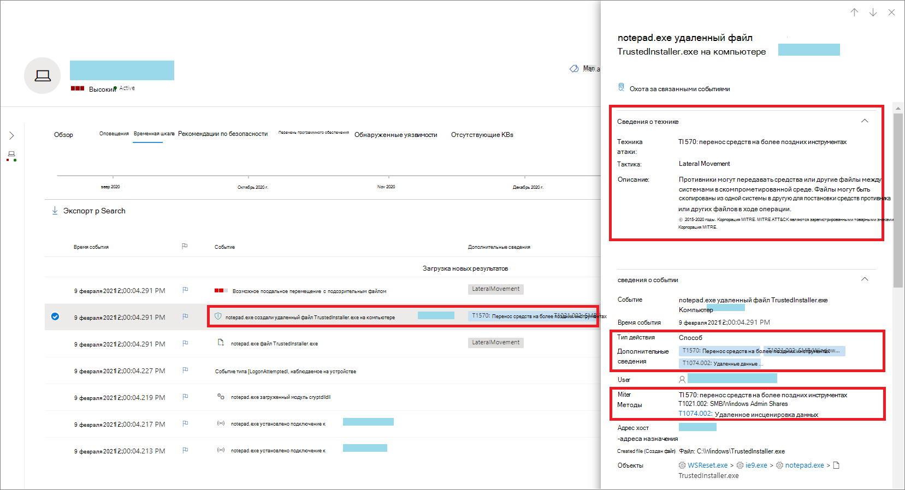
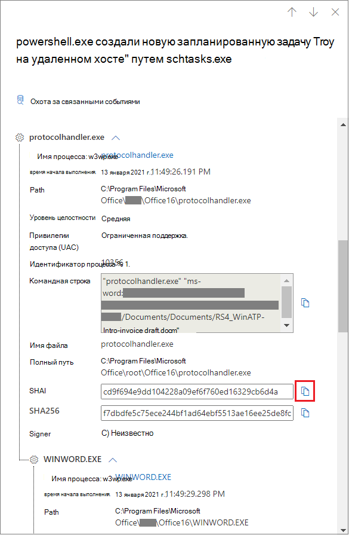
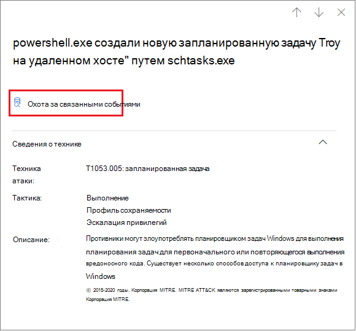
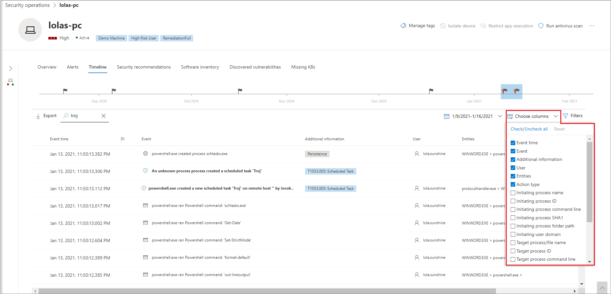
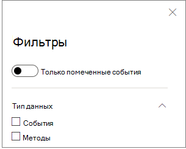

# Методы в временной шкале устройстваTechniques in the device timeline

**Область применения:****Applies to:**
- [Microsoft Defender для конечной точкиMicrosoft Defender for Endpoint](https://go.microsoft.com/fwlink/p/?linkid=2146631)

Вы можете получить больше информации в ходе расследования, проанализировав события, которые произошли на определенном устройстве.You can gain more insight in an investigation by analyzing the events that happened on a specific device. Сначала выберите интересующее устройство из списка [Устройств.](machines-view-overview.md)First, select the device of interest from the [Devices list](machines-view-overview.md). На странице устройства можно выбрать вкладку **Timeline** для просмотра всех событий, произошедших на устройстве.On the device page, you can select the **Timeline** tab to view all the events that occurred on the device.

## Понимание методов в временной шкалеUnderstand techniques in the timeline

>[!IMPORTANT]
>Некоторые сведения относятся к предварительной версии продукта в общедоступных предварительных версиях, которые могут быть существенно изменены до его коммерческого выпуска.Some information relates to a prereleased product feature in public preview which may be substantially modified before it's commercially released. Корпорация Майкрософт не дает никаких гарантий, явных или подразумеваемых, относительно предоставленных здесь сведений.Microsoft makes no warranties, express or implied, with respect to the information provided here.

В Microsoft Defender для конечной точки **методы** являются дополнительным типом данных в временной шкале событий.In Microsoft Defender for Endpoint, **Techniques** are an additional data type in the event timeline. Методы предоставляют дополнительные сведения о действиях, связанных&[CK](https://attack.mitre.org/)&или под-методов.Techniques provide more insight on activities associated with [MITRE ATT&CK](https://attack.mitre.org/) techniques or sub-techniques. 

Эта функция упрощает опыт исследования, помогая аналитикам понять действия, наблюдаемые на устройстве.This feature simplifies the investigation experience by helping analysts understand the activities that were observed on a device. Затем аналитики могут принять решение о дальнейшем расследовании.Analysts can then decide to investigate further.

Для общего предварительного просмотра методы доступны по умолчанию и показаны вместе с событиями при просмотре временной шкалы устройства.For public preview, Techniques are available by default and shown together with events when a device's timeline is viewed. 

Методы выделены жирным текстом и отображаются с синим значком слева.Techniques are highlighted in bold text and appear with a blue icon on the left. Соответствующее имя и имя&CK ATT также отображаются в качестве тегов в статье Дополнительные сведения.The corresponding MITRE ATT&CK ID and technique name also appear as tags under Additional information. 

Параметры поиска и экспорта также доступны для методов.Search and Export options are also available for Techniques.

## Исследование с помощью боковой областиInvestigate using the side pane

Выберите метод для открытия соответствующей боковой области.Select a Technique to open its corresponding side pane. Здесь вы можете увидеть дополнительные сведения и сведения, такие как связанные методы&CK, тактика и описания.Here you can see additional information and insights like related ATT&CK techniques, tactics, and descriptions. 

Выберите определенную *методику атаки,* чтобы открыть связанную страницу&CK, на которой можно найти дополнительные сведения об этом.Select the specific *Attack technique* to open the related ATT&CK technique page where you can find more information about it.

Вы можете скопировать сведения об объекте при виде синего значка справа.You can copy an entity's details when you see a blue icon on the right. Например, чтобы скопировать sha1 связанного файла, выберите значок синей страницы.For instance, to copy a related file's SHA1, select the blue page icon.

Вы можете сделать то же самое для командных строк.You can do the same for command lines.

## Исследование связанных событийInvestigate related events

Чтобы найти [события,](advanced-hunting-overview.md) связанные с выбранным методом, выберите **Hunt для связанных событий.**To use [advanced hunting](advanced-hunting-overview.md) to find events related to the selected Technique, select **Hunt for related events**. Это приводит к продвинутой странице охоты с запросом на поиск событий, связанных с методом.This leads to the advanced hunting page with a query to find events related to the Technique.

>[!NOTE]
>Запрос с помощью кнопки **Hunt для** связанных событий с боковой области Technique отображает все события, связанные с идентифицированной техникой, но не включает сам метод в результаты запроса.Querying using the **Hunt for related events** button from a Technique side pane displays all the events related to the identified technique but does not include the Technique itself in the query results.

## Настройка временной шкалы устройстваCustomize your device timeline

В правой правой части временной шкалы устройства можно выбрать диапазон дат, чтобы ограничить количество событий и методов в временной шкале.On the upper right-hand side of the device timeline, you can choose a date range to limit the number of events and techniques in the timeline. 

Вы можете настроить столбцы для разоблачения.You can customize which columns to expose. Вы также можете фильтровать для помеченных событий по типу данных или по группе событий.You can also filter for flagged events by data type or by event group.

### Выбор столбцов для разоблаченияChoose columns to expose
Вы можете выбрать, какие столбцы выставить в временной шкале, выбрав кнопку **Выберите столбцы.**You can choose which columns to expose in the timeline by selecting the **Choose columns** button.

Оттуда можно выбрать, какие сведения включить.From there you can select which information set to include.

### Фильтр для просмотра только методов или событийFilter to view techniques or events only

Чтобы просмотреть только события или методы, выберите **фильтры** из временной шкалы устройства и выберите предпочтительный тип данных для просмотра.To view only either events or techniques, select **Filters** from the device timeline and choose your preferred Data type to view.

## См. такжеSee also
- [Просмотр и организация списка УстройствView and organize the Devices list](machines-view-overview.md)
- [Флаги событий событий Microsoft Defender для конечных устройствMicrosoft Defender for Endpoint device timeline event flags](device-timeline-event-flag.md) 

 
