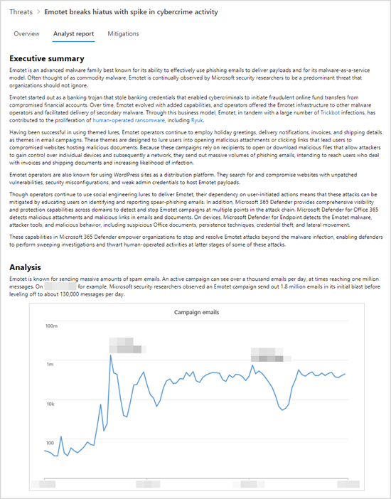

# Понимание отчета аналитики в аналитике угрозUnderstand the analyst report in threat analytics

[!INCLUDE [Microsoft 365 Defender rebranding](../../includes/microsoft-defender.md)]

**Область применения:****Applies to:**
- [Microsoft Defender для конечной точкиMicrosoft Defender for Endpoint](https://go.microsoft.com/fwlink/p/?linkid=2154037)
- [Microsoft 365 DefenderMicrosoft 365 Defender](https://go.microsoft.com/fwlink/?linkid=2118804)

> Хотите испытать Microsoft Defender для конечной точки?Want to experience Microsoft Defender for Endpoint? [Зарегистрився для бесплатной пробной.Sign up for a free trial.](https://www.microsoft.com/microsoft-365/windows/microsoft-defender-atp?ocid=docs-wdatp-exposedapis-abovefoldlink)

Каждый [отчет аналитики угроз](threat-analytics.md) включает динамические разделы и полный письменный раздел под названием _отчет аналитика_.Each [threat analytics report](threat-analytics.md) includes dynamic sections and a comprehensive written section called the _analyst report_. Чтобы получить доступ к этому разделу, откройте отчет об отслеживаемой угрозе и выберите вкладку **отчет аналитика.**To access this section, open the report about the tracked threat and select the **Analyst report** tab.

_Раздел аналитических отчетов отчета об аналитике угроз__Analyst report section of a threat analytics report_

## Сканирование отчета аналитикаScan the analyst report 
Каждый раздел отчета аналитика предназначен для предоставления информации, которая может быть действий.Each section of the analyst report is designed to provide actionable information. Хотя отчеты различаются, большинство отчетов включают разделы, описанные в следующей таблице.While reports vary, most reports include the sections described in the following table.

| Раздел ОтчетReport section | ОписаниеDescription |
|--|--|
| Сводка executiveExecutive summary | Обзор угрозы, в том числе когда она была впервые замечена, ее мотивации, заметные события, основные цели и различные средства и методы.Overview of the threat, including when it was first seen, its motivations, notable events, major targets, and distinct tools and techniques. Эти сведения можно использовать для дальнейшей оценки приоритетов угрозы в контексте вашей отрасли, географического расположения и сети.You can use this information to further assess how to prioritize the threat in the context of your industry, geographic location, and network. |
| АнализAnalysis | Техническая информация об угрозах, включая сведения об атаке и о том, как злоумышленники могут использовать новую технику или поверхность атакиTechnical information about the threats, including the details of an attack and how attackers might utilize a new technique or attack surface | 
| Методы MITRE ATT&CKMITRE ATT&CK techniques observed | Как наблюдаемые методы соотносят с структурой атак [MITRE ATT&CK](https://attack.mitre.org/)How observed techniques map to the [MITRE ATT&CK attack framework](https://attack.mitre.org/) | 
| [Смягчение последствийMitigations](#apply-additional-mitigations) | Рекомендации, которые могут остановить или уменьшить влияние угрозы.Recommendations that can stop or help reduce the impact of the threat. В этом разделе также содержатся меры по смягчению последствий, которые динамически не отслеживаются в отчете аналитики угроз.This section also includes mitigations that aren't tracked dynamically as part of the threat analytics report. |
| [Сведения об обнаруженииDetection details](#understand-how-each-threat-can-be-detected) | Конкретные и общие обнаружения, предоставляемые решениями безопасности Майкрософт, которые могут выявлять действия или компоненты, связанные с угрозой.Specific and generic detections provided by Microsoft security solutions that can surface activity or components associated with the threat. | 
| [Расширенная охотаAdvanced hunting](#find-subtle-threat-artifacts-using-advanced-hunting) | [Расширенные запросы на охоту](advanced-hunting-overview.md) для упреждающего определения возможной активности угрозы.[Advanced hunting queries](advanced-hunting-overview.md) for proactively identifying possible threat activity. Большинство запросов предоставляется для дополнительного обнаружения, особенно для обнаружения потенциально вредоносных компонентов или поведения, которые не могут быть динамически оценены как вредоносные.Most queries are provided to supplement detections, especially for locating potentially malicious components or behaviors that couldn't be dynamically assessed to be malicious. | 
| СсылкиReferences | Microsoft и сторонние публикации, на которые ссылались аналитики при создании отчета.Microsoft and third-party publications referenced by analysts during the creation of the report. Контент аналитики угроз основан на данных, проверенных исследователями Майкрософт.Threat analytics content is based on data validated by Microsoft researchers. Информация из общедоступных сторонних источников четко идентифицирована как таковая.Information from publicly available, third-party sources are identified clearly as such. | 
| Журнал измененийChange log | Время публикации отчета и внесение значительных изменений в отчет.The time the report was published and when significant changes were made to the report. |

## Применение дополнительных смягченийApply additional mitigations
Аналитика угроз динамически отслеживает [состояние обновлений безопасности и безопасных конфигураций.](threat-analytics.md#mitigations-review-list-of-mitigations-and-the-status-of-your-devices)Threat analytics dynamically tracks the [status of security updates and secure configurations](threat-analytics.md#mitigations-review-list-of-mitigations-and-the-status-of-your-devices). Эти сведения доступны в таблицах и диаграммах на вкладке **Mitigations.**This information is available as charts and tables in the **Mitigations** tab.

Помимо этих отслеживаемого смягчения последствий, в отчете аналитика  также обсуждаются меры по смягчению последствий, которые не отслеживаются динамически.In addition to these tracked mitigations, the analyst report also discusses mitigations that are _not_ dynamically monitored. Вот несколько примеров важных смягчающих последствий, которые не отслеживаются динамически:Here are some examples of important mitigations that are not dynamically tracked:

- Блокировка сообщений _электронной почты с вложениями .lnk_ или другими подозрительными типами файловBlock emails with _.lnk_ attachments or other suspicious file types
- Рандомизация паролей локального администратораRandomize local administrator passwords
- Обучение конечных пользователей фишинговой электронной почте и другим векторам угрозEducate end users about phishing email and other threat vectors
- Включим определенные [правила уменьшения поверхности атаки](attack-surface-reduction.md)Turn on specific [attack surface reduction rules](attack-surface-reduction.md)

В то время как вы можете использовать вкладку **Mitigations** для оценки вашей позиции безопасности в отношении угрозы, эти рекомендации могут позволить вам предпринять дополнительные шаги по улучшению осанки безопасности.While you can use the **Mitigations** tab to assess your security posture against a threat, these recommendations let you take additional steps towards improving your security posture. Внимательно ознакомьтесь со всеми рекомендациями по смягчению последствий в отчете аналитика и применяйте их по мере возможности.Carefully read all the mitigation guidance in the analyst report and apply them whenever possible.

## Понимание того, как можно обнаруживать каждую угрозуUnderstand how each threat can be detected
В отчете аналитика также содержится обнаружение антивирусных и обнаружение и нейтрализация атак на конечные точки (EDR) microsoft Defender для _endpoint._The analyst report also provides the detections from Microsoft Defender for Endpoint antivirus and _endpoint detection and response_ (EDR) capabilities.

### Обнаружение антивирусовAntivirus detections
Эти обнаружения доступны на устройствах с [включенной антивирусная программа в Microsoft Defender](/windows/security/threat-protection/microsoft-defender-antivirus/microsoft-defender-antivirus-in-windows-10) включенной.These detections are available on devices with [Microsoft Defender Antivirus](/windows/security/threat-protection/microsoft-defender-antivirus/microsoft-defender-antivirus-in-windows-10) turned on. Когда эти обнаружения происходят на устройствах, которые были на борту в Microsoft Defender для конечной точки, они также вызывают оповещения, которые заживеют диаграммы в отчете.When these detections occur on devices that have been onboarded to Microsoft Defender for Endpoint, they also trigger alerts that light up the charts in the report.

>[!NOTE]
>В отчете  аналитика также перечислены общие обнаружения, которые могут определять широкий диапазон угроз, в дополнение к компонентам или поведениям, определенным для отслеживаемой угрозы.The analyst report also lists **generic detections** that can identify a wide-range of threats, in addition to components or behaviors specific to the tracked threat. Эти общие обнаружения не отражаются в диаграммах.These generic detections don't reflect in the charts.

### Оповещений об обнаружении конечных точек и ответах (EDR)Endpoint detection and response (EDR) alerts
EDR оповещения поднимаются для устройств, на борту в [Microsoft Defender для конечной точки](onboard-configure.md).EDR alerts are raised for [devices onboarded to Microsoft Defender for Endpoint](onboard-configure.md). Эти оповещения обычно зависят от сигналов безопасности, собранных датчиком Microsoft Defender для конечной точки, и других возможностей конечной точки, таких как антивирус, защита сети, защита от взлома, которые служат мощными источниками сигнала.These alerts generally rely on security signals collected by the Microsoft Defender for Endpoint sensor and other endpoint capabilities—such as antivirus, network protection, tamper protection—that serve as powerful signal sources.

Как и список обнаружения антивирусов, некоторые EDR предназначены для общего флага подозрительного поведения, которое не может быть связано с отслеживаемой угрозой.Like the list of antivirus detections, some EDR alerts are designed to generically flag suspicious behavior that might not be associated with the tracked threat. В таких случаях отчет четко определяет оповещение как "общее" и не влияет ни на какие диаграммы в отчете.In such cases, the report will clearly identify the alert as "generic" and that it doesn't influence any of the charts in the report.

## Поиск тонких артефактов угроз с помощью продвинутой охотыFind subtle threat artifacts using advanced hunting
Хотя обнаружение позволяет автоматически идентифицировать и останавливать отслеживаемую угрозу, многие действия атаки оставляют тонкие следы, которые требуют дополнительной проверки.While detections allow you to identify and stop the tracked threat automatically, many attack activities leave subtle traces that require additional inspection. Некоторые действия атаки демонстрируют поведение, которое также может быть нормальным, поэтому динамическое их обнаружение может привести к рабочему шуму или даже ложным срабатываниям.Some attack activities exhibit behaviors that can also be normal, so detecting them dynamically can result in operational noise or even false positives.

[Расширенный интерфейс охоты](advanced-hunting-overview.md) предоставляет интерфейс запроса на основе языка запросов Kusto, который упрощает поиск тонких показателей активности угрозы.[Advanced hunting](advanced-hunting-overview.md) provides a query interface based on Kusto Query Language that simplifies locating subtle indicators of threat activity. Она также позволяет всплыть контекстную информацию и проверить, подключены ли индикаторы к угрозе.It also allows you to surface contextual information and verify whether indicators are connected to a threat.

Расширенные запросы на охоту в аналитических отчетах были засвеятены аналитиками Майкрософт и готовы к запуску в [редакторе предварительного запроса на охоту.](https://securitycenter.windows.com/advanced-hunting)Advanced hunting queries in the analyst reports have been vetted by Microsoft analysts and are ready for you to run in the [advanced hunting query editor](https://securitycenter.windows.com/advanced-hunting). Запросы также можно использовать для создания настраиваемой системы [обнаружения,](custom-detection-rules.md) которая вызывает оповещения для будущих совпадений.You can also use the queries to create [custom detection rules](custom-detection-rules.md) that trigger alerts for future matches.

## Статьи по темеRelated topics
- [Обзор аналитики угрозThreat analytics overview](threat-analytics.md)
- [Упреждающий поиск угроз с помощью продвинутой охотыProactively find threats with advanced hunting](advanced-hunting-overview.md) 
- [Правила настраиваемого обнаруженияCustom detection rules](custom-detection-rules.md)