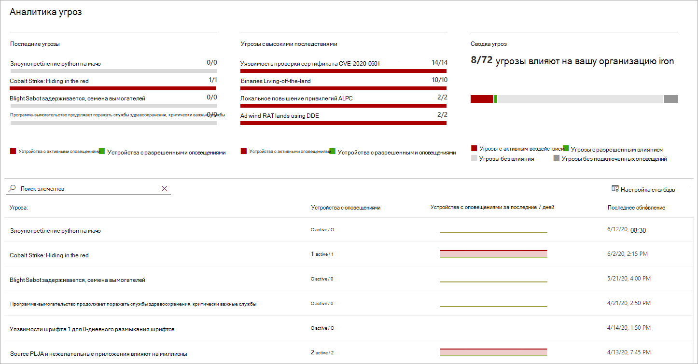
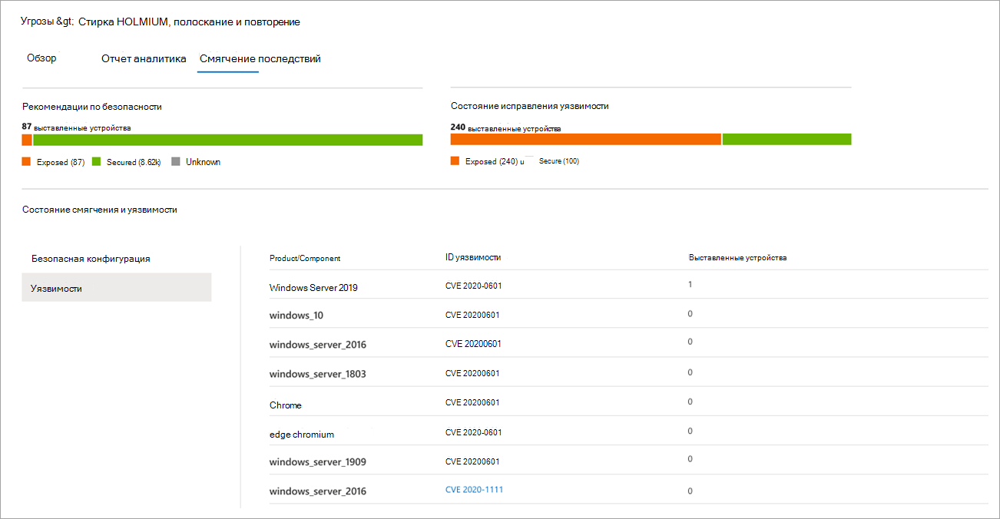

# Отслеживание и реагирование на возникающие угрозы с помощью аналитики угроз

[!INCLUDE [Microsoft 365 Defender rebranding](../../includes/microsoft-defender.md)]

**Область применения:**
- [Microsoft Defender для конечной точки](https://go.microsoft.com/fwlink/?linkid=2154037)
- [Microsoft 365 Defender](https://go.microsoft.com/fwlink/?linkid=2118804)

> Хотите испытать Microsoft Defender для конечной точки? [Зарегистрився для бесплатной пробной.](https://www.microsoft.com/microsoft-365/windows/microsoft-defender-atp?ocid=docs-wdatp-exposedapis-abovefoldlink)

При частом и распространенном распространении более сложных противников и новых угроз очень важно быстро:

- Оценка влияния новых угроз
- Проверка устойчивости к угрозам или воздействия на них
- Определение действий, которые можно принять для остановки или сдерживания угроз

Аналитика угроз — это набор отчетов экспертов microsoft security researchers, охватывающих наиболее актуальные угрозы, в том числе:

- Активные субъекты угроз и их кампании
- Популярные и новые методы атаки
- Критические уязвимости
- Общие поверхности атаки
- Распространенные вредоносные программы

В каждом отчете содержится подробный анализ угрозы и подробные рекомендации по защите от этой угрозы. В нее также включены данные из сети, указывающие, активна ли угроза и есть ли у вас применимые средства защиты.

Просмотрите это короткое видео, чтобы узнать больше о том, как аналитика угроз может помочь отслеживать последние угрозы и останавливать их.

> [!VIDEO https://www.microsoft.com/en-us/videoplayer/embed/RE4bw1f]

## Просмотр панели мониторинга аналитики угроз

Панель аналитики угроз — это отличное место для получения отчетов, наиболее важных для организации. В нем подводятся итоги угроз в следующих разделах:

- **Последние угрозы**— списки недавно опубликованных отчетов об угрозах, а также количество устройств с активными и разрешенными оповещениями.
- **Угрозы с высоким уровнем** воздействия — это списки угроз, которые оказали самое большое влияние на организацию. В этом разделе вычислим угрозы по количеству устройств с активными оповещениями.
- **Сводка угроз**— показывает общее влияние отслеживаемой угрозы, показывая количество угроз с активными и разрешенными оповещениями.

Выберите угрозу с панели мониторинга, чтобы просмотреть отчет об этой угрозе.

## Просмотр отчета аналитики угроз

Каждый отчет аналитики угроз содержит сведения в трех разделах: **Обзор,** **отчет** аналитики и **сведения о смягчении последствий.**

### Обзор. Быстрое понимание угрозы, оценка ее воздействия и проверка защиты

В **разделе Обзор** представлен предварительный просмотр подробного отчета аналитика. Он также предоставляет диаграммы, которые подчеркивают влияние угрозы для организации и вашей экспозиции с помощью неправильно сконфигурованных и неоплаченных устройств.

 _отчета аналитики угроз_

#### Оценка влияния на организацию
Каждый отчет содержит диаграммы, предназначенные для предоставления сведений о влиянии угрозы на организацию:
- **Устройства с оповещениями**— показывают текущее число различных устройств, на которые повлияла угроза. Устройство классифицируются как **Active,** если существует по крайней  мере  одно оповещение, связанное с этой угрозой, и разрешено, если все оповещения, связанные с угрозой на устройстве, устранены.
- **Устройства с оповещениями со временем** показывают количество различных устройств с оповещений **Active** и **Resolved** с течением времени. Количество разрешенных оповещений указывает, как быстро организация реагирует на оповещения, связанные с угрозой. В идеале на диаграмме должны быть показаны оповещения, разрешенные в течение нескольких дней.

#### Проверка устойчивости и осанки безопасности
Каждый отчет содержит диаграммы, в которых представлен обзор устойчивости организации к данной угрозе:
- **Состояние конфигурации безопасности**— показывает количество устройств, которые применили рекомендуемые параметры безопасности, которые могут помочь уменьшить угрозу. Устройства считаются **Безопасными,**  если они применили все отслеживаемые параметры.
- **Состояние исправлений уязвимости**— показывает количество устройств, применяющих обновления или исправления безопасности, которые используют уязвимости, использованные угрозой.

### Отчет аналитика: получите экспертную информацию от исследователей безопасности Майкрософт
Перейдите в **раздел Отчет аналитика,** чтобы ознакомиться с подробным отчетом эксперта. В большинстве отчетов подробно описаны цепочки атак, включая тактику и методы, относячимые к базе ATT MITRE&CK, исчерпывающие списки рекомендаций и мощные рекомендации по охоте на угрозы. 

[Дополнительные новости о отчете аналитика](threat-analytics-analyst-reports.md)

### Смягчение последствий: обзор списка смягчения последствий и состояния устройств
В разделе **Mitigations** просмотрите список конкретных рекомендаций, которые помогут повысить устойчивость организации к угрозе. Список отслеживаемого смягчения включает в себя:

- **Обновления безопасности**— развертывание обновлений или исправлений для уязвимостей
- **антивирусная программа в Microsoft Defender параметров**
  - Версия разведки безопасности
  - Облачная защита  
  - Защита потенциально нежелательного приложения (PUA)
  - Защита в режиме реального времени
 
Сведения о смягчении последствий в этом разделе включают данные из [контроль угроз и уязвимостей,](next-gen-threat-and-vuln-mgt.md)которые также предоставляют подробные сведения о сверлении из различных ссылок в отчете.

 _Mitigations_ отчета об аналитике угроз

## Дополнительные сведения и ограничения отчета
При использовании отчетов имейте в виду следующее: 

- Объем данных основан на области управления доступом на основе ролей (RBAC). Вы увидите состояние устройств в [группах, к которые можно получить доступ.](machine-groups.md)
- Диаграммы отражают только отслеживаемые меры по смягчению последствий. Ознакомьтесь с обзором отчетов о дополнительных смягчениях, которые не показаны в диаграммах.
- Смягчение последствий не гарантирует полную устойчивость. Предоставленные меры по смягчению последствий отражают наилучшие действия, необходимые для повышения устойчивости.
- Устройства считаются недоступными, если они не передают данные службе.
- Статистика, связанная с антивирусом, основана на антивирусная программа в Microsoft Defender параметров. Устройства с сторонними антивирусными решениями могут отображаться как "открытые".

## Статьи по теме
- [Упреждающий поиск угроз с помощью продвинутой охоты](advanced-hunting-overview.md) 
- [Понимание раздела отчетов аналитика](threat-analytics-analyst-reports.md)
- [Оценка и устранение недостатков и воздействий безопасности](next-gen-threat-and-vuln-mgt.md)
