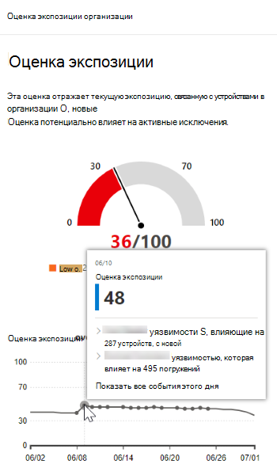

# Временная шкала событий — управление угрозами и уязвимостьюEvent timeline - threat and vulnerability management

[!INCLUDE [Microsoft 365 Defender rebranding](../../includes/microsoft-defender.md)]

**Область применения:****Applies to:**
- [Microsoft Defender для конечной точкиMicrosoft Defender for Endpoint](https://go.microsoft.com/fwlink/?linkid=2154037)
- [Microsoft 365 DefenderMicrosoft 365 Defender](https://go.microsoft.com/fwlink/?linkid=2118804)

>Хотите испытать Microsoft Defender для конечной точки?Want to experience Microsoft Defender for Endpoint? [Зарегистрився для бесплатной пробной.Sign up for a free trial.](https://www.microsoft.com/microsoft-365/windows/microsoft-defender-atp?ocid=docs-wdatp-portaloverview-abovefoldlink)

Временная шкала событий — это лента новостей о рисках, которая помогает интерпретировать, как риск вводится в организацию с помощью новых уязвимостей или эксплойтов.Event timeline is a risk news feed that helps you interpret how risk is introduced into the organization through new vulnerabilities or exploits. Можно просмотреть события, которые могут повлиять на риск организации.You can view events that may impact your organization's risk. Например, вы можете найти новые уязвимости, которые были введены, уязвимости, которые стали эксплуатироваться, использовать, которые были добавлены в набор эксплойтов и другие.For example, you can find new vulnerabilities that were introduced, vulnerabilities that became exploitable, exploit that was added to an exploit kit, and more.

В хронике событий также  рассказывается история оценки экспозиции и [microsoft Secure Score для](tvm-microsoft-secure-score-devices.md) устройств, чтобы можно было определить причину больших изменений.Event timeline also tells the story of your [exposure score](tvm-exposure-score.md) and [Microsoft Secure Score for Devices](tvm-microsoft-secure-score-devices.md) so you can determine the cause of large changes. События могут повлиять на ваши устройства или оценку для устройств.Events can impact your devices or your score for devices. Уменьшите воздействие, реась на то, что необходимо устранять, основываясь на приоритетных [рекомендациях по безопасности.](tvm-security-recommendation.md)Reduce you exposure by addressing what needs to be remediated based on the prioritized [security recommendations](tvm-security-recommendation.md).

>[!TIP]
>Чтобы получить сообщения о новых событиях уязвимости, см. в руб. Настройка уведомлений об уязвимости в [Microsoft Defender для endpoint](configure-vulnerability-email-notifications.md)To get emails about new vulnerability events, see [Configure vulnerability email notifications in Microsoft Defender for Endpoint](configure-vulnerability-email-notifications.md)

## Перейдите на страницу временной шкалы событийNavigate to the Event timeline page

Существует также три точки входа из панели управления угрозами и [уязвимостью:](tvm-dashboard-insights.md)There are also three entry points from the [threat and vulnerability management dashboard](tvm-dashboard-insights.md):

- **Карта оценки экспозиции** организации. Наведите курсор над точками событий в графе "Оценка экспозиции со временем" и выберите "См. все события этого дня".**Organization exposure score card**: Hover over the event dots in the "Exposure Score over time" graph and select "See all events from this day." События представляют уязвимости программного обеспечения.The events represent software vulnerabilities.
- **Microsoft Secure Score for Devices:** Hover over the event dots in the "Your score for devices over time" graph and select "See all events from this day".**Microsoft Secure Score for Devices**: Hover over the event dots in the "Your score for devices over time" graph and select "See all events from this day." События представляют собой новые оценки конфигурации.The events represent new configuration assessments.
- **Верхняя карта** событий: Выберите "Показать больше" в нижней части таблицы событий верхней части.**Top events card**: Select "Show more" at the bottom of the top events table. Карта отображает три наиболее важных события за последние 7 дней.The card displays the three most impactful events in the last 7 days. Важные события могут включать, если событие затрагивает большое количество устройств или является критической уязвимостью.Impactful events can include if the event affects a large number of devices, or if it is a critical vulnerability.

### Оценка экспозиции и microsoft Secure Score для устройствExposure score and Microsoft Secure Score for Devices graphs

На панели мониторинга управления угрозами и уязвимостями наведите курсор над графиком показателей экспозиции, чтобы просмотреть события уязвимости программного обеспечения с того дня, которые повлияли на ваши устройства.In the threat and vulnerability management dashboard, hover over the Exposure score graph to view top software vulnerability events from that day that impacted your devices. Наведите курсор над графом Microsoft Secure Score для устройств, чтобы просмотреть новые оценки конфигурации безопасности, влияющие на ваш результат.Hover over the Microsoft Secure Score for Devices graph to view new security configuration assessments that affect your score.

Если нет событий, влияющих на устройства или оценку для устройств, то ни одно из них не будет показано.If there are no events that affect your devices or your score for devices, then none will be shown.

 
  

### Сверлить до событий с этого дняDrill down to events from that day

Выбор show **all events from this day** takes you to the Event timeline page with a custom date range for that day.Selecting **Show all events from this day** takes you to the Event timeline page with a custom date range for that day.

Выберите **настраиваемый** диапазон, чтобы изменить диапазон дат на другой настраиваемый или заранее установленный диапазон времени.Select **Custom range** to change the date range to another custom one, or a pre-set time range.

## Обзор временной шкалы событийEvent timeline overview

На странице Временной шкалы событий можно просмотреть всю необходимую информацию, связанную с событием.On the Event timeline page, you can view the all the necessary info related to an event. 

Функции:Features:

- Настройка столбцовCustomize columns
- Фильтр по типу событий или процентам устройств с влияниемFilter by event type or percent of impacted devices
- Просмотр 30, 50 или 100 элементов на страницуView 30, 50, or 100 items per page

Два больших числа в верхней части страницы показывают количество новых уязвимостей и уязвимостей, которые можно использовать, а не событий.The two large numbers at the top of the page show the number of new vulnerabilities and exploitable vulnerabilities, not events. Некоторые события могут иметь несколько уязвимостей, а некоторые уязвимости могут иметь несколько событий.Some events can have multiple vulnerabilities, and some vulnerabilities can have multiple events.

### СтолбцыColumns

- **Дата:** месяц, день, год**Date**: month, day, year
- **Event:** impactful event, including component, type and number of impacted devices**Event**: impactful event, including component, type, and number of impacted devices
- **Связанный компонент:** программное обеспечение**Related component**: software
- **Первоначально повлияли устройства:** количество и процент, на которые повлияли устройства, когда это событие первоначально произошло.**Originally impacted devices**: the number, and percentage, of impacted devices when this event originally occurred. Кроме того, можно фильтровать на проценте от общего числа устройств, на которые первоначально повлияли устройства.You can also filter by the percent of originally impacted devices, out of your total number of devices.
- **В настоящее время влияет на устройства:** текущее число и процент устройств, которые это событие в настоящее время влияет.**Currently impacted devices**: the current number, and percentage, of devices that this event currently impacts. Это поле можно найти, выбрав **столбцы Customize.**You can find this field by selecting **Customize columns**.
- **Типы:** отражают события, отпечатав время, которые влияют на результат.**Types**: reflect time-stamped events that impact the score. Их можно отфильтровать.They can be filtered.
    - Эксплойт, добавленный в набор эксплойтовExploit added to an exploit kit
    - Проверка эксплойтовExploit was verified
    - Новый общедоступный эксплойтNew public exploit
    - Новая уязвимостьNew vulnerability
    - Новая оценка конфигурацииNew configuration assessment
- **Тенденция показателей:** тенденция оценки экспозиции**Score trend**: exposure score trend

### ЗначкиIcons

Рядом с событиями отображаются следующие значки:The following icons show up next to events:

-  Новый общедоступный эксплойтNew public exploit
-  Опубликована новая уязвимостьNew vulnerability was published
-  Эксплойт, найденный в наборе эксплойтовExploit found in exploit kit
-  Проверка эксплойтовExploit verified

### Сверлить до определенного событияDrill down to a specific event

После выбора события вылет появится со списком сведений и текущих резюме, влияющих на устройства.Once you select an event, a flyout will appear with a list of the details and current CVEs that affect your devices. Вы можете показать больше резюме или просмотреть связанную рекомендацию.You can show more CVEs or view the related recommendation.

Стрелка ниже "тенденция оценки" помогает определить, было ли это событие потенциально поднято или понижено для оценки воздействия организации.The arrow below "score trend" helps you determine whether this event potentially raised or lowered your organizational exposure score. Более высокая оценка экспозиции означает, что устройства более уязвимы для эксплуатации.Higher exposure score means devices are more vulnerable to exploitation.

Оттуда выберите **Перейти к** связанной рекомендации по безопасности, чтобы просмотреть рекомендации, которые касаются новой уязвимости программного обеспечения на странице [рекомендации безопасности](tvm-security-recommendation.md).From there, select **Go to related security recommendation** view the recommendation that addresses the new software vulnerability in the [security recommendations page](tvm-security-recommendation.md). После прочтения сведений о описании и уязвимости в рекомендации по безопасности можно отправить запрос на исправление и отслеживать запрос на странице [исправление.](tvm-remediation.md)After reading the description and vulnerability details in the security recommendation, you can submit a remediation request, and track the request in the [remediation page](tvm-remediation.md).  

## Просмотр временной шкалы событий на страницах программного обеспеченияView Event timelines in software pages

Чтобы открыть страницу программного обеспечения, выберите событие > имя гиперссылки программного обеспечения (например, Visual Studio 2017 г.) в разделе "Связанный компонент" в вылете.To open a software page, select an event > select the hyperlinked software name (like Visual Studio 2017) in the section called "Related component" in the flyout. [Дополнительные новости о страницах программного обеспеченияLearn more about software pages](tvm-software-inventory.md#software-pages)

Полная страница будет отображаться со всеми деталями определенного программного обеспечения.A full page will appear with all the details of a specific software. Мышь над графиком, чтобы увидеть хронологию событий для этого конкретного программного обеспечения.Mouse over the graph to see the timeline of events for that specific software.

Перейдите на вкладку временной шкалы событий, чтобы просмотреть все события, связанные с этим программным обеспечением.Navigate to the event timeline tab to view all the events related to that software. Также можно увидеть рекомендации по безопасности, обнаруженные уязвимости, установленные устройства и распространение версий.You can also see security recommendations, discovered vulnerabilities, installed devices, and version distribution.

## Похожие темыRelated topics

- [Обзор управления угрозами и уязвимостьюThreat and vulnerability management overview](next-gen-threat-and-vuln-mgt.md)
- [Панель мониторингаDashboard](tvm-dashboard-insights.md)
- [Показатель уязвимостиExposure score](tvm-exposure-score.md)
- [Рекомендации по безопасностиSecurity recommendations](tvm-security-recommendation.md)
- [Устранение уязвимостейRemediate vulnerabilities](tvm-remediation.md)
- [Инвентаризация программного обеспеченияSoftware inventory](tvm-software-inventory.md)

