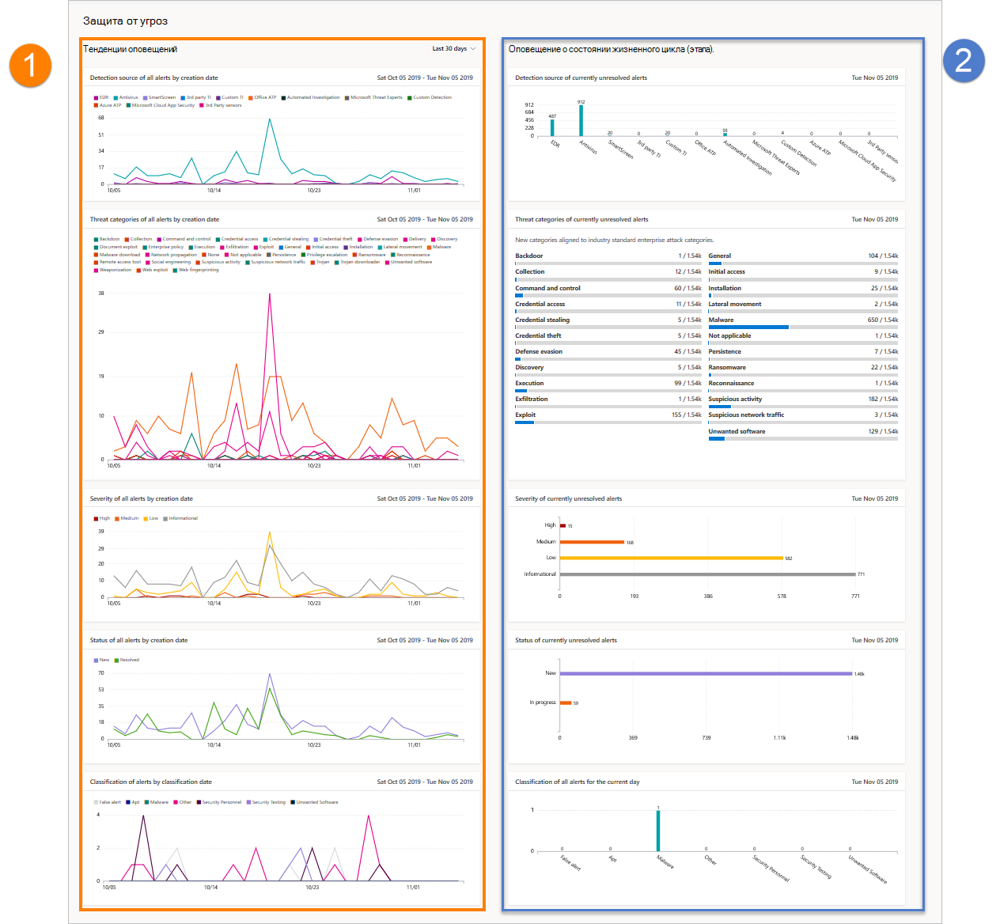

# Отчет о защите от угроз в Microsoft Defender для конечной точкиThreat protection report in Microsoft Defender for Endpoint

[!INCLUDE [Microsoft 365 Defender rebranding](../../includes/microsoft-defender.md)]

**Область применения:****Applies to:**
- [Microsoft Defender для конечной точкиMicrosoft Defender for Endpoint](https://go.microsoft.com/fwlink/p/?linkid=2154037)
- [Microsoft 365 DefenderMicrosoft 365 Defender](https://go.microsoft.com/fwlink/?linkid=2118804)

> Хотите испытать Defender для конечной точки?Want to experience Defender for Endpoint? [Зарегистрився для бесплатной пробной.Sign up for a free trial.](https://www.microsoft.com/microsoft-365/windows/microsoft-defender-atp?ocid=docs-wdatp-pullalerts-abovefoldlink) 

В отчете о защите от угроз содержится информация на высоком уровне о оповещениях, созданных в организации.The threat protection report provides high-level information about alerts generated in your organization. В отчете содержатся сведения об источниках обнаружения, категориях, серьезности, состояниях, классификациях и определениях оповещений во времени.The report includes trending information showing the detection sources, categories, severities, statuses, classifications, and determinations of alerts across time.

Панель мониторинга структурирована в два раздела:The dashboard is structured into two sections:

РазделSection | ОписаниеDescription 
:---|:---
11 | Тенденции оповещенийAlerts trends
22 | Сводка оповещенийAlert summary

## Тенденции оповещенийAlert trends
По умолчанию тенденции оповещения отображают сведения об оповещении за 30-дневный период, заканчивающийся в последний полный день.By default, the alert trends display alert information from the 30-day period ending in the latest full day. Чтобы получить более точное представление о тенденциях, происходящих в вашей организации, вы можете отладить отчетный период, отрегулив показанный период времени.To gain better perspective on trends occurring in your organization, you can fine-tune the reporting period by adjusting the time period shown. Чтобы настроить период времени, выберите диапазон времени из параметров отсев:To adjust the time period, select a time range from the drop-down options:

- 30 дней30 days
- 3 месяцев3 months
- 6 месяцев6 months
- ПользовательскиеCustom

>[!NOTE]
>Эти фильтры применяются только в разделе тенденции оповещения.These filters are only applied on the alert trends section. Это не влияет на раздел сводки оповещений.It doesn't affect the alert summary section.

## Сводка оповещенийAlert summary
Хотя тенденции оповещения показывают тенденции оповещения, в сводке оповещений показана оповещенная информация, охватившая текущий день.While the alert trends shows trending alert information, the alert summary shows alert information scoped to the current day.

 Сводка оповещений позволяет сверлить до определенной очереди оповещения с соответствующим фильтром, примененным к ней.The alert summary allows you to drill down to a particular alert queue with the corresponding filter applied to it. Например, щелкнув планку EDR в карточке источников обнаружения, вы сможете найти очередь оповещений с результатами, показывающими только оповещения, созданные при обнаружении EDR.For example, clicking on the EDR bar in the Detection sources card will bring you the alerts queue with results showing only alerts generated from EDR detections. 

>[!NOTE]
>Данные, отражающиеся в сводной статье, могут быть за 180 дней до текущей даты.The data reflected in the summary section is scoped to 180 days prior to the current date. Например, если сегодня 5 ноября 2019 г., данные сводного раздела будут отражать цифры, начиная с 5 мая 2019 г. по 5 ноября 2019 г.For example if today's date is November 5, 2019, the data on the summary section will reflect numbers starting from May 5, 2019 to November 5, 2019. 
> Фильтр, применяемый в разделе тенденции, не применяется в сводной части.The filter applied on the trends section is not applied on the summary section. 

## Атрибуты оповещенийAlert attributes
Отчет состоит из карт, отображает следующие атрибуты оповещений:The report is made up of cards that display the following alert attributes:

- **Источники обнаружения:** показывает сведения о датчиках и технологиях обнаружения, которые предоставляют данные, используемые Microsoft Defender для конечной точки для запуска оповещений.**Detection sources**: shows information about the sensors and detection technologies that provide the data used by Microsoft Defender for Endpoint to trigger alerts.

- **Категории угроз:** показаны типы действий угроз или атак, которые вызвали оповещения, указав возможные области фокуса для операций безопасности.**Threat categories**: shows the types of threat or attack activity that triggered alerts, indicating possible focus areas for your security operations.

- **Серьезность**: показывает уровень серьезности оповещений, указывающее коллективное потенциальное влияние угроз на организацию и уровень реагирования, необходимый для их устранения.**Severity**: shows the severity level of alerts, indicating the collective potential impact of threats to your organization and the level of response needed to address them.

- **Состояние**: показывает состояние оповещений с разрешением, указывающее эффективность ответов ручного оповещения и автоматического восстановления (если включено).**Status**: shows the resolution status of alerts, indicating the efficiency of your manual alert responses and of automated remediation (if enabled). 

- **Определение &** классификации: показывает, как вы классифицировали оповещения по разрешению, классифицировали ли их как реальные угрозы (настоящие оповещения) или как неправильные обнаружения (ложные оповещения).**Classification & determination**: shows how you have classified alerts upon resolution, whether you have classified them as actual threats (true alerts) or as incorrect detections (false alerts). Эти карточки также показывают определение разрешенных оповещений, предоставляя дополнительные сведения о типах обнаруженных фактических угроз или о неправильно обнаруженных действиях.These cards also show the determination of resolved alerts, providing additional insight like the types of actual threats found or the legitimate activities that were incorrectly detected.

 

## Фильтрация данныхFilter data

Используйте предоставленные фильтры, чтобы включить или исключить оповещения с определенными атрибутами.Use the provided filters to include or exclude alerts with certain attributes.

>[!NOTE]
>Эти фильтры применяются **для всех** карт в отчете.These filters apply to **all** the cards in the report.

Например, чтобы показать данные только о предупреждениях высокой степени тяжести:For example, to show data about high-severity alerts only:

1. В **статье Filters > строгость** выберите **High**Under **Filters > Severity**, select **High**
2. Убедитесь, что все другие параметры **в статье Severity** отклонились.Ensure that all other options under **Severity** are deselected.
3. Нажмите **Применить**.Select **Apply**. 

## Связанная темаRelated topic
- [Отчет о состоянии и соответствии требованиям к устройствуDevice health and compliance report](machine-reports.md)
