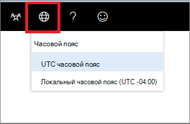

# Центр безопасности в Microsoft Defender часовой поясMicrosoft Defender Security Center time zone settings

[!INCLUDE [Microsoft 365 Defender rebranding](../../includes/microsoft-defender.md)]

**Область применения:****Applies to:**
- [Microsoft Defender для конечной точкиMicrosoft Defender for Endpoint](https://go.microsoft.com/fwlink/p/?linkid=2154037)

>Хотите испытать Microsoft Defender для конечной точки?Want to experience Microsoft Defender for Endpoint? [Зарегистрився для бесплатной пробной.Sign up for a free trial.](https://www.microsoft.com/microsoft-365/windows/microsoft-defender-atp?ocid=docs-wdatp-settings-abovefoldlink)

Чтобы настроить **часовой** пояс и просмотреть сведения о лицензии, используйте значок параметров часовой  зоны .Use the **Time zone** menu  to configure the time zone and view license information.

## Параметры часовой зоныTime zone settings
Аспект времени имеет важное значение для оценки и анализа предполагаемых и фактических кибератак.The aspect of time is important in the assessment and analysis of perceived and actual cyberattacks.

Киберфоренсические расследования часто используют штампы времени, чтобы собрать последовательность событий.Cyberforensic investigations often rely on time stamps to piece together the sequence of events. Важно, чтобы система отражала правильные параметры часовой пояс.It’s important that your system reflects the correct time zone settings.

Защитник Microsoft для конечной точки может отображать как скоординированное универсальное время (UTC), так и локальное время.Microsoft Defender for Endpoint can display either Coordinated Universal Time (UTC) or local time.

Текущий параметр часовой пояс отображается в меню Microsoft Defender для конечной точки.Your current time zone setting is shown in the Microsoft Defender for Endpoint menu. Вы можете изменить отображаемую часовую зону в **меню часовой** зоны.You can change the displayed time zone in the **Time zone** menu.

..

### Часовой пояс UTCUTC time zone
Microsoft Defender для конечной точки использует время UTC по умолчанию.Microsoft Defender for Endpoint uses UTC time by default.

Настройка часовой зоны Microsoft Defender для конечной точки для UTC отображает все системные периоды времени (оповещения, события и другие) в UTC для всех пользователей.Setting the Microsoft Defender for Endpoint time zone to UTC will display all system timestamps (alerts, events, and others) in UTC for all users. Это может помочь аналитикам безопасности, работающим в разных местах по всему миру, использовать одинаковые штампы времени при расследовании событий.This can help security analysts working in different locations across the globe to use the same time stamps while investigating events.

### Локальный часовой поясLocal time zone
Вы можете выбрать, чтобы Microsoft Defender для конечной точки использовали локальные параметры часовой пояс.You can choose to have Microsoft Defender for Endpoint use local time zone settings. Все оповещения и события будут отображаться в локальном часовом поясе.All alerts and events will be displayed using your local time zone.

Локальный часовой пояс взят из региональных параметров устройства.The local time zone is taken from your device’s regional settings. При изменении региональных параметров также изменится часовой пояс Microsoft Defender для конечной точки.If you change your regional settings, the Microsoft Defender for Endpoint time zone will also change. Выбор этого параметра означает, что периоды времени, отображаемые в Microsoft Defender для конечной точки, будут согласованы с локальным временем для всех пользователей Конечных точек Microsoft Defender.Choosing this setting means that the timestamps displayed in Microsoft Defender for Endpoint will be aligned to local time for all Microsoft Defender for Endpoint users. Аналитики, расположенные в разных глобальных расположениях, теперь будут видеть оповещений Microsoft Defender для конечных точек в соответствии с их региональными настройками.Analysts located in different global locations will now see the Microsoft Defender for Endpoint alerts according to their regional settings.

Выбор использования местного времени может быть полезен, если аналитики находятся в одном расположении.Choosing to use local time can be useful if the analysts are located in a single location. В этом случае может быть проще соотнести события с локальным временем, например, когда локальный пользователь нажал на подозрительную ссылку электронной почты.In this case it might be easier to correlate events to local time, for example – when a local user clicked on a suspicious email link.

### Установите часовой поясSet the time zone
Часовой пояс Microsoft Defender для конечной точки по умолчанию устанавливается для UTC.The Microsoft Defender for Endpoint time zone is set by default to UTC.
Настройка часовой зоны также изменяет время для всех представлений Microsoft Defender для конечных точек.Setting the time zone also changes the times for all Microsoft Defender for Endpoint views.
Чтобы установить часовой пояс:To set the time zone:

1. Щелкните **значок** параметров часовой зоны меню Click the **Time zone** menu .
2. Выберите индикатор **UTC часовой зоны.**Select the **Timezone UTC** indicator.
3. Выберите **UTC часовой** пояс или локальный часовой пояс, например -7:00.Select **Timezone UTC** or your local time zone, for example -7:00.

### Региональные параметрыRegional settings
Чтобы применить различные форматы дат для Microsoft Defender для конечной точки, используйте региональные параметры для Internet Explorer (IE) и Microsoft Edge (Edge).To apply different date formats for Microsoft Defender for Endpoint, use regional settings for Internet Explorer (IE) and Microsoft Edge (Edge). Если вы используете другой браузер, например Google Chrome, выполните необходимые действия, чтобы изменить параметры времени и даты для этого браузера.If you're using another browser such as Google Chrome, follow the required steps to change the time and date settings for that browser. 

**Internet Explorer (IE) и Microsoft Edge****Internet Explorer (IE) and Microsoft Edge**

IE и Microsoft Edge параметры **Region,** настроенные в параметре **"Часы",** "Язык" и "Область" в панели управления.IE and Microsoft Edge use the **Region** settings configured in the **Clocks, Language, and Region** option in the Control panel. 

#### Известные проблемы с региональными форматамиKnown issues with regional formats

**Форматы даты и времени****Date and time formats** 
Известны некоторые проблемы с форматами времени и даты.There are some known issues with the time and date formats. Если настроить региональные параметры на что-либо, кроме поддерживаемых форматов, портал может неправильно отражать ваши параметры.If you configure your regional settings to anything other than the supported formats, the portal may not correctly reflect your settings.

Поддерживаются следующие форматы даты и времени:The following date and time formats are supported:
- Формат даты MM/dd/yyyyDate format MM/dd/yyyy
- Формат даты dd/MM/yyyyDate format dd/MM/yyyy
- Формат времени hh:mm:ss (12-часовой формат)Time format hh:mm:ss (12 hour format)

В настоящее время не поддерживаются следующие форматы даты и времени:The following date and time formats are currently not supported:
- Формат yyyy-MM-ddDate format yyyy-MM-dd
- Формат даты dd-MMM-yyDate format dd-MMM-yy
- Формат даты dd/MM/yyyDate format dd/MM/yy
- Формат даты MM/dd/yyyDate format MM/dd/yy
- Формат даты с yy.Date format with yy. Будет показываться только yyyy.Will only show yyyy.
- Формат времени HH:mm:ss (24-часовой формат)Time format HH:mm:ss (24 hour format)

**Десятичной символ, используемый в числах****Decimal symbol used in numbers** 
Используемый десятичный символ всегда является точкой, даже если запятая выбрана в параметрах **формата Numbers** в **параметрах Region.**Decimal symbol used is always a dot, even if a comma is selected in  the **Numbers** format settings in **Region** settings. Например, 15,5K отображается как 15,5K.For example, 15,5K is displayed as 15.5K.

