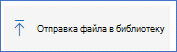
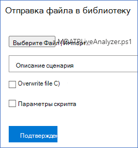

# <a name="collect-support-logs-in-microsoft-defender-for-endpoint-using-live-response"></a>Сбор журналов поддержки в Microsoft Defender для конечной точки с помощью живого ответа 


**Область применения:**
- [Microsoft Defender для конечной точки](https://go.microsoft.com/fwlink/p/?linkid=2154037)
- [Microsoft 365 Defender](https://go.microsoft.com/fwlink/?linkid=2118804)

> Хотите испытать Defender для конечной точки? [Зарегистрився для бесплатной пробной.](https://www.microsoft.com/microsoft-365/windows/microsoft-defender-atp?ocid=docs-wdatp-pullalerts-abovefoldlink) 


При контакте с поддержкой может потребоваться предоставить пакет вывода средства клиентского анализатора Microsoft Defender для конечных точек.

В этом разделе указаны инструкции по запуску средства с помощью Live Response.

1. Скачайте соответствующий скрипт
    * Только журналы датчиков клиентских датчиков Microsoft Defender [ для конечных](https://aka.ms/MDELiveAnalyzer)точек:LiveAnalyzer.ps1 скрипт .
      - Примерный размер пакета результатов: ~100Kb 
    *  Microsoft Defender для клиентского датчика конечных точек и журналов антивирусов: [сценарий LiveAnalyzer+MDAV.ps1](https://aka.ms/MDELiveAnalyzerAV).
       - Примерный размер пакета результатов: ~10Mb 
 
2.  [Инициировать сеанс живого ответа](live-response.md#initiate-a-live-response-session-on-a-device) на компьютере, который необходимо исследовать.

3.  Выберите **Файл Отправка в библиотеку.**

    

4. Выберите **файл Выбор**.

    

5. Выберите загруженный файл с именем MDELiveAnalyzer.ps1 и нажмите кнопку **Подтвердить**


   


6. В сеансе LiveResponse используйте команды ниже, чтобы запустить анализатор и собрать файл результатов:

    ```console
    Run MDELiveAnalyzer.ps1
    GetFile "C:\ProgramData\Microsoft\Windows Defender Advanced Threat Protection\Downloads\MDEClientAnalyzerResult.zip" -auto
    ```

    


>[!NOTE]
> - Последнюю версию предварительного просмотра MDEClientAnalyzer можно скачать здесь: [https://aka.ms/Betamdeanalyzer](https://aka.ms/Betamdeanalyzer) .
> 
> - Скрипт LiveAnalyzer загружает пакет устранения неполадок на машине назначения из: https://mdatpclientanalyzer.blob.core.windows.net .
> 
>   Если вы не можете разрешить компьютеру достичь вышеуказанного URL-адреса, MDEClientAnalyzerPreview.zip файл в библиотеку перед запуском сценария LiveAnalyzer:
>
>   ```console
>   PutFile MDEClientAnalyzerPreview.zip -overwrite
>   Run MDELiveAnalyzer.ps1
>   GetFile "C:\ProgramData\Microsoft\Windows Defender Advanced Threat Protection\Downloads\MDEClientAnalyzerResult.zip" -auto
>   ```
> 
> - Дополнительные сведения о локальном сборе данных на компьютере в том случае, если машина не общается с облачными службами Microsoft Defender для конечных точек или не появляется на портале Microsoft Defender для конечных точек, как ожидалось, см. в примере [Verify client connectivity to Microsoft Defender for Endpoint service](configure-proxy-internet.md#verify-client-connectivity-to-microsoft-defender-atp-service-urls)URL-адреса.
