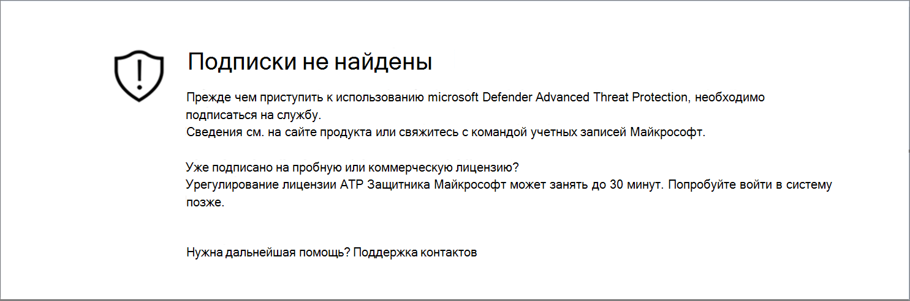
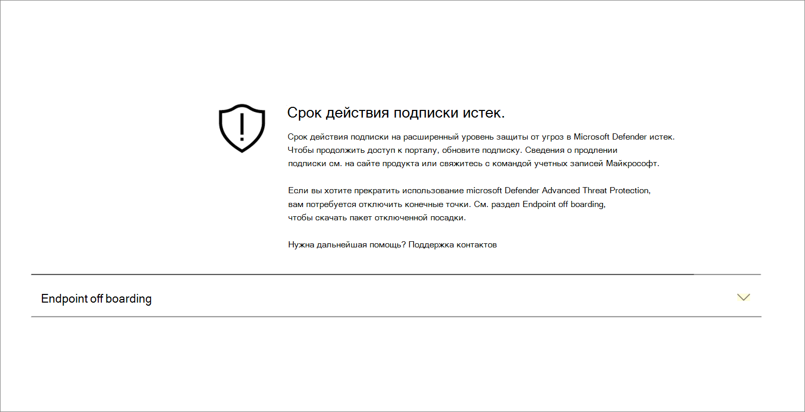
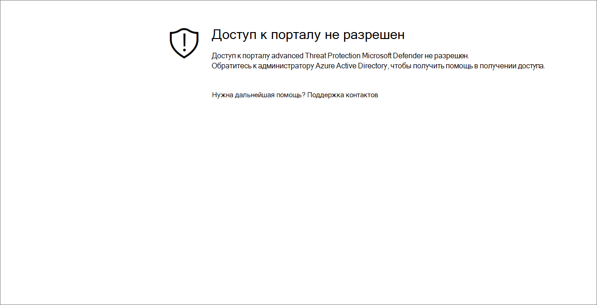
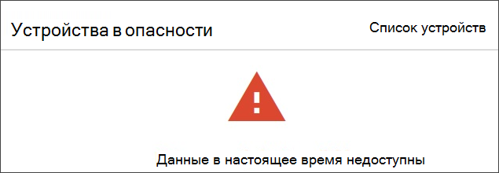

# Устранение неполадок с подпиской и доступом на порталTroubleshoot subscription and portal access issues

[!INCLUDE [Microsoft 365 Defender rebranding](../../includes/microsoft-defender.md)]

**Область применения:****Applies to:**
- [Microsoft Defender для конечной точкиMicrosoft Defender for Endpoint](https://go.microsoft.com/fwlink/p/?linkid=2154037)
- [Microsoft 365 DefenderMicrosoft 365 Defender](https://go.microsoft.com/fwlink/?linkid=2118804)

>Хотите испытать Microsoft Defender для конечной точки?Want to experience Microsoft Defender for Endpoint? [Зарегистрився для бесплатной пробной.Sign up for a free trial.](https://www.microsoft.com/microsoft-365/windows/microsoft-defender-atp?ocid=docs-wdatp-troublshootonboarding-abovefoldlink)

На этой странице подробно описаны действия по устранению неполадок, которые могут возникнуть при настройке службы Microsoft Defender для конечных точек.This page provides detailed steps to troubleshoot issues that might occur when setting up your Microsoft Defender for Endpoint service.

Если вы получите сообщение об ошибке, Центр безопасности Защитника Майкрософт предоставит подробные пояснения о том, что такое проблема, и будут предоставлены соответствующие ссылки.If you receive an error message, Microsoft Defender Security Center will provide a detailed explanation on what the issue is and relevant links will be supplied.

## Подписки не найденыNo subscriptions found

Если при доступе к Центру  безопасности Microsoft Defender вы получаете сообщение Без подписок, это означает, что Azure Active Directory (Azure AD), используемый для входа пользователя на портал, не имеет лицензии Microsoft Defender для конечных точек.If while accessing Microsoft Defender Security Center you get a **No subscriptions found** message, it means the Azure Active Directory (Azure AD) used to log in the user to the portal, does not have a Microsoft Defender for Endpoint license.

Возможные причины:Potential reasons:
- Лицензии Windows E5 и Office E5 - это две разные лицензии.The Windows E5 and Office E5 licenses are separate licenses.
- Лицензия была приобретена, но не была предусмотрена для этого экземпляра Azure AD.The license was purchased but not provisioned to this Azure AD instance.
    - Это может быть проблема с подготовкаю лицензии.It could be a license provisioning issue.
    - Это может быть случайное предоставление лицензии другому Microsoft Azure AD, чем лицензия, используемая для проверки подлинности в службе.It could be you inadvertently provisioned the license to a different Microsoft Azure AD than the one used for authentication into the service.

В обоих случаях следует обратиться в службу поддержки Майкрософт в [Службу](https://support.microsoft.com/getsupport?wf=0&tenant=ClassicCommercial&oaspworkflow=start_1.0.0.0&locale=en-us&supportregion=en-us&pesid=16055&ccsid=636419533611396913) поддержки конечных точек или поддержку [лицензий на объем.](https://www.microsoft.com/licensing/servicecenter/Help/Contact.aspx)For both cases, you should contact Microsoft support at [General Microsoft Defender for Endpoint Support](https://support.microsoft.com/getsupport?wf=0&tenant=ClassicCommercial&oaspworkflow=start_1.0.0.0&locale=en-us&supportregion=en-us&pesid=16055&ccsid=636419533611396913) or [Volume license support](https://www.microsoft.com/licensing/servicecenter/Help/Contact.aspx).

## Срок действия подписки истекYour subscription has expired

Если при доступе к Центру  безопасности Microsoft Defender вы получаете сообщение с истекшим сроком действия подписки, срок действия подписки на службу в Интернете истек.If while accessing Microsoft Defender Security Center you get a **Your subscription has expired** message, your online service subscription has expired. Подписка Microsoft Defender для конечной точки, как и любая другая подписка на онлайн-службу, имеет срок действия.Microsoft Defender for Endpoint subscription, like any other online service subscription, has an expiration date. 

Вы можете продлить или продлить лицензию в любой момент времени.You can choose to renew or extend the license at any point in time. При доступе к порталу  по истечении срока действия подписки будет представлено сообщение с возможностью скачивания пакета offboarding устройства, если вы решите не продлевать лицензию.When accessing the portal after the expiration date a **Your subscription has expired** message will be presented with an option to download the device offboarding package, should you choose to not renew the license.

> [!NOTE]
> По соображениям безопасности срок действия пакета, используемой для устройств Offboard, истекает через 30 дней после даты его загрузки.For security reasons, the package used to Offboard devices will expire 30 days after the date it was downloaded. Просроченные пакеты offboarding, отправленные на устройство, будут отклонены.Expired offboarding packages sent to a device will be rejected. При загрузке пакета offboarding вы будете уведомлены о дате истечения срока действия пакетов и он также будет включен в имя пакета.When downloading an offboarding package you will be notified of the packages expiry date and it will also be included in the package name.

## Доступ к порталу не разрешенYou are not authorized to access the portal

Если вы получаете средство, не уполномоченное получать доступ к порталу, следует помнить, что Microsoft Defender for Endpoint — это продукт мониторинга безопасности, расследования инцидентов и реагирования, поэтому доступ к нему ограничен и контролируется пользователем.If you receive a **You are not authorized to access the portal**, be aware that Microsoft Defender for Endpoint is a security monitoring, incident investigation and response product, and as such, access to it is restricted and controlled by the user.
Дополнительные сведения см. в [**ссылке Назначение доступа пользователей к порталу.**](https://docs.microsoft.com/windows/threat-protection/windows-defender-atp/assign-portal-access-windows-defender-advanced-threat-protection)For more information, see, [**Assign user access to the portal**](https://docs.microsoft.com/windows/threat-protection/windows-defender-atp/assign-portal-access-windows-defender-advanced-threat-protection).

## Данные в настоящее время недоступны на некоторых разделах порталаData currently isn't available on some sections of the portal
Если панель мониторинга портала и другие разделы показывают сообщение об ошибке, например "Данные в настоящее время недоступны":If the portal dashboard and other sections show an error message such as "Data currently isn't available":

Необходимо разрешить все поддомены под `securitycenter.windows.com` ней.You'll need to allow the `securitycenter.windows.com` and all subdomains under it. Например, `*.securitycenter.windows.com`.For example, `*.securitycenter.windows.com`.

## Проблемы с связью порталаPortal communication issues
Если у вас возникнут проблемы с доступом к порталу, отсутствием данных или ограниченным доступом к частям портала, необходимо убедиться, что следующие URL-адреса разрешены и открыты для связи.If you encounter issues with accessing the portal, missing data, or restricted access to portions of the portal, you'll need to verify that the following URLs are allowed and open for communication.

- `*.blob.core.windows.net`
- `crl.microsoft.com`
- `https://*.microsoftonline-p.com`
- `https://*.securitycenter.windows.com` 
- `https://automatediracs-eus-prd.securitycenter.windows.com`
- `https://login.microsoftonline.com`
- `https://login.windows.net`
- `https://onboardingpackagescusprd.blob.core.windows.net`
- `https://secure.aadcdn.microsoftonline-p.com` 
- `https://securitycenter.windows.com` 
- `https://static2.sharepointonline.com` 

