# <a name="troubleshoot-microsoft-defender-for-endpoint-onboarding-issues"></a><span data-ttu-id="35343-104">Устранение неполадок в Microsoft Defender для проблем с бортовой точкой конечной точки</span><span class="sxs-lookup"><span data-stu-id="35343-104">Troubleshoot Microsoft Defender for Endpoint onboarding issues</span></span>

[!INCLUDE [Microsoft 365 Defender rebranding](../../includes/microsoft-defender.md)]


<span data-ttu-id="35343-105">**Область применения:**</span><span class="sxs-lookup"><span data-stu-id="35343-105">**Applies to:**</span></span>

- [<span data-ttu-id="35343-106">Microsoft Defender для конечной точки</span><span class="sxs-lookup"><span data-stu-id="35343-106">Microsoft Defender for Endpoint</span></span>](https://go.microsoft.com/fwlink/?linkid=2154037)
- <span data-ttu-id="35343-107">Windows Server 2012 R2</span><span class="sxs-lookup"><span data-stu-id="35343-107">Windows Server 2012 R2</span></span>
- <span data-ttu-id="35343-108">Windows Server 2016</span><span class="sxs-lookup"><span data-stu-id="35343-108">Windows Server 2016</span></span>
- [<span data-ttu-id="35343-109">Microsoft 365 Defender</span><span class="sxs-lookup"><span data-stu-id="35343-109">Microsoft 365 Defender</span></span>](https://go.microsoft.com/fwlink/?linkid=2118804)

> <span data-ttu-id="35343-110">Хотите испытать Defender для конечной точки?</span><span class="sxs-lookup"><span data-stu-id="35343-110">Want to experience Defender for Endpoint?</span></span> [<span data-ttu-id="35343-111">Зарегистрився для бесплатной пробной.</span><span class="sxs-lookup"><span data-stu-id="35343-111">Sign up for a free trial.</span></span>](https://www.microsoft.com/microsoft-365/windows/microsoft-defender-atp?ocid=docs-wdatp-pullalerts-abovefoldlink) 

<span data-ttu-id="35343-112">При проблемах может потребоваться устранить неполадки в процессе бортового процесса Microsoft Defender для конечной точки.</span><span class="sxs-lookup"><span data-stu-id="35343-112">You might need to troubleshoot the Microsoft Defender for Endpoint onboarding process if you encounter issues.</span></span>
<span data-ttu-id="35343-113">На этой странице подробно описаны действия по устранению неполадок, которые могут возникнуть при развертывании с помощью одного из средств развертывания, а также распространенные ошибки, которые могут возникнуть на устройствах.</span><span class="sxs-lookup"><span data-stu-id="35343-113">This page provides detailed steps to troubleshoot onboarding issues that might occur when deploying with one of the deployment tools and common errors that might occur on the devices.</span></span>

## <a name="troubleshoot-issues-with-onboarding-tools"></a><span data-ttu-id="35343-114">Устранение неполадок с помощью средств бортовой связи</span><span class="sxs-lookup"><span data-stu-id="35343-114">Troubleshoot issues with onboarding tools</span></span>

<span data-ttu-id="35343-115">Если вы завершили процесс подключения и не видите устройства в списке [Устройств](investigate-machines.md) через час, это может указывать на проблемы с подключением или подключением.</span><span class="sxs-lookup"><span data-stu-id="35343-115">If you have completed the onboarding process and don't see devices in the [Devices list](investigate-machines.md) after an hour, it might indicate an onboarding or connectivity problem.</span></span>

### <a name="troubleshoot-onboarding-when-deploying-with-group-policy"></a><span data-ttu-id="35343-116">Устранение неполадок при развертывании с помощью групповой политики</span><span class="sxs-lookup"><span data-stu-id="35343-116">Troubleshoot onboarding when deploying with Group Policy</span></span>

<span data-ttu-id="35343-117">Развертывание с групповой политикой делается путем запуска сценария onboarding на устройствах.</span><span class="sxs-lookup"><span data-stu-id="35343-117">Deployment with Group Policy is done by running the onboarding script on the devices.</span></span> <span data-ttu-id="35343-118">Консоль групповой политики не указывает, удалось ли развертывание или нет.</span><span class="sxs-lookup"><span data-stu-id="35343-118">The Group Policy console does not indicate if the deployment has succeeded or not.</span></span>

<span data-ttu-id="35343-119">Если вы завершили процесс бортовой обработки и не видите устройства в списке [Устройств](investigate-machines.md) через час, вы можете проверить выход скрипта на устройствах.</span><span class="sxs-lookup"><span data-stu-id="35343-119">If you have completed the onboarding process and don't see devices in the [Devices list](investigate-machines.md) after an hour, you can check the output of the script on the devices.</span></span> <span data-ttu-id="35343-120">Дополнительные сведения см. в таблице [Устранение неполадок при](#troubleshoot-onboarding-when-deploying-with-a-script)развертывании с помощью скрипта.</span><span class="sxs-lookup"><span data-stu-id="35343-120">For more information, see [Troubleshoot onboarding when deploying with a script](#troubleshoot-onboarding-when-deploying-with-a-script).</span></span>

<span data-ttu-id="35343-121">Если сценарий успешно завершается, см. в таблице [Устранение](#troubleshoot-onboarding-issues-on-the-device) неполадок на устройствах для устранения дополнительных ошибок, которые могут возникнуть.</span><span class="sxs-lookup"><span data-stu-id="35343-121">If the script completes successfully, see [Troubleshoot onboarding issues on the devices](#troubleshoot-onboarding-issues-on-the-device) for additional errors that might occur.</span></span>

### <a name="troubleshoot-onboarding-issues-when-deploying-with-microsoft-endpoint-configuration-manager"></a><span data-ttu-id="35343-122">Устранение неполадок при развертывании с помощью Microsoft Endpoint Configuration Manager</span><span class="sxs-lookup"><span data-stu-id="35343-122">Troubleshoot onboarding issues when deploying with Microsoft Endpoint Configuration Manager</span></span>

<span data-ttu-id="35343-123">При накладных устройствах с помощью следующих версий Configuration Manager:</span><span class="sxs-lookup"><span data-stu-id="35343-123">When onboarding devices using the following versions of Configuration Manager:</span></span>

- <span data-ttu-id="35343-124">Microsoft Endpoint Configuration Manager</span><span class="sxs-lookup"><span data-stu-id="35343-124">Microsoft Endpoint Configuration Manager</span></span>
- <span data-ttu-id="35343-125">Диспетчер конфигураций System Center 2012</span><span class="sxs-lookup"><span data-stu-id="35343-125">System Center 2012 Configuration Manager</span></span>
- <span data-ttu-id="35343-126">Диспетчер конфигураций System Center 2012 R2</span><span class="sxs-lookup"><span data-stu-id="35343-126">System Center 2012 R2 Configuration Manager</span></span>

<span data-ttu-id="35343-127">Развертывание с указанными выше версиями диспетчера конфигурации происходит с помощью скрипта onboarding на устройствах.</span><span class="sxs-lookup"><span data-stu-id="35343-127">Deployment with the above-mentioned versions of Configuration Manager is done by running the onboarding script on the devices.</span></span> <span data-ttu-id="35343-128">Вы можете отслеживать развертывание в консоли Диспетчер конфигурации.</span><span class="sxs-lookup"><span data-stu-id="35343-128">You can track the deployment in the Configuration Manager Console.</span></span>

<span data-ttu-id="35343-129">В случае сбой развертывания можно проверить выход скрипта на устройствах.</span><span class="sxs-lookup"><span data-stu-id="35343-129">If the deployment fails, you can check the output of the script on the devices.</span></span>

<span data-ttu-id="35343-130">Если бортовая надстройка успешно завершена, но устройства не [](#troubleshoot-onboarding-issues-on-the-device) отображаются в списке **Устройств** через час, см. в рубке Устранение неполадок на устройстве для устранения дополнительных ошибок, которые могут возникнуть.</span><span class="sxs-lookup"><span data-stu-id="35343-130">If the onboarding completed successfully but the devices are not showing up in the **Devices list** after an hour, see [Troubleshoot onboarding issues on the device](#troubleshoot-onboarding-issues-on-the-device) for additional errors that might occur.</span></span>

### <a name="troubleshoot-onboarding-when-deploying-with-a-script"></a><span data-ttu-id="35343-131">Устранение неполадок при развертывании с помощью скрипта</span><span class="sxs-lookup"><span data-stu-id="35343-131">Troubleshoot onboarding when deploying with a script</span></span>

<span data-ttu-id="35343-132">**Проверьте результат скрипта на устройстве:**</span><span class="sxs-lookup"><span data-stu-id="35343-132">**Check the result of the script on the device:**</span></span>

1. <span data-ttu-id="35343-133">Нажмите **кнопку Начните,** **введите viewer событий** и нажмите **кнопку Ввод**.</span><span class="sxs-lookup"><span data-stu-id="35343-133">Click **Start**, type **Event Viewer**, and press **Enter**.</span></span>

2. <span data-ttu-id="35343-134">Перейдите в **приложение Журналы**  >  **Windows**.</span><span class="sxs-lookup"><span data-stu-id="35343-134">Go to **Windows Logs** > **Application**.</span></span>

3. <span data-ttu-id="35343-135">Посмотрите событие из **источника событий WDATPOnboarding.**</span><span class="sxs-lookup"><span data-stu-id="35343-135">Look for an event from **WDATPOnboarding** event source.</span></span>

<span data-ttu-id="35343-136">Если сценарий сбой и событие является ошибкой, вы можете проверить ID события в следующей таблице, чтобы помочь вам устранить проблему.</span><span class="sxs-lookup"><span data-stu-id="35343-136">If the script fails and the event is an error, you can check the event ID in the following table to help you troubleshoot the issue.</span></span>

> [!NOTE]
> <span data-ttu-id="35343-137">Следующие ID-события специфика только для сценария на борту.</span><span class="sxs-lookup"><span data-stu-id="35343-137">The following event IDs are specific to the onboarding script only.</span></span>

<span data-ttu-id="35343-138">Идентификатор события</span><span class="sxs-lookup"><span data-stu-id="35343-138">Event ID</span></span> | <span data-ttu-id="35343-139">Тип ошибки</span><span class="sxs-lookup"><span data-stu-id="35343-139">Error Type</span></span> | <span data-ttu-id="35343-140">Действия по разрешению</span><span class="sxs-lookup"><span data-stu-id="35343-140">Resolution steps</span></span>
:---:|:---|:---
 `5` | <span data-ttu-id="35343-141">Offboarding data was found but couldn't be deleted</span><span class="sxs-lookup"><span data-stu-id="35343-141">Offboarding data was found but couldn't be deleted</span></span> | <span data-ttu-id="35343-142">Проверка разрешений в реестре, в частности</span><span class="sxs-lookup"><span data-stu-id="35343-142">Check the permissions on the registry, specifically</span></span><br> <span data-ttu-id="35343-143">`HKLM\SOFTWARE\Policies\Microsoft\Windows Advanced Threat Protection`.</span><span class="sxs-lookup"><span data-stu-id="35343-143">`HKLM\SOFTWARE\Policies\Microsoft\Windows Advanced Threat Protection`.</span></span>
`10` | <span data-ttu-id="35343-144">Данные о вписке не могут быть записаны в реестр</span><span class="sxs-lookup"><span data-stu-id="35343-144">Onboarding data couldn't be written to registry</span></span> |  <span data-ttu-id="35343-145">Проверка разрешений в реестре, в частности</span><span class="sxs-lookup"><span data-stu-id="35343-145">Check the permissions on the registry, specifically</span></span><br> <span data-ttu-id="35343-146">`HKLM\SOFTWARE\Policies\Microsoft\Windows Advanced Threat Protection`.</span><span class="sxs-lookup"><span data-stu-id="35343-146">`HKLM\SOFTWARE\Policies\Microsoft\Windows Advanced Threat Protection`.</span></span><br><span data-ttu-id="35343-147">Убедитесь, что сценарий был запускаться в качестве администратора.</span><span class="sxs-lookup"><span data-stu-id="35343-147">Verify that the script has been run as an administrator.</span></span>
`15` |  <span data-ttu-id="35343-148">Не удалось запустить службу SENSE</span><span class="sxs-lookup"><span data-stu-id="35343-148">Failed to start SENSE service</span></span> |<span data-ttu-id="35343-149">Проверка состояния службы `sc query sense` (команда).</span><span class="sxs-lookup"><span data-stu-id="35343-149">Check the service health (`sc query sense` command).</span></span> <span data-ttu-id="35343-150">Убедитесь, что он не в промежуточном состоянии *(Pending_Stopped,* *Pending_Running)* и попробуйте запустить сценарий снова (с правами администратора).</span><span class="sxs-lookup"><span data-stu-id="35343-150">Make sure it's not in an intermediate state (*'Pending_Stopped'*, *'Pending_Running'*) and try to run the script again (with administrator rights).</span></span> <br> <br> <span data-ttu-id="35343-151">Если на устройстве работает Windows 10, версия 1607 и возвращается команда, перезагружаем `sc query sense` `START_PENDING` устройство.</span><span class="sxs-lookup"><span data-stu-id="35343-151">If the device is running Windows 10, version 1607 and running the command `sc query sense` returns `START_PENDING`, reboot the device.</span></span> <span data-ttu-id="35343-152">Если перезагрузка устройства не решает проблему, перезагружайтесь до KB4015217 и попробуйте снова входить в систему.</span><span class="sxs-lookup"><span data-stu-id="35343-152">If rebooting the device doesn't address the issue, upgrade to KB4015217 and try onboarding again.</span></span>
`15` | <span data-ttu-id="35343-153">Не удалось запустить службу SENSE</span><span class="sxs-lookup"><span data-stu-id="35343-153">Failed to start SENSE service</span></span> | <span data-ttu-id="35343-154">Если сообщение об ошибке: ошибка системы 577 или ошибка 1058 произошла, необходимо включить драйвер elAM антивируса Microsoft Defender, см. в руб. Убедитесь, что антивирус [Microsoft Defender](#ensure-that-microsoft-defender-antivirus-is-not-disabled-by-a-policy) не отключен политикой инструкций.</span><span class="sxs-lookup"><span data-stu-id="35343-154">If the message of the error is: System error 577  or error 1058 has occurred, you need to enable the Microsoft Defender Antivirus ELAM driver, see [Ensure that Microsoft Defender Antivirus is not disabled by a policy](#ensure-that-microsoft-defender-antivirus-is-not-disabled-by-a-policy) for instructions.</span></span>
`30` |  <span data-ttu-id="35343-155">Сценарию не удалось дождаться запуска службы</span><span class="sxs-lookup"><span data-stu-id="35343-155">The script failed to wait for the service to start running</span></span> | <span data-ttu-id="35343-156">При попытке запуска службе могло быть уйма времени на запуск или ошибки.</span><span class="sxs-lookup"><span data-stu-id="35343-156">The service could have taken more time to start or has encountered errors while trying to start.</span></span> <span data-ttu-id="35343-157">Дополнительные сведения о событиях и ошибках, связанных с SENSE, см. в обзоре событий и [ошибок с помощью просмотра событий.](event-error-codes.md)</span><span class="sxs-lookup"><span data-stu-id="35343-157">For more information on events and errors related to SENSE, see [Review events and errors using Event viewer](event-error-codes.md).</span></span>
`35` |  <span data-ttu-id="35343-158">Сценарию не удалось найти необходимое значение реестра состояния onboarding</span><span class="sxs-lookup"><span data-stu-id="35343-158">The script failed to find needed onboarding status registry value</span></span> | <span data-ttu-id="35343-159">Когда служба SENSE запускается впервые, она записывает состояние бортовой записи в расположение реестра.</span><span class="sxs-lookup"><span data-stu-id="35343-159">When the SENSE service starts for the first time, it writes onboarding status to the registry location</span></span><br><span data-ttu-id="35343-160">`HKLM\SOFTWARE\Microsoft\Windows Advanced Threat Protection\Status`.</span><span class="sxs-lookup"><span data-stu-id="35343-160">`HKLM\SOFTWARE\Microsoft\Windows Advanced Threat Protection\Status`.</span></span><br> <span data-ttu-id="35343-161">Сценарий не удалось найти через несколько секунд.</span><span class="sxs-lookup"><span data-stu-id="35343-161">The script failed to find it after several seconds.</span></span> <span data-ttu-id="35343-162">Вы можете вручную проверить его и проверить, есть ли он.</span><span class="sxs-lookup"><span data-stu-id="35343-162">You can manually test it and check if it's there.</span></span> <span data-ttu-id="35343-163">Дополнительные сведения о событиях и ошибках, связанных с SENSE, см. в обзоре событий и [ошибок с помощью просмотра событий.](event-error-codes.md)</span><span class="sxs-lookup"><span data-stu-id="35343-163">For more information on events and errors related to SENSE, see [Review events and errors using Event viewer](event-error-codes.md).</span></span>
`40` | <span data-ttu-id="35343-164">Состояние onboarding службы SENSE не установлено до **1**</span><span class="sxs-lookup"><span data-stu-id="35343-164">SENSE service onboarding status is not set to **1**</span></span> | <span data-ttu-id="35343-165">Служба SENSE не смогла должным образом работать на борту.</span><span class="sxs-lookup"><span data-stu-id="35343-165">The SENSE service has failed to onboard properly.</span></span> <span data-ttu-id="35343-166">Дополнительные сведения о событиях и ошибках, связанных с SENSE, см. в обзоре событий и [ошибок с помощью просмотра событий.](event-error-codes.md)</span><span class="sxs-lookup"><span data-stu-id="35343-166">For more information on events and errors related to SENSE, see [Review events and errors using Event viewer](event-error-codes.md).</span></span>
`65` | <span data-ttu-id="35343-167">Недостаточные привилегии</span><span class="sxs-lookup"><span data-stu-id="35343-167">Insufficient privileges</span></span>| <span data-ttu-id="35343-168">Запустите скрипт снова с привилегиями администратора.</span><span class="sxs-lookup"><span data-stu-id="35343-168">Run the script again with administrator privileges.</span></span>

### <a name="troubleshoot-onboarding-issues-using-microsoft-intune"></a><span data-ttu-id="35343-169">Устранение неполадок с бортовой записью с помощью Microsoft Intune</span><span class="sxs-lookup"><span data-stu-id="35343-169">Troubleshoot onboarding issues using Microsoft Intune</span></span>

<span data-ttu-id="35343-170">Вы можете использовать Microsoft Intune для проверки кодов ошибок и устранения неполадок.</span><span class="sxs-lookup"><span data-stu-id="35343-170">You can use Microsoft Intune to check error codes and attempt to troubleshoot the cause of the issue.</span></span>

<span data-ttu-id="35343-171">Если вы настроили политики в Intune и они не распространяются на устройствах, может потребоваться настроить автоматическую регистрацию MDM.</span><span class="sxs-lookup"><span data-stu-id="35343-171">If you have configured policies in Intune and they are not propagated on devices, you might need to configure automatic MDM enrollment.</span></span>

<span data-ttu-id="35343-172">Используйте следующие таблицы, чтобы понять возможные причины проблем во время работы с бортом:</span><span class="sxs-lookup"><span data-stu-id="35343-172">Use the following tables to understand the possible causes of issues while onboarding:</span></span>

- <span data-ttu-id="35343-173">Коды ошибок Microsoft Intune и OMA-URIs таблицы</span><span class="sxs-lookup"><span data-stu-id="35343-173">Microsoft Intune error codes and OMA-URIs table</span></span>
- <span data-ttu-id="35343-174">Известные проблемы с таблицей несоблюдения</span><span class="sxs-lookup"><span data-stu-id="35343-174">Known issues with non-compliance table</span></span>
- <span data-ttu-id="35343-175">Таблица журналов журналов событий для управления мобильными устройствами (MDM)</span><span class="sxs-lookup"><span data-stu-id="35343-175">Mobile Device Management (MDM) event logs table</span></span>

<span data-ttu-id="35343-176">Если ни один из журналов событий и действий по  устранению неполадок не работает, скачайте сценарий Local из раздела управление устройствами портала и запустите его в командной подсказке.</span><span class="sxs-lookup"><span data-stu-id="35343-176">If none of the event logs and troubleshooting steps work, download the Local script from the **Device management** section of the portal, and run it in an elevated command prompt.</span></span>

#### <a name="microsoft-intune-error-codes-and-oma-uris"></a><span data-ttu-id="35343-177">Коды ошибок Microsoft Intune и OMA-URIs</span><span class="sxs-lookup"><span data-stu-id="35343-177">Microsoft Intune error codes and OMA-URIs</span></span>

<span data-ttu-id="35343-178">Код ошибки Hex</span><span class="sxs-lookup"><span data-stu-id="35343-178">Error Code Hex</span></span> | <span data-ttu-id="35343-179">Код ошибки Dec</span><span class="sxs-lookup"><span data-stu-id="35343-179">Error Code Dec</span></span> | <span data-ttu-id="35343-180">Описание ошибки</span><span class="sxs-lookup"><span data-stu-id="35343-180">Error Description</span></span> | <span data-ttu-id="35343-181">OMA-URI</span><span class="sxs-lookup"><span data-stu-id="35343-181">OMA-URI</span></span> | <span data-ttu-id="35343-182">Возможные действия по устранению причин и неполадок</span><span class="sxs-lookup"><span data-stu-id="35343-182">Possible cause and troubleshooting steps</span></span>
:---:|:---|:---|:---|:---
<span data-ttu-id="35343-183">0x87D1FDE8</span><span class="sxs-lookup"><span data-stu-id="35343-183">0x87D1FDE8</span></span> | <span data-ttu-id="35343-184">-2016281112</span><span class="sxs-lookup"><span data-stu-id="35343-184">-2016281112</span></span> | <span data-ttu-id="35343-185">Исправление не удалось</span><span class="sxs-lookup"><span data-stu-id="35343-185">Remediation failed</span></span> | <span data-ttu-id="35343-186">Адаптация</span><span class="sxs-lookup"><span data-stu-id="35343-186">Onboarding</span></span> <br> <span data-ttu-id="35343-187">Offboarding</span><span class="sxs-lookup"><span data-stu-id="35343-187">Offboarding</span></span> | <span data-ttu-id="35343-188">**Возможная причина:** Отключение бортового или offboarding на неправильном blob: неправильной подписи или отсутствующих полях PreviousOrgIds.</span><span class="sxs-lookup"><span data-stu-id="35343-188">**Possible cause:** Onboarding or offboarding failed on a wrong blob: wrong signature or missing PreviousOrgIds fields.</span></span> <br><br> <span data-ttu-id="35343-189">**Действия по устранению неполадок:**</span><span class="sxs-lookup"><span data-stu-id="35343-189">**Troubleshooting steps:**</span></span> <br> <span data-ttu-id="35343-190">Проверьте ID-данные событий в разделе Учет ошибок агента просмотра в [разделе журнал событий устройства.](#view-agent-onboarding-errors-in-the-device-event-log)</span><span class="sxs-lookup"><span data-stu-id="35343-190">Check the event IDs in the [View agent onboarding errors in the device event log](#view-agent-onboarding-errors-in-the-device-event-log) section.</span></span> <br><br> <span data-ttu-id="35343-191">Проверьте журналы событий MDM в следующей таблице или следуйте инструкциям в журнале Диагностика сбоев [MDM в Windows 10](https://docs.microsoft.com/windows/client-management/mdm/diagnose-mdm-failures-in-windows-10).</span><span class="sxs-lookup"><span data-stu-id="35343-191">Check the MDM event logs in the following table or follow the instructions in [Diagnose MDM failures in Windows 10](https://docs.microsoft.com/windows/client-management/mdm/diagnose-mdm-failures-in-windows-10).</span></span>
 | | | | <span data-ttu-id="35343-192">Адаптация</span><span class="sxs-lookup"><span data-stu-id="35343-192">Onboarding</span></span> <br> <span data-ttu-id="35343-193">Offboarding</span><span class="sxs-lookup"><span data-stu-id="35343-193">Offboarding</span></span> <br> <span data-ttu-id="35343-194">SampleSharing</span><span class="sxs-lookup"><span data-stu-id="35343-194">SampleSharing</span></span> | <span data-ttu-id="35343-195">**Возможная причина:** Ключ реестра Microsoft Defender для конечной политики отсутствует, а клиент dm OMA не имеет разрешений на запись.</span><span class="sxs-lookup"><span data-stu-id="35343-195">**Possible cause:** Microsoft Defender for Endpoint Policy registry key does not exist or the OMA DM client doesn't have permissions to write to it.</span></span> <br><br> <span data-ttu-id="35343-196">**Действия по устранению неполадок:** Убедитесь, что существует следующий ключ реестра: `HKEY_LOCAL_MACHINE\SOFTWARE\Policies\Microsoft\Windows Advanced Threat Protection`</span><span class="sxs-lookup"><span data-stu-id="35343-196">**Troubleshooting steps:** Ensure that the following registry key exists: `HKEY_LOCAL_MACHINE\SOFTWARE\Policies\Microsoft\Windows Advanced Threat Protection`</span></span> <br> <br> <span data-ttu-id="35343-197">Если его нет, откройте повышенную команду и добавьте ключ.</span><span class="sxs-lookup"><span data-stu-id="35343-197">If it doesn't exist, open an elevated command and add the key.</span></span>
 | | | | <span data-ttu-id="35343-198">SenseIsRunning</span><span class="sxs-lookup"><span data-stu-id="35343-198">SenseIsRunning</span></span> <br> <span data-ttu-id="35343-199">OnboardingState</span><span class="sxs-lookup"><span data-stu-id="35343-199">OnboardingState</span></span> <br> <span data-ttu-id="35343-200">OrgId</span><span class="sxs-lookup"><span data-stu-id="35343-200">OrgId</span></span> |  <span data-ttu-id="35343-201">**Возможная причина:** Попытка исправлений с помощью свойства только для чтения.</span><span class="sxs-lookup"><span data-stu-id="35343-201">**Possible cause:** An attempt to remediate by read-only property.</span></span> <span data-ttu-id="35343-202">Сбой в октагонах.</span><span class="sxs-lookup"><span data-stu-id="35343-202">Onboarding has failed.</span></span> <br><br> <span data-ttu-id="35343-203">**Действия по устранению неполадок:** Проверьте действия по устранению неполадок в устранении неполадок на [устройстве.](#troubleshoot-onboarding-issues-on-the-device)</span><span class="sxs-lookup"><span data-stu-id="35343-203">**Troubleshooting steps:** Check the troubleshooting steps in [Troubleshoot onboarding issues on the device](#troubleshoot-onboarding-issues-on-the-device).</span></span> <br><br> <span data-ttu-id="35343-204">Проверьте журналы событий MDM в следующей таблице или следуйте инструкциям в журнале Диагностика сбоев [MDM в Windows 10](https://docs.microsoft.com/windows/client-management/mdm/diagnose-mdm-failures-in-windows-10).</span><span class="sxs-lookup"><span data-stu-id="35343-204">Check the MDM event logs in the following table or follow the instructions in [Diagnose MDM failures in Windows 10](https://docs.microsoft.com/windows/client-management/mdm/diagnose-mdm-failures-in-windows-10).</span></span>
 | | | | <span data-ttu-id="35343-205">Все</span><span class="sxs-lookup"><span data-stu-id="35343-205">All</span></span> | <span data-ttu-id="35343-206">**Возможная причина:** Попытка развертывания Microsoft Defender для конечной точки на не поддерживаемой SKU/Платформе, в частности holographic SKU.</span><span class="sxs-lookup"><span data-stu-id="35343-206">**Possible cause:** Attempt to deploy Microsoft Defender for Endpoint on non-supported SKU/Platform, particularly Holographic SKU.</span></span> <br><br> <span data-ttu-id="35343-207">Поддерживаемые в настоящее время платформы:</span><span class="sxs-lookup"><span data-stu-id="35343-207">Currently supported platforms:</span></span><br> <span data-ttu-id="35343-208">Корпоративный, образовательный и профессиональный.</span><span class="sxs-lookup"><span data-stu-id="35343-208">Enterprise, Education, and Professional.</span></span><br> <span data-ttu-id="35343-209">Сервер не поддерживается.</span><span class="sxs-lookup"><span data-stu-id="35343-209">Server is not supported.</span></span>
 <span data-ttu-id="35343-210">0x87D101A9</span><span class="sxs-lookup"><span data-stu-id="35343-210">0x87D101A9</span></span> | <span data-ttu-id="35343-211">-2016345687</span><span class="sxs-lookup"><span data-stu-id="35343-211">-2016345687</span></span> |<span data-ttu-id="35343-212">SyncML (425): запрашиваемая команда не справилась с управлением, так как у отправитель не имеет достаточных разрешений управления доступом (ACL) для получателя.</span><span class="sxs-lookup"><span data-stu-id="35343-212">SyncML(425): The requested command failed because the sender does not have adequate access control permissions (ACL) on the recipient.</span></span> | <span data-ttu-id="35343-213">Все</span><span class="sxs-lookup"><span data-stu-id="35343-213">All</span></span> |  <span data-ttu-id="35343-214">**Возможная причина:** Попытка развертывания Microsoft Defender для конечной точки на не поддерживаемой SKU/Платформе, в частности holographic SKU.</span><span class="sxs-lookup"><span data-stu-id="35343-214">**Possible cause:** Attempt to deploy Microsoft Defender for Endpoint on non-supported SKU/Platform, particularly Holographic SKU.</span></span><br><br> <span data-ttu-id="35343-215">Поддерживаемые в настоящее время платформы:</span><span class="sxs-lookup"><span data-stu-id="35343-215">Currently supported platforms:</span></span><br>  <span data-ttu-id="35343-216">Корпоративный, образовательный и профессиональный.</span><span class="sxs-lookup"><span data-stu-id="35343-216">Enterprise, Education, and Professional.</span></span>

#### <a name="known-issues-with-non-compliance"></a><span data-ttu-id="35343-217">Известные проблемы с несоблюдением</span><span class="sxs-lookup"><span data-stu-id="35343-217">Known issues with non-compliance</span></span>

<span data-ttu-id="35343-218">В следующей таблице приводится информация о проблемах с несоответствием требованиям и о том, как можно решить эти проблемы.</span><span class="sxs-lookup"><span data-stu-id="35343-218">The following table provides information on issues with non-compliance and how you can address the issues.</span></span>

<span data-ttu-id="35343-219">Дело</span><span class="sxs-lookup"><span data-stu-id="35343-219">Case</span></span> | <span data-ttu-id="35343-220">Симптомы</span><span class="sxs-lookup"><span data-stu-id="35343-220">Symptoms</span></span> | <span data-ttu-id="35343-221">Возможные действия по устранению причин и неполадок</span><span class="sxs-lookup"><span data-stu-id="35343-221">Possible cause and troubleshooting steps</span></span>
:---:|:---|:---
 `1` | <span data-ttu-id="35343-222">Устройство соответствует senseIsRunning OMA-URI.</span><span class="sxs-lookup"><span data-stu-id="35343-222">Device is compliant by SenseIsRunning OMA-URI.</span></span> <span data-ttu-id="35343-223">Но не соответствует требованиям OrgId, Onboarding и OnboardingState OMA-URIs.</span><span class="sxs-lookup"><span data-stu-id="35343-223">But is non-compliant by OrgId, Onboarding and OnboardingState OMA-URIs.</span></span> | <span data-ttu-id="35343-224">**Возможная причина:** Проверьте, прошел ли пользователь OOBE после установки или обновления Windows.</span><span class="sxs-lookup"><span data-stu-id="35343-224">**Possible cause:** Check that user passed OOBE after Windows installation or upgrade.</span></span> <span data-ttu-id="35343-225">Во время бортового OOBE не удалось завершить, но SENSE уже запущена.</span><span class="sxs-lookup"><span data-stu-id="35343-225">During OOBE onboarding couldn't be completed but SENSE is running already.</span></span><br><br> <span data-ttu-id="35343-226">**Действия по устранению неполадок:** Подождите, пока OOBE завершится.</span><span class="sxs-lookup"><span data-stu-id="35343-226">**Troubleshooting steps:** Wait for OOBE to complete.</span></span>
 `2` |  <span data-ttu-id="35343-227">Устройство соответствует требованиям OrgId, Onboarding и OnboardingState OMA-URIs, но не соответствует требованиям SenseIsRunning OMA-URI.</span><span class="sxs-lookup"><span data-stu-id="35343-227">Device is compliant by OrgId, Onboarding, and OnboardingState OMA-URIs, but is non-compliant by SenseIsRunning OMA-URI.</span></span> |  <span data-ttu-id="35343-228">**Возможная причина:** Тип запуска службы sense за установлен как "Задержка запуска".</span><span class="sxs-lookup"><span data-stu-id="35343-228">**Possible cause:** Sense service's startup type is set as "Delayed Start".</span></span> <span data-ttu-id="35343-229">Иногда из-за этого сервер Microsoft Intune сообщает о том, что устройство не соответствует требованиям SenseIsRunning при запуске системы.</span><span class="sxs-lookup"><span data-stu-id="35343-229">Sometimes this causes the Microsoft Intune server to report the device as non-compliant by SenseIsRunning when DM session occurs on system start.</span></span> <br><br> <span data-ttu-id="35343-230">**Действия по устранению неполадок:** Проблема должна быть устранена автоматически в течение 24 часов.</span><span class="sxs-lookup"><span data-stu-id="35343-230">**Troubleshooting steps:** The issue should automatically be fixed within 24 hours.</span></span>
 `3` | <span data-ttu-id="35343-231">Устройство не соответствует требованиям</span><span class="sxs-lookup"><span data-stu-id="35343-231">Device is non-compliant</span></span> | <span data-ttu-id="35343-232">**Действия по устранению неполадок:** Убедитесь, что политики onboarding и Offboarding не развертываются на одном устройстве одновременно.</span><span class="sxs-lookup"><span data-stu-id="35343-232">**Troubleshooting steps:** Ensure that Onboarding and Offboarding policies are not deployed on the same device at same time.</span></span>

#### <a name="mobile-device-management-mdm-event-logs"></a><span data-ttu-id="35343-233">Журналы событий управления мобильными устройствами (MDM)</span><span class="sxs-lookup"><span data-stu-id="35343-233">Mobile Device Management (MDM) event logs</span></span>

<span data-ttu-id="35343-234">Просмотр журналов событий MDM для устранения неполадок, которые могут возникнуть при входе в систему:</span><span class="sxs-lookup"><span data-stu-id="35343-234">View the MDM event logs to troubleshoot issues that might arise during onboarding:</span></span>

<span data-ttu-id="35343-235">Имя журнала: Microsoft\Windows\DeviceManagement-EnterpriseDiagnostics-Provider</span><span class="sxs-lookup"><span data-stu-id="35343-235">Log name: Microsoft\Windows\DeviceManagement-EnterpriseDiagnostics-Provider</span></span>

<span data-ttu-id="35343-236">Имя канала: Admin</span><span class="sxs-lookup"><span data-stu-id="35343-236">Channel name: Admin</span></span>

<span data-ttu-id="35343-237">Идентификатор</span><span class="sxs-lookup"><span data-stu-id="35343-237">ID</span></span> | <span data-ttu-id="35343-238">Severity</span><span class="sxs-lookup"><span data-stu-id="35343-238">Severity</span></span> | <span data-ttu-id="35343-239">Описание события</span><span class="sxs-lookup"><span data-stu-id="35343-239">Event description</span></span> | <span data-ttu-id="35343-240">Действия по устранению неполадок</span><span class="sxs-lookup"><span data-stu-id="35343-240">Troubleshooting steps</span></span>
:---|:---|:---|:---
<span data-ttu-id="35343-241">1819</span><span class="sxs-lookup"><span data-stu-id="35343-241">1819</span></span> | <span data-ttu-id="35343-242">Error</span><span class="sxs-lookup"><span data-stu-id="35343-242">Error</span></span> | <span data-ttu-id="35343-243">Microsoft Defender для CSP конечной точки: не удалось установить значение узла.</span><span class="sxs-lookup"><span data-stu-id="35343-243">Microsoft Defender for Endpoint CSP: Failed to Set Node's Value.</span></span> <span data-ttu-id="35343-244">NodeId: (%1), TokenName: (%2), Результат: (%3).</span><span class="sxs-lookup"><span data-stu-id="35343-244">NodeId: (%1), TokenName: (%2), Result: (%3).</span></span> | <span data-ttu-id="35343-245">Скачайте [накопительное обновление для Windows 10, 1607](https://go.microsoft.com/fwlink/?linkid=829760).</span><span class="sxs-lookup"><span data-stu-id="35343-245">Download the [Cumulative Update for Windows 10, 1607](https://go.microsoft.com/fwlink/?linkid=829760).</span></span>

## <a name="troubleshoot-onboarding-issues-on-the-device"></a><span data-ttu-id="35343-246">Устранение неполадок с бортовой проблемой на устройстве</span><span class="sxs-lookup"><span data-stu-id="35343-246">Troubleshoot onboarding issues on the device</span></span>

<span data-ttu-id="35343-247">Если используемые средства развертывания не указывают на ошибку в процессе бортовой обработки, но устройства по-прежнему не отображаются в списке устройств в течение часа, ознакомьтесь со следующими разделами проверки, чтобы проверить, произошла ли ошибка с агентом Microsoft Defender для конечной точки.</span><span class="sxs-lookup"><span data-stu-id="35343-247">If the deployment tools used does not indicate an error in the onboarding process, but devices are still not appearing in the devices list in an hour, go through the following verification topics to check if an error occurred with the Microsoft Defender for Endpoint agent.</span></span>

- [<span data-ttu-id="35343-248">Просмотр ошибок входа агента в журнал событий устройства</span><span class="sxs-lookup"><span data-stu-id="35343-248">View agent onboarding errors in the device event log</span></span>](#view-agent-onboarding-errors-in-the-device-event-log)
- [<span data-ttu-id="35343-249">Убедитесь, что служба диагностических данных включена</span><span class="sxs-lookup"><span data-stu-id="35343-249">Ensure the diagnostic data service is enabled</span></span>](#ensure-the-diagnostics-service-is-enabled)
- [<span data-ttu-id="35343-250">Убедитесь, что служба настроена на запуск</span><span class="sxs-lookup"><span data-stu-id="35343-250">Ensure the service is set to start</span></span>](#ensure-the-service-is-set-to-start)
- [<span data-ttu-id="35343-251">Обеспечение подключения к Интернету на устройстве</span><span class="sxs-lookup"><span data-stu-id="35343-251">Ensure the device has an Internet connection</span></span>](#ensure-the-device-has-an-internet-connection)
- [<span data-ttu-id="35343-252">Убедитесь, что антивирус Microsoft Defender не отключен политикой</span><span class="sxs-lookup"><span data-stu-id="35343-252">Ensure that Microsoft Defender Antivirus is not disabled by a policy</span></span>](#ensure-that-microsoft-defender-antivirus-is-not-disabled-by-a-policy)

### <a name="view-agent-onboarding-errors-in-the-device-event-log"></a><span data-ttu-id="35343-253">Просмотр ошибок входа агента в журнал событий устройства</span><span class="sxs-lookup"><span data-stu-id="35343-253">View agent onboarding errors in the device event log</span></span>

1. <span data-ttu-id="35343-254">Нажмите **кнопку Начните,** **введите viewer событий** и нажмите **кнопку Ввод**.</span><span class="sxs-lookup"><span data-stu-id="35343-254">Click **Start**, type **Event Viewer**, and press **Enter**.</span></span>

2. <span data-ttu-id="35343-255">В области **Просмотра событий (Local)** расширяем **журналы** приложений и служб  >  **Microsoft**  >  **Windows**  >  **SENSE**.</span><span class="sxs-lookup"><span data-stu-id="35343-255">In the **Event Viewer (Local)** pane, expand **Applications and Services Logs** > **Microsoft** > **Windows** > **SENSE**.</span></span>

   > [!NOTE]
   > <span data-ttu-id="35343-256">SENSE — это внутреннее имя, используемое для обозначения поведенческого датчика, который работает с Microsoft Defender для конечной точки.</span><span class="sxs-lookup"><span data-stu-id="35343-256">SENSE is the internal name used to refer to the behavioral sensor that powers Microsoft Defender for Endpoint.</span></span>

3. <span data-ttu-id="35343-257">Выберите **Оперативный** для загрузки журнала.</span><span class="sxs-lookup"><span data-stu-id="35343-257">Select **Operational** to load the log.</span></span>

4. <span data-ttu-id="35343-258">В области **Действия** нажмите **кнопку Фильтр текущего журнала**.</span><span class="sxs-lookup"><span data-stu-id="35343-258">In the **Action** pane, click **Filter Current log**.</span></span>

5. <span data-ttu-id="35343-259">На **вкладке Фильтр,** на уровне **события:** **выберите** критические, **предупреждающие** и ошибки **и** нажмите **кнопку ОК**.</span><span class="sxs-lookup"><span data-stu-id="35343-259">On the **Filter** tab, under **Event level:** select **Critical**, **Warning**, and **Error**, and click **OK**.</span></span>

   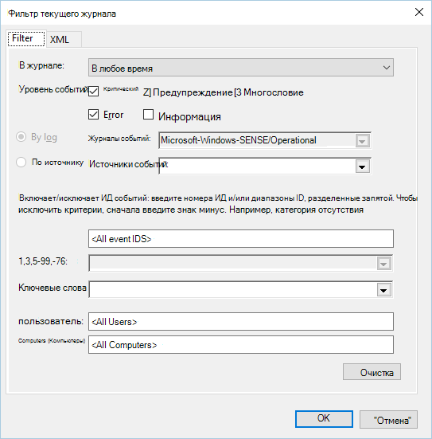

6. <span data-ttu-id="35343-261">События, которые могут указывать на проблемы, будут отображаться в **области Operational.**</span><span class="sxs-lookup"><span data-stu-id="35343-261">Events which can indicate issues will appear in the **Operational** pane.</span></span> <span data-ttu-id="35343-262">Вы можете попытаться устранить их на основе решений в следующей таблице:</span><span class="sxs-lookup"><span data-stu-id="35343-262">You can attempt to troubleshoot them based on the solutions in the following table:</span></span>

<span data-ttu-id="35343-263">Идентификатор события</span><span class="sxs-lookup"><span data-stu-id="35343-263">Event ID</span></span> | <span data-ttu-id="35343-264">Сообщение</span><span class="sxs-lookup"><span data-stu-id="35343-264">Message</span></span> | <span data-ttu-id="35343-265">Действия по разрешению</span><span class="sxs-lookup"><span data-stu-id="35343-265">Resolution steps</span></span>
:---:|:---|:---
 `5` | <span data-ttu-id="35343-266">Служба Microsoft Defender для конечных точек не смогла подключиться к серверу с _переменной_</span><span class="sxs-lookup"><span data-stu-id="35343-266">Microsoft Defender for Endpoint service failed to connect to the server at _variable_</span></span> | <span data-ttu-id="35343-267">[Убедитесь, что устройство имеет доступ к Интернету.](#ensure-the-device-has-an-internet-connection)</span><span class="sxs-lookup"><span data-stu-id="35343-267">[Ensure the device has Internet access](#ensure-the-device-has-an-internet-connection).</span></span>
 `6` | <span data-ttu-id="35343-268">Служба Microsoft Defender для конечной точки не установлена на борт, и параметры бортового параметров не найдены.</span><span class="sxs-lookup"><span data-stu-id="35343-268">Microsoft Defender for Endpoint service is not onboarded and no onboarding parameters were found.</span></span> <span data-ttu-id="35343-269">Код отказа: _переменная_</span><span class="sxs-lookup"><span data-stu-id="35343-269">Failure code: _variable_</span></span> | <span data-ttu-id="35343-270">[Запустите сценарий для висят снова](configure-endpoints-script.md).</span><span class="sxs-lookup"><span data-stu-id="35343-270">[Run the onboarding script again](configure-endpoints-script.md).</span></span>
 `7` | <span data-ttu-id="35343-271">Служба Microsoft Defender для конечной точки не считыла параметры бортовой записи.</span><span class="sxs-lookup"><span data-stu-id="35343-271">Microsoft Defender for Endpoint service failed to read the onboarding parameters.</span></span> <span data-ttu-id="35343-272">Код отказа: _переменная_</span><span class="sxs-lookup"><span data-stu-id="35343-272">Failure code: _variable_</span></span> | <span data-ttu-id="35343-273">[Убедитесь, что устройство имеет доступ к Интернету,](#ensure-the-device-has-an-internet-connection)затем запустите весь процесс подключения.</span><span class="sxs-lookup"><span data-stu-id="35343-273">[Ensure the device has Internet access](#ensure-the-device-has-an-internet-connection), then run the entire onboarding process again.</span></span>
 `9` | <span data-ttu-id="35343-274">Служба Microsoft Defender для конечной точки не смогла изменить тип запуска.</span><span class="sxs-lookup"><span data-stu-id="35343-274">Microsoft Defender for Endpoint service failed to change its start type.</span></span> <span data-ttu-id="35343-275">Код отказа: переменная</span><span class="sxs-lookup"><span data-stu-id="35343-275">Failure code: variable</span></span> | <span data-ttu-id="35343-276">Если событие произошло во время бортовой работы, перезагружайтесь и повторно пытайтесь запускать сценарий бортовой работы.</span><span class="sxs-lookup"><span data-stu-id="35343-276">If the event happened during onboarding, reboot and re-attempt running the onboarding script.</span></span> <span data-ttu-id="35343-277">Дополнительные сведения см. в [дополнительных сведениях.](configure-endpoints-script.md)</span><span class="sxs-lookup"><span data-stu-id="35343-277">For more information, see [Run the onboarding script again](configure-endpoints-script.md).</span></span> <br><br><span data-ttu-id="35343-278">Если событие произошло во время offboarding, обратитесь в службу поддержки.</span><span class="sxs-lookup"><span data-stu-id="35343-278">If the event happened during offboarding, contact support.</span></span>
`10` | <span data-ttu-id="35343-279">Служба Microsoft Defender для конечных точек не смогла сохранить сведения о взимаемой информации.</span><span class="sxs-lookup"><span data-stu-id="35343-279">Microsoft Defender for Endpoint service failed to persist the onboarding information.</span></span> <span data-ttu-id="35343-280">Код отказа: переменная</span><span class="sxs-lookup"><span data-stu-id="35343-280">Failure code: variable</span></span> | <span data-ttu-id="35343-281">Если событие произошло во время бортовой работы, повторно попытайтесь запускать сценарий бортовой работы.</span><span class="sxs-lookup"><span data-stu-id="35343-281">If the event happened during onboarding, re-attempt running the onboarding script.</span></span> <span data-ttu-id="35343-282">Дополнительные сведения см. в [дополнительных сведениях.](configure-endpoints-script.md)</span><span class="sxs-lookup"><span data-stu-id="35343-282">For more information, see [Run the onboarding script again](configure-endpoints-script.md).</span></span> <br><br><span data-ttu-id="35343-283">Если проблема сохраняется, обратитесь в службу поддержки.</span><span class="sxs-lookup"><span data-stu-id="35343-283">If the problem persists, contact support.</span></span>
`15` | <span data-ttu-id="35343-284">Microsoft Defender для конечной точки не может запустить командный канал с URL-адресом: _переменная_</span><span class="sxs-lookup"><span data-stu-id="35343-284">Microsoft Defender for Endpoint cannot start command channel with URL: _variable_</span></span> | <span data-ttu-id="35343-285">[Убедитесь, что устройство имеет доступ к Интернету.](#ensure-the-device-has-an-internet-connection)</span><span class="sxs-lookup"><span data-stu-id="35343-285">[Ensure the device has Internet access](#ensure-the-device-has-an-internet-connection).</span></span>
`17` | <span data-ttu-id="35343-286">Служба Microsoft Defender для конечных точек не смогла изменить расположение службы подключенных пользователей и службы телеметрии.</span><span class="sxs-lookup"><span data-stu-id="35343-286">Microsoft Defender for Endpoint service failed to change the Connected User Experiences and Telemetry service location.</span></span> <span data-ttu-id="35343-287">Код отказа: переменная</span><span class="sxs-lookup"><span data-stu-id="35343-287">Failure code: variable</span></span> | <span data-ttu-id="35343-288">[Запустите сценарий для висят снова](configure-endpoints-script.md).</span><span class="sxs-lookup"><span data-stu-id="35343-288">[Run the onboarding script again](configure-endpoints-script.md).</span></span> <span data-ttu-id="35343-289">Если проблема сохраняется, обратитесь в службу поддержки.</span><span class="sxs-lookup"><span data-stu-id="35343-289">If the problem persists, contact support.</span></span>
`25` | <span data-ttu-id="35343-290">Службе Microsoft Defender для конечных точек не удалось сбросить состояние здоровья в реестре.</span><span class="sxs-lookup"><span data-stu-id="35343-290">Microsoft Defender for Endpoint service failed to reset health status in the registry.</span></span> <span data-ttu-id="35343-291">Код отказа: _переменная_</span><span class="sxs-lookup"><span data-stu-id="35343-291">Failure code: _variable_</span></span> | <span data-ttu-id="35343-292">Обратитесь за поддержкой.</span><span class="sxs-lookup"><span data-stu-id="35343-292">Contact support.</span></span>
`27` | <span data-ttu-id="35343-293">Не удалось включить режим Microsoft Defender для конечной точки в Защитник Windows.</span><span class="sxs-lookup"><span data-stu-id="35343-293">Failed to enable Microsoft Defender for Endpoint mode in Windows Defender.</span></span> <span data-ttu-id="35343-294">Сбой в процессе onboarding.</span><span class="sxs-lookup"><span data-stu-id="35343-294">Onboarding process failed.</span></span> <span data-ttu-id="35343-295">Код отказа: переменная</span><span class="sxs-lookup"><span data-stu-id="35343-295">Failure code: variable</span></span> | <span data-ttu-id="35343-296">Обратитесь за поддержкой.</span><span class="sxs-lookup"><span data-stu-id="35343-296">Contact support.</span></span>
`29` | <span data-ttu-id="35343-297">Не удалось прочитать параметры offboarding.</span><span class="sxs-lookup"><span data-stu-id="35343-297">Failed to read the offboarding parameters.</span></span> <span data-ttu-id="35343-298">Тип ошибки: %1, код ошибки: %2, Описание: %3</span><span class="sxs-lookup"><span data-stu-id="35343-298">Error type: %1, Error code: %2, Description: %3</span></span> | <span data-ttu-id="35343-299">Убедитесь, что устройство имеет доступ к Интернету, затем запустите весь процесс offboarding снова.</span><span class="sxs-lookup"><span data-stu-id="35343-299">Ensure the device has Internet access, then run the entire offboarding process again.</span></span>
`30` | <span data-ttu-id="35343-300">Не удалось отключить режим $(build.sense.productDisplayName) в Microsoft Defender для конечной точки.</span><span class="sxs-lookup"><span data-stu-id="35343-300">Failed to disable $(build.sense.productDisplayName) mode in Microsoft Defender for Endpoint.</span></span> <span data-ttu-id="35343-301">Код отказа: %1</span><span class="sxs-lookup"><span data-stu-id="35343-301">Failure code: %1</span></span> | <span data-ttu-id="35343-302">Обратитесь за поддержкой.</span><span class="sxs-lookup"><span data-stu-id="35343-302">Contact support.</span></span>
`32` | <span data-ttu-id="35343-303">Служба $(build.sense.productDisplayName) не смогла запросить остановку после процесса offboarding.</span><span class="sxs-lookup"><span data-stu-id="35343-303">$(build.sense.productDisplayName) service failed to request to stop itself after offboarding process.</span></span> <span data-ttu-id="35343-304">Код отказа: %1</span><span class="sxs-lookup"><span data-stu-id="35343-304">Failure code: %1</span></span> | <span data-ttu-id="35343-305">Убедитесь, что тип запуска службы является ручным и перезагружайте устройство.</span><span class="sxs-lookup"><span data-stu-id="35343-305">Verify that the service start type is manual and reboot the device.</span></span>
`55` | <span data-ttu-id="35343-306">Не удалось создать автологгер Secure ETW.</span><span class="sxs-lookup"><span data-stu-id="35343-306">Failed to create the Secure ETW autologger.</span></span> <span data-ttu-id="35343-307">Код отказа: %1</span><span class="sxs-lookup"><span data-stu-id="35343-307">Failure code: %1</span></span> | <span data-ttu-id="35343-308">Перезагрузка устройства.</span><span class="sxs-lookup"><span data-stu-id="35343-308">Reboot the device.</span></span>
`63` | <span data-ttu-id="35343-309">Обновление типа запуска внешней службы.</span><span class="sxs-lookup"><span data-stu-id="35343-309">Updating the start type of external service.</span></span> <span data-ttu-id="35343-310">Имя: %1, фактический тип запуска: %2, ожидаемый тип запуска: %3, код выхода: %4</span><span class="sxs-lookup"><span data-stu-id="35343-310">Name: %1, actual start type: %2, expected start type: %3, exit code: %4</span></span> | <span data-ttu-id="35343-311">Определите, что вызывает изменения в типе запуска упомянутой службы.</span><span class="sxs-lookup"><span data-stu-id="35343-311">Identify what is causing changes in start type of mentioned service.</span></span> <span data-ttu-id="35343-312">Если код выхода не 0, исправьте тип запуска вручную до ожидаемого типа запуска.</span><span class="sxs-lookup"><span data-stu-id="35343-312">If the exit code is not 0, fix the start type manually to expected start type.</span></span>
`64` | <span data-ttu-id="35343-313">Запуск остановленной внешней службы.</span><span class="sxs-lookup"><span data-stu-id="35343-313">Starting stopped external service.</span></span> <span data-ttu-id="35343-314">Имя: %1, код выхода: %2</span><span class="sxs-lookup"><span data-stu-id="35343-314">Name: %1, exit code: %2</span></span> | <span data-ttu-id="35343-315">Обратитесь в службу поддержки, если событие будет отображаться повторно.</span><span class="sxs-lookup"><span data-stu-id="35343-315">Contact support if the event keeps re-appearing.</span></span>
`68` | <span data-ttu-id="35343-316">Тип запуска службы является неожиданным.</span><span class="sxs-lookup"><span data-stu-id="35343-316">The start type of the service is unexpected.</span></span> <span data-ttu-id="35343-317">Имя службы: %1, фактический тип запуска: %2, ожидаемый тип запуска: %3</span><span class="sxs-lookup"><span data-stu-id="35343-317">Service name: %1, actual start type: %2, expected start type: %3</span></span> | <span data-ttu-id="35343-318">Определите, что вызывает изменения в типе запуска.</span><span class="sxs-lookup"><span data-stu-id="35343-318">Identify what is causing changes in start type.</span></span> <span data-ttu-id="35343-319">Исправление упомянутого типа запуска службы.</span><span class="sxs-lookup"><span data-stu-id="35343-319">Fix mentioned service start type.</span></span>
`69` | <span data-ttu-id="35343-320">Служба остановлена.</span><span class="sxs-lookup"><span data-stu-id="35343-320">The service is stopped.</span></span> <span data-ttu-id="35343-321">Имя службы: %1</span><span class="sxs-lookup"><span data-stu-id="35343-321">Service name: %1</span></span> | <span data-ttu-id="35343-322">Запустите упомянутую службу.</span><span class="sxs-lookup"><span data-stu-id="35343-322">Start the mentioned service.</span></span> <span data-ttu-id="35343-323">Поддержка контактов, если сохраняется.</span><span class="sxs-lookup"><span data-stu-id="35343-323">Contact support if persists.</span></span>

<br />

<span data-ttu-id="35343-324">На устройстве есть дополнительные компоненты, от которых зависит правильное функционирование агента Microsoft Defender для конечных точек.</span><span class="sxs-lookup"><span data-stu-id="35343-324">There are additional components on the device that the Microsoft Defender for Endpoint agent depends on to function properly.</span></span> <span data-ttu-id="35343-325">Если в журнале событий агентов конечных точек microsoft Defender for Endpoint нет связанных ошибок, приступить к следующим шагам, чтобы убедиться, что дополнительные компоненты настроены правильно.</span><span class="sxs-lookup"><span data-stu-id="35343-325">If there are no onboarding related errors in the Microsoft Defender for Endpoint agent event log, proceed with the following steps to ensure that the additional components are configured correctly.</span></span>

<span id="ensure-the-diagnostics-service-is-enabled" />

### <a name="ensure-the-diagnostic-data-service-is-enabled"></a><span data-ttu-id="35343-326">Убедитесь, что служба диагностических данных включена</span><span class="sxs-lookup"><span data-stu-id="35343-326">Ensure the diagnostic data service is enabled</span></span>

<span data-ttu-id="35343-327">Если устройства не сообщают правильно, может потребоваться проверить, установлена ли служба диагностических данных Windows 10 для автоматического запуска и запуска на устройстве.</span><span class="sxs-lookup"><span data-stu-id="35343-327">If the devices aren't reporting correctly, you might need to check that the Windows 10 diagnostic data service is set to automatically start and is running on the device.</span></span> <span data-ttu-id="35343-328">Служба могла быть отключена другими программами или изменениями конфигурации пользователей.</span><span class="sxs-lookup"><span data-stu-id="35343-328">The service might have been disabled by other programs or user configuration changes.</span></span>

<span data-ttu-id="35343-329">Сначала необходимо проверить, будет ли служба запущена автоматически при запуске Windows, а затем проверьте, запущена ли служба (и запустите ее, если она не запущена).</span><span class="sxs-lookup"><span data-stu-id="35343-329">First, you should check that the service is set to start automatically when Windows starts, then you should check that the service is currently running (and start it if it isn't).</span></span>

### <a name="ensure-the-service-is-set-to-start"></a><span data-ttu-id="35343-330">Убедитесь, что служба настроена на запуск</span><span class="sxs-lookup"><span data-stu-id="35343-330">Ensure the service is set to start</span></span>

<span data-ttu-id="35343-331">**Используйте командную строку, чтобы проверить тип** запуска службы диагностических данных Windows 10:</span><span class="sxs-lookup"><span data-stu-id="35343-331">**Use the command line to check the Windows 10 diagnostic data service startup type**:</span></span>

1. <span data-ttu-id="35343-332">Откройте на устройстве повышенную командную строку:</span><span class="sxs-lookup"><span data-stu-id="35343-332">Open an elevated command-line prompt on the device:</span></span>

   <span data-ttu-id="35343-333">а)</span><span class="sxs-lookup"><span data-stu-id="35343-333">a.</span></span> <span data-ttu-id="35343-334">Нажмите **кнопку Начните,** введите **cmd** и нажмите **кнопку Ввод**.</span><span class="sxs-lookup"><span data-stu-id="35343-334">Click **Start**, type **cmd**, and press **Enter**.</span></span>

   <span data-ttu-id="35343-335">б)</span><span class="sxs-lookup"><span data-stu-id="35343-335">b.</span></span> <span data-ttu-id="35343-336">Щелкните правой кнопкой мыши пункт **Командная строка** и выберите команду **Запуск от имени администратора**.</span><span class="sxs-lookup"><span data-stu-id="35343-336">Right-click **Command prompt** and select **Run as administrator**.</span></span>

2. <span data-ttu-id="35343-337">Введите следующую команду и нажмите **кнопку Ввод:**</span><span class="sxs-lookup"><span data-stu-id="35343-337">Enter the following command, and press **Enter**:</span></span>

   ```text
   sc qc diagtrack
   ```

   <span data-ttu-id="35343-338">Если служба включена, результат должен выглядеть следующим образом:</span><span class="sxs-lookup"><span data-stu-id="35343-338">If the service is enabled, then the result should look like the following screenshot:</span></span>

   

   <span data-ttu-id="35343-340">Если не установлено, необходимо настроить службу для `START_TYPE` `AUTO_START` автоматического запуска.</span><span class="sxs-lookup"><span data-stu-id="35343-340">If the `START_TYPE` is not set to `AUTO_START`, then you'll need to set the service to automatically start.</span></span>

<span data-ttu-id="35343-341">**Чтобы автоматически запустить службу диагностических данных Windows 10, используйте командную строку:**</span><span class="sxs-lookup"><span data-stu-id="35343-341">**Use the command line to set the Windows 10 diagnostic data service to automatically start:**</span></span>

1. <span data-ttu-id="35343-342">Откройте на устройстве повышенную командную строку:</span><span class="sxs-lookup"><span data-stu-id="35343-342">Open an elevated command-line prompt on the device:</span></span>

   <span data-ttu-id="35343-343">а)</span><span class="sxs-lookup"><span data-stu-id="35343-343">a.</span></span> <span data-ttu-id="35343-344">Нажмите **кнопку Начните,** введите **cmd** и нажмите **кнопку Ввод**.</span><span class="sxs-lookup"><span data-stu-id="35343-344">Click **Start**, type **cmd**, and press **Enter**.</span></span>

   <span data-ttu-id="35343-345">б)</span><span class="sxs-lookup"><span data-stu-id="35343-345">b.</span></span> <span data-ttu-id="35343-346">Щелкните правой кнопкой мыши пункт **Командная строка** и выберите команду **Запуск от имени администратора**.</span><span class="sxs-lookup"><span data-stu-id="35343-346">Right-click **Command prompt** and select **Run as administrator**.</span></span>

2. <span data-ttu-id="35343-347">Введите следующую команду и нажмите **кнопку Ввод:**</span><span class="sxs-lookup"><span data-stu-id="35343-347">Enter the following command, and press **Enter**:</span></span>

   ```text
   sc config diagtrack start=auto
   ```

3. <span data-ttu-id="35343-348">Отображается сообщение об успехе.</span><span class="sxs-lookup"><span data-stu-id="35343-348">A success message is displayed.</span></span> <span data-ttu-id="35343-349">Проверьте изменение, введите следующую команду и нажмите **кнопку Ввод:**</span><span class="sxs-lookup"><span data-stu-id="35343-349">Verify the change by entering the following command, and press **Enter**:</span></span>

   ```text
   sc qc diagtrack
   ```

4. <span data-ttu-id="35343-350">Запустите службу.</span><span class="sxs-lookup"><span data-stu-id="35343-350">Start the service.</span></span>

   <span data-ttu-id="35343-351">а)</span><span class="sxs-lookup"><span data-stu-id="35343-351">a.</span></span> <span data-ttu-id="35343-352">В командной подсказке введите следующую команду и нажмите **кнопку Ввод:**</span><span class="sxs-lookup"><span data-stu-id="35343-352">In the command prompt, type the following command and press **Enter**:</span></span>

   ```text
   sc start diagtrack
   ```

### <a name="ensure-the-device-has-an-internet-connection"></a><span data-ttu-id="35343-353">Обеспечение подключения к Интернету на устройстве</span><span class="sxs-lookup"><span data-stu-id="35343-353">Ensure the device has an Internet connection</span></span>

<span data-ttu-id="35343-354">Датчик ATP защитника окна требует от Microsoft Windows HTTP (WinHTTP) сообщать данные датчиков и общаться с службой Microsoft Defender для конечных точек.</span><span class="sxs-lookup"><span data-stu-id="35343-354">The Window Defender ATP sensor requires Microsoft Windows HTTP (WinHTTP) to report sensor data and communicate with the Microsoft Defender for Endpoint service.</span></span>

<span data-ttu-id="35343-355">WinHTTP не зависит от параметров прокси-сервера для просмотра в Интернете и других приложений контекста пользователя и должен иметь возможность обнаруживать прокси-серверы, доступные в конкретной среде.</span><span class="sxs-lookup"><span data-stu-id="35343-355">WinHTTP is independent of the Internet browsing proxy settings and other user context applications and must be able to detect the proxy servers that are available in your particular environment.</span></span>

<span data-ttu-id="35343-356">Чтобы обеспечить подключение датчика к службе, выполните действия, описанные в разделе Проверка подключения клиентов к URL-адресам [службы Microsoft Defender для конечных точек.](configure-proxy-internet.md#verify-client-connectivity-to-microsoft-defender-atp-service-urls)</span><span class="sxs-lookup"><span data-stu-id="35343-356">To ensure that sensor has service connectivity, follow the steps described in the [Verify client connectivity to Microsoft Defender for Endpoint service URLs](configure-proxy-internet.md#verify-client-connectivity-to-microsoft-defender-atp-service-urls) topic.</span></span>

<span data-ttu-id="35343-357">Если проверка не удается, а ваша среда использует прокси-сервер для подключения к Интернету, выполните действия, описанные в разделе Настройка параметров прокси и [подключения](configure-proxy-internet.md) к Интернету.</span><span class="sxs-lookup"><span data-stu-id="35343-357">If the verification fails and your environment is using a proxy to connect to the Internet, then follow the steps described in [Configure proxy and Internet connectivity settings](configure-proxy-internet.md) topic.</span></span>

### <a name="ensure-that-microsoft-defender-antivirus-is-not-disabled-by-a-policy"></a><span data-ttu-id="35343-358">Убедитесь, что антивирус Microsoft Defender не отключен политикой</span><span class="sxs-lookup"><span data-stu-id="35343-358">Ensure that Microsoft Defender Antivirus is not disabled by a policy</span></span>

> [!IMPORTANT]
> <span data-ttu-id="35343-359">Ниже приводится только то,  что устройства еще не получили обновление от августа 2020 г. (версия 4.18.2007.8) для антивируса Microsoft Defender.</span><span class="sxs-lookup"><span data-stu-id="35343-359">The following only applies to devices that have **not** yet received the August 2020 (version 4.18.2007.8) update to Microsoft Defender Antivirus.</span></span>
>
> <span data-ttu-id="35343-360">Обновление гарантирует, что антивирус Microsoft Defender нельзя отключить на клиентских устройствах с помощью системной политики.</span><span class="sxs-lookup"><span data-stu-id="35343-360">The update ensures that Microsoft Defender Antivirus cannot be turned off on client devices via system policy.</span></span>

<span data-ttu-id="35343-361">**Проблема.** Служба Защитника Microsoft для конечных точек не начинается после взимания.</span><span class="sxs-lookup"><span data-stu-id="35343-361">**Problem**: The Microsoft Defender for Endpoint service does not start after onboarding.</span></span>

<span data-ttu-id="35343-362">**Симптом:** успешное завершение работы с бортом, но при попытке запуска службы вы видите ошибку 577 или ошибку 1058.</span><span class="sxs-lookup"><span data-stu-id="35343-362">**Symptom**: Onboarding successfully completes, but you see error 577 or error 1058 when trying to start the service.</span></span>

<span data-ttu-id="35343-363">**Решение.** Если на ваших устройствах работает сторонний клиент противомалярийных программ, агенту Microsoft Defender для конечных точек требуется включить драйвер раннего запуска antimalware (ELAM).</span><span class="sxs-lookup"><span data-stu-id="35343-363">**Solution**: If your devices are running a third-party antimalware client, the Microsoft Defender for Endpoint agent needs the Early Launch Antimalware (ELAM) driver to be enabled.</span></span> <span data-ttu-id="35343-364">Необходимо убедиться, что она не отключена системной политикой.</span><span class="sxs-lookup"><span data-stu-id="35343-364">You must ensure that it's not turned off by a system policy.</span></span>

- <span data-ttu-id="35343-365">В зависимости от средства, используемой для реализации политик, необходимо убедиться в том, что Защитник Windows политики очищаются:</span><span class="sxs-lookup"><span data-stu-id="35343-365">Depending on the tool that you use to implement policies, you'll need to verify that the following Windows Defender policies are cleared:</span></span>

  - <span data-ttu-id="35343-366">DisableAntiSpyware</span><span class="sxs-lookup"><span data-stu-id="35343-366">DisableAntiSpyware</span></span>
  - <span data-ttu-id="35343-367">ОтключениеAntiVirus</span><span class="sxs-lookup"><span data-stu-id="35343-367">DisableAntiVirus</span></span>

  <span data-ttu-id="35343-368">Например, в групповой политике не должно быть записей, таких как следующие значения:</span><span class="sxs-lookup"><span data-stu-id="35343-368">For example, in Group Policy there should be no entries such as the following values:</span></span>

  - `<Key Path="SOFTWARE\Policies\Microsoft\Windows Defender"><KeyValue Value="0" ValueKind="DWord" Name="DisableAntiSpyware"/></Key>`
  - `<Key Path="SOFTWARE\Policies\Microsoft\Windows Defender"><KeyValue Value="0" ValueKind="DWord" Name="DisableAntiVirus"/></Key>`

> [!IMPORTANT]
> <span data-ttu-id="35343-369">Параметр прекращается и будет игнорироваться на всех клиентских устройствах с августа `disableAntiSpyware` 2020 г. (версия 4.18.2007.8) для антивируса Microsoft Defender.</span><span class="sxs-lookup"><span data-stu-id="35343-369">The `disableAntiSpyware` setting is discontinued and will be ignored on all client devices, as of the August 2020 (version 4.18.2007.8) update to Microsoft Defender Antivirus.</span></span>

- <span data-ttu-id="35343-370">После очистки политики снова запустите этапы onboarding.</span><span class="sxs-lookup"><span data-stu-id="35343-370">After clearing the policy, run the onboarding steps again.</span></span>

- <span data-ttu-id="35343-371">Вы также можете проверить предыдущие значения ключевых реестров, чтобы убедиться, что политика отключена, открыв ключ `HKEY_LOCAL_MACHINE\SOFTWARE\Policies\Microsoft\Windows Defender` реестра.</span><span class="sxs-lookup"><span data-stu-id="35343-371">You can also check the previous registry key values to verify that the policy is disabled, by opening the registry key `HKEY_LOCAL_MACHINE\SOFTWARE\Policies\Microsoft\Windows Defender`.</span></span>

    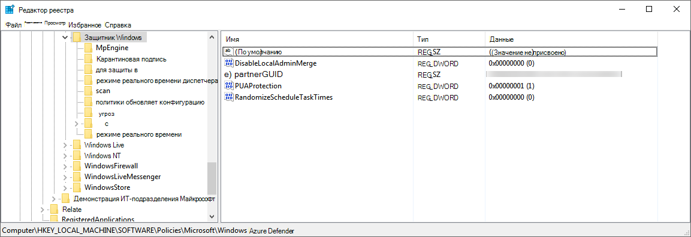

   > [!NOTE]
   > <span data-ttu-id="35343-373">Кроме того, необходимо убедиться, что wdfilter.sys и wdboot.sys по умолчанию устанавливаются значения старта по умолчанию в "0".</span><span class="sxs-lookup"><span data-stu-id="35343-373">In addition, you must ensure that wdfilter.sys and wdboot.sys are set to their default start values of "0".</span></span>
   >
   > - `<Key Path="SYSTEM\CurrentControlSet\Services\WdBoot"><KeyValue Value="0" ValueKind="DWord" Name="Start"/></Key>`
   > - `<Key Path="SYSTEM\CurrentControlSet\Services\WdFilter"><KeyValue Value="0" ValueKind="DWord" Name="Start"/></Key>`

## <a name="troubleshoot-onboarding-issues-on-a-server"></a><span data-ttu-id="35343-374">Устранение неполадок при наладке на сервере</span><span class="sxs-lookup"><span data-stu-id="35343-374">Troubleshoot onboarding issues on a server</span></span>

<span data-ttu-id="35343-375">Если при найме на сервер возникнут проблемы, пройдите следующие действия по проверке, чтобы решить возможные проблемы.</span><span class="sxs-lookup"><span data-stu-id="35343-375">If you encounter issues while onboarding a server, go through the following verification steps to address possible issues.</span></span>

- [<span data-ttu-id="35343-376">Убедитесь, что агент мониторинга Майкрософт (MMA) установлен и настроен для передачи данных датчиков в службу</span><span class="sxs-lookup"><span data-stu-id="35343-376">Ensure Microsoft Monitoring Agent (MMA) is installed and configured to report sensor data to the service</span></span>](configure-server-endpoints.md#server-mma)
- [<span data-ttu-id="35343-377">Убедитесь, что параметры прокси-сервера и подключения к Интернету настроены правильно</span><span class="sxs-lookup"><span data-stu-id="35343-377">Ensure that the server proxy and Internet connectivity settings are configured properly</span></span>](configure-server-endpoints.md#server-proxy)

<span data-ttu-id="35343-378">Также может потребоваться проверить следующее:</span><span class="sxs-lookup"><span data-stu-id="35343-378">You might also need to check the following:</span></span>

- <span data-ttu-id="35343-379">Убедитесь, что на вкладке **Processes** в диспетчере задач работает служба Защитника Майкрософт для **конечных точек.**</span><span class="sxs-lookup"><span data-stu-id="35343-379">Check that there is a Microsoft Defender for Endpoint Service running in the **Processes** tab in **Task Manager**.</span></span> <span data-ttu-id="35343-380">Пример.</span><span class="sxs-lookup"><span data-stu-id="35343-380">For example:</span></span>

    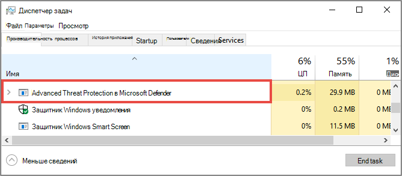

- <span data-ttu-id="35343-382">Проверьте **диспетчер операций** для просмотра событий и журналов служб, чтобы узнать, есть  >    >   ли какие-либо ошибки.</span><span class="sxs-lookup"><span data-stu-id="35343-382">Check **Event Viewer** > **Applications and Services Logs** > **Operation Manager** to see if there are any errors.</span></span>

- <span data-ttu-id="35343-383">В **Службах** проверьте, работает ли **агент мониторинга Майкрософт** на сервере.</span><span class="sxs-lookup"><span data-stu-id="35343-383">In **Services**, check if the **Microsoft Monitoring Agent** is running on the server.</span></span> <span data-ttu-id="35343-384">Пример.</span><span class="sxs-lookup"><span data-stu-id="35343-384">For example,</span></span>

    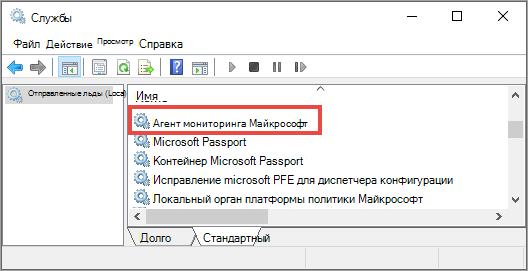

- <span data-ttu-id="35343-386">В **microsoft Monitoring Agent** Azure Log  >  **Analytics (OMS)** проверьте рабочее пространство и убедитесь, что состояние запущено.</span><span class="sxs-lookup"><span data-stu-id="35343-386">In **Microsoft Monitoring Agent** > **Azure Log Analytics (OMS)**, check the Workspaces and verify that the status is running.</span></span>

    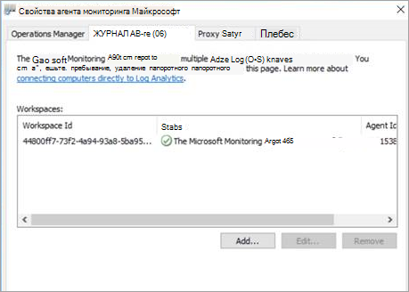

- <span data-ttu-id="35343-388">Убедитесь, что устройства отражаются в списке **Устройств** на портале.</span><span class="sxs-lookup"><span data-stu-id="35343-388">Check to see that devices are reflected in the **Devices list** in the portal.</span></span>

## <a name="confirming-onboarding-of-newly-built-devices"></a><span data-ttu-id="35343-389">Подтверждение onboarding недавно построенных устройств</span><span class="sxs-lookup"><span data-stu-id="35343-389">Confirming onboarding of newly built devices</span></span>

<span data-ttu-id="35343-390">Могут быть случаи, когда бортовая развертывание разворачивается на недавно построенном устройстве, но не завершено.</span><span class="sxs-lookup"><span data-stu-id="35343-390">There may be instances when onboarding is deployed on a newly built device but not completed.</span></span>

<span data-ttu-id="35343-391">Ниже приведены инструкции по следующему сценарию:</span><span class="sxs-lookup"><span data-stu-id="35343-391">The steps below provide guidance for the following scenario:</span></span>

- <span data-ttu-id="35343-392">Пакет onboarding развертывается на недавно созданных устройствах</span><span class="sxs-lookup"><span data-stu-id="35343-392">Onboarding package is deployed to newly built devices</span></span>
- <span data-ttu-id="35343-393">Датчик не начинается из-за того, что интерфейс out-of-box (OOBE) или первый логотип пользователя еще не завершен.</span><span class="sxs-lookup"><span data-stu-id="35343-393">Sensor does not start because the Out-of-box experience (OOBE) or first user logon has not been completed</span></span>
- <span data-ttu-id="35343-394">Устройство выключено или перезапущено до выполнения конечным пользователем первого логотипа</span><span class="sxs-lookup"><span data-stu-id="35343-394">Device is turned off or restarted before the end user performs a first logon</span></span>
- <span data-ttu-id="35343-395">В этом сценарии служба SENSE не будет автоматически запускаться, даже если развернуты бортовые пакеты</span><span class="sxs-lookup"><span data-stu-id="35343-395">In this scenario, the SENSE service will not start automatically even though onboarding package was deployed</span></span>

> [!NOTE]
> <span data-ttu-id="35343-396">Следующие действия актуальны только при использовании Microsoft Endpoint Configuration Manager.</span><span class="sxs-lookup"><span data-stu-id="35343-396">The following steps are only relevant when using Microsoft Endpoint Configuration Manager.</span></span> <span data-ttu-id="35343-397">Дополнительные сведения о настройке с помощью Microsoft Endpoint Configuration Manager см. в [материале Microsoft Defender for Endpoint.](https://docs.microsoft.com/mem/configmgr/protect/deploy-use/windows-defender-advanced-threat-protection)</span><span class="sxs-lookup"><span data-stu-id="35343-397">For more details about onboarding using Microsoft Endpoint Configuration Manager, see [Microsoft Defender for Endpoint](https://docs.microsoft.com/mem/configmgr/protect/deploy-use/windows-defender-advanced-threat-protection).</span></span>

1. <span data-ttu-id="35343-398">Создание приложения в Microsoft Endpoint Configuration Manager.</span><span class="sxs-lookup"><span data-stu-id="35343-398">Create an application in Microsoft Endpoint Configuration Manager.</span></span>

    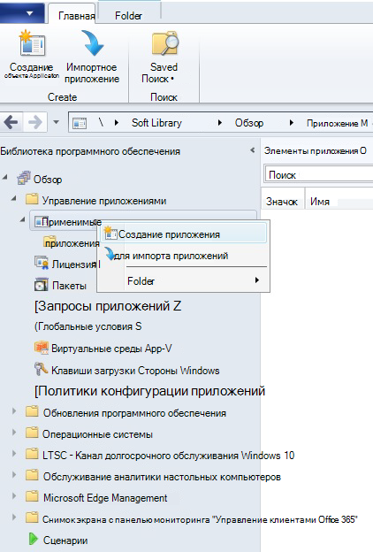

2. <span data-ttu-id="35343-400">Выберите **вручную указать сведения о приложении.**</span><span class="sxs-lookup"><span data-stu-id="35343-400">Select **Manually specify the application information**.</span></span>

    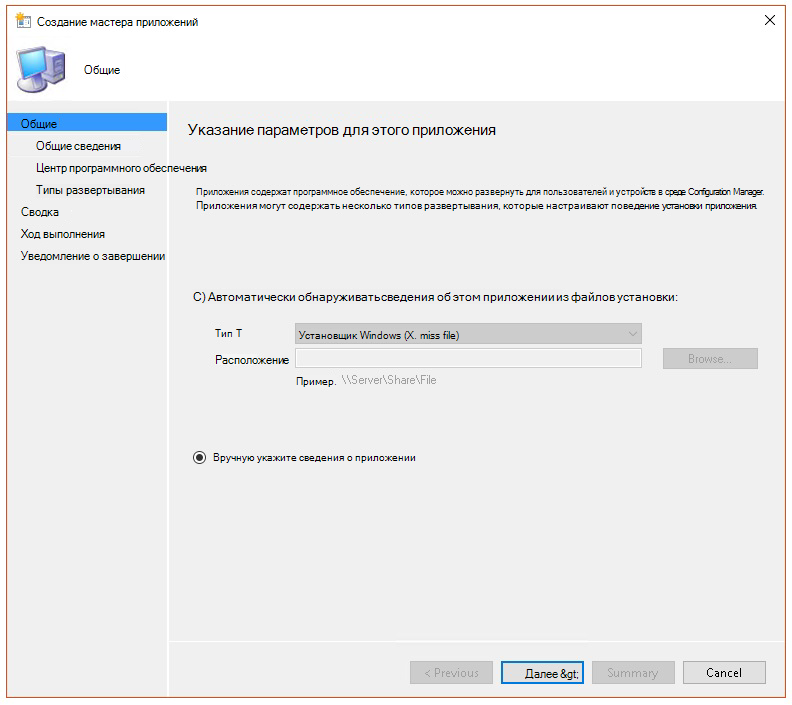

3. <span data-ttu-id="35343-402">Укажите сведения о приложении, а затем выберите **Далее**.</span><span class="sxs-lookup"><span data-stu-id="35343-402">Specify information about the application, then select **Next**.</span></span>

    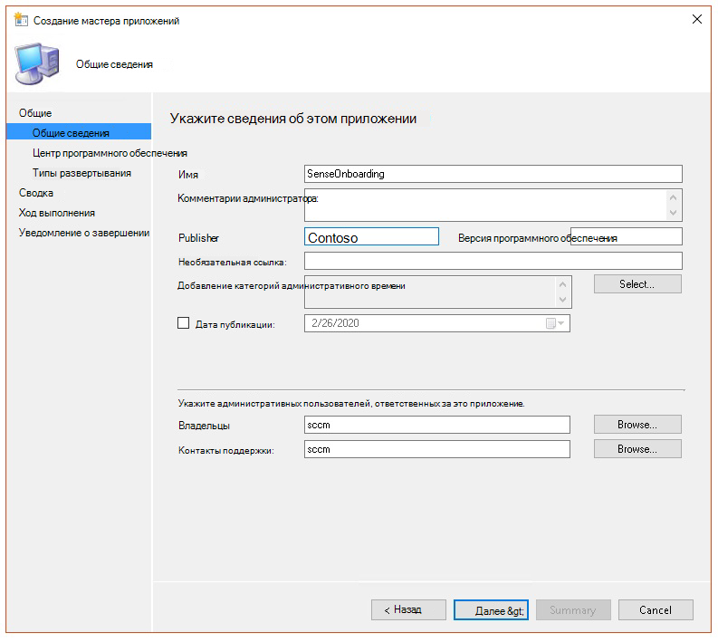

4. <span data-ttu-id="35343-404">Укажите сведения о центре программного обеспечения, а затем выберите **Далее**.</span><span class="sxs-lookup"><span data-stu-id="35343-404">Specify information about the software center, then select **Next**.</span></span>

    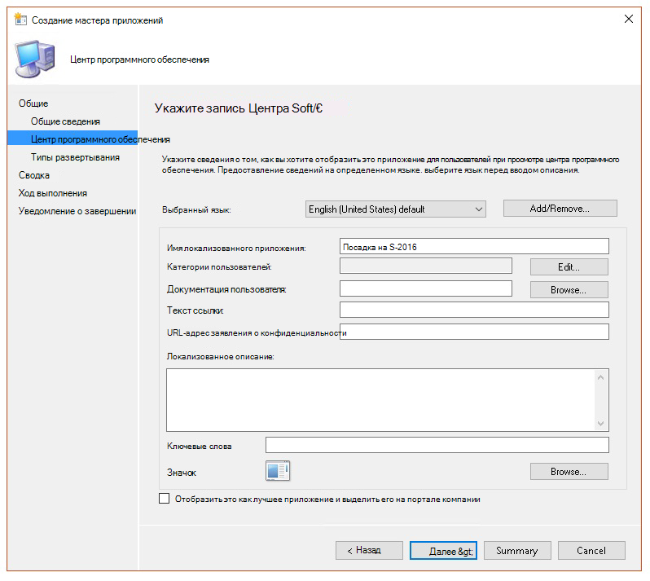

5. <span data-ttu-id="35343-406">В **типах развертывания** выберите **Добавить**.</span><span class="sxs-lookup"><span data-stu-id="35343-406">In **Deployment types** select **Add**.</span></span>

    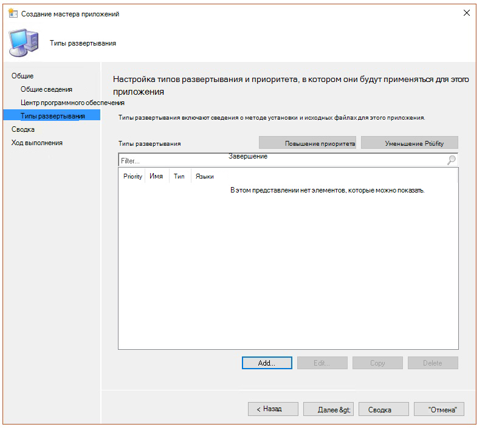

6. <span data-ttu-id="35343-408">Выберите **вручную указать сведения о типе развертывания,** а затем выберите **Далее**.</span><span class="sxs-lookup"><span data-stu-id="35343-408">Select **Manually specify the deployment type information**, then select **Next**.</span></span>

    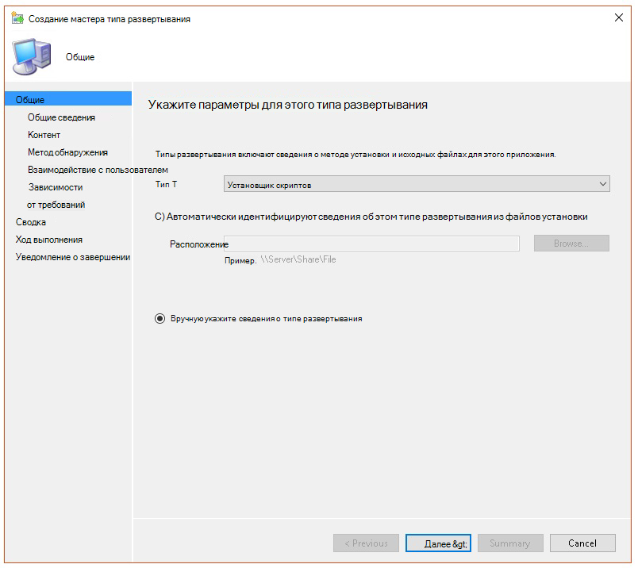

7. <span data-ttu-id="35343-410">Укажите сведения о типе развертывания, а затем выберите **Далее**.</span><span class="sxs-lookup"><span data-stu-id="35343-410">Specify information about the deployment type, then select **Next**.</span></span>

    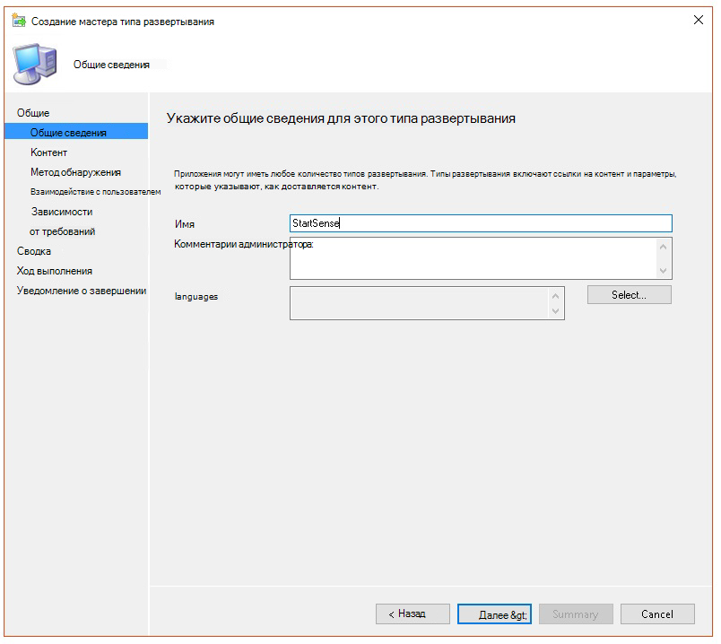

8. <span data-ttu-id="35343-412">В **программе установки**  >  **контента** укажите команду: `net start sense` .</span><span class="sxs-lookup"><span data-stu-id="35343-412">In **Content** > **Installation program** specify the command: `net start sense`.</span></span>

    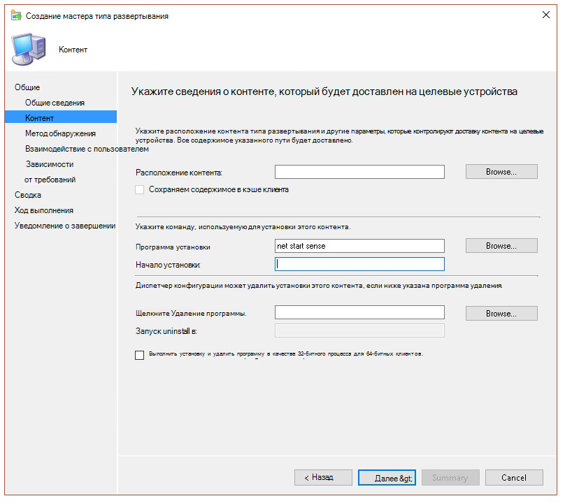

9. <span data-ttu-id="35343-414">В **методе Detection** выберите **Настройка правил для обнаружения** присутствия этого типа развертывания, а затем выберите **Добавить клаузула**.</span><span class="sxs-lookup"><span data-stu-id="35343-414">In **Detection method**, select **Configure rules to detect the presence of this deployment type**, then select **Add Clause**.</span></span>

    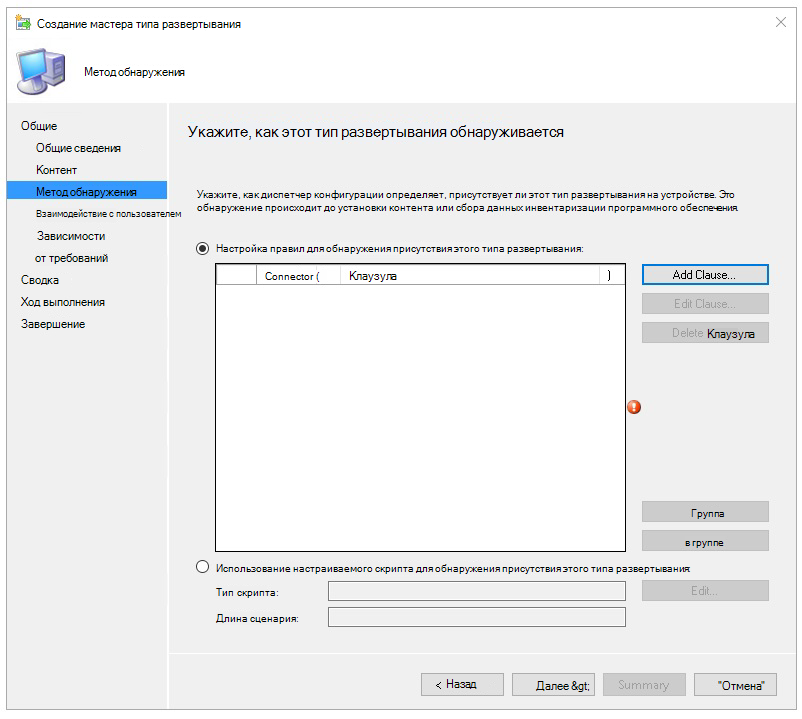

10. <span data-ttu-id="35343-416">Укажите следующие сведения об обнаружении, а затем выберите **ОК:**</span><span class="sxs-lookup"><span data-stu-id="35343-416">Specify the following detection rule details, then select **OK**:</span></span>

    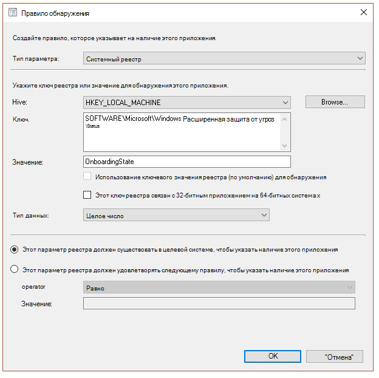

11. <span data-ttu-id="35343-418">В **методе Обнаружения** выберите **Далее**.</span><span class="sxs-lookup"><span data-stu-id="35343-418">In **Detection method** select **Next**.</span></span>

    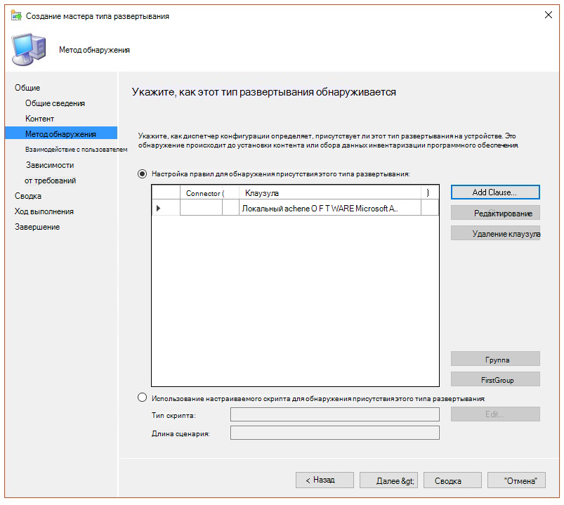

12. <span data-ttu-id="35343-420">В **пользовательском интерфейсе** укажите следующие сведения, а затем выберите **Далее:**</span><span class="sxs-lookup"><span data-stu-id="35343-420">In **User Experience**, specify the following information, then select **Next**:</span></span>

    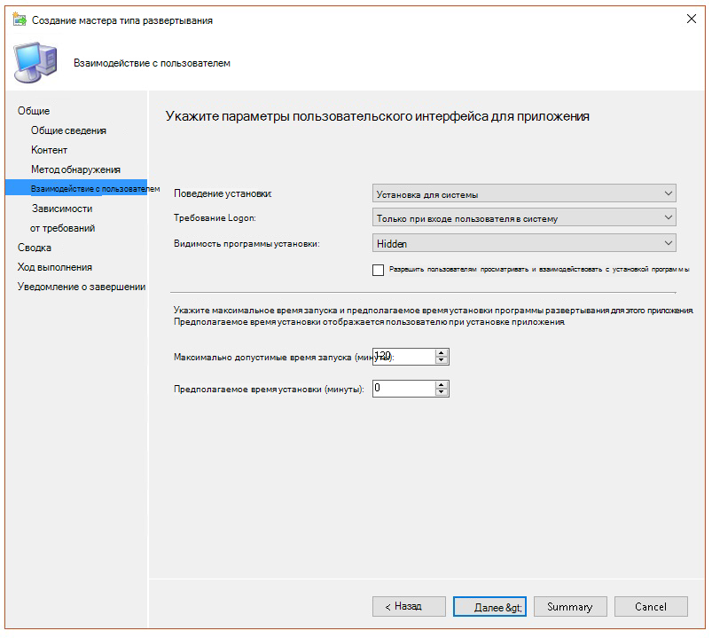

13. <span data-ttu-id="35343-422">В **"Требованиях"** выберите **Далее**.</span><span class="sxs-lookup"><span data-stu-id="35343-422">In **Requirements**, select **Next**.</span></span>

    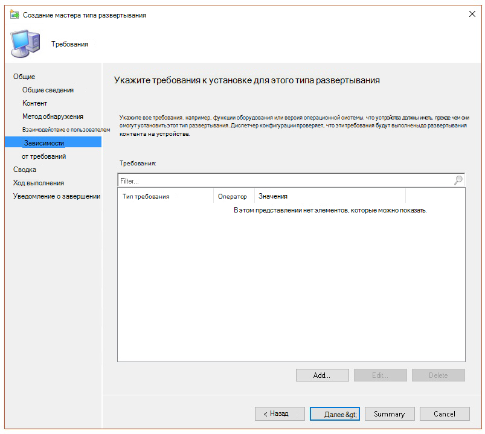

14. <span data-ttu-id="35343-424">В **зависимости выберите** **Далее**.</span><span class="sxs-lookup"><span data-stu-id="35343-424">In **Dependencies**, select **Next**.</span></span>

    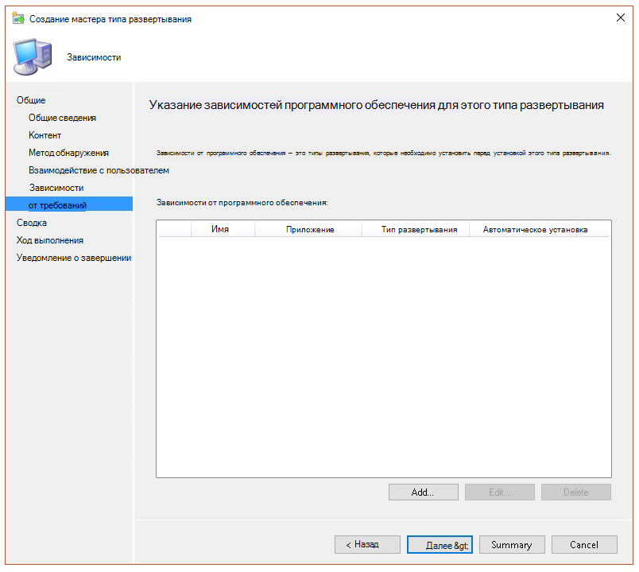

15. <span data-ttu-id="35343-426">В **сводке** выберите **Далее**.</span><span class="sxs-lookup"><span data-stu-id="35343-426">In **Summary**, select **Next**.</span></span>

    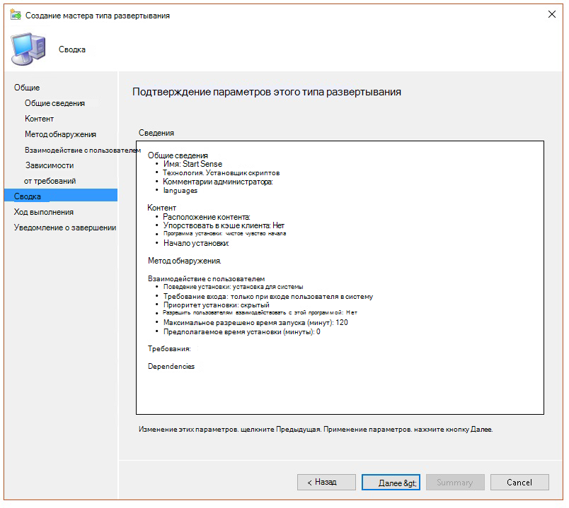

16. <span data-ttu-id="35343-428">В **завершение** выберите **Закрыть**.</span><span class="sxs-lookup"><span data-stu-id="35343-428">In **Completion**, select **Close**.</span></span>

    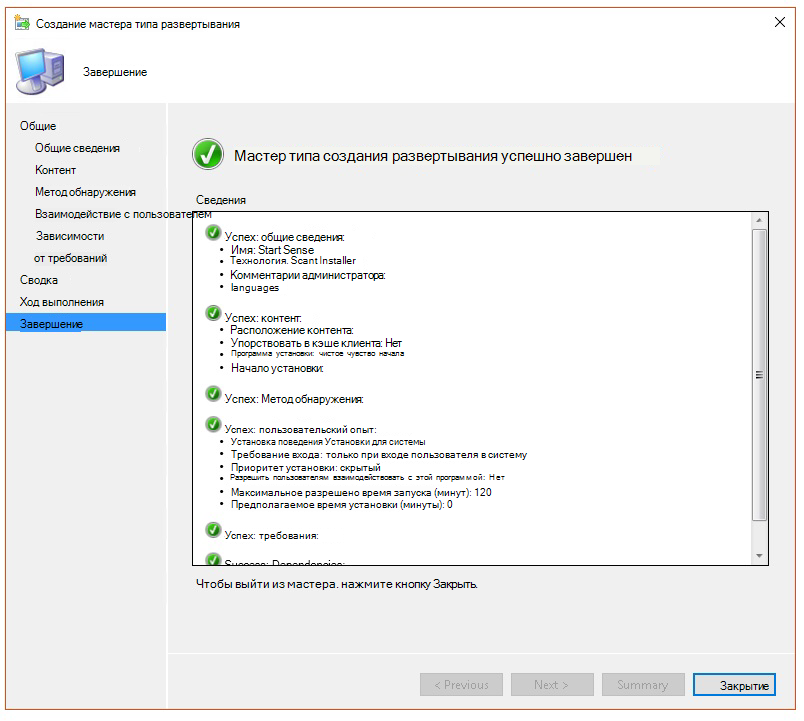

17. <span data-ttu-id="35343-430">В **типах развертывания** выберите **Далее**.</span><span class="sxs-lookup"><span data-stu-id="35343-430">In **Deployment types**, select **Next**.</span></span>

    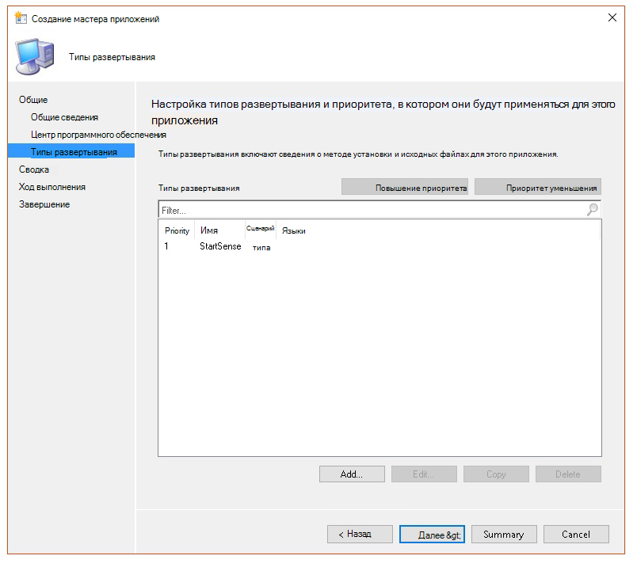

18. <span data-ttu-id="35343-432">В **сводке** выберите **Далее**.</span><span class="sxs-lookup"><span data-stu-id="35343-432">In **Summary**, select **Next**.</span></span>

    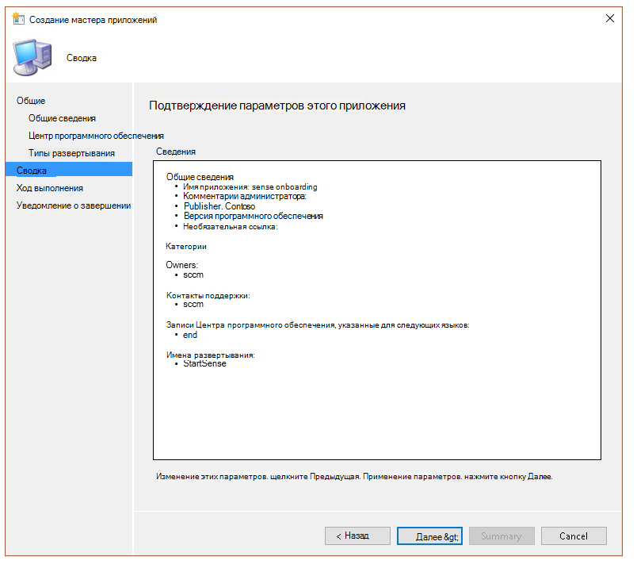

    <span data-ttu-id="35343-434">Затем отображается состояние: 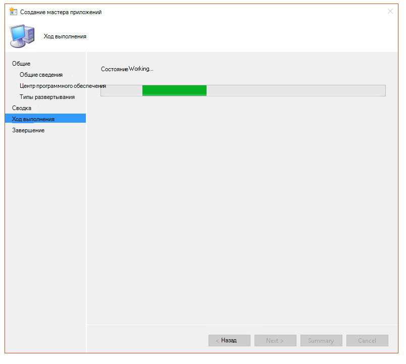</span><span class="sxs-lookup"><span data-stu-id="35343-434">The status is then displayed: </span></span>

19. <span data-ttu-id="35343-435">В **завершение** выберите **Закрыть**.</span><span class="sxs-lookup"><span data-stu-id="35343-435">In **Completion**, select **Close**.</span></span>

    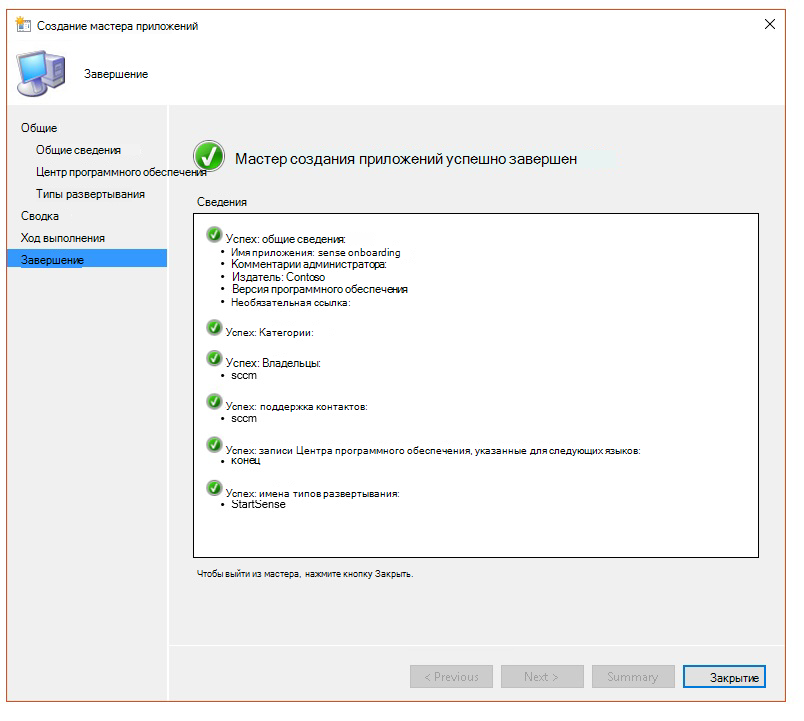

20. <span data-ttu-id="35343-437">Теперь вы можете развернуть приложение, щелкнув приложение правой кнопкой мыши и выбрав **Развертывание.**</span><span class="sxs-lookup"><span data-stu-id="35343-437">You can now deploy the application by right-clicking the app and selecting **Deploy**.</span></span>

    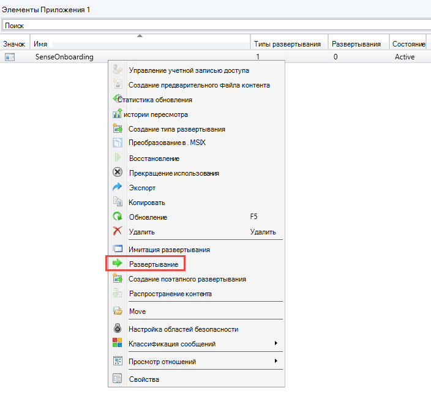

21. <span data-ttu-id="35343-439">В **общем** выберите **автоматически распространять контент для зависимостей и** **просматривать**.</span><span class="sxs-lookup"><span data-stu-id="35343-439">In **General** select **Automatically distribute content for dependencies** and **Browse**.</span></span>

    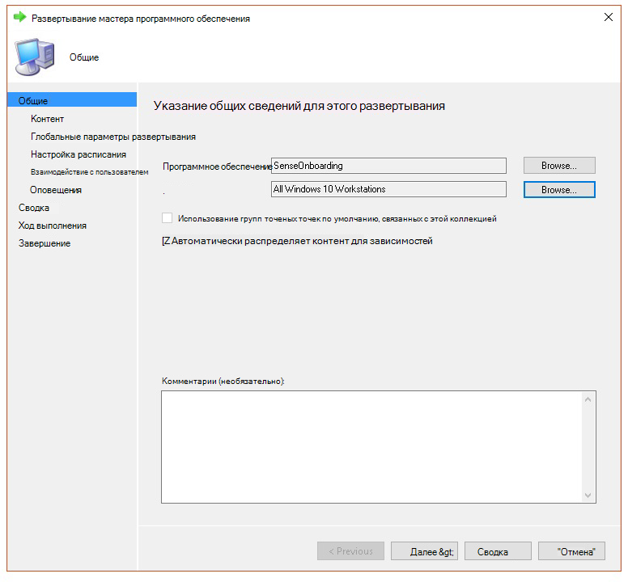

22. <span data-ttu-id="35343-441">В **контенте** выберите **Далее**.</span><span class="sxs-lookup"><span data-stu-id="35343-441">In **Content** select **Next**.</span></span>

    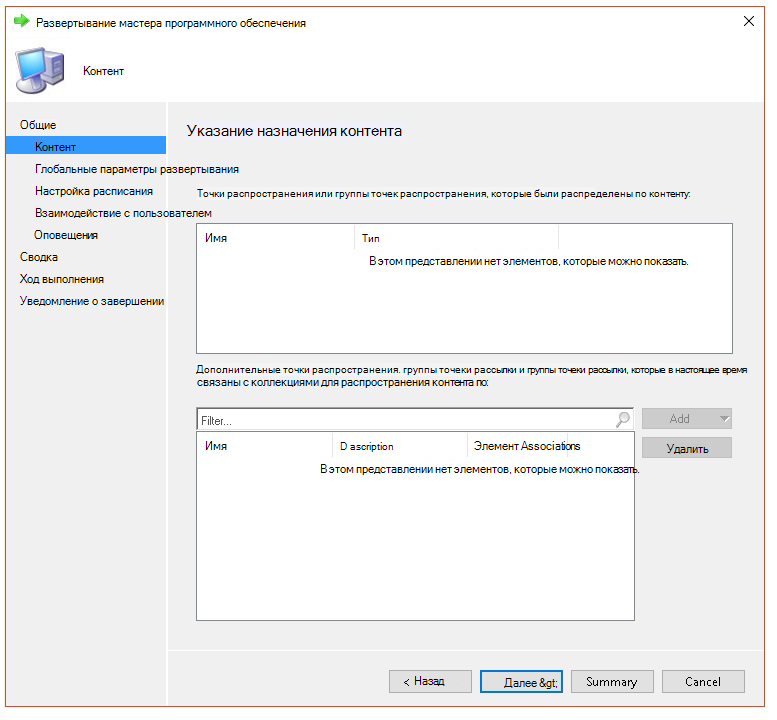

23. <span data-ttu-id="35343-443">В **параметрах развертывания** выберите **Далее**.</span><span class="sxs-lookup"><span data-stu-id="35343-443">In **Deployment settings**, select **Next**.</span></span>

    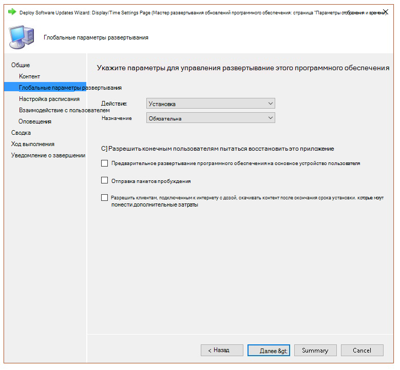

24. <span data-ttu-id="35343-445">В **планировании** выберите как можно скорее **после доступного времени,** а затем выберите **Далее**.</span><span class="sxs-lookup"><span data-stu-id="35343-445">In **Scheduling** select **As soon as possible after the available time**, then select **Next**.</span></span>

    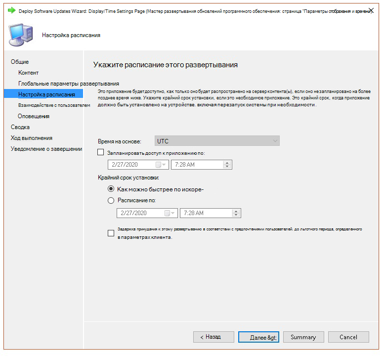

25. <span data-ttu-id="35343-447">В **пользовательских интерфейсах** выберите **Изменения фиксации** в крайний срок или во время окна обслуживания (требуется перезапуск) и выберите **Далее**.</span><span class="sxs-lookup"><span data-stu-id="35343-447">In **User experience**, select **Commit changes at deadline or during a maintenance window (requires restarts)**, then select **Next**.</span></span>

    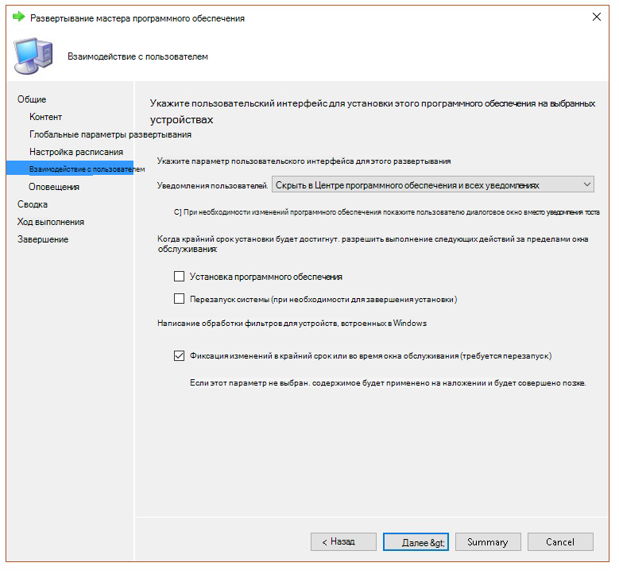

26. <span data-ttu-id="35343-449">В **оповещении** выберите **Далее**.</span><span class="sxs-lookup"><span data-stu-id="35343-449">In **Alerts** select **Next**.</span></span>

    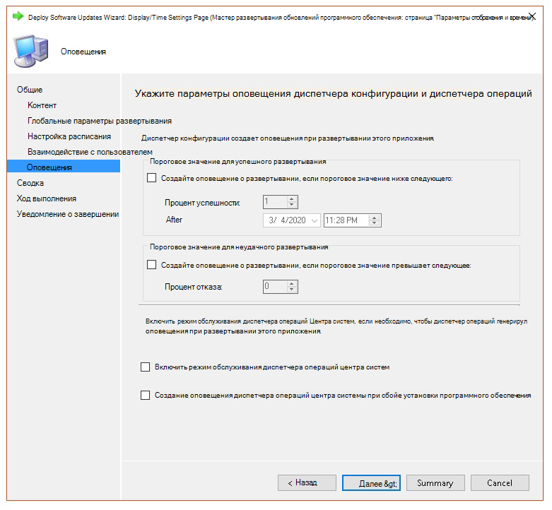

27. <span data-ttu-id="35343-451">В **сводке** выберите **Далее**.</span><span class="sxs-lookup"><span data-stu-id="35343-451">In **Summary**, select **Next**.</span></span>

    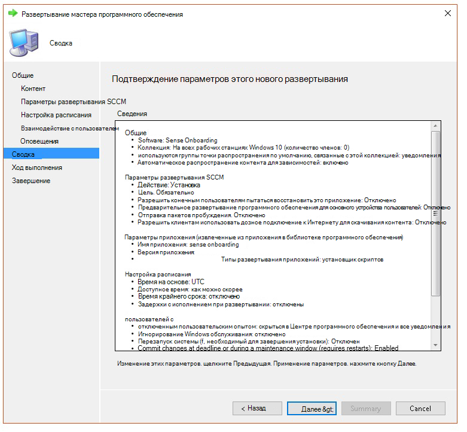

    <span data-ttu-id="35343-453">Затем в состоянии отображается 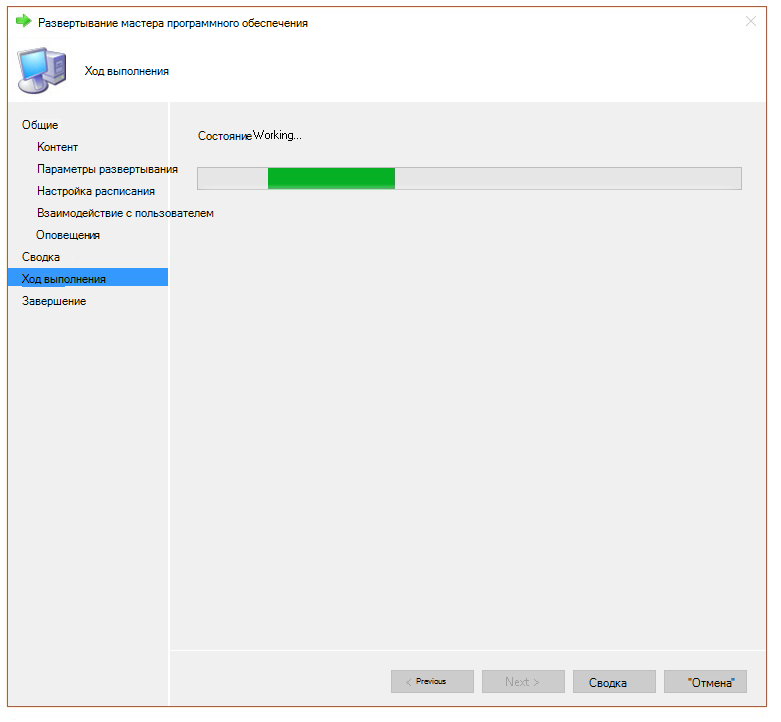</span><span class="sxs-lookup"><span data-stu-id="35343-453">The status is then displayed </span></span>

28. <span data-ttu-id="35343-454">В **завершение** выберите **Закрыть**.</span><span class="sxs-lookup"><span data-stu-id="35343-454">In **Completion**, select **Close**.</span></span>

    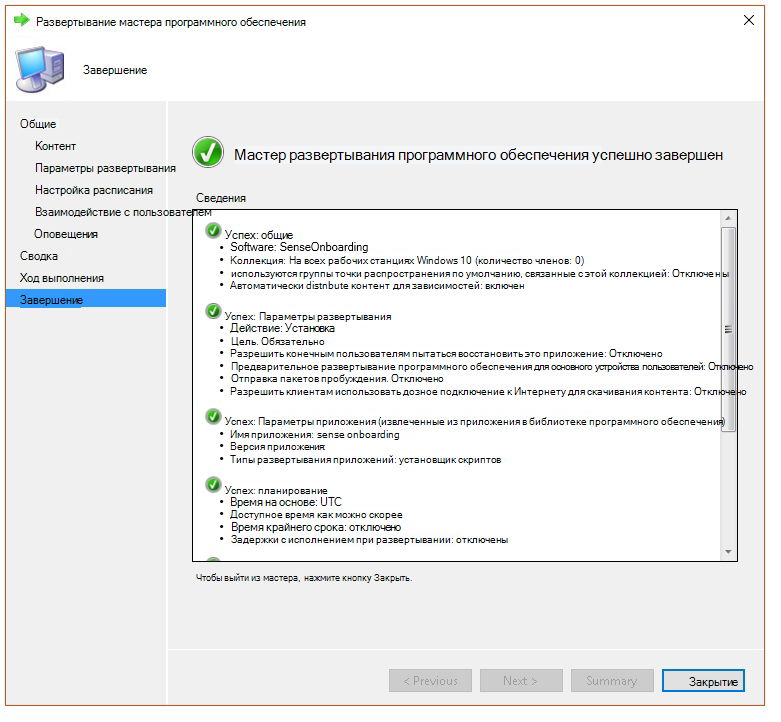


## <a name="related-topics"></a><span data-ttu-id="35343-456">Статьи по теме</span><span class="sxs-lookup"><span data-stu-id="35343-456">Related topics</span></span>

- [<span data-ttu-id="35343-457">Устранение неполадок Microsoft Defender для конечной точки</span><span class="sxs-lookup"><span data-stu-id="35343-457">Troubleshoot Microsoft Defender for Endpoint</span></span>](troubleshoot-mdatp.md)
- [<span data-ttu-id="35343-458">Бортовых устройств</span><span class="sxs-lookup"><span data-stu-id="35343-458">Onboard devices</span></span>](onboard-configure.md)
- [<span data-ttu-id="35343-459">Настройка параметров прокси-сервера устройства и подключения к Интернету</span><span class="sxs-lookup"><span data-stu-id="35343-459">Configure device proxy and Internet connectivity settings</span></span>](configure-proxy-internet.md)
