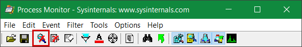
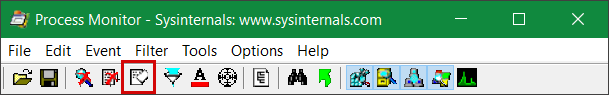
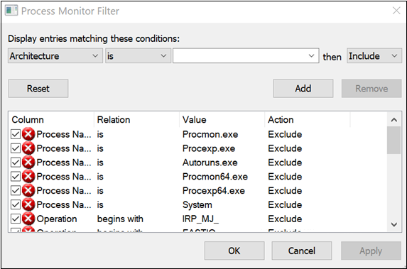
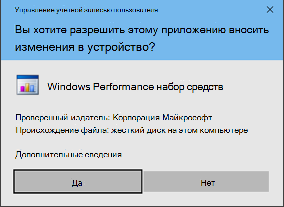
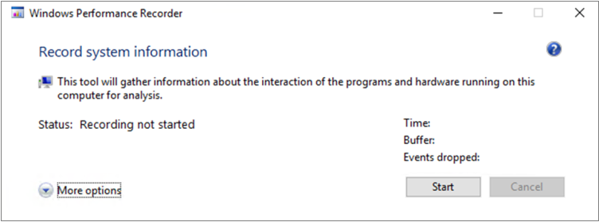
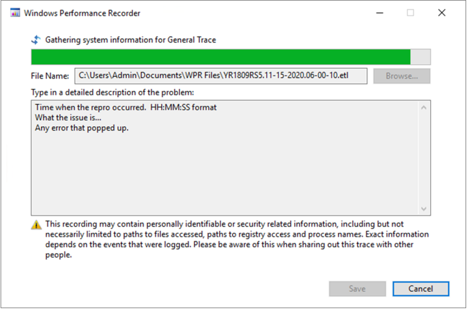

# <a name="troubleshoot-performance-issues-related-to-real-time-protection"></a><span data-ttu-id="5a3cd-104">Устранение неполадок, связанных с защитой в режиме реального времени</span><span class="sxs-lookup"><span data-stu-id="5a3cd-104">Troubleshoot performance issues related to real-time protection</span></span>


[!INCLUDE [Microsoft 365 Defender rebranding](../../includes/microsoft-defender.md)]


<span data-ttu-id="5a3cd-105">**Область применения:**</span><span class="sxs-lookup"><span data-stu-id="5a3cd-105">**Applies to:**</span></span>

- [<span data-ttu-id="5a3cd-106">Microsoft Defender для конечной точки</span><span class="sxs-lookup"><span data-stu-id="5a3cd-106">Microsoft Defender for Endpoint</span></span>](https://go.microsoft.com/fwlink/p/?linkid=2146631)
 
<span data-ttu-id="5a3cd-107">Если у вашей системы высокие показатели использования ЦП или производительности, связанные со службой защиты в режиме реального времени в Microsoft Defender для конечной точки, вы можете отправить билет в службу поддержки Майкрософт.</span><span class="sxs-lookup"><span data-stu-id="5a3cd-107">If your system is having high CPU usage or performance issues related to the real-time protection service in Microsoft Defender for Endpoint, you can submit a ticket to Microsoft support.</span></span> <span data-ttu-id="5a3cd-108">Выполните действия в [области сбора диагностических данных Microsoft Defender AV.](/collect-diagnostic-data.md)</span><span class="sxs-lookup"><span data-stu-id="5a3cd-108">Follow the steps in [Collect Microsoft Defender AV diagnostic data](/collect-diagnostic-data.md).</span></span>

<span data-ttu-id="5a3cd-109">В качестве администратора вы также можете устранить эти проблемы самостоятельно.</span><span class="sxs-lookup"><span data-stu-id="5a3cd-109">As an admin, you can also troubleshoot these issues on your own.</span></span> 

<span data-ttu-id="5a3cd-110">Во-первых, может потребоваться проверить, вызвана ли проблема другим программным обеспечением.</span><span class="sxs-lookup"><span data-stu-id="5a3cd-110">First, you might want to check if the issue is being caused by another software.</span></span> <span data-ttu-id="5a3cd-111">Ознакомьтесь [с проверкой поставщиков исключений антивирусов.](#check-with-vendor-for-antivirus-exclusions)</span><span class="sxs-lookup"><span data-stu-id="5a3cd-111">Read [Check with vendor for antivirus exclusions](#check-with-vendor-for-antivirus-exclusions).</span></span>

<span data-ttu-id="5a3cd-112">В противном случае можно определить, какое программное обеспечение связано с выявленной проблемой производительности, следуя шагам в [журнале Анализ защиты Майкрософт.](#analyze-the-microsoft-protection-log)</span><span class="sxs-lookup"><span data-stu-id="5a3cd-112">Otherwise, you can identify which software is related to the identified performance issue by following the steps in [Analyze the Microsoft Protection Log](#analyze-the-microsoft-protection-log).</span></span> 

<span data-ttu-id="5a3cd-113">Вы также можете предоставить дополнительные журналы для отправки в службу поддержки Майкрософт, следуя следующим шагам:</span><span class="sxs-lookup"><span data-stu-id="5a3cd-113">You can also provide additional logs to your submission to Microsoft support by following the steps in:</span></span>
- [<span data-ttu-id="5a3cd-114">Запись журналов процессов с помощью монитора процесса</span><span class="sxs-lookup"><span data-stu-id="5a3cd-114">Capture process logs using Process Monitor</span></span>](#capture-process-logs-using-process-monitor)
- [<span data-ttu-id="5a3cd-115">Запись журналов производительности с помощью регистратора производительности Windows</span><span class="sxs-lookup"><span data-stu-id="5a3cd-115">Capture performance logs using Windows Performance Recorder</span></span>](#capture-performance-logs-using-windows-performance-recorder) 

## <a name="check-with-vendor-for-antivirus-exclusions"></a><span data-ttu-id="5a3cd-116">Узнайте у поставщика об исключениях антивирусов</span><span class="sxs-lookup"><span data-stu-id="5a3cd-116">Check with vendor for antivirus exclusions</span></span>

<span data-ttu-id="5a3cd-117">Если вы можете легко определить программное обеспечение, влияющие на производительность системы, перейдите в базу знаний поставщика программного обеспечения или центр поддержки.</span><span class="sxs-lookup"><span data-stu-id="5a3cd-117">If you can readily identify the software affecting system performance, go to the software vendor's knowledge base or support center.</span></span> <span data-ttu-id="5a3cd-118">Поиск, если у них есть рекомендации по исключениям антивирусов.</span><span class="sxs-lookup"><span data-stu-id="5a3cd-118">Search if they have recommendations about antivirus exclusions.</span></span> <span data-ttu-id="5a3cd-119">Если на веб-сайте поставщика нет их, вы можете открыть с ними билет поддержки и попросить его опубликовать.</span><span class="sxs-lookup"><span data-stu-id="5a3cd-119">If the vendor's website does not have them, you can open a support ticket with them and ask them to publish one.</span></span> 

<span data-ttu-id="5a3cd-120">Мы рекомендуем поставщикам программного обеспечения следовать различным рекомендациям в партнерстве с отраслью, чтобы свести к минимуму [ложные срабатывания.](https://www.microsoft.com/security/blog/2018/08/16/partnering-with-the-industry-to-minimize-false-positives/)</span><span class="sxs-lookup"><span data-stu-id="5a3cd-120">We recommend that software vendors follow the various guidelines in [Partnering with the industry to minimize false positives](https://www.microsoft.com/security/blog/2018/08/16/partnering-with-the-industry-to-minimize-false-positives/).</span></span> <span data-ttu-id="5a3cd-121">Поставщик может отправить свое программное обеспечение через [портал Microsoft Defender Security Intelligence (MDSI).](https://www.microsoft.com/wdsi/filesubmission?persona=SoftwareDeveloper)</span><span class="sxs-lookup"><span data-stu-id="5a3cd-121">The vendor can submit their software through the [Microsoft Defender Security Intelligence portal (MDSI)](https://www.microsoft.com/wdsi/filesubmission?persona=SoftwareDeveloper).</span></span>


## <a name="analyze-the-microsoft-protection-log"></a><span data-ttu-id="5a3cd-122">Анализ журнала microsoft Protection</span><span class="sxs-lookup"><span data-stu-id="5a3cd-122">Analyze the Microsoft Protection Log</span></span>

<span data-ttu-id="5a3cd-123">В **MPLog-xxxxxxx-xxxxxx.log** вы можете найти сведения о предполагаемом влиянии производительности запущенного программного обеспечения как *EstimatedImpact:*</span><span class="sxs-lookup"><span data-stu-id="5a3cd-123">In **MPLog-xxxxxxxx-xxxxxx.log**, you can find the estimated performance impact information of running software as *EstimatedImpact*:</span></span>
    
`Per-process counts:ProcessImageName: smsswd.exe, TotalTime: 6597, Count: 1406, MaxTime: 609, MaxTimeFile: \Device\HarddiskVolume3\_SMSTaskSequence\Packages\WQ1008E9\Files\FramePkg.exe, EstimatedImpact: 65%`

| <span data-ttu-id="5a3cd-124">Имя поля</span><span class="sxs-lookup"><span data-stu-id="5a3cd-124">Field name</span></span> | <span data-ttu-id="5a3cd-125">Описание</span><span class="sxs-lookup"><span data-stu-id="5a3cd-125">Description</span></span> |
|---|---|
|<span data-ttu-id="5a3cd-126">ProcessImageName</span><span class="sxs-lookup"><span data-stu-id="5a3cd-126">ProcessImageName</span></span>   | <span data-ttu-id="5a3cd-127">Имя изображения процесса</span><span class="sxs-lookup"><span data-stu-id="5a3cd-127">Process image name</span></span> |
| <span data-ttu-id="5a3cd-128">TotalTime</span><span class="sxs-lookup"><span data-stu-id="5a3cd-128">TotalTime</span></span> | <span data-ttu-id="5a3cd-129">Совокупная продолжительность миллисекунд, затраченных на сканирование файлов, доступных в этом процессе</span><span class="sxs-lookup"><span data-stu-id="5a3cd-129">The cumulative duration in milliseconds spent in scans of files accessed by this process</span></span> |
|<span data-ttu-id="5a3cd-130">Count</span><span class="sxs-lookup"><span data-stu-id="5a3cd-130">Count</span></span> | <span data-ttu-id="5a3cd-131">Количество отсканированных файлов, доступных в этом процессе</span><span class="sxs-lookup"><span data-stu-id="5a3cd-131">The number of scanned files accessed by this process</span></span> |
|<span data-ttu-id="5a3cd-132">MaxTime</span><span class="sxs-lookup"><span data-stu-id="5a3cd-132">MaxTime</span></span> |  <span data-ttu-id="5a3cd-133">Продолжительность в миллисекунд в самом длинном одном сканировании файла, доступного в этом процессе</span><span class="sxs-lookup"><span data-stu-id="5a3cd-133">The duration in milliseconds in the longest single scan of a file accessed by this process</span></span> |
| <span data-ttu-id="5a3cd-134">MaxTimeFile</span><span class="sxs-lookup"><span data-stu-id="5a3cd-134">MaxTimeFile</span></span> | <span data-ttu-id="5a3cd-135">Путь файла, доступ к которому был зафиксирован в этом процессе, для которого было записано самое длительное `MaxTime` сканирование</span><span class="sxs-lookup"><span data-stu-id="5a3cd-135">The path of the file accessed by this process for which the longest scan of `MaxTime` duration was recorded</span></span> |
| <span data-ttu-id="5a3cd-136">EstimatedImpact</span><span class="sxs-lookup"><span data-stu-id="5a3cd-136">EstimatedImpact</span></span> | <span data-ttu-id="5a3cd-137">Процент времени, затраченного на сканирование файлов, доступных в этом процессе, за период, в течение которого этот процесс испытывал активность сканирования.</span><span class="sxs-lookup"><span data-stu-id="5a3cd-137">The percentage of time spent in scans for files accessed by this process out of the period in which this process experienced scan activity</span></span> |

<span data-ttu-id="5a3cd-138">Если производительность высока, попробуйте добавить процесс в исключения Path/Process, следуя шагам в Настройка и проверка исключений для антивирусных сканов [Microsoft Defender.](collect-diagnostic-data.md)</span><span class="sxs-lookup"><span data-stu-id="5a3cd-138">If the performance impact is high, try adding the process to the Path/Process exclusions by following the steps in [Configure and validate exclusions for Microsoft Defender Antivirus scans](collect-diagnostic-data.md).</span></span>

<span data-ttu-id="5a3cd-139">Если предыдущий шаг не решает проблему, можно собирать [](#capture-process-logs-using-process-monitor) дополнительные сведения через монитор процесса или [регистратор](#capture-performance-logs-using-windows-performance-recorder) производительности Windows в следующих разделах.</span><span class="sxs-lookup"><span data-stu-id="5a3cd-139">If the previous step doesn't solve the problem, you can collect more information through the [Process Monitor](#capture-process-logs-using-process-monitor) or the [Windows Performance Recorder](#capture-performance-logs-using-windows-performance-recorder) in the following sections.</span></span> 
     
## <a name="capture-process-logs-using-process-monitor"></a><span data-ttu-id="5a3cd-140">Запись журналов процессов с помощью монитора процесса</span><span class="sxs-lookup"><span data-stu-id="5a3cd-140">Capture process logs using Process Monitor</span></span>

<span data-ttu-id="5a3cd-141">Process Monitor (ProcMon) — это расширенный инструмент мониторинга, который может показывать процессы в режиме реального времени.</span><span class="sxs-lookup"><span data-stu-id="5a3cd-141">Process Monitor (ProcMon) is an advanced monitoring tool that can show real-time processes.</span></span> <span data-ttu-id="5a3cd-142">С помощью этого можно зафиксировать проблему производительности по мере ее выполнения.</span><span class="sxs-lookup"><span data-stu-id="5a3cd-142">You can use this to capture the performance issue as it is occurring.</span></span> 

1. <span data-ttu-id="5a3cd-143">Загрузка [монитора процесса v3.60](/sysinternals/downloads/procmon) в папку типа `C:\temp` .</span><span class="sxs-lookup"><span data-stu-id="5a3cd-143">Download [Process Monitor v3.60](/sysinternals/downloads/procmon) to a folder like `C:\temp`.</span></span> 

2. <span data-ttu-id="5a3cd-144">Чтобы удалить метку файла в Интернете:</span><span class="sxs-lookup"><span data-stu-id="5a3cd-144">To remove the file's mark of the web:</span></span>
    1. <span data-ttu-id="5a3cd-145">Щелкните **правой кнопкой мышиProcessMonitor.zip** выберите **Свойства**.</span><span class="sxs-lookup"><span data-stu-id="5a3cd-145">Right-click **ProcessMonitor.zip** and select **Properties**.</span></span>
    1. <span data-ttu-id="5a3cd-146">В *вкладке General* и посмотрите на *безопасность.*</span><span class="sxs-lookup"><span data-stu-id="5a3cd-146">Under the *General* tab, look for *Security*.</span></span>
    1. <span data-ttu-id="5a3cd-147">Проверьте поле рядом **с разблокировка**.</span><span class="sxs-lookup"><span data-stu-id="5a3cd-147">Check the box beside **Unblock**.</span></span>
    1. <span data-ttu-id="5a3cd-148">Нажмите **Применить**.</span><span class="sxs-lookup"><span data-stu-id="5a3cd-148">Select **Apply**.</span></span>
    
     

3. <span data-ttu-id="5a3cd-150">Разбей файл `C:\temp` так, чтобы путь папки был `C:\temp\ProcessMonitor` .</span><span class="sxs-lookup"><span data-stu-id="5a3cd-150">Unzip the file in `C:\temp` so that the folder path will be `C:\temp\ProcessMonitor`.</span></span> 

4. <span data-ttu-id="5a3cd-151">**СкопируйтеProcMon.exe** на клиент Windows или сервер Windows, который вы устраняете.</span><span class="sxs-lookup"><span data-stu-id="5a3cd-151">Copy **ProcMon.exe**  to the Windows client or Windows server you're troubleshooting.</span></span>  

5. <span data-ttu-id="5a3cd-152">Перед запуском ProcMon убедитесь, что все другие приложения, не связанные с высокой проблемой использования ЦП, закрыты.</span><span class="sxs-lookup"><span data-stu-id="5a3cd-152">Before running ProcMon, make sure all other applications not related to the high CPU usage issue are closed.</span></span> <span data-ttu-id="5a3cd-153">Это позволит свести к минимуму количество проверок.</span><span class="sxs-lookup"><span data-stu-id="5a3cd-153">Doing this will minimize the number of processes to check.</span></span>

6. <span data-ttu-id="5a3cd-154">Запуск ProcMon можно двумя способами.</span><span class="sxs-lookup"><span data-stu-id="5a3cd-154">You can launch ProcMon in two ways.</span></span>
    1. <span data-ttu-id="5a3cd-155">Щелкните **правой кнопкой мышиProcMon.exe** **выполнить в качестве администратора.**</span><span class="sxs-lookup"><span data-stu-id="5a3cd-155">Right-click **ProcMon.exe** and select **Run as administrator**.</span></span> 
    

        <span data-ttu-id="5a3cd-156">Так как ведение журнала запускается автоматически, выберите значок увеличительное стекло, чтобы остановить текущий захват или использовать клавишу ярлык **Ctrl +E**.</span><span class="sxs-lookup"><span data-stu-id="5a3cd-156">Since logging starts automatically, select the magnifying glass icon  to stop the current capture or use the keyboard shortcut **Ctrl+E**.</span></span>
 
        

        <span data-ttu-id="5a3cd-158">Чтобы убедиться, что вы остановили захват, проверьте, отображается ли значок увеличительного стекла с красным X.</span><span class="sxs-lookup"><span data-stu-id="5a3cd-158">To verify that you have stopped the capture, check if the magnifying glass icon now appears with a red X.</span></span>

                 

        <span data-ttu-id="5a3cd-160">Далее, чтобы очистить предыдущий захват, выберите значок ластик.</span><span class="sxs-lookup"><span data-stu-id="5a3cd-160">Next, to clear the earlier capture, select the eraser icon.</span></span>

        

        <span data-ttu-id="5a3cd-162">Или используйте клавишу ярлык **Ctrl+X**.</span><span class="sxs-lookup"><span data-stu-id="5a3cd-162">Or use the keyboard shortcut **Ctrl+X**.</span></span>

    2. <span data-ttu-id="5a3cd-163">Второй способ — выполнить  командную строку в качестве администратора, а затем с пути Монитор процесса выполнить:</span><span class="sxs-lookup"><span data-stu-id="5a3cd-163">The second way is to run the **command line** as admin, then from the Process Monitor path, run:</span></span>

        
 
        ```console
        Procmon.exe /AcceptEula /Noconnect /Profiling
        ```
        
        >[!TIP] 
        ><span data-ttu-id="5a3cd-165">Сделайте окно ProcMon как можно меньше при захвате данных, чтобы можно было легко запустить и остановить трассировку.</span><span class="sxs-lookup"><span data-stu-id="5a3cd-165">Make the ProcMon window as small as possible when capturing data so you can easily start and stop the trace.</span></span>
        > 
        >
    
7. <span data-ttu-id="5a3cd-167">После одной из процедур на шаге 6 вы увидите возможность установить фильтры.</span><span class="sxs-lookup"><span data-stu-id="5a3cd-167">After following one of the procedures in step 6, you'll next see an option to set filters.</span></span> <span data-ttu-id="5a3cd-168">Нажмите **ОК**.</span><span class="sxs-lookup"><span data-stu-id="5a3cd-168">Select **OK**.</span></span> <span data-ttu-id="5a3cd-169">Вы всегда можете отфильтровать результаты после завершения захвата.</span><span class="sxs-lookup"><span data-stu-id="5a3cd-169">You can always filter the results after the capture is completed.</span></span>
 
     

8. <span data-ttu-id="5a3cd-171">Чтобы начать захват, снова выберите значок увеличительной стекла.</span><span class="sxs-lookup"><span data-stu-id="5a3cd-171">To start the capture, select the magnifying glass icon again.</span></span>
     
9. <span data-ttu-id="5a3cd-172">Воспроизвести проблему.</span><span class="sxs-lookup"><span data-stu-id="5a3cd-172">Reproduce the problem.</span></span>
 
    >[!TIP] 
    ><span data-ttu-id="5a3cd-173">Подождите, пока проблема будет полностью воспроизведена, а затем обратите внимание на время начала трассировки.</span><span class="sxs-lookup"><span data-stu-id="5a3cd-173">Wait for the problem to be fully reproduced, then take note of the timestamp when the trace started.</span></span>
    

10. <span data-ttu-id="5a3cd-174">После двух-четырех минут обработки при высоком условии использования ЦП остановите захват, выбрав значок увеличительного стекла.</span><span class="sxs-lookup"><span data-stu-id="5a3cd-174">Once you have two to four minutes of process activity during the high CPU usage condition, stop the capture by selecting the magnifying glass icon.</span></span>

11. <span data-ttu-id="5a3cd-175">Чтобы сохранить захват с уникальным именем и с форматом .pml, выберите **Файл,** а затем выберите **Сохранить ...**. Убедитесь, что для выбора кнопок радио **все** события и формат монитора родного **процесса (PML)**.</span><span class="sxs-lookup"><span data-stu-id="5a3cd-175">To save the capture with a unique name and with the .pml format, select **File** then select **Save...**. Make sure to select the radio buttons **All events** and **Native Process Monitor Format (PML)**.</span></span>

    

12. <span data-ttu-id="5a3cd-177">Чтобы лучше отслеживать, измените путь по умолчанию с `C:\temp\ProcessMonitor\LogFile.PML` `C:\temp\ProcessMonitor\%ComputerName%_LogFile_MMDDYEAR_Repro_of_issue.PML` места:</span><span class="sxs-lookup"><span data-stu-id="5a3cd-177">For better tracking, change the default path from `C:\temp\ProcessMonitor\LogFile.PML` to `C:\temp\ProcessMonitor\%ComputerName%_LogFile_MMDDYEAR_Repro_of_issue.PML` where:</span></span>
    - <span data-ttu-id="5a3cd-178">`%ComputerName%` это имя устройства</span><span class="sxs-lookup"><span data-stu-id="5a3cd-178">`%ComputerName%` is the device name</span></span>
    - <span data-ttu-id="5a3cd-179">`MMDDYEAR` это месяц, день и год</span><span class="sxs-lookup"><span data-stu-id="5a3cd-179">`MMDDYEAR` is the month, day, and year</span></span>
    -  <span data-ttu-id="5a3cd-180">`Repro_of_issue` это имя проблемы, которая вы пытаетесь воспроизвести</span><span class="sxs-lookup"><span data-stu-id="5a3cd-180">`Repro_of_issue` is the name of the issue you're trying to reproduce</span></span>

    >[!TIP] 
    > <span data-ttu-id="5a3cd-181">Если у вас есть рабочая система, вы можете получить пример журнала для сравнения.</span><span class="sxs-lookup"><span data-stu-id="5a3cd-181">If you have a working system, you might want to get a sample log to compare.</span></span>

13. <span data-ttu-id="5a3cd-182">Zip файл .pml и отправить его в службу поддержки Майкрософт.</span><span class="sxs-lookup"><span data-stu-id="5a3cd-182">Zip the .pml file and submit it to Microsoft support.</span></span>


## <a name="capture-performance-logs-using-windows-performance-recorder"></a><span data-ttu-id="5a3cd-183">Запись журналов производительности с помощью регистратора производительности Windows</span><span class="sxs-lookup"><span data-stu-id="5a3cd-183">Capture performance logs using Windows Performance Recorder</span></span>

<span data-ttu-id="5a3cd-184">Вы можете использовать регистратор производительности Windows (WPR), чтобы включить дополнительные сведения в отправку в службу поддержки Майкрософт.</span><span class="sxs-lookup"><span data-stu-id="5a3cd-184">You can use Windows Performance Recorder (WPR) to include additional information in your submission to Microsoft support.</span></span> <span data-ttu-id="5a3cd-185">WPR — это мощный инструмент записи, который создает отслеживание событий для записей Windows.</span><span class="sxs-lookup"><span data-stu-id="5a3cd-185">WPR is a powerful recording tool that creates Event Tracing for Windows recordings.</span></span> 

<span data-ttu-id="5a3cd-186">WPR является частью набора windows Assessment and Deployment Kit (Windows ADK) и может быть скачана из скачивания и установки [Windows ADK.](/windows-hardware/get-started/adk-install)</span><span class="sxs-lookup"><span data-stu-id="5a3cd-186">WPR is part of the Windows Assessment and Deployment Kit (Windows ADK) and can be downloaded from [Download and install the Windows ADK](/windows-hardware/get-started/adk-install).</span></span> <span data-ttu-id="5a3cd-187">Вы также можете скачать его в комплекте разработки программного обеспечения Для Windows 10 в [Windows 10 SDK.](https://developer.microsoft.com/windows/downloads/windows-10-sdk/)</span><span class="sxs-lookup"><span data-stu-id="5a3cd-187">You can also download it as part of the Windows 10 Software Development Kit at [Windows 10 SDK](https://developer.microsoft.com/windows/downloads/windows-10-sdk/).</span></span>

<span data-ttu-id="5a3cd-188">Пользовательский интерфейс WPR можно использовать, следуя шагам в журналах производительности [Capture с помощью пользовательского интерфейса WPR.](#capture-performance-logs-using-the-wpr-ui)</span><span class="sxs-lookup"><span data-stu-id="5a3cd-188">You can use the WPR user interface by following the steps in [Capture performance logs using the WPR UI](#capture-performance-logs-using-the-wpr-ui).</span></span> 

<span data-ttu-id="5a3cd-189">Кроме того, вы также можете использовать средство командной строки *wpr.exe,* доступное в Windows 8 и более поздних версиях, следуя шагам в журналах производительности Capture с помощью [CLI WPR](#capture-performance-logs-using-the-wpr-cli).</span><span class="sxs-lookup"><span data-stu-id="5a3cd-189">Alternatively, you can also use the command-line tool *wpr.exe*, which is available in Windows 8 and later versions  by following the steps in [Capture performance logs using the WPR CLI](#capture-performance-logs-using-the-wpr-cli).</span></span>


### <a name="capture-performance-logs-using-the-wpr-ui"></a><span data-ttu-id="5a3cd-190">Запись журналов производительности с помощью пользовательского интерфейса WPR</span><span class="sxs-lookup"><span data-stu-id="5a3cd-190">Capture performance logs using the WPR UI</span></span>

>[!TIP]
><span data-ttu-id="5a3cd-191">Если у вас есть несколько устройств, на которых возникла проблема, используйте устройство с наибольшей объемом оперативной памяти.</span><span class="sxs-lookup"><span data-stu-id="5a3cd-191">If you have multiple devices where the issue is occurring, use the one which has the most amount of RAM.</span></span>

1. <span data-ttu-id="5a3cd-192">Скачайте и установите WPR.</span><span class="sxs-lookup"><span data-stu-id="5a3cd-192">Download and install WPR.</span></span>

2. <span data-ttu-id="5a3cd-193">В *комплектах Windows* щелкните правой кнопкой **мыши запись производительности Windows.**</span><span class="sxs-lookup"><span data-stu-id="5a3cd-193">Under *Windows Kits*, right-click **Windows Performance Recorder**.</span></span> 

    

    <span data-ttu-id="5a3cd-195">Выберите **дополнительные**.</span><span class="sxs-lookup"><span data-stu-id="5a3cd-195">Select **More**.</span></span> <span data-ttu-id="5a3cd-196">Выберите **Выполнить в качестве администратора.**</span><span class="sxs-lookup"><span data-stu-id="5a3cd-196">Select **Run as administrator**.</span></span>

3. <span data-ttu-id="5a3cd-197">Когда появится диалоговое окно управления учетной записью пользователя, выберите **Да**.</span><span class="sxs-lookup"><span data-stu-id="5a3cd-197">When the User Account Control dialog box appears, select **Yes**.</span></span>

    

4. <span data-ttu-id="5a3cd-199">Далее скачайте профиль [анализа Microsoft Defender для конечных](https://github.com/YongRhee-MDE/Scripts/blob/master/MDAV.wprp) точек и сохраните `WD.wprp` папку типа `C:\temp` .</span><span class="sxs-lookup"><span data-stu-id="5a3cd-199">Next, download the [Microsoft Defender for Endpoint analysis](https://github.com/YongRhee-MDE/Scripts/blob/master/MDAV.wprp) profile and save as `WD.wprp` to a folder like `C:\temp`.</span></span> 
     
5. <span data-ttu-id="5a3cd-200">В диалоговом окне WPR выберите **дополнительные параметры.**</span><span class="sxs-lookup"><span data-stu-id="5a3cd-200">On the WPR dialog box, select **More options**.</span></span>

    

6. <span data-ttu-id="5a3cd-202">Выберите **Добавить профили...** и просмотреть путь `WD.wprp` файла.</span><span class="sxs-lookup"><span data-stu-id="5a3cd-202">Select **Add Profiles...** and browse to the path of the `WD.wprp` file.</span></span>

7. <span data-ttu-id="5a3cd-203">После этого следует увидеть новый набор  профилей под пользовательскими измерениями с именем Microsoft Defender для анализа *конечных точек* под ним.</span><span class="sxs-lookup"><span data-stu-id="5a3cd-203">After that, you should see a new profile set under *Custom measurements* named *Microsoft Defender for Endpoint analysis* underneath it.</span></span>
    <span data-ttu-id="5a3cd-204"></span><span class="sxs-lookup"><span data-stu-id="5a3cd-204"></span></span>
    >[!WARNING]
    ><span data-ttu-id="5a3cd-205">Если windows Server имеет 64 ГБ оперативной памяти или более, используйте настраиваемые `Microsoft Defender for Endpoint analysis for large servers` измерения вместо `Microsoft Defender for Endpoint analysis` .</span><span class="sxs-lookup"><span data-stu-id="5a3cd-205">If your Windows Server has 64 GB of RAM or more, use the custom measurement `Microsoft Defender for Endpoint analysis for large servers` instead of `Microsoft Defender for Endpoint analysis`.</span></span> <span data-ttu-id="5a3cd-206">В противном случае система может потреблять большое количество памяти пула без страниц или буферов, что может привести к нестабильности системы.</span><span class="sxs-lookup"><span data-stu-id="5a3cd-206">Otherwise, your system could consume a high amount of non-paged pool memory or buffers which can lead to system instability.</span></span> <span data-ttu-id="5a3cd-207">Вы можете выбрать, какие профили добавить, расширяя **анализ ресурсов.**</span><span class="sxs-lookup"><span data-stu-id="5a3cd-207">You can choose which profiles to add by expanding **Resource Analysis**.</span></span> <span data-ttu-id="5a3cd-208">Этот настраиваемый профиль предоставляет необходимый контекст для углубленного анализа производительности.</span><span class="sxs-lookup"><span data-stu-id="5a3cd-208">This custom profile provides the necessary context for in-depth performance analysis.</span></span>
 
8. <span data-ttu-id="5a3cd-209">Чтобы использовать настраиваемый профиль анализа подробных анализов Microsoft Defender для конечных точек в пользовательском интерфейсе WPR:</span><span class="sxs-lookup"><span data-stu-id="5a3cd-209">To use the custom measurement Microsoft Defender for Endpoint verbose analysis profile in the WPR UI:</span></span>

    1. <span data-ttu-id="5a3cd-210">Убедитесь, что профили не будут выбраны  в группах "Анализ ресурсов" и *"Анализ сценариев* первого уровня".</span><span class="sxs-lookup"><span data-stu-id="5a3cd-210">Ensure no profiles are selected under the *First-level triage*, *Resource Analysis* and *Scenario Analysis* groups.</span></span>
    2. <span data-ttu-id="5a3cd-211">Выберите **настраиваемые измерения.**</span><span class="sxs-lookup"><span data-stu-id="5a3cd-211">Select **Custom measurements**.</span></span>
    3. <span data-ttu-id="5a3cd-212">Выберите **Microsoft Defender для анализа конечных точек.**</span><span class="sxs-lookup"><span data-stu-id="5a3cd-212">Select **Microsoft Defender for Endpoint analysis**.</span></span>
    4. <span data-ttu-id="5a3cd-213">Выберите **Verbose на** *уровне Detail.*</span><span class="sxs-lookup"><span data-stu-id="5a3cd-213">Select **Verbose** under *Detail* level.</span></span>
    1. <span data-ttu-id="5a3cd-214">Выберите **файл** или **память в** режиме ведения журнала.</span><span class="sxs-lookup"><span data-stu-id="5a3cd-214">Select **File** or **Memory** under Logging mode.</span></span> 

    >[!important]
    ><span data-ttu-id="5a3cd-215">Чтобы использовать *режим* ведения журнала файлов, следует выбрать Файл, если проблема производительности может быть воспроизведена непосредственно пользователем.</span><span class="sxs-lookup"><span data-stu-id="5a3cd-215">You should select *File* to use the file logging mode if the performance issue can be reproduced directly by the user.</span></span> <span data-ttu-id="5a3cd-216">Большинство проблем подпадают под эту категорию.</span><span class="sxs-lookup"><span data-stu-id="5a3cd-216">Most issues fall under this category.</span></span> <span data-ttu-id="5a3cd-217">Однако если пользователь не может непосредственно воспроизвести проблему, но может легко заметить ее после возникновения проблемы, пользователю следует выбрать *Memory* для использования режима ведения журнала памяти.</span><span class="sxs-lookup"><span data-stu-id="5a3cd-217">However, if the user cannot directly reproduce the issue but can easily notice it once the issue occurs, the user should select *Memory* to use the memory logging mode.</span></span> <span data-ttu-id="5a3cd-218">Это гарантирует, что журнал трассировки не будет чрезмерно раздувать из-за длительного времени запуска.</span><span class="sxs-lookup"><span data-stu-id="5a3cd-218">This ensures that the trace log will not inflate excessively due to the long run time.</span></span>

9. <span data-ttu-id="5a3cd-219">Теперь вы готовы к сбору данных.</span><span class="sxs-lookup"><span data-stu-id="5a3cd-219">Now you're ready to collect data.</span></span> <span data-ttu-id="5a3cd-220">Выход из всех приложений, которые не имеют отношения к воспроизводить проблему производительности.</span><span class="sxs-lookup"><span data-stu-id="5a3cd-220">Exit all the applications that are not relevant to reproducing the performance issue.</span></span> <span data-ttu-id="5a3cd-221">Вы можете выбрать **параметры Hide,** чтобы пространство, занятое окном WPR, было небольшим.</span><span class="sxs-lookup"><span data-stu-id="5a3cd-221">You can select **Hide options** to keep the space occupied by the WPR window small.</span></span>

    

    >[!TIP]
    ><span data-ttu-id="5a3cd-223">Попробуйте начать трассировку в течение нескольких секунд.</span><span class="sxs-lookup"><span data-stu-id="5a3cd-223">Try starting the trace at whole number seconds.</span></span> <span data-ttu-id="5a3cd-224">Например, 01:30:00.</span><span class="sxs-lookup"><span data-stu-id="5a3cd-224">For instance, 01:30:00.</span></span> <span data-ttu-id="5a3cd-225">Это облегчит анализ данных.</span><span class="sxs-lookup"><span data-stu-id="5a3cd-225">This will make it easier to analyze the data.</span></span> <span data-ttu-id="5a3cd-226">Также попробуйте отслеживать время, когда именно будет воспроизводиться проблема.</span><span class="sxs-lookup"><span data-stu-id="5a3cd-226">Also try to keep track of the timestamp of exactly when the issue is reproduced.</span></span>

10. <span data-ttu-id="5a3cd-227">Нажмите кнопку **Пуск**.</span><span class="sxs-lookup"><span data-stu-id="5a3cd-227">Select **Start**.</span></span>

    

11. <span data-ttu-id="5a3cd-229">Воспроизвести проблему.</span><span class="sxs-lookup"><span data-stu-id="5a3cd-229">Reproduce the issue.</span></span>

    >[!TIP]
    ><span data-ttu-id="5a3cd-230">Сохранение коллекции данных не более пяти минут.</span><span class="sxs-lookup"><span data-stu-id="5a3cd-230">Keep the data collection to no more than five minutes.</span></span> <span data-ttu-id="5a3cd-231">Два-три минуты — это хороший диапазон, так как собирается большое количество данных.</span><span class="sxs-lookup"><span data-stu-id="5a3cd-231">Two to three minutes is a good range since a lot of data is being collected.</span></span>

12. <span data-ttu-id="5a3cd-232">Нажмите **Сохранить**.</span><span class="sxs-lookup"><span data-stu-id="5a3cd-232">Select **Save**.</span></span>

    

13. <span data-ttu-id="5a3cd-234">Заполните **Тип в подробном описании проблемы:** сведения о проблеме и о том, как вы воспроизводили проблему.</span><span class="sxs-lookup"><span data-stu-id="5a3cd-234">Fill up **Type in a detailed description of the problem:** with information about the problem and how you reproduced the issue.</span></span>

    

    1. <span data-ttu-id="5a3cd-236">Выберите **имя файла:** чтобы определить, где будет сохранен ваш файл трассировки.</span><span class="sxs-lookup"><span data-stu-id="5a3cd-236">Select **File Name:** to determine where your trace file will be saved.</span></span> <span data-ttu-id="5a3cd-237">По умолчанию она 1.is сохранена `%user%\Documents\WPR Files\` до .</span><span class="sxs-lookup"><span data-stu-id="5a3cd-237">By default, it 1.is saved to `%user%\Documents\WPR Files\`.</span></span> 
    1. <span data-ttu-id="5a3cd-238">Нажмите **Сохранить**.</span><span class="sxs-lookup"><span data-stu-id="5a3cd-238">Select **Save**.</span></span> 

14. <span data-ttu-id="5a3cd-239">Подождите, пока трассировка будет объединена.</span><span class="sxs-lookup"><span data-stu-id="5a3cd-239">Wait while the trace is being merged.</span></span>

    

15. <span data-ttu-id="5a3cd-241">Как только трассировка сохранена, выберите **открытую папку**.</span><span class="sxs-lookup"><span data-stu-id="5a3cd-241">Once the trace is saved, select **Open folder**.</span></span>

    

    <span data-ttu-id="5a3cd-243">Включите файл и папку в отправку в службу поддержки Майкрософт.</span><span class="sxs-lookup"><span data-stu-id="5a3cd-243">Include both the file and the folder in your submission to Microsoft support.</span></span>

    

### <a name="capture-performance-logs-using-the-wpr-cli"></a><span data-ttu-id="5a3cd-245">Захват журналов производительности с помощью CLI WPR</span><span class="sxs-lookup"><span data-stu-id="5a3cd-245">Capture performance logs using the WPR CLI</span></span>

<span data-ttu-id="5a3cd-246">Средство командной *строкиwpr.exe* операционной системы, начиная с Windows 8.</span><span class="sxs-lookup"><span data-stu-id="5a3cd-246">The command-line tool *wpr.exe* is part of the operating system starting with Windows 8.</span></span> <span data-ttu-id="5a3cd-247">Для сбора трассировки WPR с помощью средства командной строки wpr.exe:</span><span class="sxs-lookup"><span data-stu-id="5a3cd-247">To collect a WPR trace using the command-line tool wpr.exe:</span></span>

1. <span data-ttu-id="5a3cd-248">Скачайте профиль анализа Microsoft Defender для **[конечной](https://github.com/YongRhee-MDE/Scripts/blob/master/MDAV.wprp)** точки для отслеживания производительности в файл с именем в локальном `WD.wprp` каталоге, например `C:\traces` .</span><span class="sxs-lookup"><span data-stu-id="5a3cd-248">Download **[Microsoft Defender for Endpoint analysis](https://github.com/YongRhee-MDE/Scripts/blob/master/MDAV.wprp)** profile for performance traces to a file named `WD.wprp` in a local directory such as `C:\traces`.</span></span>

3. <span data-ttu-id="5a3cd-249">Щелкните правой кнопкой кнопку **Пуск** меню и выберите **Windows Powershell (Admin)** или Командный запрос **(Администратор),** чтобы открыть окно командной команды администратора.</span><span class="sxs-lookup"><span data-stu-id="5a3cd-249">Right-click the **Start Menu** icon and select **Windows Powershell (Admin)** or **Command Prompt (Admin)** to open an Admin command prompt window.</span></span>

4. <span data-ttu-id="5a3cd-250">Когда появится диалоговое окно управления учетной записью пользователя, выберите **Да**.</span><span class="sxs-lookup"><span data-stu-id="5a3cd-250">When the User Account Control dialog box appears, select **Yes**.</span></span>

5. <span data-ttu-id="5a3cd-251">В приподнятом запросе запустите следующую команду, чтобы запустить трассировку производительности Microsoft Defender для конечных точек:</span><span class="sxs-lookup"><span data-stu-id="5a3cd-251">At the elevated prompt, run the following command to start a Microsoft Defender for Endpoint performance trace:</span></span>

    ```console
    wpr.exe -start C:\traces\WD.wprp!WD.Verbose -filemode
    ```
    
    >[!WARNING]
    ><span data-ttu-id="5a3cd-252">Если у windows Server 64 ГБ или оперативной памяти или более, используйте профили, а не `WDForLargeServers.Light` `WDForLargeServers.Verbose` профили `WD.Light` `WD.Verbose` и, соответственно.</span><span class="sxs-lookup"><span data-stu-id="5a3cd-252">If your Windows Server has 64 GB or RAM or more, use profiles `WDForLargeServers.Light` and `WDForLargeServers.Verbose` instead of profiles `WD.Light` and `WD.Verbose`, respectively.</span></span> <span data-ttu-id="5a3cd-253">В противном случае система может потреблять большое количество памяти пула без страниц или буферов, что может привести к нестабильности системы.</span><span class="sxs-lookup"><span data-stu-id="5a3cd-253">Otherwise, your system could consume a high amount of non-paged pool memory or buffers which can lead to system instability.</span></span>

6. <span data-ttu-id="5a3cd-254">Воспроизвести проблему.</span><span class="sxs-lookup"><span data-stu-id="5a3cd-254">Reproduce the issue.</span></span>

    >[!TIP]
    ><span data-ttu-id="5a3cd-255">Сохранение сбора данных не более пяти минут.</span><span class="sxs-lookup"><span data-stu-id="5a3cd-255">Keep the data collection no to more than five minutes.</span></span>  <span data-ttu-id="5a3cd-256">В зависимости от сценария, 2-3 минуты — это хороший диапазон, так как собирается большое количество данных.</span><span class="sxs-lookup"><span data-stu-id="5a3cd-256">Depending on the scenario, two to three minutes is a good range since a lot of data is being collected.</span></span>

7. <span data-ttu-id="5a3cd-257">На повышенной подсказке запустите следующую команду, чтобы остановить трассировку производительности, чтобы предоставить сведения о проблеме и о том, как вы воспроизводили проблему:</span><span class="sxs-lookup"><span data-stu-id="5a3cd-257">At the elevated prompt, run the following command to stop the performance trace, making sure to provide information about the problem and how you reproduced the issue:</span></span>

    ```console
    wpr.exe -stop merged.etl "Timestamp when the issue was reproduced, in HH:MM:SS format" "Description of the issue" "Any error that popped up"
    ```

8. <span data-ttu-id="5a3cd-258">Подождите, пока трассировка не будет слита.</span><span class="sxs-lookup"><span data-stu-id="5a3cd-258">Wait until the trace is merged.</span></span> 

9. <span data-ttu-id="5a3cd-259">Включите файл и папку в отправку в службу поддержки Майкрософт.</span><span class="sxs-lookup"><span data-stu-id="5a3cd-259">Include both the file and the folder in your submission to Microsoft support.</span></span>

## <a name="see-also"></a><span data-ttu-id="5a3cd-260">См. также</span><span class="sxs-lookup"><span data-stu-id="5a3cd-260">See also</span></span>

- [<span data-ttu-id="5a3cd-261">Сбор диагностических данных Microsoft Defender AV</span><span class="sxs-lookup"><span data-stu-id="5a3cd-261">Collect Microsoft Defender AV diagnostic data</span></span>](collect-diagnostic-data.md)
- [<span data-ttu-id="5a3cd-262">Настройка и проверка исключений для проверки антивирусных программ Microsoft Defender</span><span class="sxs-lookup"><span data-stu-id="5a3cd-262">Configure and validate exclusions for Microsoft Defender Antivirus scans</span></span>](configure-exclusions-microsoft-defender-antivirus.md)