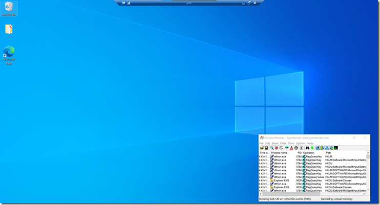
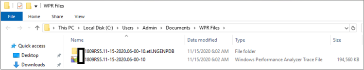

# <a name="troubleshoot-performance-issues-related-to-real-time-protection"></a>Устранение неполадок, связанных с защитой в режиме реального времени


[!INCLUDE [Microsoft 365 Defender rebranding](../../includes/microsoft-defender.md)]


**Область применения:**

- [Microsoft Defender для конечной точки](https://go.microsoft.com/fwlink/p/?linkid=2146631)
 
Если у вашей системы высокие показатели использования ЦП или производительности, связанные со службой защиты в режиме реального времени в Microsoft Defender для конечной точки, вы можете отправить билет в службу поддержки Майкрософт. Следуйте шагам [в сборе антивирусная программа в Microsoft Defender диагностических данных.](collect-diagnostic-data.md)

В качестве администратора вы также можете устранить эти проблемы самостоятельно. 

Во-первых, может потребоваться проверить, вызвана ли проблема другим программным обеспечением. Ознакомьтесь [с проверкой поставщиков исключений антивирусов.](#check-with-vendor-for-antivirus-exclusions)

В противном случае можно определить, какое программное обеспечение связано с выявленной проблемой производительности, следуя шагам в [журнале Анализ защиты Майкрософт.](#analyze-the-microsoft-protection-log) 

Вы также можете предоставить дополнительные журналы для отправки в службу поддержки Майкрософт, следуя следующим шагам:
- [Запись журналов процессов с помощью монитора процесса](#capture-process-logs-using-process-monitor)
- [Запись журналов производительности с Windows записи производительности](#capture-performance-logs-using-windows-performance-recorder) 

## <a name="check-with-vendor-for-antivirus-exclusions"></a>Узнайте у поставщика об исключениях антивирусов

Если вы можете легко определить программное обеспечение, влияющие на производительность системы, перейдите в базу знаний поставщика программного обеспечения или центр поддержки. Поиск, если у них есть рекомендации по исключениям антивирусов. Если на веб-сайте поставщика нет их, вы можете открыть с ними билет поддержки и попросить его опубликовать. 

Мы рекомендуем поставщикам программного обеспечения следовать различным рекомендациям в партнерстве с отраслью, чтобы свести к минимуму [ложные срабатывания.](https://www.microsoft.com/security/blog/2018/08/16/partnering-with-the-industry-to-minimize-false-positives/) Поставщик может отправить свое программное обеспечение через [портал Microsoft Defender Security Intelligence (MDSI).](https://www.microsoft.com/wdsi/filesubmission?persona=SoftwareDeveloper)


## <a name="analyze-the-microsoft-protection-log"></a>Анализ журнала microsoft Protection

В **MPLog-xxxxxxx-xxxxxx.log** вы можете найти сведения о предполагаемом влиянии производительности запущенного программного обеспечения как *EstimatedImpact:*
    
`Per-process counts:ProcessImageName: smsswd.exe, TotalTime: 6597, Count: 1406, MaxTime: 609, MaxTimeFile: \Device\HarddiskVolume3\_SMSTaskSequence\Packages\WQ1008E9\Files\FramePkg.exe, EstimatedImpact: 65%`

| Имя поля | Описание |
|---|---|
|ProcessImageName | Имя изображения процесса |
| TotalTime | Совокупная продолжительность миллисекунд, затраченных на сканирование файлов, доступных в этом процессе |
|Count | Количество отсканированных файлов, доступных в этом процессе |
|MaxTime |  Продолжительность в миллисекунд в самом длинном одном сканировании файла, доступного в этом процессе |
| MaxTimeFile | Путь файла, доступ к которому был зафиксирован в этом процессе, для которого было записано самое длительное `MaxTime` сканирование |
| EstimatedImpact | Процент времени, затраченного на сканирование файлов, доступных в этом процессе, за период, в течение которого этот процесс испытывал активность сканирования. |

Если производительность высока, попробуйте добавить процесс в исключения Path/Process, следуя шагам в Настройка и проверка исключений для антивирусная программа в Microsoft Defender [проверки.](collect-diagnostic-data.md)

Если предыдущий шаг не решает проблему, можно собирать [](#capture-process-logs-using-process-monitor) дополнительные сведения [](#capture-performance-logs-using-windows-performance-recorder) через монитор процесса или Windows записи производительности в следующих разделах.
     
## <a name="capture-process-logs-using-process-monitor"></a>Запись журналов процессов с помощью монитора процесса

Process Monitor (ProcMon) — это расширенный инструмент мониторинга, который может показывать процессы в режиме реального времени. С помощью этого можно зафиксировать проблему производительности по мере ее выполнения.

1. Загрузка [монитора процесса v3.60](/sysinternals/downloads/procmon) в папку типа `C:\temp` .

2. Чтобы удалить метку файла в Интернете:
    1. Щелкните **правой кнопкой мышиProcessMonitor.zip** выберите **Свойства**.
    1. В *вкладке General* и посмотрите на *безопасность.*
    1. Проверьте поле рядом **с разблокировка**.
    1. Нажмите **Применить**.
    
     

3. Разбей файл `C:\temp` так, чтобы путь папки был `C:\temp\ProcessMonitor` . 

4. **СкопируйтеProcMon.exe** на Windows или Windows сервер, который вы устраняете.  

5. Перед запуском ProcMon убедитесь, что все другие приложения, не связанные с высокой проблемой использования ЦП, закрыты. Это позволит свести к минимуму количество проверок.

6. Запуск ProcMon можно двумя способами.
    1. Щелкните **правой кнопкой мышиProcMon.exe** **выполнить в качестве администратора.** 
    

        Так как ведение журнала запускается автоматически, выберите значок увеличительное стекло, чтобы остановить текущий захват или использовать клавишу ярлык **Ctrl +E**.
 
        

        Чтобы убедиться, что вы остановили захват, проверьте, отображается ли значок увеличительного стекла с красным X.

                 

        Далее, чтобы очистить предыдущий захват, выберите значок ластик.

        

        Или используйте клавишу ярлык **Ctrl+X**.

    2. Второй способ — выполнить  командную строку в качестве администратора, а затем с пути Монитор процесса выполнить:

        
 
        ```console
        Procmon.exe /AcceptEula /Noconnect /Profiling
        ```
        
        >[!TIP] 
        >Сделайте окно ProcMon как можно меньше при захвате данных, чтобы можно было легко запустить и остановить трассировку.
        > 
        >
    
7. После одной из процедур на шаге 6 вы увидите возможность установить фильтры. Нажмите **ОК**. Вы всегда можете отфильтровать результаты после завершения захвата.
 
     

8. Чтобы начать захват, снова выберите значок увеличительной стекла.
     
9. Воспроизвести проблему.
 
    >[!TIP] 
    >Подождите, пока проблема будет полностью воспроизведена, а затем обратите внимание на время начала трассировки.

10. После двух-четырех минут обработки при высоком условии использования ЦП остановите захват, выбрав значок увеличительного стекла.

11. Чтобы сохранить захват с уникальным именем и с форматом .pml, выберите **Файл,** а затем выберите **Сохранить ...**. Убедитесь, что для выбора кнопок радио **все** события и формат монитора родного **процесса (PML)**.

    

12. Чтобы лучше отслеживать, измените путь по умолчанию с `C:\temp\ProcessMonitor\LogFile.PML` `C:\temp\ProcessMonitor\%ComputerName%_LogFile_MMDDYEAR_Repro_of_issue.PML` места:
    - `%ComputerName%` это имя устройства
    - `MMDDYEAR` это месяц, день и год
    -  `Repro_of_issue` это имя проблемы, которая вы пытаетесь воспроизвести

    >[!TIP] 
    > Если у вас есть рабочая система, вы можете получить пример журнала для сравнения.

13. Zip файл .pml и отправить его в службу поддержки Майкрософт.


## <a name="capture-performance-logs-using-windows-performance-recorder"></a>Запись журналов производительности с Windows записи производительности

Вы можете использовать Windows (WPR), чтобы включить дополнительные сведения в отправку в службу поддержки Майкрософт. WPR — это мощный инструмент записи, который создает трассировку событий для Windows записей. 

WPR является частью набора Windows и развертывания (Windows ADK) и может быть загружен из скачивания и установки Windows [ADK](/windows-hardware/get-started/adk-install). Вы также можете скачать его в Windows 10 комплекта разработки программного обеспечения [в Windows 10 SDK](https://developer.microsoft.com/windows/downloads/windows-10-sdk/).

Пользовательский интерфейс WPR можно использовать, следуя шагам в журналах производительности [Capture с помощью пользовательского интерфейса WPR.](#capture-performance-logs-using-the-wpr-ui) 

Кроме того, вы также можете использовать средство командной строки *wpr.exe,* доступное в Windows 8 и более поздних версиях, следуя шагам в журналах производительности Capture с помощью [CLI WPR](#capture-performance-logs-using-the-wpr-cli).


### <a name="capture-performance-logs-using-the-wpr-ui"></a>Запись журналов производительности с помощью пользовательского интерфейса WPR

>[!TIP]
>Если у вас есть несколько устройств, на которых возникла проблема, используйте устройство с наибольшей объемом оперативной памяти.

1. Скачайте и установите WPR.

2. В *Windows наборов* щелкните правой кнопкой мыши **Windows записи производительности**. 

    

    Выберите **дополнительные**. Выберите **Выполнить в качестве администратора.**

3. Когда появится диалоговое окно управления учетной записью пользователя, выберите **Да**.

    

4. Далее скачайте профиль [анализа Microsoft Defender для конечных](https://github.com/YongRhee-MDE/Scripts/blob/master/MDAV.wprp) точек и сохраните `MDAV.wprp` папку типа `C:\temp` . 
     
5. В диалоговом окне WPR выберите **дополнительные параметры.**

    

6. Выберите **Добавить профили...** и просмотреть путь `MDAV.wprp` файла.

7. После этого следует увидеть новый набор  профилей под пользовательскими измерениями с именем Microsoft Defender для анализа *конечных точек* под ним.

    

    >[!WARNING]
    >Если у Windows Server 64 ГБ оперативной памяти или более, используйте настраиваемые измерения вместо `Microsoft Defender for Endpoint analysis for large servers` `Microsoft Defender for Endpoint analysis` . В противном случае система может потреблять большое количество памяти пула без страниц или буферов, что может привести к нестабильности системы. Вы можете выбрать, какие профили добавить, расширяя **анализ ресурсов.** Этот настраиваемый профиль предоставляет необходимый контекст для углубленного анализа производительности.
 
8. Чтобы использовать настраиваемый профиль анализа подробных анализов Microsoft Defender для конечных точек в пользовательском интерфейсе WPR:

    1. Убедитесь, что профили не будут выбраны  в группах "Анализ ресурсов" и *"Анализ сценариев* первого уровня".
    2. Выберите **настраиваемые измерения.**
    3. Выберите **Microsoft Defender для анализа конечных точек.**
    4. Выберите **Verbose на** *уровне Detail.*
    1. Выберите **файл** или **память в** режиме ведения журнала. 

    >[!important]
    >Чтобы использовать *режим* ведения журнала файлов, следует выбрать Файл, если проблема производительности может быть воспроизведена непосредственно пользователем. Большинство проблем подпадают под эту категорию. Однако если пользователь не может непосредственно воспроизвести проблему, но может легко заметить ее после возникновения проблемы, пользователю следует выбрать *Memory* для использования режима ведения журнала памяти. Это гарантирует, что журнал трассировки не будет чрезмерно раздувать из-за длительного времени запуска.

9. Теперь вы готовы к сбору данных. Выход из всех приложений, которые не имеют отношения к воспроизводить проблему производительности. Вы можете выбрать **параметры Hide,** чтобы пространство, занятое окном WPR, было небольшим.

    

    >[!TIP]
    >Попробуйте начать трассировку в течение нескольких секунд. Например, 01:30:00. Это облегчит анализ данных. Также попробуйте отслеживать время, когда именно будет воспроизводиться проблема.

10. Нажмите кнопку **Пуск**.

    

11. Воспроизвести проблему.

    >[!TIP]
    >Сохранение коллекции данных не более пяти минут. Два-три минуты — это хороший диапазон, так как собирается большое количество данных.

12. Нажмите **Сохранить**.

    

13. Заполните **Тип в подробном описании проблемы:** сведения о проблеме и о том, как вы воспроизводили проблему.

    

    1. Выберите **имя файла:** чтобы определить, где будет сохранен ваш файл трассировки. По умолчанию она 1.is сохранена `%user%\Documents\WPR Files\` до .
    1. Нажмите **Сохранить**.

14. Подождите, пока трассировка будет объединена.

    

15. Как только трассировка сохранена, выберите **открытую папку**.

    

    Включите файл и папку в отправку в службу поддержки Майкрософт.

    

### <a name="capture-performance-logs-using-the-wpr-cli"></a>Захват журналов производительности с помощью CLI WPR

Средство командной *строкиwpr.exe* является частью операционной системы, начиная с Windows 8. Для сбора трассировки WPR с помощью средства командной строки wpr.exe:

1. Скачайте профиль анализа Microsoft Defender для **[конечной](https://github.com/YongRhee-MDE/Scripts/blob/master/MDAV.wprp)** точки для отслеживания производительности в файл с именем в локальном `MDAV.wprp` каталоге, например `C:\traces` .

3. Щелкните правой кнопкой кнопку **Пуск** меню и выберите Windows PowerShell **(Администратор)** или Командный запрос **(Администратор),** чтобы открыть окно командной команды администратора.

4. Когда появится диалоговое окно управления учетной записью пользователя, выберите **Да**.

5. В приподнятом запросе запустите следующую команду, чтобы запустить трассировку производительности Microsoft Defender для конечных точек:

    ```console
    wpr.exe -start C:\traces\MDAV.wprp!WD.Verbose -filemode
    ```
    
    >[!WARNING]
    >Если у Windows Server 64 ГБ или оперативной памяти или более, используйте профили и вместо профилей `WDForLargeServers.Light` `WDForLargeServers.Verbose` и , `WD.Light` `WD.Verbose` соответственно. В противном случае система может потреблять большое количество памяти пула без страниц или буферов, что может привести к нестабильности системы.

6. Воспроизвести проблему.

    >[!TIP]
    >Сохранение сбора данных не более пяти минут.  В зависимости от сценария, 2-3 минуты — это хороший диапазон, так как собирается большое количество данных.

7. На повышенной подсказке запустите следующую команду, чтобы остановить трассировку производительности, чтобы предоставить сведения о проблеме и о том, как вы воспроизводили проблему:

    ```console
    wpr.exe -stop merged.etl "Timestamp when the issue was reproduced, in HH:MM:SS format" "Description of the issue" "Any error that popped up"
    ```

8. Подождите, пока трассировка не будет слита. 

9. Включите файл и папку в отправку в службу поддержки Майкрософт.

## <a name="see-also"></a>См. также

- [Сбор антивирусная программа в Microsoft Defender диагностических данных](collect-diagnostic-data.md)
- [Настройка и проверка исключений для антивирусная программа в Microsoft Defender сканирования](configure-exclusions-microsoft-defender-antivirus.md)
