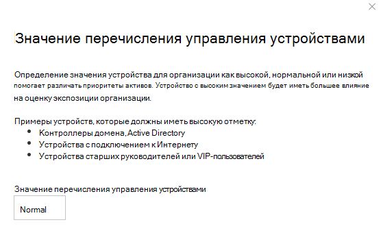

# Назначение значения устройства — управления угрозами и уязвимостьюAssign device value - threat and vulnerability management

[!INCLUDE [Microsoft 365 Defender rebranding](../../includes/microsoft-defender.md)]

**Область применения:****Applies to:**

- [Microsoft Defender для конечной точкиMicrosoft Defender for Endpoint](https://go.microsoft.com/fwlink/?linkid=2154037)
- [Управление угрозами и уязвимостямиThreat and vulnerability management](next-gen-threat-and-vuln-mgt.md)
- [Microsoft 365 DefenderMicrosoft 365 Defender](https://go.microsoft.com/fwlink/?linkid=2118804)

> Хотите испытать Microsoft Defender для конечной точки?Want to experience Microsoft Defender for Endpoint? [Зарегистрився для бесплатной пробной.Sign up for a free trial.](https://www.microsoft.com/microsoft-365/windows/microsoft-defender-atp?ocid=docs-wdatp-portaloverview-abovefoldlink)

[!include[Prerelease information](../../includes/prerelease.md)]

Определение значения устройства позволяет различать приоритеты активов.Defining a device’s value helps you differentiate between asset priorities. Значение устройства используется для включения аппетита к риску отдельного актива в расчет оценки воздействия на угрозы и уязвимости управления рисками.The device value is used to incorporate the risk appetite of an individual asset into the threat and vulnerability management exposure score calculation. Устройства, назначенные как "высокое значение", будут получать больше веса.Devices assigned as “high value” will receive more weight.

Вы также можете использовать API значения [за установленного устройства.](set-device-value.md)You can also use the [set device value API](set-device-value.md).

Параметры значения устройства:Device value options:

- НизкийLow
- С обычными интервалами (по умолчанию)Normal (Default)
- ВысокийHigh

Примеры устройств, которые должны быть назначены с высоким значением:Examples of devices that should be assigned a high value:

- Контроллеры домена, Active DirectoryDomain controllers, Active Directory
- Устройства с подключением к ИнтернетуInternet facing devices
- VIP-устройстваVIP devices
- Устройства, на которые размещены внутренние и внешние производственные службыDevices hosting internal/external production services

## Выбор значения устройстваChoose device value

1. Перейдите на любую страницу устройства, самое простое место из инвентаризации устройства.Navigate to any device page, the easiest place is from the device inventory.

2. Выберите **значение Device** из трех точек рядом со стойкой действий в верхней части страницы.Select **Device value** from three dots next to the actions bar at the top of the page.

    

3. Вылет появится с текущим значением устройства и его значением.A flyout will appear with the current device value and what it means. Просмотрите значение устройства и выберите устройство, которое лучше всего подходит вашему устройству.Review the value of the device and choose the one that best fits your device.

## Влияние значения устройства на оценку экспозицииHow device value impacts your exposure score

Оценка экспозиции — это средневзвешение для всех устройств.The exposure score is a weighted average across all devices. Если у вас есть группы устройств, вы также можете фильтровать оценку по группе устройств.If you have device groups, you can also filter the score by device group.

- Вес обычных устройств составляет 1Normal devices have a weight of 1
- Устройства с низким значением имеют вес 0,75Low value devices have a weight of 0.75
- Устройства с высоким значением имеют вес NumberOfAssets / 10.High value devices have a weight of NumberOfAssets / 10.
    - Если у вас 100 устройств, каждое устройство с высоким значением будет иметь вес 10 (100/10)If you have 100 devices, each high value device will have a weight of 10 (100/10)

## Статьи по темеRelated topics

- [Обзор управления угрозами и уязвимостьюThreat and vulnerability management overview](next-gen-threat-and-vuln-mgt.md)
- [Оценка экспозицииExposure Score](tvm-exposure-score.md)
- [Интерфейсы APIAPIs](next-gen-threat-and-vuln-mgt.md#apis)