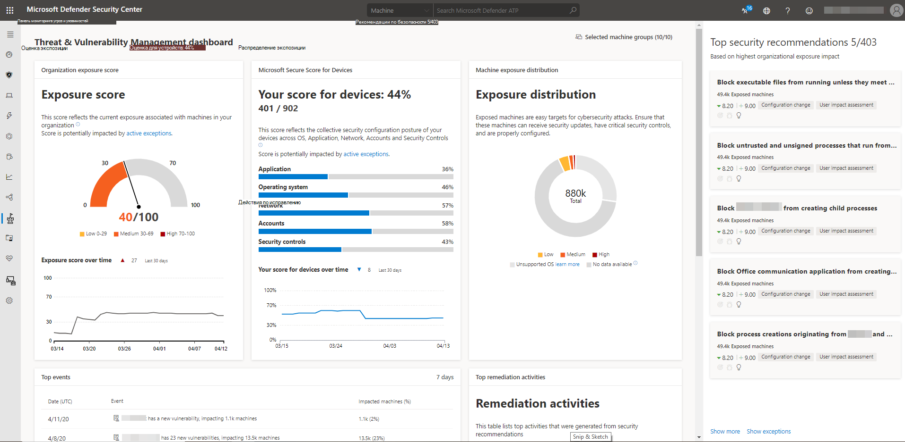

# Сведения о панели мониторинга — контроль угроз и уязвимостейDashboard insights - threat and vulnerability management

[!INCLUDE [Microsoft 365 Defender rebranding](../../includes/microsoft-defender.md)]

**Область применения:****Applies to:**

- [Microsoft Defender для конечной точкиMicrosoft Defender for Endpoint](https://go.microsoft.com/fwlink/?linkid=2154037)
- [Угроза и управление уязвимостямиThreat and vulnerability management](next-gen-threat-and-vuln-mgt.md)
- [Microsoft 365 DefenderMicrosoft 365 Defender](https://go.microsoft.com/fwlink/?linkid=2118804)

> Хотите испытать Defender для конечной точки?Want to experience Defender for Endpoint? [Зарегистрився для бесплатной пробной.Sign up for a free trial.](https://www.microsoft.com/microsoft-365/windows/microsoft-defender-atp?ocid=docs-wdatp-portaloverview-abovefoldlink)

Threat and управление уязвимостями является компонентом Defender для endpoint и предоставляет администраторам безопасности и группам операций безопасности уникальное значение, в том числе:Threat and vulnerability management is a component of Defender for Endpoint, and provides both security administrators and security operations teams with unique value, including:

- Аналитика по обнаружению и устранению угроз на конечных точках (EDR) в режиме реального времени, связанная с уязвимостями конечных точекReal-time endpoint detection and response (EDR) insights correlated with endpoint vulnerabilities
- Бесценный контекст уязвимости устройства во время расследований инцидентовInvaluable device vulnerability context during incident investigations
- Встроенные процессы восстановления с помощью Microsoft Intune и Microsoft Endpoint Configuration ManagerBuilt-in remediation processes through Microsoft Intune and Microsoft Endpoint Configuration Manager  
  
Вы можете использовать контроль угроз и уязвимостей в [Центр безопасности в Microsoft Defender:](https://securitycenter.windows.com/)You can use the threat and vulnerability management capability in [Microsoft Defender Security Center](https://securitycenter.windows.com/) to:

- Просмотр результатов воздействия и microsoft Secure Score для устройств, а также рекомендации по безопасности, уязвимость программного обеспечения, действия по исправлению и выставленные устройстваView you exposure score and Microsoft Secure Score for Devices, along with top security recommendations, software vulnerability, remediation activities, and exposed devices
- Сопоставление EDR с уязвимостями конечной точки и их обработкаCorrelate EDR insights with endpoint vulnerabilities and process them
- Выберите параметры исправлений для отслеживания и отслеживания задач по исправлению.Select remediation options to triage and track the remediation tasks
- Выбор параметров исключений и отслеживание активных исключенийSelect exception options and track active exceptions

> [!NOTE]
> Устройства, не активные в течение последних 30 дней, не будут учитываться в данных, отражающих оценку контроль угроз и уязвимостей и microsoft Secure Score для устройств.Devices that are not active in the last 30 days are not factored in on the data that reflects your organization's threat and vulnerability management exposure score and Microsoft Secure Score for Devices.

Просмотрите это видео, чтобы получить краткий обзор того, что находится на контроль угроз и уязвимостей панели мониторинга.Watch this video for a quick overview of what is in the threat and vulnerability management dashboard.

>[!VIDEO https://www.microsoft.com/en-us/videoplayer/embed/RE4r1nv]

## Панель мониторинга угроз и управление уязвимостямиThreat and vulnerability management dashboard

 

ОбластьArea | ОписаниеDescription
:---|:---
**Выбранные группы устройств (#/#)****Selected device groups (#/#)**   | Фильтрация контроль угроз и уязвимостей данных, которые необходимо увидеть на панели мониторинга и картах группами устройств.Filter the threat and vulnerability management data you want to see in the dashboard and cards by device groups. Выбранный фильтр применяется на всех контроль угроз и уязвимостей страницах.What you select in the filter applies throughout the threat and vulnerability management pages.
[**Показатель уязвимости****Exposure score**](tvm-exposure-score.md)   | См. текущее состояние воздействия устройств организации на угрозы и уязвимости.See the current state of your organization's device exposure to threats and vulnerabilities. Оценка экспозиции организации влияет на несколько факторов: слабые места, обнаруженные на устройствах, вероятность взлома устройств, значение устройств для организации и соответствующие оповещения, обнаруженные на устройствах.Several factors affect your organization's exposure score: weaknesses discovered in your devices, likelihood of your devices to be breached, value of the devices to your organization, and relevant alerts discovered with your devices. Цель состоит в том, чтобы снизить оценку экспозиции вашей организации, чтобы быть более безопасной.The goal is to lower the exposure score of your organization to be more secure. Чтобы уменьшить количество баллов, необходимо устранять связанные проблемы с конфигурацией безопасности, перечисленные в рекомендациях по безопасности.To reduce the score, you need to remediate the related security configuration issues listed in the security recommendations.
[**Оценка безопасности (Майкрософт) для устройств****Microsoft Secure Score for Devices**](tvm-microsoft-secure-score-devices.md) | См. положение безопасности операционной системы, приложений, сетей, учетных записей и элементов управления безопасностью организации.See the security posture of the operating system, applications, network, accounts, and security controls of your organization. Цель состоит в исправлении связанных с этим проблем с конфигурацией безопасности, чтобы увеличить ваш балл для устройств.The goal is to remediate the related security configuration issues to increase your score for devices. Выбор баров поможет вам найти страницу рекомендаций **по безопасности.**Selecting the bars will take you to the **Security recommendation** page.
**Распределение экспозиции устройств****Device exposure distribution** | Узнайте, сколько устройств подвергается воздействию на основе уровня экспозиции.See how many devices are exposed based on their exposure level. Выберите раздел в кольцевой диаграмме, чтобы перейти на страницу списка **Устройств** и просмотреть имена затронутых устройств, уровень экспозиции, уровень риска и другие сведения, такие как домен, платформа операционной системы, состояние его здоровья, когда оно было в последний раз замечено, и его теги.Select a section in the doughnut chart to go to the **Devices list** page and view the affected device names, exposure level, risk level, and other details such as domain, operating system platform, its health state, when it was last seen, and its tags.
**Рекомендации по безопасности****Top security recommendations** | См. в соотноженных рекомендациях по безопасности, отсортированных и приоритизированных в зависимости от риска организации и требуемой срочности.See the collated security recommendations that are sorted and prioritized based on your organization's risk exposure and the urgency that it requires. Выберите **Показать больше,** чтобы увидеть остальные рекомендации по безопасности в списке.Select **Show more** to see the rest of the security recommendations in the list. Выберите **Показать исключения** для списка рекомендаций, которые имеют исключение.Select **Show exceptions** for the list of recommendations that have an exception.
**Верхнее уязвимое программное обеспечение****Top vulnerable software** | Получите возможность в режиме реального времени влиять на инвентаризацию программного обеспечения организации с помощью списка уязвимых программ, установленных на устройствах сети, и их влияния на оценку воздействия на организацию.Get real-time visibility into your organization's software inventory with a stack-ranked list of vulnerable software installed on your network's devices and how they impact your organizational exposure score. Выберите элемент для получения дополнительных сведений или **покажите** дополнительные сведения, чтобы увидеть остальные уязвимые списки программного обеспечения на странице **инвентаризации программного** обеспечения.Select an item for details or **Show more** to see the rest of the vulnerable software list in the **Software inventory** page.
**Топ действий по исправлению****Top remediation activities** | Отслеживание действий по исправлению, созданных из рекомендаций по безопасности.Track the remediation activities generated from the security recommendations. Вы можете выбрать каждый элемент в списке, чтобы просмотреть сведения на странице Исправление или показать больше для просмотра остальных действий по исправлению и активных исключений.  You can select each item on the list to see the details in the **Remediation** page or select **Show more** to view the rest of the remediation activities, and active exceptions.
**Устройства с верхним подвергаемом воздействию****Top exposed devices** | Просмотр открытых имен устройств и их уровня экспозиции.View exposed device names and their exposure level. Выберите имя устройства из списка, чтобы перейти на страницу устройства, на которой можно просмотреть оповещения, риски, инциденты, рекомендации по безопасности, установленное программное обеспечение и обнаруженные уязвимости, связанные с выставленными устройствами.Select a device name from the list to go to the device page where you can view the alerts, risks, incidents, security recommendations, installed software, and discovered vulnerabilities associated with the exposed devices. Выберите **Показать больше,** чтобы увидеть остальную часть списка выставленных устройств.Select **Show more** to see the rest of the exposed devices list. Из списка устройств можно управлять тегами, инициировать автоматическое расследование, инициировать сеанс живого ответа, собирать пакет исследований, запускать антивирусное сканирование, ограничивать выполнение приложения и изолировать устройство.From the devices list, you can manage tags, initiate automated investigations, initiate a live response session, collect an investigation package, run antivirus scan, restrict app execution, and isolate device.

Дополнительные сведения о значках, используемых на портале, см. в [иконах Microsoft Defender для конечных точек.](portal-overview.md#microsoft-defender-for-endpoint-icons)For more information on the icons used throughout the portal, see [Microsoft Defender for Endpoint icons](portal-overview.md#microsoft-defender-for-endpoint-icons).

## Статьи по темеRelated topics

- [Обзор угроз и управление уязвимостямиThreat and vulnerability management overview](next-gen-threat-and-vuln-mgt.md)
- [Показатель уязвимостиExposure score](tvm-exposure-score.md)
- [Оценка безопасности (Майкрософт) для устройствMicrosoft Secure Score for Devices](tvm-microsoft-secure-score-devices.md)
- [Рекомендации по безопасностиSecurity recommendations](tvm-security-recommendation.md)
- [Инвентаризация программного обеспеченияSoftware inventory](tvm-software-inventory.md)
- [Временная шкала событияEvent timeline](threat-and-vuln-mgt-event-timeline.md)

