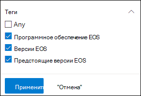
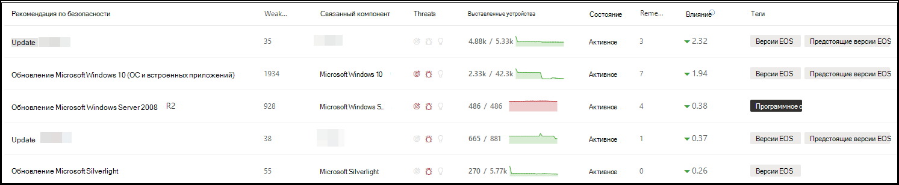
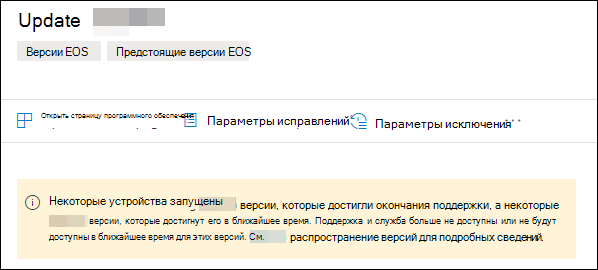
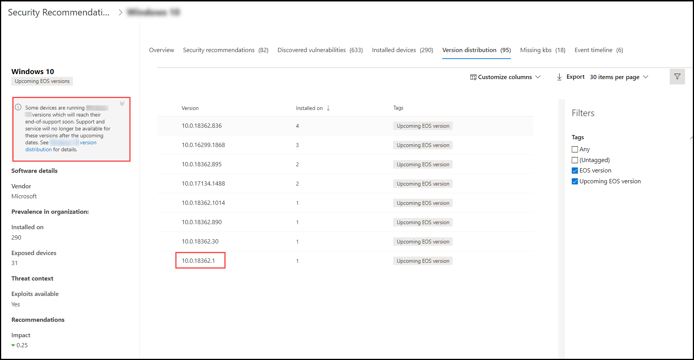
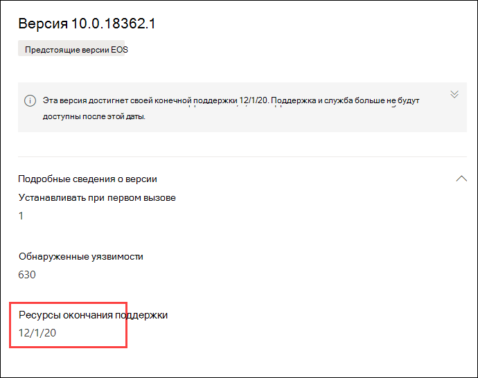

# Планирование конечных версий программного обеспечения и программного обеспечения с управлением угрозами и уязвимостью

[!INCLUDE [Microsoft 365 Defender rebranding](../../includes/microsoft-defender.md)]

**Область применения:**

- [Microsoft Defender для конечной точки](https://go.microsoft.com/fwlink/?linkid=2154037)
- [Управление угрозами и уязвимостями](next-gen-threat-and-vuln-mgt.md)
- [Microsoft 365 Defender](https://go.microsoft.com/fwlink/?linkid=2118804)

>Хотите испытать Microsoft Defender для конечной точки? [Зарегистрився для бесплатной пробной.](https://www.microsoft.com/microsoft-365/windows/microsoft-defender-atp?ocid=docs-wdatp-portaloverview-abovefoldlink)

End-of-support (EOS), иначе известный как end-of-life (EOL), для программных или программных версий означает, что они больше не будут поддерживаться и не будут получать обновления безопасности. При использовании программных или программных версий с законченной поддержкой вы подвергаете свою организацию уязвимостям безопасности, юридическим и финансовым рискам.

Важно, чтобы администраторы безопасности и ИТ-администраторы работали вместе и обеспечивали настройку инвентаризации программного обеспечения организации для оптимальных результатов, соответствия требованиям и здоровой сетевой экосистемы. Они должны изучить варианты удаления или замены приложений, которые достигли конечной поддержки и обновления версий, которые больше не поддерживаются. Лучше всего создать и реализовать план **до** окончания сроков поддержки.

## Поиск версий программного обеспечения или программного обеспечения, которые больше не поддерживаются

1. Из меню управления угрозами и уязвимостями перейдите к [**рекомендациям по безопасности.**](tvm-security-recommendation.md)
2. Перейдите к **панели Фильтры** и найдите раздел теги. Выберите один или несколько параметров тегов EOS. Затем **применить**.

    

3. Вы увидите список рекомендаций, связанных с программным обеспечением с конечной поддержкой, версиями программного обеспечения, завершающим поддержку, или версиями с предстоящим завершением поддержки. Эти теги также видны на странице инвентаризации [программного](tvm-software-inventory.md) обеспечения.

    

## Список версий и дат

Чтобы просмотреть список версий, которые скоро достигли окончания поддержки или окончания или поддержки, а также эти даты, выполните следующие действия:

1. Сообщение появится в вылете рекомендации по безопасности для программного обеспечения с версиями, которые достигли конца поддержки или скоро достигнут конца поддержки.

    

2. Выберите **ссылку на рассылку** версий, чтобы перейти на страницу сверла программного обеспечения. Там можно увидеть фильтрованный список версий с тегами, идентифицирующие их как конец поддержки или предстоящий конец поддержки.

    

3. Выберите одну из версий в таблице для открытия. Например, версия 10.0.18362.1. Вылет появится с окончанием даты поддержки.

    

После того как вы определите, какие версии программного обеспечения и программного обеспечения уязвимы из-за их состояния поддержки, необходимо решить, обновлять или удалять их из организации. Это позволит снизить уровень уязвимостей и постоянных угроз для организаций.

## Похожие темы

- [Обзор управления угрозами и уязвимостью](next-gen-threat-and-vuln-mgt.md)
- [Рекомендации по безопасности](tvm-security-recommendation.md)
- [Инвентаризация программного обеспечения](tvm-software-inventory.md)
