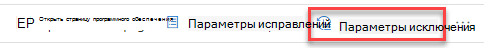
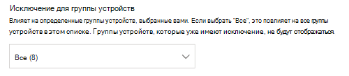
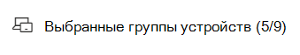
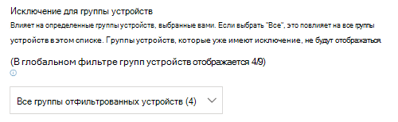
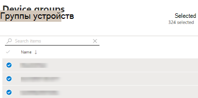
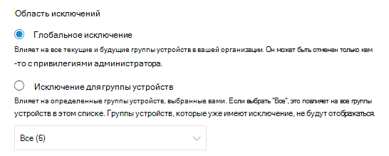
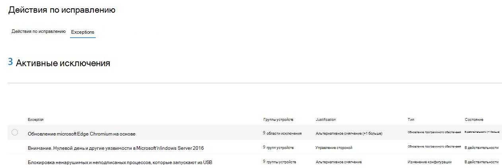
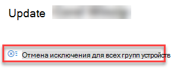
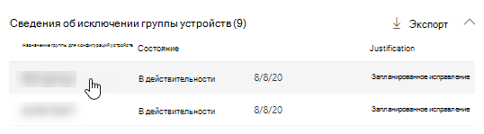
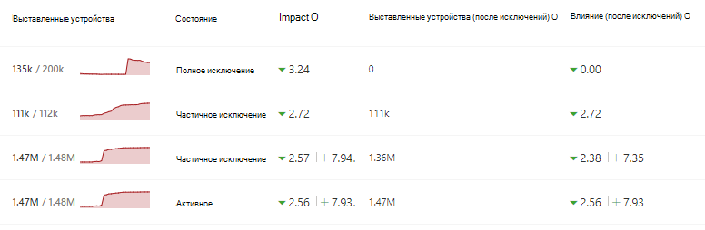

# Создание и просмотр исключений для рекомендаций по безопасности — управление угрозами и уязвимостью

[!INCLUDE [Microsoft 365 Defender rebranding](../../includes/microsoft-defender.md)]

**Область применения:**

- [Microsoft Defender для конечной точки](https://go.microsoft.com/fwlink/?linkid=2154037)
- [Управление угрозами и уязвимостями](next-gen-threat-and-vuln-mgt.md)
- [Microsoft 365 Defender](https://go.microsoft.com/fwlink/?linkid=2118804)

>Хотите испытать Microsoft Defender для конечной точки? [Зарегистрився для бесплатной пробной.](https://www.microsoft.com/microsoft-365/windows/microsoft-defender-atp?ocid=docs-wdatp-portaloverview-abovefoldlink)

В качестве альтернативы запросу на исправление, если рекомендация на данный момент не актуальна, можно создать исключения для рекомендаций. Если в организации есть группы устройств, вы сможете использовать исключение для определенных групп устройств. Исключения можно создавать либо для выбранных групп устройств, либо для всех групп устройств в прошлом и настоящем.  

Если для рекомендации создается исключение, рекомендация не будет активна до окончания срока действия исключения. Состояние рекомендации будет изменяться на **полное исключение или** **частичное** исключение (по группе устройств).

## Разрешения

Управлять исключениями (включая создание или отмену) могут только пользователи с разрешениями "обработка исключений". [Узнайте больше о ролях RBAC.](user-roles.md)

## Создание исключения

Выберите рекомендацию по безопасности, для чего необходимо создать исключение, а затем выберите **параметры Исключения** и заполните форму.  

### Исключение по группе устройств

Примени исключение для всех текущих групп устройств или выберите определенные группы устройств. Будущие группы устройств не будут включены в исключение. Группы устройств, которые уже имеют исключение, не будут отображаться в списке. Если выбрать только определенные группы устройств, состояние рекомендации изменится с "active" на "частичное исключение". При выборе всех групп устройств состояние изменится на "полное исключение".

#### Отфильтрованные представления

Если вы отфильтрованы группой устройств на любой из страниц управления угрозами и уязвимостями, в качестве параметров будут отображаться только группы отфильтрованных устройств.

Это кнопка фильтрации группой устройств на любой из страниц управления угрозами и уязвимостями: 

Представление исключения с отфильтрованными группами устройств:

#### Большое количество групп устройств

Если в организации более 20 групп устройств, выберите **Изменить** рядом с фильтрованным вариантом группы устройств.

Появится вылет, в котором можно будет искать и выбирать группы устройств, которые необходимо включить. Выберите значок контрольного знака ниже Поиск, чтобы проверить или оточеовать все.

### Глобальные исключения

Если у вас есть глобальные разрешения администратора (так называемый администратор ATP Microsoft Defender), вы сможете создать и отменить глобальное исключение. Она затрагивает **все текущие** и будущие группы устройств в вашей организации, и изменить ее сможет только пользователь с аналогичным разрешением. Состояние рекомендации изменится с "active" на "полное исключение".

Некоторые вещи, которые необходимо иметь в виду:

- Если рекомендация находится под глобальным исключением, то вновь созданные исключения для групп устройств будут приостановлены до истечения или отмены глобального исключения. После этого новые исключения группы устройств вступает в силу до истечения срока их действия.
- Если в рекомендации уже есть исключения для определенных групп устройств и создается глобальное исключение, исключение группы устройств будет приостановлено до истечения срока действия или глобального исключения до истечения срока действия.

### Justification

Выберите обоснование исключения, необходимого для файла, а не исправление рекомендации по безопасности, о чем идет речь. Заполните контекст обоснования, а затем установите длительность исключения.

В следующем списке подробно извесятся об обоснованиях для параметров исключений:

- **Управление сторонними** средствами . Сторонний продукт или программное обеспечение уже адресована эта рекомендация . Выбор этого типа обоснования позволит снизить оценку экспозиции и повысить безопасную оценку, так как риск снижается.
- **Альтернативное** смягчение последствий . Внутренний инструмент уже решает эту рекомендацию. Выбор этого типа обоснования позволит снизить оценку экспозиции и повысить безопасную оценку, так как риск снижается.
- **Риск, принятый** . Создает низкий риск и/или реализация рекомендации является слишком дорогой
- **Запланированное исправление (благодать)** — уже запланировано, но ожидает выполнения или авторизации

## Просмотр всех исключений

Перейдите на **вкладку Исключения** на странице **Исправление.** Можно фильтровать по оправданию, типу и статусу.

 Выберите исключение, чтобы открыть вылет с дополнительными сведениями. Исключения для каждой группы устройств будут иметь список каждой группы устройств, на которые распространяется исключение, которое можно экспортировать. Вы также можете просмотреть связанную рекомендацию или отменить исключение.

## Отмена исключения

Чтобы отменить исключение, перейдите на вкладку **Исключения** на странице **Исправление.** Выберите исключение.

Чтобы отменить исключение для всех групп устройств или глобальное исключение, выберите кнопку **Отмена для всех групп** устройств. Вы сможете отменить исключения только для групп устройств, на которые у вас есть разрешения.

### Отмена исключения для определенной группы устройств

Выберите конкретную группу устройств, чтобы отменить исключение для нее. Для группы устройств появится вылет, и вы можете выбрать исключение **Отмена.**

## Просмотр влияния после примененных исключений

На странице Рекомендации по безопасности выберите **Параметры** столбцов и проверьте поля для устройств **Exposed (после** исключений) и **Impact (после исключений).**

Столбец выставленных устройств (после исключений) отображает оставшиеся устройства, которые по-прежнему подвержены уязвимостям после примененных исключений. Исключения, влияющие на экспозицию, включают "сторонний контроль" и "альтернативное смягчение". Другие обоснования не уменьшают экспозицию устройства, и они по-прежнему считаются выставленными.

Влияние (после исключений) показывает оставшееся влияние на оценку экспозиции или безопасную оценку после примененных исключений. Исключения, влияющие на оценки, включают "сторонний контроль" и "альтернативное смягчение". Другие обоснования не уменьшают экспозицию устройства, поэтому оценка экспозиции и безопасная оценка не изменяются.

## Статьи по теме

- [Обзор управления угрозами и уязвимостью](next-gen-threat-and-vuln-mgt.md)
- [Устранение уязвимостей](tvm-remediation.md)
- [Рекомендации по безопасности](tvm-security-recommendation.md)
- [Показатель уязвимости](tvm-exposure-score.md)
- [Оценка безопасности (Майкрософт) для устройств](tvm-microsoft-secure-score-devices.md)
