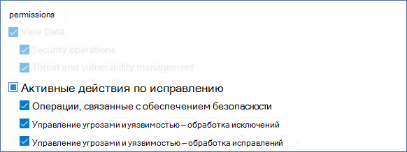
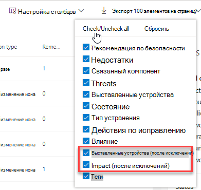

# Создание и просмотр исключений для рекомендаций по безопасности — управление угрозами и уязвимостьюCreate and view exceptions for security recommendations - threat and vulnerability management

[!INCLUDE [Microsoft 365 Defender rebranding](../../includes/microsoft-defender.md)]

**Область применения:****Applies to:**

- [Microsoft Defender для конечной точкиMicrosoft Defender for Endpoint](https://go.microsoft.com/fwlink/?linkid=2154037)
- [Управление угрозами и уязвимостямиThreat and vulnerability management](next-gen-threat-and-vuln-mgt.md)
- [Microsoft 365 DefenderMicrosoft 365 Defender](https://go.microsoft.com/fwlink/?linkid=2118804)

>Хотите испытать Microsoft Defender для конечной точки?Want to experience Microsoft Defender for Endpoint? [Зарегистрився для бесплатной пробной.Sign up for a free trial.](https://www.microsoft.com/microsoft-365/windows/microsoft-defender-atp?ocid=docs-wdatp-portaloverview-abovefoldlink)

В качестве альтернативы запросу на исправление, если рекомендация на данный момент не актуальна, можно создать исключения для рекомендаций.As an alternative to a remediation request when a recommendation is not relevant at the moment, you can create exceptions for recommendations. Если в организации есть группы устройств, вы сможете использовать исключение для определенных групп устройств.If your organization has device groups, you will be able to scope the exception to specific device groups. Исключения можно создавать либо для выбранных групп устройств, либо для всех групп устройств в прошлом и настоящем.Exceptions can either be created for selected device groups, or for all device groups past and present.  

Если для рекомендации создается исключение, рекомендация не будет активна до окончания срока действия исключения.When an exception is created for a recommendation, the recommendation will not be active until the end of the exception duration. Состояние рекомендации будет изменяться на **полное исключение или** **частичное** исключение (по группе устройств).The recommendation state will change to **Full exception** or **Partial exception** (by device group).

## РазрешенияPermissions

Управлять исключениями (включая создание или отмену) могут только пользователи с разрешениями "обработка исключений".Only users with “exceptions handling” permissions can manage exceptions (including creating or canceling). [Узнайте больше о ролях RBAC.](user-roles.md)[Learn more about RBAC roles](user-roles.md).

## Создание исключенияCreate an exception

Выберите рекомендацию по безопасности, для чего необходимо создать исключение, а затем выберите **параметры Исключения** и заполните форму.Select a security recommendation you would like create an exception for, and then select **Exception options** and fill out the form.  

### Исключение по группе устройствException by device group

Примени исключение для всех текущих групп устройств или выберите определенные группы устройств.Apply the exception to all current device groups or choose specific device groups. Будущие группы устройств не будут включены в исключение.Future device groups won't be included in the exception. Группы устройств, которые уже имеют исключение, не будут отображаться в списке.Device groups that already have an exception will not be displayed in the list. Если выбрать только определенные группы устройств, состояние рекомендации изменится с "active" на "частичное исключение".If you only select certain device groups, the recommendation state will change from “active” to “partial exception.” При выборе всех групп устройств состояние изменится на "полное исключение".The state will change to “full exception” if you select all the device groups.

#### Отфильтрованные представленияFiltered views

Если вы отфильтрованы группой устройств на любой из страниц управления угрозами и уязвимостями, в качестве параметров будут отображаться только группы отфильтрованных устройств.If you have filtered by device group on any of the threat and vulnerability management pages, only your filtered device groups will appear as options.

Это кнопка фильтрации группой устройств на любой из страниц управления угрозами и уязвимостями:This is the button to filter by device group on any of the threat and vulnerability management pages: 

Представление исключения с отфильтрованными группами устройств:Exception view with filtered device groups:

#### Большое количество групп устройствLarge number of device groups

Если в организации более 20 групп устройств, выберите **Изменить** рядом с фильтрованным вариантом группы устройств.If your organization has more than 20 device groups, select **Edit** next to the filtered device group option.

Появится вылет, в котором можно будет искать и выбирать группы устройств, которые необходимо включить.A flyout will appear where you can search and choose device groups you want included. Выберите значок контрольного знака ниже Поиск, чтобы проверить или оточеовать все.Select the check mark icon below Search to check/uncheck all.

### Глобальные исключенияGlobal exceptions

Если у вас есть глобальные разрешения администратора (так называемый администратор ATP Microsoft Defender), вы сможете создать и отменить глобальное исключение.If you have global administrator permissions (called Microsoft Defender ATP administrator), you will be able to create and cancel a global exception. Она затрагивает **все текущие** и будущие группы устройств в вашей организации, и изменить ее сможет только пользователь с аналогичным разрешением.It affects **all** current and future device groups in your organization, and only a user with similar permission would be able to change it. Состояние рекомендации изменится с "active" на "полное исключение".The recommendation state will change from “active” to “full exception.”

Некоторые вещи, которые необходимо иметь в виду:Some things to keep in mind:

- Если рекомендация находится под глобальным исключением, то вновь созданные исключения для групп устройств будут приостановлены до истечения или отмены глобального исключения.If a recommendation is under global exception, then newly created exceptions for device groups will be suspended until the global exception has expired or been cancelled. После этого новые исключения группы устройств вступает в силу до истечения срока их действия.After that point, the new device group exceptions will go into effect until they expire.
- Если в рекомендации уже есть исключения для определенных групп устройств и создается глобальное исключение, исключение группы устройств будет приостановлено до истечения срока действия или глобального исключения до истечения срока действия.If a recommendation already has exceptions for specific device groups and a global exception is created, then the device group exception will be suspended until it expires or the global exception is cancelled before it expires.

### JustificationJustification

Выберите обоснование исключения, необходимого для файла, а не исправление рекомендации по безопасности, о чем идет речь.Select your justification for the exception you need to file instead of remediating the security recommendation in question. Заполните контекст обоснования, а затем установите длительность исключения.Fill out the justification context, then set the exception duration.

В следующем списке подробно извесятся об обоснованиях для параметров исключений:The following list details the justifications behind the exception options:

- **Управление сторонними** средствами . Сторонний продукт или программное обеспечение уже адресована эта рекомендация . Выбор этого типа обоснования позволит снизить оценку экспозиции и повысить безопасную оценку, так как риск снижается.**Third party control** - A third party product or software already addresses this recommendation       - Choosing this justification type will lower your exposure score and increase your secure score because your risk is reduced
- **Альтернативное** смягчение последствий . Внутренний инструмент уже решает эту рекомендацию. Выбор этого типа обоснования позволит снизить оценку экспозиции и повысить безопасную оценку, так как риск снижается.**Alternate mitigation** - An internal tool already addresses this recommendation       - Choosing this justification type will lower your exposure score and increase your secure score because your risk is reduced
- **Риск, принятый** . Создает низкий риск и/или реализация рекомендации является слишком дорогой**Risk accepted** - Poses low risk and/or implementing the recommendation is too expensive
- **Запланированное исправление (благодать)** — уже запланировано, но ожидает выполнения или авторизации**Planned remediation (grace)** - Already planned but is awaiting execution or authorization

## Просмотр всех исключенийView all exceptions

Перейдите на **вкладку Исключения** на странице **Исправление.**Navigate to the **Exceptions** tab in the **Remediation** page. Можно фильтровать по оправданию, типу и статусу.You can filter by justification, type, and status.

 Выберите исключение, чтобы открыть вылет с дополнительными сведениями.Select an exception to open a flyout with more details. Исключения для каждой группы устройств будут иметь список каждой группы устройств, на которые распространяется исключение, которое можно экспортировать.Exceptions per devices group will have a list of every device group the exception covers, which you can export. Вы также можете просмотреть связанную рекомендацию или отменить исключение.You can also view the related recommendation or cancel the exception.

## Отмена исключенияHow to cancel an exception

Чтобы отменить исключение, перейдите на вкладку **Исключения** на странице **Исправление.**To cancel an exception, navigate to the **Exceptions** tab in the **Remediation** page. Выберите исключение.Select the exception.

Чтобы отменить исключение для всех групп устройств или глобальное исключение, выберите кнопку **Отмена для всех групп** устройств.To cancel the exception for all device groups or for a global exception, select the **Cancel exception for all device groups** button. Вы сможете отменить исключения только для групп устройств, на которые у вас есть разрешения.You will only be able to cancel exceptions for device groups you have permissions for.

### Отмена исключения для определенной группы устройствCancel the exception for a specific device group

Выберите конкретную группу устройств, чтобы отменить исключение для нее.Select the specific device group to cancel the exception for it. Для группы устройств появится вылет, и вы можете выбрать исключение **Отмена.**A flyout will appear for the device group, and you can select **Cancel exception**.

## Просмотр влияния после примененных исключенийView impact after exceptions are applied

На странице Рекомендации по безопасности выберите **Параметры** столбцов и проверьте поля для устройств **Exposed (после** исключений) и **Impact (после исключений).**In the Security Recommendations page, select **Customize columns** and check the boxes for **Exposed devices (after exceptions)** and **Impact (after exceptions)**.

Столбец выставленных устройств (после исключений) отображает оставшиеся устройства, которые по-прежнему подвержены уязвимостям после примененных исключений.The exposed devices (after exceptions) column shows the remaining devices that are still exposed to vulnerabilities after exceptions are applied. Исключения, влияющие на экспозицию, включают "сторонний контроль" и "альтернативное смягчение".Exception justifications that affect the exposure include ‘third party control’ and ‘alternate mitigation’. Другие обоснования не уменьшают экспозицию устройства, и они по-прежнему считаются выставленными.Other justifications do not reduce the exposure of a device, and they are still considered exposed.

Влияние (после исключений) показывает оставшееся влияние на оценку экспозиции или безопасную оценку после примененных исключений.The impact (after exceptions) shows remaining impact to exposure score or secure score after exceptions are applied. Исключения, влияющие на оценки, включают "сторонний контроль" и "альтернативное смягчение".Exception justifications that affect the scores include ‘third party control’ and ‘alternate mitigation.’ Другие обоснования не уменьшают экспозицию устройства, поэтому оценка экспозиции и безопасная оценка не изменяются.Other justifications do not reduce the exposure of a device, and so the exposure score and secure score do not change.

## Статьи по темеRelated topics

- [Обзор управления угрозами и уязвимостьюThreat and vulnerability management overview](next-gen-threat-and-vuln-mgt.md)
- [Устранение уязвимостейRemediate vulnerabilities](tvm-remediation.md)
- [Рекомендации по безопасностиSecurity recommendations](tvm-security-recommendation.md)
- [Показатель уязвимостиExposure score](tvm-exposure-score.md)
- [Оценка безопасности (Майкрософт) для устройствMicrosoft Secure Score for Devices](tvm-microsoft-secure-score-devices.md)
