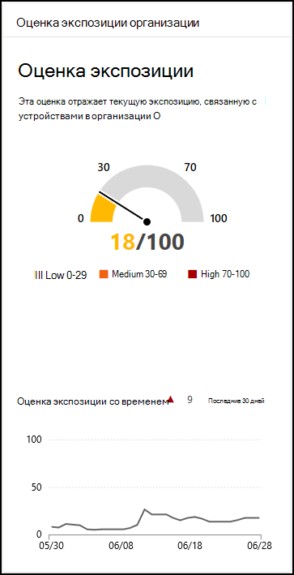

# Оценка экспозиции — управление угрозами и уязвимостью

[!INCLUDE [Microsoft 365 Defender rebranding](../../includes/microsoft-defender.md)]

**Область применения:**

- [Microsoft Defender для конечной точки](https://go.microsoft.com/fwlink/?linkid=2154037)
- [Управление угрозами и уязвимостями](next-gen-threat-and-vuln-mgt.md)
- [Microsoft 365 Defender](https://go.microsoft.com/fwlink/?linkid=2118804)

>Хотите испытать Microsoft Defender для конечной точки? [Зарегистрився для бесплатной пробной.](https://www.microsoft.com/microsoft-365/windows/microsoft-defender-atp?ocid=docs-wdatp-portaloverview-abovefoldlink)

Оценка экспозиции отображается на [панели](tvm-dashboard-insights.md) управления угрозами и уязвимостью Центра безопасности Microsoft Defender. Это отражает уязвимость организации к угрозам кибербезопасности. Низкая оценка экспозиции означает, что ваши устройства менее уязвимы от эксплуатации.

- Быстрое понимание и определение высокоуровневой информации о состоянии безопасности в вашей организации.
- Обнаружение и реагирование на области, которые требуют расследования или действий для улучшения текущего состояния.
- Общение с коллегами и руководством о влиянии усилий по обеспечению безопасности.

Карта позволяет просматривать тенденцию оценки экспозиции на высоком уровне со временем. Любые всплески в диаграмме дают наглядное представление о высокой угрозе кибербезопасности, которую можно исследовать далее.

## Принципы работы

Оценка экспозиции разбита на следующие уровни:

- 0-29: низкая оценка экспозиции
- 30-69: средняя оценка экспозиции
- 70-100: высокая оценка экспозиции

Вы можете устранять проблемы, основываясь  на рекомендациях по безопасности с приоритетами, чтобы снизить оценку экспозиции. У каждого программного обеспечения есть недостатки, которые преобразуются в рекомендации и приоритизируются в зависимости от риска для организации.

## Уменьшение воздействия угроз и уязвимостей

Снижение воздействия угрозы и уязвимости путем устранения [рекомендаций по безопасности.](tvm-security-recommendation.md) Сделайте наибольшее влияние на оценку экспозиции, изменив верхние рекомендации по безопасности, которые можно просмотреть в панели управления угрозами и [уязвимостями.](tvm-dashboard-insights.md)

## Статьи по теме

- [Обзор управления угрозами и уязвимостью](next-gen-threat-and-vuln-mgt.md)
- [Оценка безопасности (Майкрософт) для устройств](tvm-microsoft-secure-score-devices.md)
- [Рекомендации по безопасности](tvm-security-recommendation.md)
- [Временная шкала события](threat-and-vuln-mgt-event-timeline.md)
