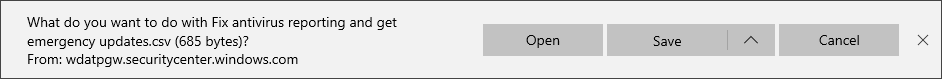

# Microsoft Secure Score для устройств

[!INCLUDE [Microsoft 365 Defender rebranding](../../includes/microsoft-defender.md)]

**Область применения:**

- [Microsoft Defender для конечной точки](https://go.microsoft.com/fwlink/?linkid=2154037)
- [Управление угрозами и уязвимостями](next-gen-threat-and-vuln-mgt.md)
- [Microsoft 365 Defender](https://go.microsoft.com/fwlink/?linkid=2118804)

> Хотите испытать Defender для конечной точки? [Зарегистрився для бесплатной пробной.](https://www.microsoft.com/microsoft-365/windows/microsoft-defender-atp?ocid=docs-wdatp-pullalerts-abovefoldlink) 

>[!NOTE]
> Оценка конфигурации теперь является частью управления угрозами и уязвимостями в качестве Microsoft Secure Score для устройств.

Оценка для устройств отображается на  панели мониторинга управления угрозами и уязвимостями Центра безопасности Microsoft Defender. Более высокий показатель microsoft Secure Score для устройств означает, что конечные точки более устойчивы к атакам угроз кибербезопасности. Он отражает состояние конфигурации коллективной безопасности устройств в следующих категориях:

- Приложение
- Операционная система
- Сеть
- Учетные записи
- Элементы управления безопасностью

Выберите категорию, чтобы перейти на страницу [**Рекомендации безопасности**](tvm-security-recommendation.md) и просмотреть соответствующие рекомендации.

## Включив соединители microsoft Secure Score

Forward Microsoft Defender for Endpoint signals, giving Microsoft Secure Score visibility into the device security posture. Переададные данные хранятся и обрабатываются в том же месте, что и данные Microsoft Secure Score.

На отражение изменений на панели мониторинга может потребоваться до нескольких часов.

1. В области навигации перейдите к **расширенным** функциям Settings  >  **Advanced** 

2. Прокрутите **вниз до Microsoft Secure Score** и перейдите к параметру **On**.

3. Выберите **Параметры Сохранить**.

## Принципы работы

>[!NOTE]
> Microsoft Secure Score для устройств в настоящее время поддерживает конфигурации, заданная с помощью групповой политики. Из-за текущей частичной поддержки Intune конфигурации, которые могли быть настроены через Intune, могут быть неправильно настроены. Обратитесь к ИТ-администратору, чтобы проверить фактическое состояние конфигурации в случае, если ваша организация использует Intune для безопасного управления конфигурацией.

Данные в карточке Microsoft Secure Score for Devices — это продукт тщательного и непрерывного процесса обнаружения уязвимости. Она агрегируется с оценками обнаружения конфигурации, которые непрерывно:

- Сравнение собранных конфигураций с собранными тестами, чтобы обнаружить неправильное расположение активов
- Конфигурации карт для уязвимостей, которые можно устранять или частично устранять (снижение риска)
- Сбор и обслуживание контрольных показателей конфигурации (поставщики, каналы безопасности, внутренние исследовательские группы)
- Сбор и мониторинг изменений состояния конфигурации управления безопасностью из всех активов

## Улучшение конфигурации безопасности

Улучшение конфигурации безопасности путем устранения проблем из списка рекомендаций по безопасности. По мере этого ваша оценка microsoft Secure Для устройств улучшается, а ваша организация становится более устойчивой к угрозам и уязвимостям кибербезопасности.

1. Из карты Microsoft Secure Score for Devices в панели управления угрозами и уязвимостью выберите одну из категорий. Вы увидите список рекомендаций, связанных с этой категорией. Он будет принимать вас на [**страницу рекомендации безопасности.**](tvm-security-recommendation.md) Если вы хотите увидеть все рекомендации по безопасности, как только вы доберетсяе до страницы Рекомендации безопасности, очистить поле поиска.

2. Выберите элемент в списке. Панель вылетов откроется с подробными сведениями, связанными с рекомендацией. Выберите **параметры исправлений.**

   

3. Ознакомьтесь с описанием, чтобы понять контекст проблемы и что делать дальше. Выберите дату, добавить заметки и экспортировать все данные о деятельности по исправлению в **CSV,** чтобы можно было прикрепить их к электронной почте для последующей работы.

4. **Отправка запроса**. Вы увидите сообщение подтверждения о том, что задача по исправлению была создана.
   

5. Сохраните CSV-файл.
   

6. Отправьте ИТ-администратору по электронной почте последующее письмо и дайте время, отведенное для распространения исправлений в системе.

7. Снова **просмотрите карту Microsoft Secure Score для устройств** на панели мониторинга. Количество рекомендаций по контролю безопасности будет уменьшаться. Когда вы выберите элементы управления  **безопасностью,** чтобы вернуться на страницу рекомендации по безопасности, элемент, который вы рассмотрели, больше не будет перечислены там. Необходимо увеличить оценку microsoft Secure Для устройств.

>[!IMPORTANT]
>Чтобы повысить уровень обнаружения уязвимости, скачайте следующие обязательные обновления безопасности и разместите их в сети:
>- Клиенты 19H1 | [KB 4512941](https://support.microsoft.com/help/4512941/windows-10-update-kb4512941)
>- Клиенты RS5 | [KB 4516077](https://support.microsoft.com/help/4516077/windows-10-update-kb4516077)
>- Клиенты RS4 | [KB 4516045](https://support.microsoft.com/help/4516045/windows-10-update-kb4516045)
>- Клиенты RS3 | [KB 4516071](https://support.microsoft.com/help/4516071/windows-10-update-kb4516071)
>
>Чтобы скачать обновления безопасности:
>1. Перейдите [в каталог обновлений Майкрософт](https://www.catalog.update.microsoft.com/home.aspx).
>2. Вйдите в номер КБ обновления безопасности, который необходимо скачать, а затем нажмите **кнопку Поиск**.  

## Статьи по теме

- [Обзор управления угрозами и уязвимостью](next-gen-threat-and-vuln-mgt.md)
- [Панель мониторинга](tvm-dashboard-insights.md)
- [Оценка экспозиции](tvm-exposure-score.md)
- [Рекомендации по безопасности](tvm-security-recommendation.md)
