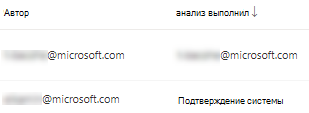
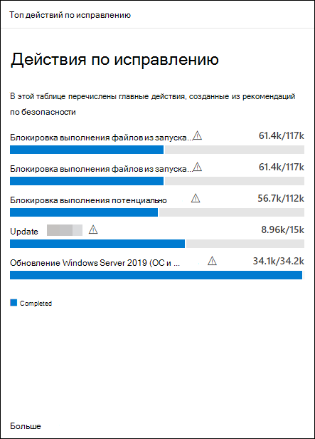

# Устранение уязвимостей с помощью управления угрозами и уязвимостями

[!INCLUDE [Microsoft 365 Defender rebranding](../../includes/microsoft-defender.md)]

**Область применения:**
- [Microsoft Defender для конечной точки](https://go.microsoft.com/fwlink/?linkid=2154037)
- [Управление угрозами и уязвимостями](next-gen-threat-and-vuln-mgt.md)
- [Microsoft 365 Defender](https://go.microsoft.com/fwlink/?linkid=2118804)

>Хотите испытать Microsoft Defender для конечной точки? [Зарегистрився для бесплатной пробной.](https://www.microsoft.com/microsoft-365/windows/microsoft-defender-atp?ocid=docs-wdatp-portaloverview-abovefoldlink)

## Запрос на исправление

Возможности управления угрозами и уязвимостями в Microsoft Defender for Endpoint устраняют разрыв между администраторами безопасности и ИТ-службами с помощью рабочего процесса запроса на исправление. Администраторы безопасности, такие как вы, могут запрашивать у  ИТ-администратора исправление уязвимости со страниц рекомендаций по безопасности в Intune.

### Включить подключение Microsoft Intune

Чтобы использовать эту возможность, встройте подключение Microsoft Intune. В Центре безопасности Защитника Майкрософт перейдите к общим расширенным функциям **Settings**  >    >  **General Advanced.** Прокрутите вниз и найдите **подключение Microsoft Intune.** По умолчанию отключается тоггл. Включите **подключение Microsoft Intune,** чтобы **включить**.

**Примечание.** Если включено подключение Intune, можно создать задачу безопасности Intune при создании запроса на исправление. Этот параметр не появится, если подключение не установлено.

Подробные сведения см. в материале [Использование Intune](https://docs.microsoft.com/intune/atp-manage-vulnerabilities) для устранения уязвимостей, выявленных Microsoft Defender для конечной точки.

### Действия запроса на исправление

1. Перейдите к меню навигации по управлению угрозами и уязвимостями в Центре безопасности Microsoft Defender и выберите [**рекомендации по безопасности.**](tvm-security-recommendation.md)

2. Выберите рекомендацию по безопасности, для чего необходимо запросить исправление, а затем выберите **параметры исправлений.**

3. Заполните форму, в том числе запрашиваемую исправление для применимых групп устройств, приоритета, даты и необязательных заметок.
    1. Если вы выбираете параметр "требуемого внимания", выбор даты не будет доступен, так как не существует конкретных действий.

4. Выберите **отправку запроса**. Отправка запроса на исправление создает элемент действия по исправлению в управлении угрозами и уязвимостью, который можно использовать для мониторинга хода восстановления для этой рекомендации. Это не вызовет исправление и не будет применять какие-либо изменения к устройствам.

5. Уведомите ИТ-администратора о новом запросе и зайдите в Intune, чтобы утвердить или отклонить запрос и запустить развертывание пакета.

6. Перейдите на [**страницу**](tvm-remediation.md) Исправление, чтобы просмотреть состояние запроса на исправление.

Чтобы проверить, как будет показан билет в [Intune,](https://docs.microsoft.com/intune/atp-manage-vulnerabilities) см. в материале Use Intune для устранения уязвимостей, выявленных в Microsoft Defender для конечной точки.

>[!NOTE]
>Если ваш запрос включает в себя исправление более 10 000 устройств, мы можем отправить только 10 000 устройств для восстановления в Intune.

После того, как слабые стороны кибербезопасности организации будут выявлены и отнеслись к рекомендациям по [безопасности,](tvm-security-recommendation.md)приступить к созданию задач безопасности. Задачи можно создавать с помощью интеграции с Microsoft Intune, где создаются билеты на исправление.

Снижение воздействия уязвимостей в организации и повышение конфигурации безопасности путем устранения рекомендаций по безопасности.

## Просмотр действий по исправлению

При отправке запроса на исправление со страницы рекомендации по безопасности оно привнося в действие исправление. Создается задача безопасности, которую можно отслеживать на странице  устранения угроз и уязвимостей, а в Microsoft Intune создается билет на исправление.

Если вы выбрали параметр "требуемого внимания", не будет панели прогресса, состояния билета или даты выполнения, так как не существует фактических действий, которые мы можем отслеживать.

После того как вы находитесь на странице Исправление, выберите действия по исправлению, которые необходимо просмотреть. Вы можете выполнять действия по исправлению, отслеживать ход выполнения, просматривать соответствующие рекомендации, экспортировать в CSV или отмечать как завершенные.

>[!NOTE]
> Существует 180-дневный период хранения для завершенных действий по исправлению. Чтобы страница Исправление выполнялась оптимально, действие по исправлению будет удалено через 6 месяцев после ее завершения.

### Завершено столбцом

Отслеживайте, кто закрыл действие по исправлению с помощью столбца "Завершено" на странице Исправление.

- **Адрес электронной** почты: электронная почта человека, который вручную выполнил задачу
- **Подтверждение системы:** задача была автоматически выполнена (все устройства исправлены)
- **N/A.** Информация недоступна, так как мы не знаем, как была выполнена эта более старая задача

### Топ действий по исправлению в панели мониторинга

Просмотр **топовых действий по** исправлению в панели управления угрозами и [уязвимостью.](tvm-dashboard-insights.md) Выберите любой из записей, чтобы перейти на страницу **Исправление.** Вы можете пометить действие по исправлению после устранения задачи командой ИТ-администратора.

## Статьи по теме

- [Обзор управления угрозами и уязвимостью](next-gen-threat-and-vuln-mgt.md)
- [Панель мониторинга](tvm-dashboard-insights.md)
- [Рекомендации по безопасности](tvm-security-recommendation.md)