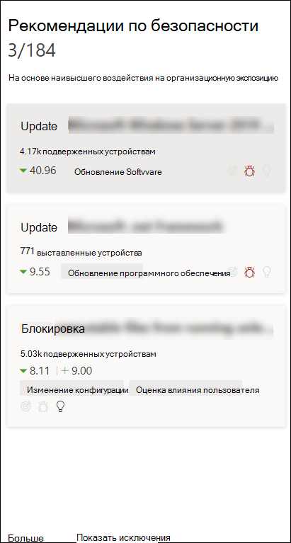
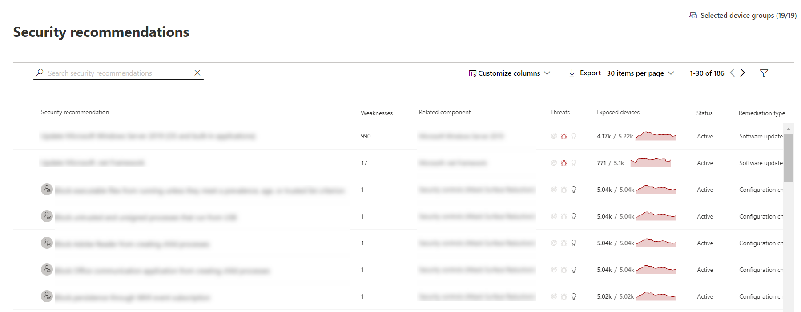
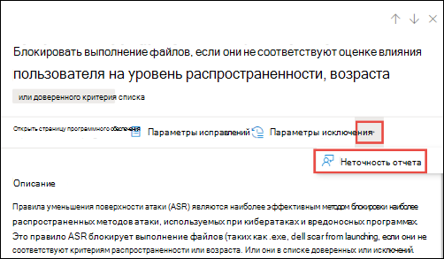

# Рекомендации по безопасности — управление угрозами и уязвимостью

[!INCLUDE [Microsoft 365 Defender rebranding](../../includes/microsoft-defender.md)]

**Область применения:**

- [Microsoft Defender для конечной точки](https://go.microsoft.com/fwlink/?linkid=2154037)
- [Управление угрозами и уязвимостями](next-gen-threat-and-vuln-mgt.md)
- [Microsoft 365 Defender](https://go.microsoft.com/fwlink/?linkid=2118804)

>Хотите испытать Microsoft Defender для конечной точки? [Зарегистрився для бесплатной пробной.](https://www.microsoft.com/microsoft-365/windows/microsoft-defender-atp?ocid=docs-wdatp-portaloverview-abovefoldlink)

Слабые стороны кибербезопасности, выявленные в организации, сооружаются с рекомендациями по безопасности, которые можно действовать, и приоритизируются по их воздействию. Рекомендации с приоритетами помогают сократить время для устранения или устранения уязвимостей и обеспечения соответствия требованиям.

Каждая рекомендация по безопасности включает действия по исправлению. Чтобы помочь в управлении задачами, рекомендации также можно отправить с помощью Microsoft Intune и Microsoft Endpoint Configuration Manager. При изменениях ландшафта угроз рекомендация также изменяется по мере непрерывного сбора сведений из среды.

>[!TIP]
>Чтобы получить сообщения о новых событиях уязвимости, см. в руб. Настройка уведомлений об уязвимости в [Microsoft Defender для endpoint](configure-vulnerability-email-notifications.md)

## Принципы работы

Каждое устройство в организации засмеяно на основе трех важных факторов, которые помогают клиентам сосредоточиться на правильных вещах в нужное время.

- **Threat** — характеристики уязвимостей и эксплойтов в устройствах организации и истории нарушений. На основе этих факторов рекомендации по безопасности показывают соответствующие ссылки на активные оповещения, текущие кампании угроз и соответствующие аналитические отчеты об угрозах.

- **Вероятность нарушения** — осанка безопасности и устойчивость организации к угрозам

- **Бизнес-значение** — активы, критически важные процессы и интеллектуальные свойства вашей организации

## Перейдите на страницу Рекомендации по безопасности

Доступ к странице Рекомендации по безопасности можно найти несколькими способами:

- Меню навигации по управлению угрозами и уязвимостью в [Центре безопасности Защитника Майкрософт](portal-overview.md)
- Рекомендации по безопасности в панели управления [угрозами и уязвимостью](tvm-dashboard-insights.md)

Просмотр соответствующих рекомендаций по безопасности в следующих местах:

- Страница программного обеспечения
- Страница устройства

### Меню навигации

Перейдите к меню навигации по управлению угрозами и уязвимостями и выберите **рекомендации по безопасности.** На странице содержится список рекомендаций по безопасности для угроз и уязвимостей, найденных в организации.

### Рекомендации по безопасности в панели управления угрозами и уязвимостью

В данный день в качестве администратора безопасности вы  можете взглянуть на панель  мониторинга управления угрозами и уязвимостью, чтобы увидеть оценку экспозиции рядом с показателем microsoft [Secure Score для устройств.](tvm-microsoft-secure-score-devices.md) Цель состоит в **том,** чтобы снизить степень  уязвимости вашей организации и повысить безопасность устройств организации, чтобы быть более устойчивыми к атакам угроз кибербезопасности. Верхний список рекомендаций по безопасности поможет вам достичь этой цели.

В верхних рекомендациях по безопасности перечисляются возможности улучшения, приоритизированные на основе важных факторов, упомянутых в предыдущем разделе, — угрозы, вероятности нарушения и значения. Выбор рекомендации поможет вам найти дополнительные сведения на странице рекомендации по безопасности.

## Обзор рекомендаций по безопасности

Просмотр рекомендаций, количество найденных слабых мест, связанных компонентов, анализ угроз, количество выставленных устройств, состояние, тип исправлений, действия по исправлению, влияние на оценку экспозиции и Microsoft Secure Score для устройств и связанные теги.

Цвет диаграммы **подверженных устройств** изменяется по мере изменения тренда. Если количество выставленных устройств растет, цвет меняется на красный. Если количество выставленных устройств уменьшится, цвет графа изменится на зеленый.

>[!NOTE]
>Управление угрозами и уязвимостью показывает устройства, которые использовались до **30 дней** назад. Это отличается от остальной части Microsoft Defender для конечной точки, где если устройство не используется более 7 дней, оно имеет статус "Неактивно".

### Значки

Полезные значки также быстро обращают ваше внимание на:
-  возможные активные оповещения
-  связанные общедоступные эксплойты
-  рекомендации

### Ознакомьтесь с вариантами рекомендаций по безопасности

Выберите рекомендации по безопасности, которые необходимо исследовать или обработать.

Из вылета можно выбрать любой из следующих вариантов:

- **Откройте страницу** программного обеспечения . Откройте страницу программного обеспечения, чтобы получить дополнительный контекст для программного обеспечения и его распространения. Эти сведения могут включать контекст угроз, связанные рекомендации, обнаруженные недостатки, количество открытых устройств, обнаруженные уязвимости, имена и подробные сведения о устройствах с установленным программным обеспечением и распространение версий.

- [**Параметры исправлений**](tvm-remediation.md) . Отправьте запрос на исправление для открытия билета в Microsoft Intune для ИТ-администратора для выбора и адреса. Отслеживание действия по исправлению на странице Исправление.

- [**Параметры исключения**](tvm-exception.md) . Отправка исключения, обоснование и задайте продолжительность исключения, если вы еще не можете устранять проблему.

>[!NOTE]
>При изменении программного обеспечения на устройстве обычно требуется 2 часа для отражения данных на портале безопасности. Однако иногда это может занять больше времени. Изменение конфигурации может занять от 4 до 24 часов.

### Исследование изменений в экспозиции или воздействии устройств

Если происходит большой скачок количества открытых устройств или резкое увеличение влияния на оценку воздействия на организацию и microsoft Secure Score для устройств, то эту рекомендацию по безопасности стоит и расследовать.

1. Выберите страницу рекомендации и **откройте программное обеспечение**
2. Выберите **вкладку Timeline Event** для просмотра всех событий, связанных с этим программным обеспечением, таких как новые уязвимости или новые общедоступные эксплойты. [Дополнительные информацию о временной шкале событий](threat-and-vuln-mgt-event-timeline.md)
3. Решение о том, как решить проблему увеличения или воздействия вашей организации, например отправку запроса на исправление

## Запрос на исправление

Возможность устранения угроз и устранения уязвимостей устраняет разрыв между администраторами безопасности и ИТ-службами с помощью рабочего процесса запроса на исправление. Администраторы безопасности, такие как вы, могут запрашивать у  ИТ-администратора исправление уязвимости со страницы рекомендации по безопасности в Intune. [Дополнительные возможности устранения](tvm-remediation.md)

### Запрос на исправление

Выберите рекомендацию по безопасности, для чего необходимо запросить исправление, а затем выберите **параметры исправлений.** Заполните форму и выберите **отправку запроса**. Перейдите на [**страницу**](tvm-remediation.md) Исправление, чтобы просмотреть состояние запроса на исправление. [Узнайте больше о том, как запросить исправление](tvm-remediation.md#request-remediation)

## Файл для исключения

В качестве альтернативы запросу на исправление, если рекомендация на данный момент не актуальна, можно создать исключения для рекомендаций. [Дополнительные новости об исключениях](tvm-exception.md)

Исключение могут добавлять только пользователи с разрешениями "обработка исключений". [Узнайте больше о ролях RBAC.](user-roles.md)

Когда создается исключение для рекомендации, рекомендация больше не активна. Состояние рекомендации будет изменяться на **полное исключение или** **частичное** исключение (по группе устройств).

### Создание исключения

Выберите рекомендацию по безопасности, для чего необходимо создать исключение, а затем выберите **параметры Исключения.**  

Заполните форму и отправьте. Чтобы просмотреть все исключения (текущие и  прошлые), перейдите  на страницу Исправление в меню Управления  & уязвимостей и выберите вкладку **Исключения.** Дополнительные возможности создания исключения

## Неточность отчета

Вы можете сообщить о ложном срабатыве, если вы увидите какие-либо расплывчатые, неточные, неполные или уже исправленные сведения о рекомендациях безопасности.

1. Откройте рекомендацию по безопасности.

2. Выберите три точки рядом с рекомендациями по безопасности, которые необходимо сообщить, а затем выберите **неточность Отчета.**

    

3. На поле вылетов выберите категорию неточности из выпадаемого меню, заполните адрес электронной почты и сведения о неточности.

4. Выберите **Отправить**. Ваши отзывы немедленно отправляются специалистам по управлению угрозами и уязвимостями.

## Связанные статьи

- [Обзор управления угрозами и уязвимостью](next-gen-threat-and-vuln-mgt.md)
- [Панель мониторинга](tvm-dashboard-insights.md)
- [Оценка экспозиции](tvm-exposure-score.md)
- [Microsoft Secure Score для устройств](tvm-microsoft-secure-score-devices.md)
- [Исправление уязвимостей](tvm-remediation.md)
- [Создание и просмотр исключений для рекомендаций по безопасности](tvm-exception.md)
- [Временная шкала событий](threat-and-vuln-mgt-event-timeline.md)
