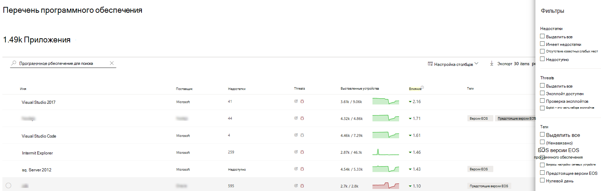
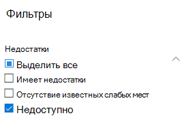
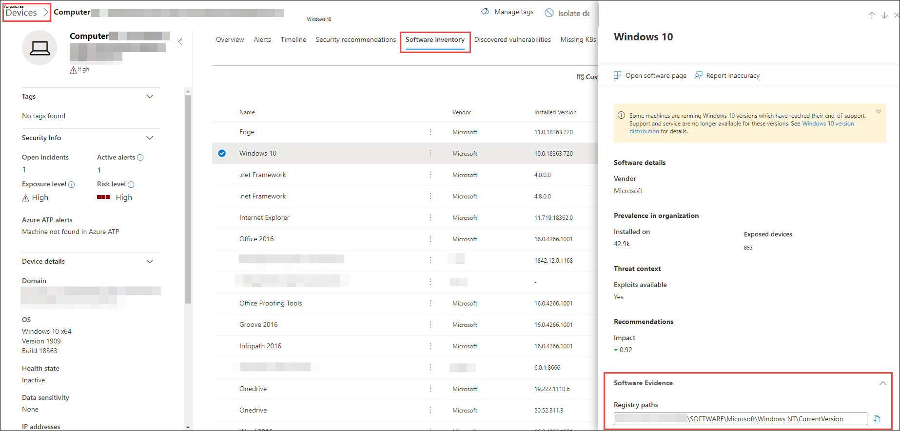

# Инвентаризация программного обеспечения — управление угрозами и уязвимостью

[!INCLUDE [Microsoft 365 Defender rebranding](../../includes/microsoft-defender.md)]

**Область применения:**
- [Microsoft Defender для конечной точки](https://go.microsoft.com/fwlink/?linkid=2154037)
- [Управление угрозами и уязвимостями](next-gen-threat-and-vuln-mgt.md)
- [Microsoft 365 Defender](https://go.microsoft.com/fwlink/?linkid=2118804)

>Хотите испытать Defender для конечной точки? [Зарегистрився для бесплатной пробной.](https://www.microsoft.com/microsoft-365/windows/microsoft-defender-atp?ocid=docs-wdatp-portaloverview-abovefoldlink)

Инвентаризация программного обеспечения в управлении угрозами и уязвимостями — это список известных программ в вашей организации с официальными перечисляниями общей платформы [(CPE).](https://nvd.nist.gov/products/cpe) Программные продукты без официального cpE не имеют опубликованных уязвимостей. Он также включает в себя такие сведения, как имя поставщика, количество слабых мест, угроз и количество выставленных устройств.

## Принципы работы

В области обнаружения мы будем использовать тот же набор сигналов, который отвечает за оценку обнаружения и уязвимости в Microsoft Defender для обнаружения конечных точек и возможностей [реагирования.](overview-endpoint-detection-response.md)

Так как это реальное время, за считанные минуты вы увидите сведения об уязвимости по мере их обнаружения. Двигатель автоматически получает сведения из нескольких каналов безопасности. На самом деле вы увидите, подключено ли определенное программное обеспечение к кампании угроз в прямом эфире. Он также предоставляет ссылку на отчет Threat Analytics, как только он будет доступен.

## Перейдите на страницу инвентаризации программного обеспечения

Доступ к странице инвентаризации  программного обеспечения, выбрав инвентаризацию программного обеспечения из меню навигации по управлению угрозами и уязвимостью в Центре безопасности [Microsoft Defender.](portal-overview.md)

Просмотр программного обеспечения на определенных устройствах на отдельных страницах устройств из [списка устройств.](machines-view-overview.md)

>[!NOTE]
>Если вы ищете программное обеспечение с помощью глобального поиска Microsoft Defender для конечных точек, не забудьте поместить подчеркивать вместо пространства. Например, для наилучших результатов поиска вместо "Windows 10" windows_10".

## Обзор инвентаризации программного обеспечения

Страница **инвентаризации** программного обеспечения открывается со списком программного обеспечения, установленного в сети, включая имя поставщика, найденные недостатки, связанные с ними угрозы, выставленные устройства, влияние на оценку экспозиции и теги.

Вы можете фильтровать представление списка на основе слабых мест, найденных в программном обеспечении, связанных с ними угроз, а также тегов, например, достиг ли программное обеспечение конечной поддержки.

Выберите программное обеспечение, которое необходимо исследовать. Панель вылетов откроется с более компактным представлением сведений на странице. Вы можете погрузиться глубже в исследование и выбрать страницу **Open software** или пометить любые технические несоответствия, выбрав неточность **Отчета.**

### Программное обеспечение, которое не поддерживается

Программное обеспечение, которое в настоящее время не поддерживается управлением & уязвимостей, может присутствовать на странице инвентаризации программного обеспечения. Так как она не поддерживается, доступны будут только ограниченные данные. Фильтруя неподтверченное программное обеспечение с помощью параметра "Недоступный" в разделе "Слабость".

Ниже указывается, что программное обеспечение не поддерживается:

- Поле Недостатки показывает "Недоступный"
- В поле выставленных устройств показана тире
- Информационный текст, добавленный в боковой панели и на странице программного обеспечения
- На странице программного обеспечения не будут иметься рекомендации по безопасности, обнаруженные уязвимости или разделы временной шкалы событий

В настоящее время продукты без CPE не показаны на странице инвентаризации программного обеспечения, только в инвентаризации программного обеспечения уровня устройства.

## Инвентаризация программного обеспечения на устройствах

Из панели навигации Центра безопасности Microsoft Defender перейдите в список **[Устройств.](machines-view-overview.md)** Выберите имя устройства, чтобы открыть страницу устройства (например,  Computer1), а затем выберите вкладку инвентаризации программного обеспечения, чтобы увидеть список всех известных программ, присутствующих на устройстве. Выберите определенную запись программного обеспечения, чтобы открыть вылет с дополнительными сведениями.

Программное обеспечение может быть видно на уровне устройства, даже если оно в настоящее время не поддерживается управлением угрозами и уязвимостью. Однако будут доступны только ограниченные данные. Вы узнаете, не является ли программное обеспечение неподтверченным, так как оно будет говорить "Недоступны" в столбце "Слабость".

Программное обеспечение без CPE также может показываться в этом инвентаре определенного программного обеспечения.

### Доказательства программного обеспечения

См. данные о том, где мы обнаружили определенное программное обеспечение на устройстве из реестра, диска или обоих. Его можно найти на любом устройстве в инвентаре программного обеспечения устройства.

Выберите имя программного обеспечения, чтобы открыть флайер, и посмотрите раздел под названием "Software Evidence".

## Страницы программного обеспечения

Страницы программного обеспечения можно просмотреть несколькими способами:

- Страница инвентаризации программного обеспечения > выберите имя программного > **Выберите** страницу открытого программного обеспечения в вылете
- [Страница рекомендации по](tvm-security-recommendation.md) безопасности > выберите > **выберите** открытую страницу программного обеспечения в вылете
- [Страница временной](threat-and-vuln-mgt-event-timeline.md) шкалы событий > Выберите событие > Выберите имя гиперссылкой программного обеспечения (например, Visual Studio 2017 г.) в разделе "Связанный компонент" в вылете

 Полная страница будет отображаться со всеми сведениями о определенном программном обеспечении и следующей информацией:

- Боковая панель с сведениями о поставщике, распространенность программного обеспечения в организации (включая количество установленных на нем устройств, а также открытые устройства, которые не исправлены), доступ и использование, а также влияние на оценку экспозиции.
- Визуализации данных с указанием количества и серьезности уязвимостей и неправильной оценки. Кроме того, графики с количеством выставленных устройств.
- Вкладки, показывающие такие сведения, как:
    - Соответствующие рекомендации по безопасности для выявленных недостатков и уязвимостей.
    - Именуются резюме обнаруженных уязвимостей.
    - Устройства с установленным программным обеспечением (наряду с именем устройства, доменом, ОС и другими).
    - Список версий программного обеспечения (включая количество устройств, на которых установлена версия, количество обнаруженных уязвимостей и имена установленных устройств).

    

## Неточность отчета

Сообщаем о ложном срабатыве, когда вы видите какие-либо расплывчатые, неточные или неполные сведения. Вы также можете сообщить о рекомендациях по безопасности, которые уже исправлены.

1. Откройте вылет программного обеспечения на странице инвентаризации программного обеспечения.
2. Выберите **неточность отчета.**
3. Из области вылетов выберите категорию неточности из выпадаемого меню, заполните адрес электронной почты и сведения о неточности.
4. Выберите **Отправить**. Ваши отзывы немедленно отправляются специалистам по управлению угрозами и уязвимостями.

## Связанные статьи

- [Обзор управления угрозами и уязвимостью](next-gen-threat-and-vuln-mgt.md)
- [Рекомендации по безопасности](tvm-security-recommendation.md)
- [Временная шкала событий](threat-and-vuln-mgt-event-timeline.md)
- [Просмотр и организация списка конечных устройств Microsoft Defender для конечных точек](machines-view-overview.md)
