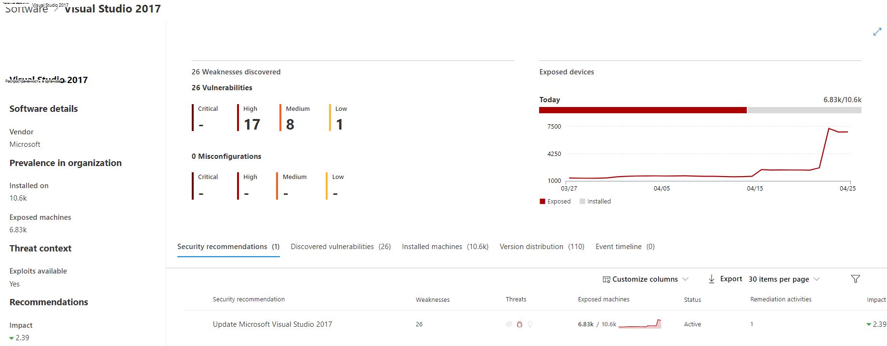

# Инвентаризация программного обеспечения — управление угрозами и уязвимостьюSoftware inventory - threat and vulnerability management

[!INCLUDE [Microsoft 365 Defender rebranding](../../includes/microsoft-defender.md)]

**Область применения:****Applies to:**
- [Microsoft Defender для конечной точкиMicrosoft Defender for Endpoint](https://go.microsoft.com/fwlink/?linkid=2154037)
- [Управление угрозами и уязвимостямиThreat and vulnerability management](next-gen-threat-and-vuln-mgt.md)
- [Microsoft 365 DefenderMicrosoft 365 Defender](https://go.microsoft.com/fwlink/?linkid=2118804)

>Хотите испытать Defender для конечной точки?Want to experience Defender for Endpoint? [Зарегистрився для бесплатной пробной.Sign up for a free trial.](https://www.microsoft.com/microsoft-365/windows/microsoft-defender-atp?ocid=docs-wdatp-portaloverview-abovefoldlink)

Инвентаризация программного обеспечения в управлении угрозами и уязвимостями — это список известных программ в вашей организации с официальными перечисляниями общей платформы [(CPE).](https://nvd.nist.gov/products/cpe)The software inventory in threat and vulnerability management is a list of known software in your organization with official [Common Platform Enumerations (CPE)](https://nvd.nist.gov/products/cpe). Программные продукты без официального cpE не имеют опубликованных уязвимостей.Software products without an official CPE don’t have vulnerabilities published. Он также включает в себя такие сведения, как имя поставщика, количество слабых мест, угроз и количество выставленных устройств.It also includes details such as the name of the vendor, number of weaknesses, threats, and number of exposed devices.

## Принципы работыHow it works

В области обнаружения мы будем использовать тот же набор сигналов, который отвечает за оценку обнаружения и уязвимости в Microsoft Defender для обнаружения конечных точек и возможностей [реагирования.](overview-endpoint-detection-response.md)In the field of discovery, we're leveraging the same set of signals that is responsible for detection and vulnerability assessment in [Microsoft Defender for Endpoint detection and response capabilities](overview-endpoint-detection-response.md).

Так как это реальное время, за считанные минуты вы увидите сведения об уязвимости по мере их обнаружения.Since it's real time, in a matter of minutes, you'll see vulnerability information as they get discovered. Двигатель автоматически получает сведения из нескольких каналов безопасности.The engine automatically grabs information from multiple security feeds. На самом деле вы увидите, подключено ли определенное программное обеспечение к кампании угроз в прямом эфире.In fact, you'll see if a particular software is connected to a live threat campaign. Он также предоставляет ссылку на отчет Threat Analytics, как только он будет доступен.It also provides a link to a Threat Analytics report soon as it's available.

## Перейдите на страницу инвентаризации программного обеспеченияNavigate to the Software inventory page

Доступ к странице инвентаризации  программного обеспечения, выбрав инвентаризацию программного обеспечения из меню навигации по управлению угрозами и уязвимостью в Центре безопасности [Microsoft Defender.](portal-overview.md)Access the Software inventory page by selecting **Software inventory** from the threat and vulnerability management navigation menu in the [Microsoft Defender Security Center](portal-overview.md).

Просмотр программного обеспечения на определенных устройствах на отдельных страницах устройств из [списка устройств.](machines-view-overview.md)View software on specific devices in the individual devices pages from the [devices list](machines-view-overview.md).

>[!NOTE]
>Если вы ищете программное обеспечение с помощью глобального поиска Microsoft Defender для конечных точек, не забудьте поместить подчеркивать вместо пространства.If you search for software using the Microsoft Defender for Endpoint global search, make sure to put an underscore instead of a space. Например, для наилучших результатов поиска вместо "Windows 10" windows_10".For example, for the best search results you'd write "windows_10" instead of "Windows 10".

## Обзор инвентаризации программного обеспеченияSoftware inventory overview

Страница **инвентаризации** программного обеспечения открывается со списком программного обеспечения, установленного в сети, включая имя поставщика, найденные недостатки, связанные с ними угрозы, выставленные устройства, влияние на оценку экспозиции и теги.The **Software inventory** page opens with a list of software installed in your network, including the vendor name, weaknesses found, threats associated with them, exposed devices, impact to exposure score, and tags.

Вы можете фильтровать представление списка на основе слабых мест, найденных в программном обеспечении, связанных с ними угроз, а также тегов, например, достиг ли программное обеспечение конечной поддержки.You can filter the list view based on weaknesses found in the software, threats associated with them, and tags like whether the software has reached end-of-support.

Выберите программное обеспечение, которое необходимо исследовать.Select the software that you want to investigate. Панель вылетов откроется с более компактным представлением сведений на странице.A flyout panel will open with a more compact view of the information on the page. Вы можете погрузиться глубже в исследование и выбрать страницу **Open software** или пометить любые технические несоответствия, выбрав неточность **Отчета.**You can either dive deeper into the investigation and select **Open software page**, or flag any technical inconsistencies by selecting **Report inaccuracy**.

### Программное обеспечение, которое не поддерживаетсяSoftware that isn't supported

Программное обеспечение, которое в настоящее время не поддерживается управлением & уязвимостей, может присутствовать на странице инвентаризации программного обеспечения.Software that isn't currently supported by threat & vulnerability management may be present in the Software inventory page. Так как она не поддерживается, доступны будут только ограниченные данные.Because it is not supported, only limited data will be available. Фильтруя неподтверченное программное обеспечение с помощью параметра "Недоступный" в разделе "Слабость".Filter by unsupported software with the "Not available" option in the "Weakness" section.

Ниже указывается, что программное обеспечение не поддерживается:The following indicates that a software is not supported:

- Поле Недостатки показывает "Недоступный"Weaknesses field shows "Not available"
- В поле выставленных устройств показана тиреExposed devices field shows a dash
- Информационный текст, добавленный в боковой панели и на странице программного обеспеченияInformational text added in side panel and in software page
- На странице программного обеспечения не будут иметься рекомендации по безопасности, обнаруженные уязвимости или разделы временной шкалы событийThe software page won't have the security recommendations, discovered vulnerabilities, or event timeline sections

В настоящее время продукты без CPE не показаны на странице инвентаризации программного обеспечения, только в инвентаризации программного обеспечения уровня устройства.Currently, products without a CPE are not shown in the software inventory page, only in the device level software inventory.

## Инвентаризация программного обеспечения на устройствахSoftware inventory on devices

Из панели навигации Центра безопасности Microsoft Defender перейдите в список **[Устройств.](machines-view-overview.md)**From the Microsoft Defender Security Center navigation panel, go to the **[Devices list](machines-view-overview.md)**. Выберите имя устройства, чтобы открыть страницу устройства (например,  Computer1), а затем выберите вкладку инвентаризации программного обеспечения, чтобы увидеть список всех известных программ, присутствующих на устройстве.Select the name of a device to open the device page (like Computer1), then select the **Software inventory** tab to see a list of all the known software present on the device. Выберите определенную запись программного обеспечения, чтобы открыть вылет с дополнительными сведениями.Select a specific software entry to open the flyout with more information.

Программное обеспечение может быть видно на уровне устройства, даже если оно в настоящее время не поддерживается управлением угрозами и уязвимостью.Software may be visible at the device level even if it is currently not supported by threat and vulnerability management. Однако будут доступны только ограниченные данные.However, only limited data will be available. Вы узнаете, не является ли программное обеспечение неподтверченным, так как оно будет говорить "Недоступны" в столбце "Слабость".You'll know if software is unsupported because it will say "Not available" in the "Weakness" column.

Программное обеспечение без CPE также может показываться в этом инвентаре определенного программного обеспечения.Software with no CPE can also show up under this device specific software inventory.

### Доказательства программного обеспеченияSoftware evidence

См. данные о том, где мы обнаружили определенное программное обеспечение на устройстве из реестра, диска или обоих. Его можно найти на любом устройстве в инвентаре программного обеспечения устройства.See evidence of where we detected a specific software on a device from the registry, disk, or both.You can find it on any device in the device software inventory.

Выберите имя программного обеспечения, чтобы открыть флайер, и посмотрите раздел под названием "Software Evidence".Select a software name to open the flyout, and look for the section called "Software Evidence."

## Страницы программного обеспеченияSoftware pages

Страницы программного обеспечения можно просмотреть несколькими способами:You can view software pages a few different ways:

- Страница инвентаризации программного обеспечения > выберите имя программного > **Выберите** страницу открытого программного обеспечения в вылетеSoftware inventory page > Select a software name > Select **Open software page** in the flyout
- [Страница рекомендации по](tvm-security-recommendation.md) безопасности > выберите > **выберите** открытую страницу программного обеспечения в вылете[Security recommendations page](tvm-security-recommendation.md) > Select a recommendation > Select **Open software page** in the flyout
- [Страница временной](threat-and-vuln-mgt-event-timeline.md) шкалы событий > Выберите событие > Выберите имя гиперссылкой программного обеспечения (например, Visual Studio 2017 г.) в разделе "Связанный компонент" в вылете[Event timeline page](threat-and-vuln-mgt-event-timeline.md) > Select an event > Select the hyperlinked software name (like Visual Studio 2017) in the section called "Related component" in the flyout

 Полная страница будет отображаться со всеми сведениями о определенном программном обеспечении и следующей информацией:A full page will appear with all the details of a specific software and the following information:

- Боковая панель с сведениями о поставщике, распространенность программного обеспечения в организации (включая количество установленных на нем устройств, а также открытые устройства, которые не исправлены), доступ и использование, а также влияние на оценку экспозиции.Side panel with vendor information, prevalence of the software in the organization (including number of devices it's installed on, and exposed devices that aren't patched), whether and exploit is available, and impact to your exposure score.
- Визуализации данных с указанием количества и серьезности уязвимостей и неправильной оценки.Data visualizations showing the number of, and severity of, vulnerabilities and misconfigurations. Кроме того, графики с количеством выставленных устройств.Also, graphs with the number of exposed devices.
- Вкладки, показывающие такие сведения, как:Tabs showing information such as:
    - Соответствующие рекомендации по безопасности для выявленных недостатков и уязвимостей.Corresponding security recommendations for the weaknesses and vulnerabilities identified.
    - Именуются резюме обнаруженных уязвимостей.Named CVEs of discovered vulnerabilities.
    - Устройства с установленным программным обеспечением (наряду с именем устройства, доменом, ОС и другими).Devices that have the software installed (along with device name, domain, OS, and more).
    - Список версий программного обеспечения (включая количество устройств, на которых установлена версия, количество обнаруженных уязвимостей и имена установленных устройств).Software version list (including number of devices the version is installed on, the number of discovered vulnerabilities, and the names of the installed devices).

    

## Неточность отчетаReport inaccuracy

Сообщаем о ложном срабатыве, когда вы видите какие-либо расплывчатые, неточные или неполные сведения.Report a false positive when you see any vague, inaccurate, or incomplete information. Вы также можете сообщить о рекомендациях по безопасности, которые уже исправлены.You can also report on security recommendations that have already been remediated.

1. Откройте вылет программного обеспечения на странице инвентаризации программного обеспечения.Open the software flyout on the Software inventory page.
2. Выберите **неточность отчета.**Select **Report inaccuracy**.
3. Из области вылетов выберите категорию неточности из выпадаемого меню, заполните адрес электронной почты и сведения о неточности.From the flyout pane, select the inaccuracy category from the drop-down menu, fill in your email address, and details about the inaccuracy.
4. Выберите **Отправить**.Select **Submit**. Ваши отзывы немедленно отправляются специалистам по управлению угрозами и уязвимостями.Your feedback is immediately sent to the threat and vulnerability management experts.

## Статьи по темеRelated articles

- [Обзор управления угрозами и уязвимостьюThreat and vulnerability management overview](next-gen-threat-and-vuln-mgt.md)
- [Рекомендации по безопасностиSecurity recommendations](tvm-security-recommendation.md)
- [Временная шкала событияEvent timeline](threat-and-vuln-mgt-event-timeline.md)
- [Просмотр и организация списка конечных устройств Microsoft Defender для конечных точекView and organize the Microsoft Defender for Endpoint Devices list](machines-view-overview.md)
