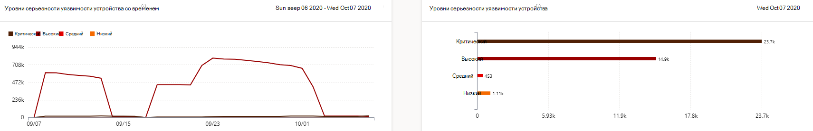
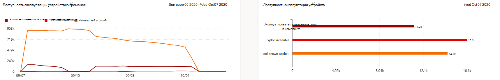
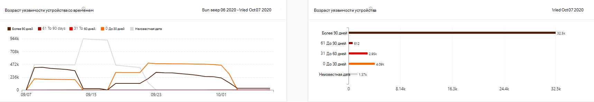
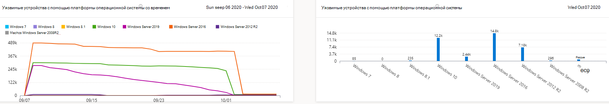
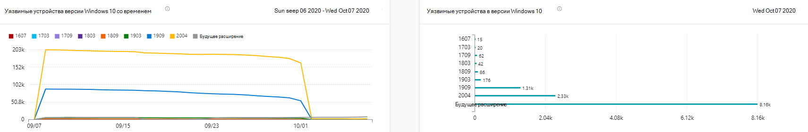

# Отчет об уязвимых устройствах — управление угрозами и уязвимостью

[!INCLUDE [Microsoft 365 Defender rebranding](../../includes/microsoft-defender.md)]

**Область применения:**

- [Microsoft Defender для конечной точки](https://go.microsoft.com/fwlink/?linkid=2154037)
- [Управление угрозами и уязвимостями](next-gen-threat-and-vuln-mgt.md)
- [Microsoft 365 Defender](https://go.microsoft.com/fwlink/?linkid=2118804)

>Хотите испытать Microsoft Defender для конечной точки? [Зарегистрився для бесплатной пробной.](https://www.microsoft.com/microsoft-365/windows/microsoft-defender-atp?ocid=docs-wdatp-portaloverview-abovefoldlink)

В отчете показаны графики и диаграммы с уязвимыми тенденциями устройства и текущей статистикой. Цель состоит в том, чтобы вы понимали дыхание и область экспозиции устройства. 

Доступ к отчету в Центре безопасности Защитника Майкрософт, переехав на > **уязвимые устройства**

Существует два столбца:

- Тенденции (со временем). Может показывать последние 30 дней, 3 месяца, 6 месяцев или настраиваемый диапазон дат.
- Сегодня (текущая информация)

**Фильтр.** Можно фильтровать данные по уровням серьезности уязвимости, доступности эксплуатации, возрасту уязвимости, платформе операционной системы, версии Windows 10 или группе устройств.

**Сверлить.** Если необходимо изучить дополнительные сведения, выберите соответствующую планку, чтобы просмотреть отфильтрованный список устройств на странице инвентаризации устройств. Оттуда можно экспортировать список.

## Графы уровня серьезности

Каждое устройство считается только один раз в соответствии с самой серьезной уязвимостью, найденной на этом устройстве.

## Использование графиков доступности

Каждое устройство считается только один раз на основе самого высокого уровня известного эксплойта.

## Графики возраста уязвимости

Каждое устройство считается только один раз в соответствии с самой старой датой публикации уязвимости. Более старые уязвимости имеют более высокую вероятность использования.

## Уязвимые устройства с помощью графиков платформ операционной системы

Количество устройств на каждой операционной системе, которые подвергаются воздействию уязвимостей программного обеспечения.

## Уязвимые устройства с помощью графиков версий Windows 10

Количество устройств в каждой версии Windows 10, которые подвергаются воздействию уязвимых приложений или ОС.

## Статьи по теме

- [Обзор управления угрозами и уязвимостью](next-gen-threat-and-vuln-mgt.md)
- [Рекомендации по безопасности](tvm-security-recommendation.md)
