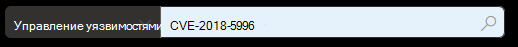
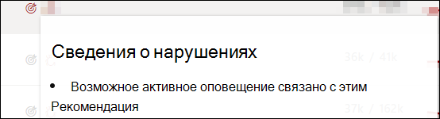
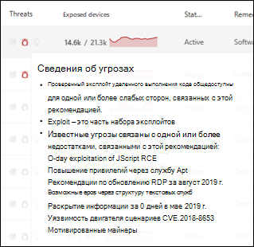
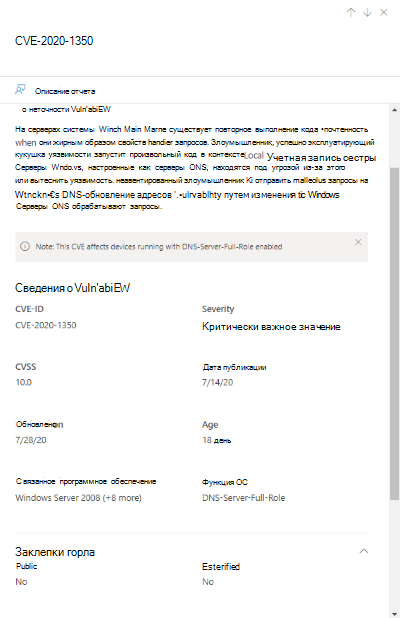
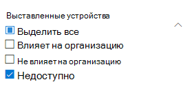
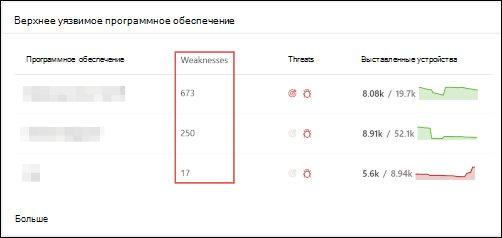
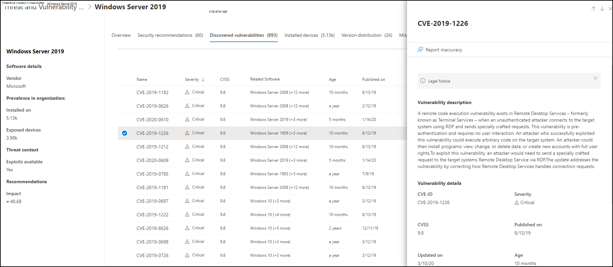
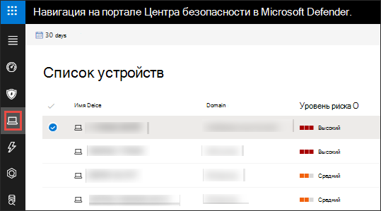
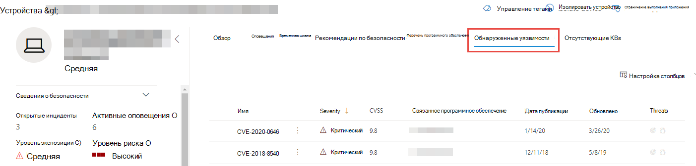
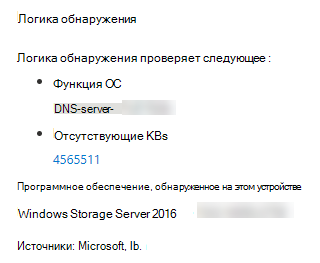

# Уязвимости в организации — управление угрозами и уязвимостями

[!INCLUDE [Microsoft 365 Defender rebranding](../../includes/microsoft-defender.md)]

**Область применения:**
- [Microsoft Defender для конечной точки](https://go.microsoft.com/fwlink/?linkid=2154037)
- [Управление угрозами и уязвимостями](next-gen-threat-and-vuln-mgt.md)
- [Microsoft 365 Defender](https://go.microsoft.com/fwlink/?linkid=2118804)

>Хотите испытать Microsoft Defender для конечной точки? [Зарегистрився для бесплатной пробной.](https://www.microsoft.com/microsoft-365/windows/microsoft-defender-atp?ocid=docs-wdatp-portaloverview-abovefoldlink)

Управление угрозами и уязвимостями использует те же сигналы в защите конечной точки Defender для конечной точки Для сканирования и обнаружения уязвимостей.

На **странице "Недостатки"** перечислены уязвимости программного обеспечения, на которые могут быть выставлены устройства, перечисляя общий ID уязвимостей и воздействий (CVE). Вы также можете просмотреть степень серьезности, оценку системы оценки общей уязвимости (CVSS), распространенность в организации, соответствующие нарушения, сведения об угрозах и другие.

>[!NOTE]
>Если для уязвимости не назначен официальный CVE-ID, имя уязвимости назначено управлением угрозами и уязвимостью.

>[!TIP]
>Чтобы получить сообщения о новых событиях уязвимости, см. в руб. Настройка уведомлений об уязвимости в [Microsoft Defender для endpoint](configure-vulnerability-email-notifications.md)

## Перейдите на страницу "Слабые места"

Доступ к странице Недостатки несколько различных способов:

- Выбор **слабых мест** из меню навигации по управлению угрозами и уязвимостью в [Центре безопасности Защитника Майкрософт](portal-overview.md)
- Глобальный поиск

### Меню навигации

Перейдите в меню навигации по управлению угрозами и уязвимостями и выберите **Недостатки,** чтобы открыть список резюме.

### Уязвимости в глобальном поиске

1. Перейдите в глобальное выпадаемое меню поиска.
2. Выберите **ИД** уязвимости и ключа в ИД "Общие уязвимости и воздействия" (CVE), который вы ищете, а затем выберите значок поиска. Страница **"Слабые** места" открывается сведениями CVE, которые вы ищете.

3. Выберите CVE, чтобы открыть панель вылетов с дополнительными сведениями, в том числе описанием уязвимости, сведениями, сведениями об угрозах и выставленными устройствами.

Чтобы увидеть остальные уязвимости на странице **Недостатки,** введите CVE, а затем выберите поиск.

## Обзор слабых сторон

Исправление уязвимостей на открытых устройствах, чтобы снизить риск для ваших активов и организации. Если **столбец Exposed Devices** показывает 0, это означает, что вы не подвержены риску.

### Сведения о нарушениях и угрозах

Просмотр всех связанных с этим нарушений и представлений об угрозах в столбце **Угроза,** когда значки окрашены в красный цвет.

 >[!NOTE]
 > Всегда приоритизуйте рекомендации, связанные с текущими угрозами. Эти рекомендации отмечены значком "Понимание  и значок  цель. .  

Значок анализа нарушений выделяется при обнаружении уязвимости в организации.

Значок сведения об угрозах выделяется, если в уязвимости, обнаруженной в организации, имеются связанные эксплойты. Наведении на значок показывает, является ли угроза частью набора эксплойтов или подключена к определенным расширенным устойчивым кампаниям или группам действий. При наличии имеется ссылка на отчет Threat Analytics с новостями об эксплуатации, раскрытием информации или связанными с ними советами по безопасности.  

### Получение информации об уязвимости

Если выбрать CVE, панель вылетов откроется дополнительными сведениями, такими как описание уязвимости, сведения, сведения об угрозах и выставленные устройства.

- Категория "ФУНКЦИЯ ОС" показана в соответствующих сценариях
- Вы можете перейти к связанной рекомендации по безопасности для каждого CVE с выставленным устройством

 

### Программное обеспечение, которое не поддерживается

CvEs для программного обеспечения, которое в настоящее время не поддерживается управлением & уязвимостей, по-прежнему присутствует на странице Weaknesses. Поскольку программное обеспечение не поддерживается, доступны будут только ограниченные данные.

Сведения об открытых устройствах не будут доступны для резюме с неподтверченным программным обеспечением. Фильтруя неподтверченное программное обеспечение, выбрав параметр "Недоступный" в разделе "Подверженные устройствам".

 

## Просмотр записей об общих уязвимостях и воздействиях (CVE) в других местах

### Верхнее уязвимое программное обеспечение на панели мониторинга

1. Перейдите к панели мониторинга управления угрозами и [уязвимостью](tvm-dashboard-insights.md) и прокрутите вниз к **виджету верхнего уязвимого программного** обеспечения. Вы увидите количество уязвимостей, найденных в каждом программном обеспечении, а также сведения об угрозах и представление на высоком уровне экспозиции устройства с течением времени.

    

2. Выберите программное обеспечение, которое необходимо исследовать, чтобы перейти на страницу сверления.
3. Выберите **вкладку Обнаруженные уязвимости.**
4. Выберите уязвимость, которую необходимо исследовать, чтобы получить дополнительные сведения о деталях уязвимости

    

### Обнаружение уязвимостей на странице устройства

Просмотр связанных сведений о недостатках на странице устройства.

1. Перейдите к панели меню навигации Центра безопасности Microsoft Defender, а затем выберите значок устройства. Откроется **страница списка Устройств.**
2. На странице **Список устройств** выберите имя устройства, которое необходимо исследовать.

    

3. Страница устройства откроется с подробными сведениями и вариантами ответа для устройства, которое необходимо исследовать.
4. Выберите **обнаруженные уязвимости.**

    

5. Выберите уязвимость, которую необходимо исследовать, чтобы открыть панель вылетов с данными CVE, такими как: описание уязвимости, анализ угроз и логика обнаружения.

#### Логика обнаружения CVE

Как и данные программного обеспечения, теперь мы показывем логику обнаружения, которую мы применили на устройстве, чтобы указать, что оно уязвимо. Новый раздел называется "Логика обнаружения" (в любой обнаруженной уязвимости на странице устройства) и показывает логику обнаружения и источник.

Категория "ФУНКЦИЯ ОС" также показана в соответствующих сценариях. CVE влияет на устройства с уязвимой ОС только в том случае, если включен определенный компонент ОС. Допустим, Windows Server 2019 имеет уязвимость в компоненте DNS. С помощью этой новой возможности мы прикрепим этот CVE только к устройствам Windows Server 2019 с возможностью DNS, включенной в их ОС.

## Неточность отчета

Сообщаем о ложном срабатыве, когда вы видите какие-либо расплывчатые, неточные или неполные сведения. Вы также можете сообщить о рекомендациях по безопасности, которые уже исправлены.

1. Откройте CVE на странице Недостатки.
2. Выберите **неточность** Отчета и откроется поле для вылетов.
3. Выберите категорию неточности из выпадаемого меню и заполните адрес электронной почты и сведения о неточности.
4. Выберите **Отправить**. Ваши отзывы немедленно отправляются специалистам по управлению угрозами и уязвимостями.

## Связанные статьи

- [Обзор управления угрозами и уязвимостью](next-gen-threat-and-vuln-mgt.md)
- [Рекомендации по безопасности](tvm-security-recommendation.md)
- [Перечень программного обеспечения](tvm-software-inventory.md)
- [Сведения о панели мониторинга](tvm-dashboard-insights.md)
- [Просмотр и организация списка конечных устройств Microsoft Defender для конечных точек](machines-view-overview.md)
