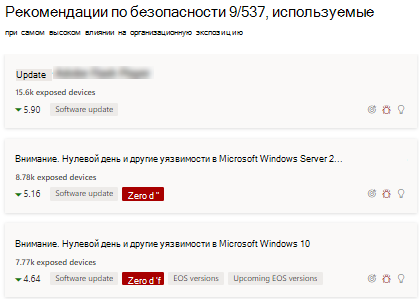
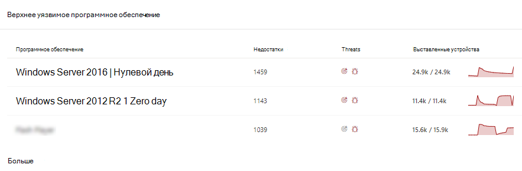
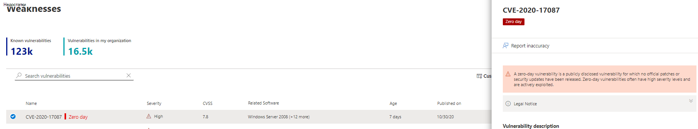
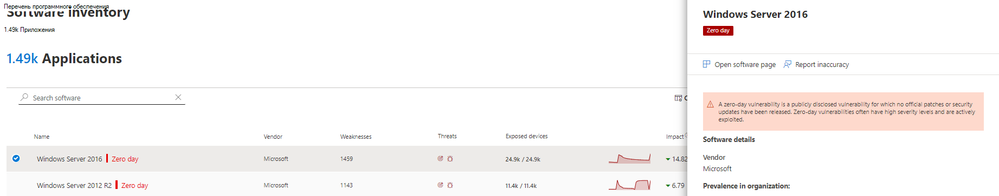
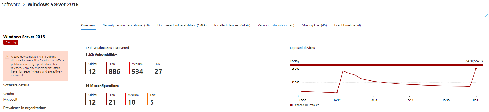
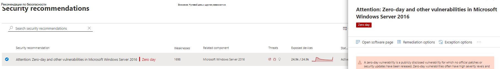
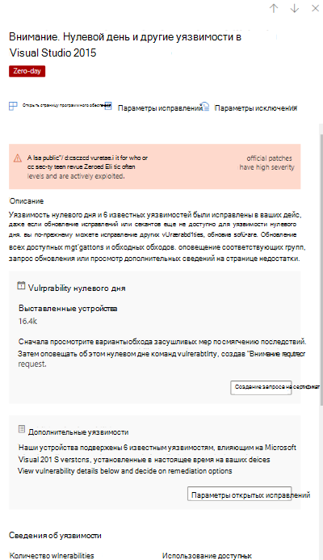
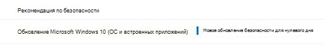

# Уменьшение уязвимостей нулевого дня — контроль угроз и уязвимостейMitigate zero-day vulnerabilities - threat and vulnerability management

[!INCLUDE [Microsoft 365 Defender rebranding](../../includes/microsoft-defender.md)]

**Область применения:****Applies to:**

- [Microsoft Defender для конечной точкиMicrosoft Defender for Endpoint](https://go.microsoft.com/fwlink/?linkid=2154037)
- [Угроза и управление уязвимостямиThreat and vulnerability management](next-gen-threat-and-vuln-mgt.md)
- [Microsoft 365 DefenderMicrosoft 365 Defender](https://go.microsoft.com/fwlink/?linkid=2118804)

>Хотите испытать Microsoft Defender для конечной точки?Want to experience Microsoft Defender for Endpoint? [Зарегистрився для бесплатной пробной.Sign up for a free trial.](https://www.microsoft.com/microsoft-365/windows/microsoft-defender-atp?ocid=docs-wdatp-portaloverview-abovefoldlink)

Уязвимость нулевого дня — это открыто раскрытая уязвимость, для которой не были выпущены официальные исправления или обновления безопасности.A zero-day vulnerability is a publicly disclosed vulnerability for which no official patches or security updates have been released. Уязвимости нулевого дня часто имеют высокий уровень серьезности и активно используются.Zero-day vulnerabilities often have high severity levels and are actively exploited.

Угрозы и управление уязвимостями будут отображаться только уязвимости нулевого дня, о них есть сведения.Threat and vulnerability management will only display zero-day vulnerabilities it has information about.

## Поиск сведений об уязвимостях нулевого дняFind information about zero-day vulnerabilities

После того, как уязвимость нулевого дня будет найдена, сведения о ней будут переданы в следующих Центр безопасности в Microsoft Defender.Once a zero-day vulnerability has been found, information about it will be conveyed through the following experiences in the Microsoft Defender Security Center.

>[!NOTE]
> 0-дневная возможность уязвимости в настоящее время доступна только для Windows продуктов.0-day vulnerability capability is currently available only for Windows products.

### Панель мониторинга угроз и управление уязвимостямиThreat and vulnerability management dashboard

Найди рекомендации с тегом нулевого дня в карточке "Рекомендации по безопасности".Look for recommendations with a zero-day tag in the “Top security recommendations” card.

Поиск верхнего программного обеспечения с тегом нулевого дня в карточке "Верхнее уязвимое программное обеспечение".Find top software with the zero-day tag in the "Top vulnerable software" card.

### Страница НедостаткиWeaknesses page

Ищи уязвимость с именем нулевого дня вместе с описанием и сведениями.Look for the named zero-day vulnerability along with a description and details.

- Если этой уязвимости назначен CVE-ID, рядом с именем CVE будет обозначена метка нулевого дня.If this vulnerability has a CVE-ID assigned, you’ll see the zero-day label next to the CVE name.

- Если эта уязвимость не назначена CVE-ID, ее можно найти под внутренним временным именем, которое выглядит как "TVM-XXXX-XXXX".If this vulnerability has no CVE-ID assigned, you'll find it under an internal, temporary name that looks like “TVM-XXXX-XXXX”. Имя будет обновляться после присвоения официального CVE-ID, но предыдущее внутреннее имя по-прежнему будет искаться и находится в боковой панели.The name will be updated once an official CVE-ID has been assigned, but the previous internal name will still be searchable and found in the side-panel.

### Страница инвентаризации программного обеспеченияSoftware inventory page

И посмотрите на программное обеспечение с тегом нулевого дня.Look for software with the zero-day tag. Фильтр по тегу "нулевой день", чтобы видеть только программное обеспечение с уязвимостями нулевого дня.Filter by the "zero day" tag to only see software with zero-day vulnerabilities.

### Страница программного обеспеченияSoftware page

Ищи тег нулевого дня для каждого программного обеспечения, на которое повлияла уязвимость нулевого дня.Look for a zero-day tag for each software that has been affected by the zero–day vulnerability.

### Страница рекомендации по безопасностиSecurity recommendations page

Просмотр четких предложений о вариантах устранения и смягчения последствий, включая обходные пути, если они существуют.View clear suggestions about remediation and mitigation options, including workarounds if they exist. Фильтр по тегу "нулевой день", чтобы увидеть только рекомендации по безопасности, адресованные уязвимостям нулевого дня.Filter by the "zero day" tag to only see security recommendations addressing zero-day vulnerabilities.

Если есть программное обеспечение с нулевой уязвимостью и дополнительные уязвимости для устранения, вы получите одну рекомендацию обо всех уязвимостях.If there's software with a zero-day vulnerability and additional vulnerabilities to address, you'll get one recommendation about all vulnerabilities.

## Устранение уязвимостей нулевого дняAddressing zero-day vulnerabilities

Перейдите на страницу рекомендации по безопасности и выберите рекомендацию с нулевой дневным значением.Go to the security recommendation page and select a recommendation with a zero-day. Вылет откроется с информацией о нулевом дне и других уязвимостях для этого программного обеспечения.A flyout will open with information about the zero-day and other vulnerabilities for that software.

Там будет ссылка на варианты смягчения и обходные пути, если они доступны.There will be a link to mitigation options and workarounds if they are available. Обходные пути могут помочь снизить риск, связанный с этой уязвимостью нулевого дня, пока не будет развернуто исправление или обновление безопасности.Workarounds may help reduce the risk posed by this zero-day vulnerability until a patch or security update can be deployed.

Откройте параметры восстановления и выберите тип внимания.Open remediation options and choose the attention type. Для уязвимостей нулевого дня рекомендуется использовать "требуемое внимание", так как обновление еще не выпущено.An "attention required" remediation option is recommended for the zero-day vulnerabilities, since an update hasn't been released yet. Вы не сможете выбрать дату выполнения, так как никаких конкретных действий не выполняется.You won't be able to select a due date, since there's no specific action to perform. Если для этого программного обеспечения существуют более старые уязвимости, которые требуется исправление, можно переопределить параметр "требуемого внимания" и выбрать "обновление".If there are older vulnerabilities for this software you wish to remediation, you can override the "attention required" remediation option and choose “update.”

## Отслеживание действий по устранению последствий нулевого дняTrack zero-day remediation activities

Перейдите на страницу  контроль угроз и уязвимостей исправлений, чтобы просмотреть элемент действия по исправлению.Go to the threat and vulnerability management [Remediation](tvm-remediation.md) page to view the remediation activity item. Если вы выбрали параметр "требуемого внимания", то не будет панели прогресса, состояния билета или даты выполнения, так как нет фактических действий, которые мы можем отслеживать.If you chose the "attention required" remediation option, there will be no progress bar, ticket status, or due date since there's no actual action we can monitor. Вы можете фильтровать по типу исправлений, например "обновление программного обеспечения" или "необходимое внимание", чтобы увидеть все элементы активности в одной категории.You can filter by remediation type, such as "software update" or "attention required," to see all activity items in the same category.

## Исправление уязвимостей нулевого дняPatching zero-day vulnerabilities

Когда исправление будет выпущено в нулевой день, рекомендация будет изменена на "Update" и с синей меткой рядом с ней с надписью "Новое обновление безопасности для нулевого дня".When a patch is released for the zero-day, the recommendation will be changed to “Update” and a blue label next to it that says “New security update for zero day.” Он больше не будет рассматриваться как нулевой день, тег нулевого дня будет удален со всех страниц.It will no longer consider as a zero-day, the zero-day tag will be removed from all pages.

## Связанные статьиRelated articles

- [Обзор угроз и управление уязвимостямиThreat and vulnerability management overview](next-gen-threat-and-vuln-mgt.md)
- [Панель мониторингаDashboard](tvm-dashboard-insights.md)
- [Рекомендации по безопасностиSecurity recommendations](tvm-security-recommendation.md)
- [Инвентаризация программного обеспеченияSoftware inventory](tvm-software-inventory.md)
- [Уязвимости в моей организацииVulnerabilities in my organization](tvm-weaknesses.md)
