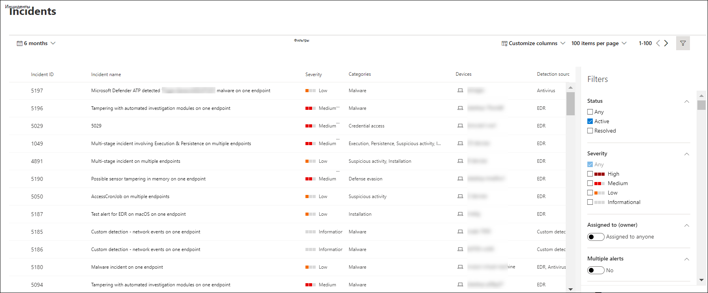

# Просмотр и организация очереди Microsoft Defender для инцидентов конечной точкиView and organize the Microsoft Defender for Endpoint Incidents queue

[!INCLUDE [Microsoft 365 Defender rebranding](../../includes/microsoft-defender.md)]

**Область применения:****Applies to:**
- [Microsoft Defender для конечной точкиMicrosoft Defender for Endpoint](https://go.microsoft.com/fwlink/?linkid=2154037)
- [Microsoft 365 DefenderMicrosoft 365 Defender](https://go.microsoft.com/fwlink/?linkid=2118804)

> Хотите испытать Defender для конечной точки?Want to experience Defender for Endpoint? [Зарегистрився для бесплатной пробной.Sign up for a free trial.](https://www.microsoft.com/microsoft-365/windows/microsoft-defender-atp?ocid=docs-wdatp-pullalerts-abovefoldlink) 

Очередь **Инциденты показывает** коллекцию инцидентов, которые были помечены с устройств в сети.The **Incidents queue** shows a collection of incidents that were flagged from devices in your network. Это помогает сортировать инциденты для определения приоритетности и создания обоснованного ответного решения информационной безопасности.It helps you sort through incidents to prioritize and create an informed cybersecurity response decision.

По умолчанию в очереди отображаются инциденты, замеченные за последние 30 дней, а последний инцидент отображается в верхней части списка, что помогает сначала увидеть последние инциденты.By default, the queue displays incidents seen in the last 30 days, with the most recent incident showing at the top of the list, helping you see the most recent incidents first.

Существует несколько вариантов настройки представления очереди Incidents.There are several options you can choose from to customize the Incidents queue view. 

В верхней части навигации можно:On the top navigation you can:
- Настройка столбцов для добавления или удаления столбцовCustomize columns to add or remove columns 
- Изменение количества элементов для просмотра на страницеModify the number of items to view per page
- Выберите элементы, которые будут показываться на страницеSelect the items to show per page
- Пакетный выбор инцидентов для назначенияBatch-select the incidents to assign 
- Перемещение между страницамиNavigate between pages
- Применение фильтровApply filters

## Сортировка и фильтрация очереди инцидентовSort and filter the incidents queue
Вы можете применить следующие фильтры, чтобы ограничить список инцидентов и получить более целенаправленное представление.You can apply the following filters to limit the list of incidents and get a more focused view.

### SeveritySeverity

Серьезность инцидентаIncident severity | ОписаниеDescription
:---|:---
ВысокийHigh  (Красный)(Red) | Угрозы, часто связанные с расширенными постоянными угрозами (APT).Threats often associated with advanced persistent threats (APT). Эти инциденты указывают на высокий риск из-за серьезности ущерба, который они могут нанести устройствам.These incidents indicate a high risk due to the severity of damage they can inflict on devices.
СреднийMedium  (Оранжевый)(Orange) | В организации редко наблюдаются угрозы, такие как аномальное изменение реестра, выполнение подозрительных файлов и наблюдаемые действия, характерные для стадий атаки.Threats rarely observed in the organization, such as anomalous registry change, execution of suspicious files, and observed behaviors typical of attack stages.
НизкийLow  (Желтый)(Yellow) | Угрозы, связанные с распространенными вредоносными программами и средствами взлома, которые не обязательно указывают на передовую угрозу, направленную на организацию.Threats associated with prevalent malware and hack-tools that do not necessarily indicate an advanced threat targeting the organization.
ИнформационнаяInformational  (Серый)(Grey) | Информационные инциденты не могут считаться вредными для сети, но могут быть хорошими для отслеживания.Informational incidents might not be considered harmful to the network but might be good to keep track of.

## Кому назначеноAssigned to
Вы можете отфильтровать список, выбрав по назначению кому-либо или выбрав те, которые назначены вам.You can choose to filter the list by selecting assigned to anyone or ones that are assigned to you.

### CategoryCategory
Инциденты классифицируются в зависимости от описания стадии, на которой находится цепочка убийств в области кибербезопасности.Incidents are categorized based on the description of the stage by which the cybersecurity kill chain is in. Это представление помогает аналитику угроз определить приоритет, срочность и соответствующую стратегию реагирования для развертывания на основе контекста.This view helps the threat analyst to determine priority, urgency, and corresponding response strategy to deploy based on context.

### СостояниеStatus
Чтобы узнать, какие из них активны или решены, вы можете ограничить список инцидентов, отображаемых на основе их состояний.You can choose to limit the list of incidents shown based on their status to see which ones are active or resolved.

### Конфиденциальность данныхData sensitivity
Этот фильтр используется для демонстрации инцидентов, содержащих метки конфиденциальности.Use this filter to show incidents that contain sensitivity labels.

## Имя инцидентаIncident naming

Чтобы сразу понять область инцидента, имена инцидентов автоматически создаются на основе атрибутов оповещений, таких как количество затронутых конечных точек, пострадавших пользователей, источников обнаружения или категорий.To understand the incident's scope at a glance, incident names are automatically generated based on alert attributes such as the number of endpoints affected, users affected, detection sources or categories.

Например: *многоэтапный инцидент на нескольких конечных точках, сообщаемой несколькими источниками.*For example: *Multi-stage incident on multiple endpoints reported by multiple sources.*

> [!NOTE]
> Инциденты, существовающие до начала автоматического именования инцидентов, будут сохранять свое имя.Incidents that existed prior the rollout of automatic incident naming will retain their name.

## См. такжеSee also
- [Очередь инцидентовIncidents queue](https://docs.microsoft.com/microsoft-365/security/defender-endpoint/view-incidents-queue)
- [Управление инцидентамиManage incidents](manage-incidents.md)
- [Исследование инцидентовInvestigate incidents](investigate-incidents.md)

