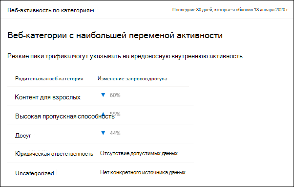
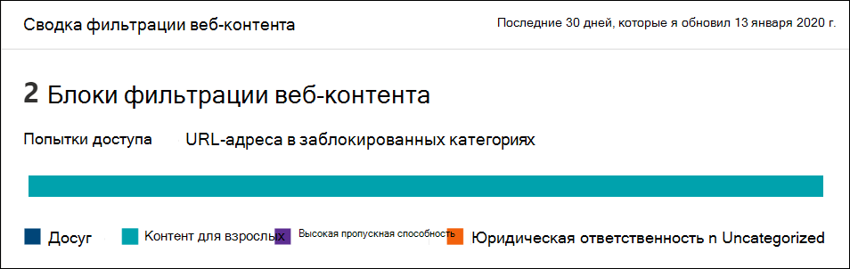
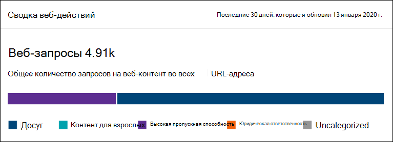
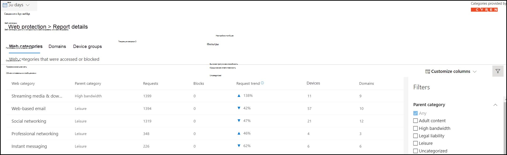

# Фильтрация веб-контента

[!INCLUDE [Microsoft 365 Defender rebranding](../../includes/microsoft-defender.md)]

**Область применения:**
- [Microsoft Defender для конечной точки](https://go.microsoft.com/fwlink/p/?linkid=2146631)
- [Microsoft 365 Defender](https://go.microsoft.com/fwlink/?linkid=2118804)

> [!IMPORTANT]
> **Фильтрация веб-контента в настоящее время является общедоступным предварительным просмотром** 
> Эта версия предварительного просмотра предоставляется без соглашения об уровне обслуживания и не рекомендуется для рабочих нагрузок. Некоторые функции могут не поддерживаться или иметь ограниченные возможности.
> Дополнительные сведения см. в [веб-сайте Microsoft Defender для функций предварительного просмотра конечных точек.](preview.md)

>Хотите испытать Microsoft Defender для конечной точки? [Зарегистрився для бесплатной пробной.](https://www.microsoft.com/microsoft-365/windows/microsoft-defender-atp?ocid=docs-wdatp-main-abovefoldlink&rtc=1)

Фильтрация веб-контента является частью возможностей [веб-защиты](web-protection-overview.md) в Microsoft Defender для конечной точки. Это позволяет организации отслеживать и регулировать доступ к веб-сайтам в зависимости от их категорий контента. Многие из этих веб-сайтов, хотя и не являются вредоносными, могут быть проблематичными из-за правил соответствия требованиям, использования пропускной способности или других проблем.

Настройка политик в группах устройств для блокировки определенных категорий. Блокировка категории не позволяет пользователям в определенных группах устройств получать доступ к URL-адресам, связанным с этой категорией. Для любой категории, которая не заблокирована, URL-адреса проверяются автоматически. Пользователи могут получать доступ к URL-адресам без сбоев, и вы соберите статистику доступа для создания более настраиваемого решения по политике. Пользователи увидят блок-уведомление, если элемент на просматриваемой странице вызывает заблокированный ресурс.

Фильтрация веб-контента доступна в основных веб-браузерах с блоками, выполняемыми Защитник Windows SmartScreen (Microsoft Edge) и Network Protection (Chrome, Firefox, Brave и Opera). Дополнительные сведения о поддержке браузера см. в разделе Предварительные условия.

Обобщение преимуществ:

- Пользователям не позволяется получать доступ к веб-сайтам в заблокированных категориях, независимо от того, просматривают ли они веб-сайты на локальном сайте или в
- Удобно развертывать политики для групп пользователей с помощью групп устройств, определенных в настройках управления доступом на основе ролей [Microsoft Defender для конечных точек доступа.](https://docs.microsoft.com/microsoft-365/security/defender-endpoint/rbac)
- Доступ к веб-отчетам в том же центральном расположении, с видимостью над фактическими блоками и веб-использованием

## Взаимодействие с пользователем

Возможность блокировки для браузеров, поддерживаемых третьей стороной, предоставляется сетевой защитой, которая предоставляет тост на уровне системы, уведомляющий пользователя о заблокированном подключении. 

Для более удобной работы в браузере рассмотрите возможность использования Microsoft Edge.

## Предварительные требования

Перед тем как попробовать эту функцию, убедитесь, что у вас есть следующие требования:

- Windows 10 Корпоративная E5 лицензия или Microsoft 365 E3 + Microsoft 365 E5 Надстройка безопасности.
- Доступ к порталу Центра безопасности Microsoft Defender
- Устройства под управлением Юбилейного обновления Windows 10 (версия 1607) или более поздней версии с последним обновлением MoCAMP.

Если Защитник Windows SmartScreen не включен, защита сети берет на себя блокировку. Для этого требуется [включение сетевой защиты](enable-network-protection.md) на устройстве. Chrome, Firefox, Brave и Opera в настоящее время являются 3-й стороной браузеров, в которых эта функция включена.

## Обработка данных

Мы будем следить за тем регионом, который вы выбрали для использования в качестве части параметров обработки данных [в Microsoft Defender для конечных точек.](https://docs.microsoft.com/microsoft-365/security/defender-endpoint/data-storage-privacy) Ваши данные не покидают центр обработки данных в этом регионе. Кроме того, ваши данные не будут делиться с любыми сторонними сторонами, в том числе с нашими поставщиками данных.

## Включив фильтрацию веб-контента

В левом меню навигации выберите Параметры > **общие > расширенные функции**. Прокрутите вниз, пока не увидите запись для **фильтрации веб-контента.** Переключение переключателя на **параметры "Включен"** **и "Сохранение".**

### Настройка политик фильтрации веб-контента

Политики фильтрации веб-контента указывают, какие категории сайтов заблокированы, на каких группах устройств. Чтобы управлять политиками, перейдите в **параметры > правила > фильтрации веб-контента.**

С помощью фильтра можно найти политики, содержащие определенные заблокированные категории или применяемые к определенным группам устройств.

### Создание политики

Чтобы добавить новую политику:

1. Выберите **Добавить политику** на странице **фильтрации веб-контента** в **Параметры**.
2. Укажите имя.
3. Выберите категории для блокировки. Используйте значок расширения, чтобы полностью расширить каждую родительную категорию и выбрать определенные категории веб-контента.
4. Укажите область политики. Выберите группы устройств, чтобы указать, где применять политику. Доступ к веб-сайтам в выбранных категориях будет препятствовать только устройствам в выбранных группах устройств.
5. Просмотрите сводку и сохраните политику. Обновление политики может занять до 2 часов для применения к выбранным устройствам.

Совет. Можно развернуть политику без выбора какой-либо категории в группе устройств. Это действие создаст политику только аудита, которая поможет вам понять поведение пользователей перед созданием политики блокировки.

>[!NOTE]
>При одновременном удалении политики или изменении групп устройств это может привести к задержке развертывания политики.

>[!IMPORTANT]
>Блокировка категории "Uncategorized" может привести к неожиданным и нежелательным результатам.  

### Разрешить определенные веб-сайты

Можно переопредить заблокированную категорию в фильтрации веб-контента, чтобы разрешить один сайт, создав настраиваемую политику индикатора. Настраиваемая политика индикатора вытемеет политику фильтрации веб-контента, если она применяется к группе устройств, о чем идет речь.

1. Создание настраиваемого индикатора в Центре безопасности защитника Майкрософт, перенастроив URL-адрес и элемент добавления  >    >  **индикаторов**  >  **параметров домена**
2. Ввод домена сайта
3. Установите действие политики, чтобы **разрешить**.  

### Неточности отчетности

Если вы столкнулись с доменом, который был неправильно классифицированы, вы можете сообщить о неточности непосредственно нам со страницы отчетов о фильтрации веб-контента. Эта функция доступна только в новом центре безопасности Microsoft 365 (security.microsoft.com).

Чтобы сообщить о неточности, перейдите по ссылке Отчеты > веб> сведения о фильтрации **веб-контента > доменах**. На вкладке доменов отчетов о фильтрации веб-контента вы увидите эллипсис рядом с каждым из доменов. Наведите курсор над этим эллипсисом и выберите **отчет о неточности**.

Откроется панель, на которой можно выбрать приоритет и добавить дополнительные сведения, такие как предлагаемая категория для повторной классификации. После завершения формы выберите **Отправить**. Наша команда рассмотрит запрос в течение одного делового дня. Для немедленной разблокировки создайте [настраиваемый индикатор допуска.](indicator-ip-domain.md)

## Карточки фильтрации веб-контента и сведения

Выберите **Отчеты > для** просмотра карт с информацией о фильтрации веб-контента и защите веб-угроз. В следующих карточках приводится сводная информация о фильтрации веб-контента.

### Веб-активность по категориям

На этой карте перечислены родительские категории веб-контента с наибольшим увеличением или уменьшением числа попыток доступа. Понимание резких изменений шаблонов веб-активности в организации за последние 30 дней, 3 месяца или 6 месяцев. Выберите имя категории, чтобы просмотреть дополнительные сведения.

В первые 30 дней использования этой функции у организации может не хватить данных для отображения этих сведений.

### Сводная карта фильтрации веб-контента

Эта карта отображает распределение попыток заблокированного доступа по различным родительским категориям веб-контента. Выберите один из цветных баров, чтобы просмотреть дополнительные сведения о определенной родительской веб-категории.

### Сводная карта веб-действий

Эта карта отображает общее количество запросов на веб-контент во всех URL-адресах.

### Просмотр сведений о карточке

Вы можете получить доступ к данным **Отчета** для каждой карты, выбрав строку таблицы или цветную планку из диаграммы на карте. Страница отчетов для каждой карты содержит обширные статистические данные о категориях веб-контента, доменах веб-сайтов и группах устройств.

- **Веб-категории:** Списки категорий веб-контента, у них были попытки доступа в организации. Выберите определенную категорию, чтобы открыть сводную вылетную информацию.

- **Домены**. Списки веб-доменов, которые были доступны или заблокированы в вашей организации. Выберите определенный домен, чтобы просмотреть подробные сведения об этом домене.

- **Группы устройств:** списки всех групп устройств, которые создали веб-активность в организации

Чтобы выбрать период времени, используйте фильтр диапазона времени в верхней части слева от страницы. Вы также можете фильтровать сведения или настраивать столбцы. Выберите строку, чтобы открыть флайер с дополнительными сведениями о выбранном элементе.

## Ошибки и проблемы

### Ограничения и известные проблемы в этом предварительном просмотре

- Только Microsoft Edge поддерживается, если конфигурация ОС вашего устройства является Server (cmd > Systeminfo > конфигурации ОС). Защита сети поддерживается только в режиме Inspect на устройствах Server, который отвечает за безопасность трафика в поддерживаемых браузерах сторон.

- Ненаверенные устройства будут иметь неправильные данные, показанные в отчете. В отчете > групп устройств можно увидеть строку с пустым полем группы устройств. Эта группа содержит ненаписаные устройства перед их вложением в указанную группу. В отчете для этой строки может не содержаться точное количество устройств или количество доступа.

## Статьи по теме

- [Обзор веб-защиты](web-protection-overview.md)
- [Защита от веб-угроз](web-threat-protection.md)
- [Мониторинг веб-безопасности](web-protection-monitoring.md)
- [Реагирование на веб-угрозы](web-protection-response.md)
