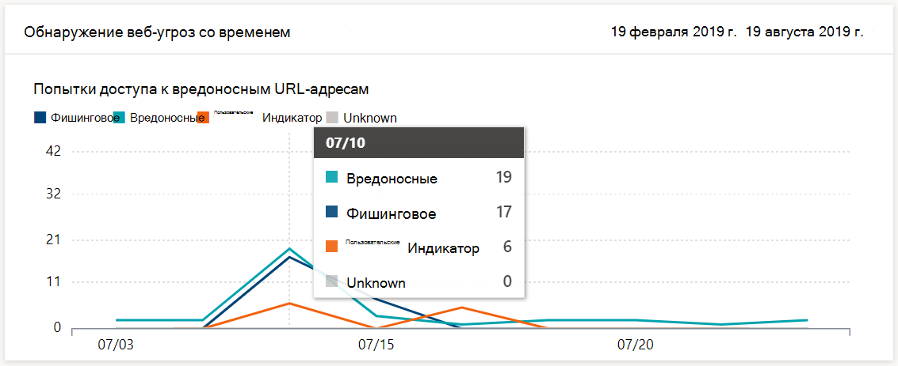
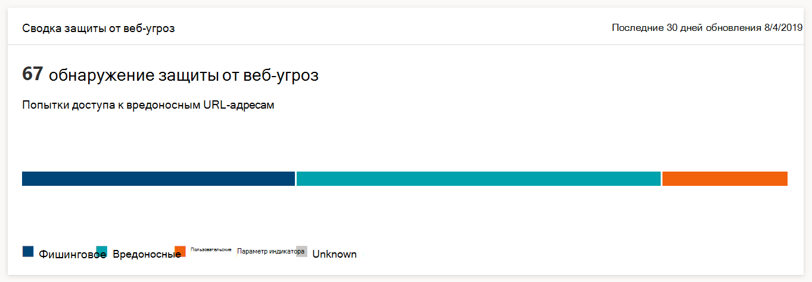

# Мониторинг безопасности просмотра веб-страницMonitor web browsing security

[!INCLUDE [Microsoft 365 Defender rebranding](../../includes/microsoft-defender.md)]

**Область применения:****Applies to:**
- [Microsoft Defender для конечной точкиMicrosoft Defender for Endpoint](https://go.microsoft.com/fwlink/p/?linkid=2154037)
- [Microsoft 365 DefenderMicrosoft 365 Defender](https://go.microsoft.com/fwlink/?linkid=2118804)

>Хотите испытать Microsoft Defender для конечной точки?Want to experience Microsoft Defender for Endpoint? [Зарегистрився для бесплатной пробной.Sign up for a free trial.](https://www.microsoft.com/microsoft-365/windows/microsoft-defender-atp?ocid=docs-wdatp-main-abovefoldlink&rtc=1)

Веб-защита позволяет отслеживать безопасность просмотра веб-страниц в  организации с помощью отчетов > веб-защиты в Центр безопасности в Microsoft Defender.Web protection lets you monitor your organization’s web browsing security through reports under **Reports > Web protection** in the Microsoft Defender Security Center. Отчет содержит карточки, которые предоставляют статистику обнаружения веб-угроз.The report contains cards that provide web threat detection statistics.

- Обнаружение **веб-угроз** со временем — эта карта тренда отображает количество веб-угроз, обнаруженных по типу в течение выбранного периода времени (Последние 30 дней, Последние 3 месяца, Последние 6 месяцев)**Web threat protection detections over time** - this trending card displays the number of web threats detected by type during the selected time period (Last 30 days, Last 3 months, Last 6 months)
 
    

- **Сводка по** защите от веб-угроз — эта карта отображает общее количество обнаружений веб-угроз за последние 30 дней, демонстрируя распространение различных типов веб-угроз.**Web threat protection summary** - this card displays the total web threat detections in the past 30 days, showing distribution across the different types of web threats. Выбор фрагмента открывает список доменов, найденных на вредоносных или нежелательных веб-сайтах.Selecting a slice opens the list of the domains that were found with malicious or unwanted websites.

    

>[!Note]
>Это может занять до 12 часов, прежде чем блок будет отражен в картах или списке домена.It can take up to 12 hours before a block is reflected in the cards or the domain list.

## Типы веб-угрозTypes of web threats

Веб-защита классифицируют вредоносные и нежелательные веб-сайты как:Web protection categorizes malicious and unwanted websites as:

- **Фишинг —** веб-сайты, содержащие поддельные веб-формы и другие механизмы фишинга, предназначенные для обмана пользователей в разглашение учетных данных и других конфиденциальных сведений**Phishing** - websites that contain spoofed web forms and other phishing mechanisms designed to trick users into divulging credentials and other sensitive information
- **Вредоносные** — веб-сайты с вредоносными программами и кодом эксплойтов**Malicious** - websites that host malware and exploit code
- **Настраиваемый индикатор** — веб-сайты, URL-адреса или домены которых добавлены в [настраиваемый](manage-indicators.md) список индикаторов для блокировки**Custom indicator** - websites whose URLs or domains you've added to your [custom indicator list](manage-indicators.md) for blocking

## Просмотр списка доменовView the domain list

Выберите определенную категорию веб-угроз в сводной карте **защиты** от веб-угроз, чтобы открыть страницу **Домены.**Select a specific web threat category in the **Web threat protection summary** card to open the **Domains** page. На этой странице отображается список доменов этой категории угроз.This page displays the list of the domains under that threat category. На странице приводится следующая информация для каждого домена:The page provides the following information for each domain:

- **Количество запросов** на URL-адреса в домене**Access count** - number of requests for URLs in the domain
- **Блоки** — количество запросов было заблокировано**Blocks** - number of times requests were blocked
- **Тенденция доступа** — изменение количества попыток доступа**Access trend** - change in number of access attempts
- **Категория угрозы** — тип веб-угрозы**Threat category** - type of web threat
- **Устройства** — число устройств с попытками доступа**Devices** - number of devices with access attempts

Выберите домен, чтобы просмотреть список устройств, которые пытались получить доступ к URL-адресам в этом домене, и список URL-адресов.Select a domain to view the list of devices that have attempted to access URLs in that domain and the list of URLs.

## Статьи по темеRelated topics

- [Обзор веб-защитыWeb protection overview](web-protection-overview.md)
- [Фильтрация веб-содержимогоWeb content filtering](web-content-filtering.md)
- [Защита от веб-угрозWeb threat protection](web-threat-protection.md)
- [Реагирование на веб-угрозыRespond to web threats](web-protection-response.md)
