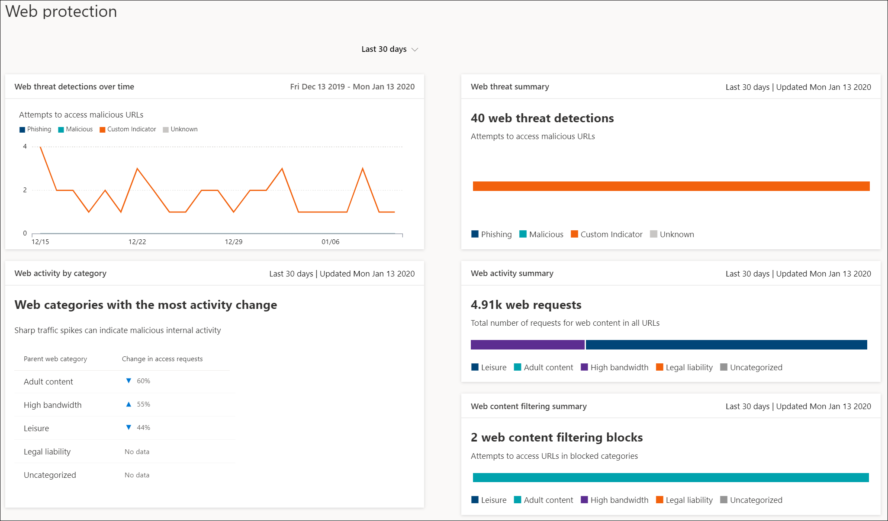

# Веб-защита

[!INCLUDE [Microsoft 365 Defender rebranding](../../includes/microsoft-defender.md)]

**Область применения:**
- [Microsoft Defender для конечной точки](https://go.microsoft.com/fwlink/p/?linkid=2154037)
- [Microsoft 365 Defender](https://go.microsoft.com/fwlink/?linkid=2118804)

>Хотите испытать Microsoft Defender для конечной точки? [Зарегистрився для бесплатной пробной.](https://www.microsoft.com/microsoft-365/windows/microsoft-defender-atp?ocid=docs-wdatp-main-abovefoldlink&rtc=1)

Веб-защита в Microsoft Defender для конечной  точки — это возможность, которая состоит из защиты от веб-угроз и фильтрации [веб-контента.](web-content-filtering.md) Веб-защита позволяет обезопасить устройства от веб-угроз и регулировать нежелательный контент. Отчеты о веб-защите можно найти в Центре безопасности Защитника Майкрософт, перейдите к отчетам **> веб-защиты.**

## Защита от веб-угроз

Карты, которые составляют защиту от веб-угроз, — это обнаружение веб-угроз со **временем** и **сводка веб-угроз.**

Защита от веб-угроз включает в себя:
- Всеобъемлющая видимость веб-угроз, влияющих на организацию
- Возможности исследования действий с угрозами, связанными с веб-сайтом, с помощью оповещений и комплексных профилей URL-адресов и устройств, которые имеют доступ к этим URL-адресам.
- Полный набор функций безопасности, отслеживает общие тенденции доступа к вредоносным и нежелательным веб-сайтам

## Фильтрация веб-контента

Карты, которые включают фильтрацию веб-контента, это веб-активность по категориям, сводка фильтрации веб-контента **и** **сводка веб-активности.**

Фильтрация веб-контента включает в себя:
- Пользователям не позволяется получать доступ к веб-сайтам в заблокированных категориях, независимо от того, просматривают ли они веб-сайты на локальном сайте или в
- Вы можете удобно развернуть разнообразные политики для различных групп пользователей с помощью групп устройств, определенных в настройках управления доступом на основе ролей [Microsoft Defender для конечных точек.](https://docs.microsoft.com/microsoft-365/security/defender-endpoint/rbac)
- Вы можете получить доступ к веб-отчетам в том же центральном расположении, с видимостью над фактическими блоками и веб-использованием

## В этом разделе

Статья | Описание
:---|:---
[Защита от веб-угроз](web-threat-protection.md) | Остановите доступ к фишинг-сайтам, векторам вредоносных программ, сайтам эксплойтов, сайтам с недоверием или низкой репутации, а также заблокированным сайтам.
[Фильтрация веб-контента](web-content-filtering.md) | Отслеживание и регулирование доступа к веб-сайтам в зависимости от категорий контента.
