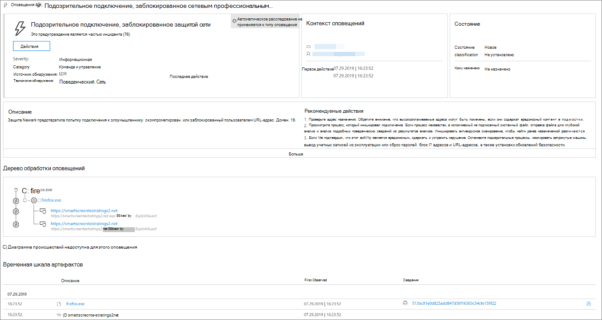
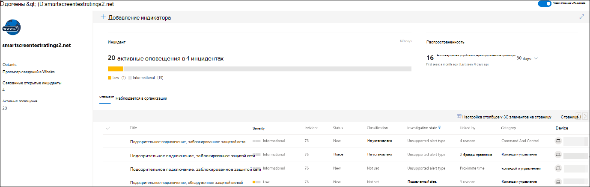
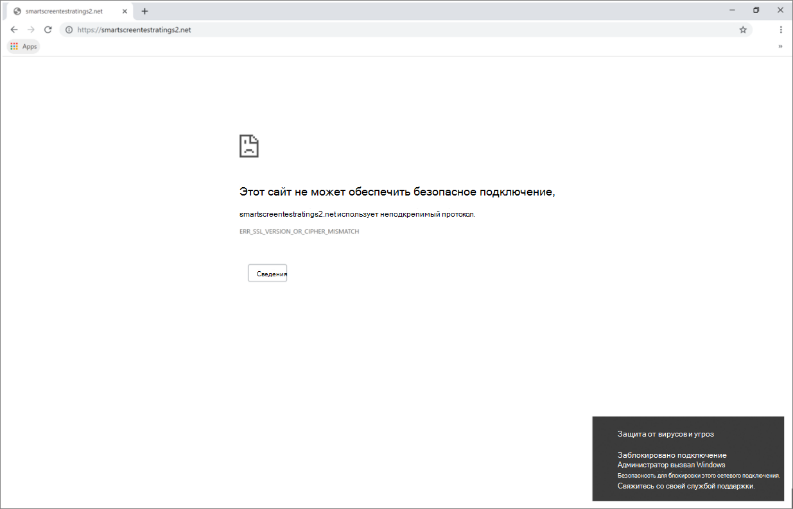

# Реагирование на веб-угрозыRespond to web threats

[!INCLUDE [Microsoft 365 Defender rebranding](../../includes/microsoft-defender.md)]

**Область применения:****Applies to:**
- [Microsoft Defender для конечной точкиMicrosoft Defender for Endpoint](https://go.microsoft.com/fwlink/p/?linkid=2154037)
- [Microsoft 365 DefenderMicrosoft 365 Defender](https://go.microsoft.com/fwlink/?linkid=2118804)

>Хотите испытать Microsoft Defender для конечной точки?Want to experience Microsoft Defender for Endpoint? [Зарегистрився для бесплатной пробной.Sign up for a free trial.](https://www.microsoft.com/microsoft-365/windows/microsoft-defender-atp?ocid=docs-wdatp-main-abovefoldlink&rtc=1)

Веб-защита в Microsoft Defender для конечной точки позволяет эффективно исследовать и реагировать на оповещения, относящиеся к вредоносным веб-сайтам и веб-сайтам в настраиваемом списке индикаторов.Web protection in Microsoft Defender for Endpoint lets you efficiently investigate and respond to alerts related to malicious websites and websites in your custom indicator list.

## Просмотр оповещений о веб-угрозахView web threat alerts
Microsoft Defender для конечной точки создает [следующие](manage-alerts.md) оповещения о вредоносной или подозрительной веб-активности:Microsoft Defender for Endpoint generates the following [alerts](manage-alerts.md) for malicious or suspicious web activity:
- **Подозрительное** подключение, заблокированное сетевой защитой— это предупреждение создается при попытке получить доступ  к вредоносному веб-сайту или веб-сайту в настраиваемом списке индикаторов, которая блокируется сетевой защитой в режиме *блокировки.***Suspicious connection blocked by network protection** — this alert is generated when an attempt to access a malicious website or a website in your custom indicator list is *stopped* by network protection in *block* mode
- **Подозрительное** подключение, обнаруженное сетевой защитой, — это предупреждение создается, когда попытка доступа к вредоносному  веб-сайту или веб-сайту в настраиваемом списке индикаторов обнаруживается защитой сети только в режиме аудита.**Suspicious connection detected by network protection** — this alert is generated when an attempt to access a malicious website or a website in your custom indicator list is detected by network protection in *audit only* mode

Каждое оповещение содержит следующие сведения:Each alert provides the following information: 
- Устройство, пытающееся получить доступ к заблокированным веб-сайтуDevice that attempted to access the blocked website
- Приложение или программа, используемая для отправки веб-запросаApplication or program used to send the web request
- Вредоносный URL-адрес или URL-адрес в настраиваемом списке индикаторовMalicious URL or URL in the custom indicator list
- Рекомендуемые действия для ответчиковRecommended actions for responders

>[!Note]
>Чтобы уменьшить объем оповещений, Microsoft Defender for Endpoint консолидирует обнаружения веб-угроз для одного домена на одном устройстве каждый день в одно оповещение.To reduce the volume of alerts, Microsoft Defender for Endpoint consolidates web threat detections for the same domain on the same device each day to a single alert. Только одно оповещение создается и подсчитываются в [отчете о защите веб-сайтов.](web-protection-monitoring.md)Only one alert is generated and counted into the [web protection report](web-protection-monitoring.md).

## Проверка сведений о веб-сайтеInspect website details
Вы можете погрузиться глубже, выбрав URL-адрес или домен веб-сайта в оповещении.You can dive deeper by selecting the URL or domain of the website in the alert. Это открывает страницу об этом КОНКРЕТНОМ URL-адресе или домене с различными сведениями, в том числе:This opens a page about that particular URL or domain with various information, including:
- Устройства, которые пытались получить доступ к веб-сайтуDevices that attempted to access website
- Инциденты и оповещения, связанные с веб-сайтомIncidents and alerts related to the website
- Как часто веб-сайт был замечен в событиях в организацииHow frequent the website was seen in events in your organization

    

[Дополнительные новости о страницах URL-адресов или сущности доменаLearn more about URL or domain entity pages](investigate-domain.md)

## Проверка устройстваInspect the device
Вы также можете проверить устройство, пытающееся получить доступ к заблокированным URL-адресам.You can also check the device that attempted to access a blocked URL. Выбор имени устройства на странице оповещений открывает страницу с подробной информацией об устройстве.Selecting the name of the device on the alert page opens a page with comprehensive information about the device.

[Дополнительные новости о страницах сущности устройстваLearn more about device entity pages](investigate-machines.md)

## Уведомления веб-браузера и Windows для конечных пользователейWeb browser and Windows notifications for end users

С помощью веб-защиты в Microsoft Defender для конечной точки конечным пользователям будет не мешать посещать вредоносные или нежелательные веб-сайты с помощью Microsoft Edge или других браузеров.With web protection in Microsoft Defender for Endpoint, your end users will be prevented from visiting malicious or unwanted websites using Microsoft Edge or other browsers. Так как блокировка выполняется с помощью [сетевой защиты,](network-protection.md)они увидят общую ошибку в веб-браузере.Because blocking is performed by [network protection](network-protection.md), they will see a generic error from the web browser. Они также увидят уведомление из Windows.They will also see a notification from Windows.

 *заблокированной в Microsoft Edge*
*Web threat blocked on Microsoft Edge*

 *Windows, заблокированной в Chrome*
*Web threat blocked on Chrome*

## Статьи по темеRelated topics
- [Обзор веб-защитыWeb protection overview](web-protection-overview.md)
- [Фильтрация веб-контентаWeb content filtering](web-content-filtering.md)
- [Защита от веб-угрозWeb threat protection](web-threat-protection.md)
- [Мониторинг веб-безопасностиMonitor web security](web-protection-monitoring.md)
