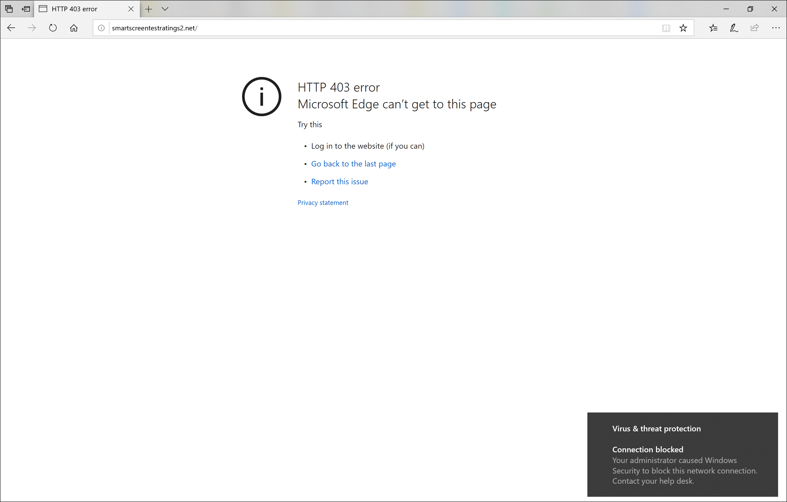

# Реагирование на веб-угрозы

[!INCLUDE [Microsoft 365 Defender rebranding](../../includes/microsoft-defender.md)]

**Область применения:**
- [Microsoft Defender для конечной точки](https://go.microsoft.com/fwlink/p/?linkid=2154037)
- [Microsoft 365 Defender](https://go.microsoft.com/fwlink/?linkid=2118804)

>Хотите испытать Microsoft Defender для конечной точки? [Зарегистрився для бесплатной пробной.](https://www.microsoft.com/microsoft-365/windows/microsoft-defender-atp?ocid=docs-wdatp-main-abovefoldlink&rtc=1)

Веб-защита в Microsoft Defender для конечной точки позволяет эффективно исследовать и реагировать на оповещения, относящиеся к вредоносным веб-сайтам и веб-сайтам в настраиваемом списке индикаторов.

## Просмотр оповещений о веб-угрозах
Microsoft Defender для конечной точки создает [следующие](manage-alerts.md) оповещения о вредоносной или подозрительной веб-активности:
- **Подозрительное** подключение, заблокированное сетевой защитой— это предупреждение создается при попытке получить доступ  к вредоносному веб-сайту или веб-сайту в настраиваемом списке индикаторов, которая блокируется сетевой защитой в режиме *блокировки.*
- **Подозрительное** подключение, обнаруженное сетевой защитой, — это предупреждение создается, когда попытка доступа к вредоносному  веб-сайту или веб-сайту в настраиваемом списке индикаторов обнаруживается защитой сети только в режиме аудита.

Каждое оповещение содержит следующие сведения: 
- Устройство, пытающееся получить доступ к заблокированным веб-сайту
- Приложение или программа, используемая для отправки веб-запроса
- Вредоносный URL-адрес или URL-адрес в настраиваемом списке индикаторов
- Рекомендуемые действия для ответчиков

>[!Note]
>Чтобы уменьшить объем оповещений, Microsoft Defender for Endpoint консолидирует обнаружения веб-угроз для одного домена на одном устройстве каждый день в одно оповещение. Только одно оповещение создается и подсчитываются в [отчете о защите веб-сайтов.](web-protection-monitoring.md)

## Проверка сведений о веб-сайте
Вы можете погрузиться глубже, выбрав URL-адрес или домен веб-сайта в оповещении. Это открывает страницу об этом КОНКРЕТНОМ URL-адресе или домене с различными сведениями, в том числе:
- Устройства, которые пытались получить доступ к веб-сайту
- Инциденты и оповещения, связанные с веб-сайтом
- Как часто веб-сайт был замечен в событиях в организации

    

[Дополнительные новости о страницах URL-адресов или сущности домена](investigate-domain.md)

## Проверка устройства
Вы также можете проверить устройство, пытающееся получить доступ к заблокированным URL-адресам. Выбор имени устройства на странице оповещений открывает страницу с подробной информацией об устройстве.

[Дополнительные новости о страницах сущности устройства](investigate-machines.md)

## Уведомления веб-браузера и Windows для конечных пользователей

С помощью веб-защиты в Microsoft Defender для конечной точки конечным пользователям будет не мешать посещать вредоносные или нежелательные веб-сайты с помощью Microsoft Edge или других браузеров. Так как блокировка выполняется с помощью [сетевой защиты,](network-protection.md)они увидят общую ошибку в веб-браузере. Они также увидят уведомление из Windows.

 *заблокированной в Microsoft Edge*

 *Windows, заблокированной в Chrome*

## Статьи по теме
- [Обзор веб-защиты](web-protection-overview.md)
- [Фильтрация веб-содержимого](web-content-filtering.md)
- [Защита от веб-угроз](web-threat-protection.md)
- [Мониторинг безопасности в Интернете](web-protection-monitoring.md)
