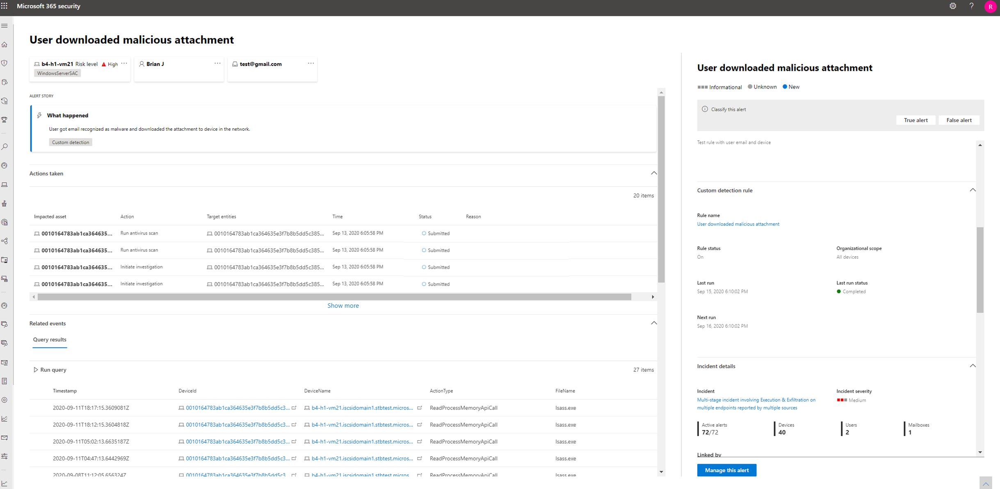

# <a name="migrate-advanced-hunting-queries-from-microsoft-defender-for-endpoint"></a>Перенос расширенных запросов на охоту из Microsoft Defender для конечной точки

[!INCLUDE [Microsoft 365 Defender rebranding](../includes/microsoft-defender.md)]

**Область применения:**
- Microsoft 365 Defender

Переместите расширенные процессы охоты из Microsoft Defender для конечной точки, чтобы активно искать угрозы с помощью более широкого набора данных. В Microsoft 365 Defender вы получаете доступ к данным из других решений безопасности Microsoft 365, включая:

- Microsoft Defender для конечной точки
- Microsoft Defender для Office 365
- Microsoft Cloud App Security
- Microsoft Defender для удостоверений

>[!NOTE]
>Большинство клиентов Microsoft Defender для конечных точек могут [использовать Microsoft 365 Defender без дополнительных лицензий.](prerequisites.md#licensing-requirements) Чтобы приступить к переходу передовых процессов охоты из Defender для конечной точки, включите [Microsoft 365 Defender](m365d-enable.md).

Вы можете перейти, не затрагивая существующие рабочий процессы Defender для конечной точки. Сохраненные запросы остаются нетронутыми, а пользовательские правила обнаружения продолжают запускать и создавать оповещения. Однако они будут видны в Microsoft 365 Defender. 

## <a name="schema-tables-in-microsoft-365-defender-only"></a>Таблицы схемы только в Microsoft 365 Defender
Продвинутая схема охоты [Microsoft 365 Defender](advanced-hunting-schema-tables.md) содержит дополнительные таблицы, содержащие данные из различных решений безопасности Microsoft 365. Следующие таблицы доступны только в Microsoft 365 Defender:

| Имя таблицы | Описание |
|------------|-------------|
| [AlertEvidence](advanced-hunting-alertevidence-table.md) | Файлы, IP-адреса, URL-адреса, пользователи или устройства, связанные с оповещениями |
| [AlertInfo](advanced-hunting-alertinfo-table.md) | Оповещения от Microsoft Defender для конечной точки, Microsoft Defender для Office 365, Microsoft Cloud App Security и Microsoft Defender for Identity, включая сведения о серьезности и категориях угроз  |
| [AppFileEvents](advanced-hunting-appfileevents-table.md) | Действия, связанные с файлами в облачных приложениях и службах |
| [EmailAttachmentInfo](advanced-hunting-emailattachmentinfo-table.md) | Сведения о файлах, присоединенных к электронным письмам |
| [EmailEvents](advanced-hunting-emailevents-table.md) | События электронной почты Microsoft 365, включая доставку электронной почты и блокировку событий |
| [EmailPostDeliveryEvents](advanced-hunting-emailpostdeliveryevents-table.md) | События безопасности, которые происходят после доставки, после того, как Microsoft 365 доставила сообщения электронной почты в почтовый ящик получателя |
| [EmailUrlInfo](advanced-hunting-emailurlinfo-table.md) | Сведения об URL-адресах в электронных письмах |
| [IdentityDirectoryEvents](advanced-hunting-identitydirectoryevents-table.md) | События с участием локального контроллера домена под управлением Active Directory (AD). В этой таблице описывается ряд событий, связанных с удостоверением, и системных событий на контроллере домена. |
| [IdentityInfo](advanced-hunting-identityinfo-table.md) | Сведения об учетных записях из различных источников, включая Azure Active Directory |
| [IdentityLogonEvents](advanced-hunting-identitylogonevents-table.md) | События проверки подлинности в службах Active Directory и Microsoft online |
| [IdentityQueryEvents](advanced-hunting-identityqueryevents-table.md) | Запросы для объектов Active Directory, таких как пользователи, группы, устройства и домены |

>[!IMPORTANT]
> Запросы и настраиваемые обнаружения, которые используют таблицы схем, доступные только в Microsoft 365 Defender, можно просматривать только в Microsoft 365 Defender.

## <a name="map-devicealertevents-table"></a>Таблица Map DeviceAlertEvents
Таблицы `AlertInfo` `AlertEvidence` и таблицы `DeviceAlertEvents` заменяют таблицу в схеме Microsoft Defender для конечной точки. Помимо данных о оповещениях о устройствах, эти две таблицы включают данные о оповещениях для удостоверений, приложений и электронных писем.

Используйте следующую таблицу, чтобы проверить, как столбцы сое всего мира сое and `DeviceAlertEvents` `AlertInfo` `AlertEvidence` tables.

>[!TIP]
>Помимо столбцов в следующей таблице, в таблице содержится множество других столбцов, которые предоставляют более целостную картину оповещений из `AlertEvidence` различных источников. [См. все столбцы AlertEvidence](advanced-hunting-alertevidence-table.md) 

| Колонка DeviceAlertEvents | Где найти те же данные в Microsoft 365 Defender |
|-------------|-----------|-------------|-------------|
| `AlertId` | `AlertInfo` и  `AlertEvidence` таблицы |
| `Timestamp` | `AlertInfo` и  `AlertEvidence` таблицы |
| `DeviceId` | `AlertEvidence` таблица |
| `DeviceName` | `AlertEvidence` таблица |
| `Severity` | `AlertInfo` таблица |
| `Category` | `AlertInfo` таблица |
| `Title` | `AlertInfo` таблица |
| `FileName` | `AlertEvidence` таблица |
| `SHA1` | `AlertEvidence` таблица |
| `RemoteUrl` | `AlertEvidence` таблица |
| `RemoteIP` | `AlertEvidence` таблица |
| `AttackTechniques` | `AlertInfo` таблица |
| `ReportId` | Этот столбец обычно используется в Microsoft Defender для конечной точки для поиска связанных записей в других таблицах. В Microsoft 365 Defender можно получить связанные данные непосредственно из `AlertEvidence` таблицы. |
| `Table` | Этот столбец обычно используется в Microsoft Defender для конечной точки для получения дополнительных сведений о событиях в других таблицах. В Microsoft 365 Defender можно получить связанные данные непосредственно из `AlertEvidence` таблицы. |

## <a name="adjust-existing-microsoft-defender-for-endpoint-queries"></a>Настройка существующих запросов Microsoft Defender для запросов конечной точки
Запросы Microsoft Defender для конечных точек будут работать как есть, если они не ссылатся на `DeviceAlertEvents` таблицу. Чтобы использовать эти запросы в Microsoft 365 Defender, внесите эти изменения:

- Замените `DeviceAlertEvents` `AlertInfo` .
- Присоединяйтесь `AlertInfo` к `AlertEvidence` таблицам и таблицам, чтобы получить `AlertId` эквивалентные данные.

### <a name="original-query"></a>Исходный запрос
Следующий запрос используется `DeviceAlertEvents` в Microsoft Defender для конечной точки для получения оповещений, которые включают _powershell.exe:_

```kusto
DeviceAlertEvents
| where Timestamp > ago(7d) 
| where AttackTechniques has "PowerShell (T1086)" and FileName == "powershell.exe"
```
### <a name="modified-query"></a>Измененный запрос
Следующий запрос был скорректирован для использования в Microsoft 365 Defender. Вместо того, чтобы проверять имя файла непосредственно из, он присоединяется и проверяет имя `DeviceAlertEvents` `AlertEvidence` файла в этой таблице.

```kusto
AlertInfo 
| where Timestamp > ago(7d) 
| where AttackTechniques has "PowerShell (T1086)" 
| join AlertEvidence on AlertId
| where FileName == "powershell.exe"
```

## <a name="migrate-custom-detection-rules"></a>Перенос пользовательских правил обнаружения

Когда правила Microsoft Defender для конечной точки редактированы в Microsoft 365 Defender, они продолжают функционировать так же, как и раньше, если в результате запрос смотрит только на таблицы устройств. 

Например, оповещения, созданные пользовательскими правилами обнаружения, которые по-прежнему будут доставляться в SIEM только таблицы устройств и создавать уведомления электронной почты, в зависимости от того, как вы настроили их в Microsoft Defender для конечной точки. Любые существующие правила подавления в Защитнике для конечной точки также будут продолжать применяться.

После изменения правила Defender для конечной точки, чтобы он запрашивал удостоверения и таблицы электронной почты, доступные только в Microsoft 365 Defender, правило автоматически перемещается в Microsoft 365 Defender. 

Оповещения, созданные правилом переноса:

- Больше не отображается на портале Защитник для конечной точки (Центр безопасности Защитника Майкрософт)
- Прекратите доставку в SIEM или создание уведомлений электронной почты. Чтобы обойти это изменение, настройте уведомления через Microsoft 365 Defender для получения оповещений. API [защитника Microsoft 365](api-incident.md) можно использовать для получения уведомлений о оповещениях об обнаружении клиентов или связанных с ними инцидентах.
- Правила подавления конечных точек microsoft Defender не будут подавлены. Чтобы предотвратить сгенерированию оповещений для определенных пользователей, устройств или почтовых ящиков, измените соответствующие запросы, чтобы исключить эти объекты явно.

Если изменить правило таким образом, вам будет предложено подтверждение до того, как будут применены такие изменения.

Новые оповещения, созданные с помощью настраиваемых правил обнаружения на портале Microsoft 365 Defender, отображаются на странице оповещений, которая содержит следующие сведения:

- Название и описание оповещений 
- Влияние активов
- Действия, принятые в ответ на предупреждение
- Результаты запроса, которые вызвали оповещение 
- Сведения о пользовательском правиле обнаружения 
 


## <a name="write-queries-without-devicealertevents"></a>Записывай запросы без DeviceAlertEvents

В схеме защитника Microsoft 365 предоставляются таблицы и таблицы для размещения разнообразного набора сведений, сопровождающих оповещения `AlertInfo` `AlertEvidence` из различных источников. 

Чтобы получить те же сведения оповещений, которые вы использовали для получения из таблицы в схеме Microsoft Defender для конечной точки, фильтруем таблицу, а затем присоединяем каждый уникальный ID со таблицей, которая предоставляет подробные сведения о событиях и `DeviceAlertEvents` `AlertInfo` `ServiceSource` `AlertEvidence` сущности. 

Пример запроса см. ниже:

```kusto
AlertInfo
| where Timestamp > ago(7d)
| where ServiceSource == "Microsoft Defender for Endpoint"
| join AlertEvidence on AlertId
```

Этот запрос дает гораздо больше столбцов, чем `DeviceAlertEvents` в схеме Microsoft Defender для конечной точки. Чтобы сохранить управляемые результаты, используйте для получения только `project` интересуемых столбцов. В примере ниже проектов столбцов, которые могут быть интересны при обнаружении в ходе расследования активности PowerShell:

```kusto
AlertInfo
| where Timestamp > ago(7d)
| where ServiceSource == "Microsoft Defender for Endpoint"
    and AttackTechniques has "powershell"
| join AlertEvidence on AlertId
| project Timestamp, Title, AlertId, DeviceName, FileName, ProcessCommandLine 
```

Если вы хотите фильтровать для определенных сущностей, участвующих в оповещениях, вы можете это сделать, указав тип объекта и значение, которое вы хотите `EntityType` фильтровать. В следующем примере ниже приводится пример определенного IP-адреса:

```kusto
AlertInfo
| where Title == "Insert_your_alert_title"
| join AlertEvidence on AlertId 
| where EntityType == "Ip" and RemoteIP == "192.88.99.01" 
```

## <a name="see-also"></a>См. также
- [Включение Microsoft 365 Defender](advanced-hunting-query-language.md)
- [Обзор расширенной охоты](advanced-hunting-overview.md)
- [Сведения о схеме](advanced-hunting-schema-tables.md)
- [Расширенный поиск в Microsoft Defender для конечной точки](/windows/security/threat-protection/microsoft-defender-atp/advanced-hunting-overview)