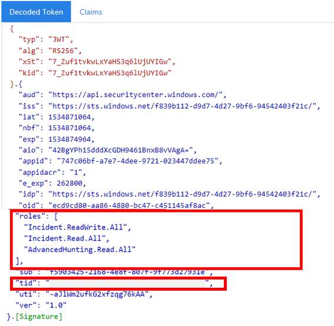

# <a name="create-an-app-to-access-microsoft-365-defender-apis-on-behalf-of-a-user"></a>Создание приложения для доступа к API Защитника Microsoft 365 от имени пользователя

[!INCLUDE [Microsoft 365 Defender rebranding](../includes/microsoft-defender.md)]

**Область применения:**

- Microsoft 365 Defender

> [!IMPORTANT]
> Некоторые сведения относятся к предварительным выпускам продуктов, которые могут быть существенно изменены до коммерческого выпуска. Корпорация Майкрософт не дает никаких гарантий, явных или подразумеваемых, относительно предоставленных здесь сведений.

На этой странице описывается создание приложения для получения программного доступа к Microsoft 365 Defender от имени одного пользователя.

Если вам необходим программный доступ к Microsoft 365 Defender без определенного пользователя (например, если вы пишете фоновое приложение или daemon), см. в раздел Создание приложения для доступа к [Microsoft 365 Defender](api-create-app-web.md)без пользователя . Если вам необходимо предоставить доступ для нескольких клиентов, например, если вы обслуживаете крупную организацию или группу клиентов, см. в приложении [Create a app with partner access to Microsoft 365 Defender API.](api-partner-access.md) Если вы не уверены, какой доступ вам нужен, см. [в этой ленте Начало](api-access.md)работы.

Microsoft 365 Defender предоставляет большую часть своих данных и действий с помощью набора программных API. Эти API помогают автоматизировать рабочий процесс и использовать возможности Microsoft 365 Defender. Этот доступ к API требует проверки подлинности OAuth2.0. Дополнительные сведения см. в [тексте OAuth 2.0 Authorization Code Flow.](/azure/active-directory/develop/active-directory-v2-protocols-oauth-code)

В общем, для использования этих API необходимо предпринять следующие действия:

- Создание приложения Azure Active Directory (Azure AD).
- Получение маркера доступа с помощью этого приложения.
- Используйте маркер для доступа к API Защитника Microsoft 365.

В этой статье объясняется, как:

- Создание приложения Azure AD
- Получите маркер доступа к Microsoft 365 Defender
- Проверка маркера

> [!NOTE]
> При доступе к API Защитника Microsoft 365 от имени пользователя вам потребуется правильные разрешения приложения и разрешения пользователей.

> [!TIP]
> Если у вас есть разрешение на выполнение действия на портале, у вас есть разрешение на выполнение действия в API.

## <a name="create-an-app"></a>Создать приложение

1. Во входе [в Azure](https://portal.azure.com) в качестве пользователя с **ролью глобального администратора.**

2. Перейдите к **регистрации приложений Azure Active**  >  **Directory**  >  **.**

   

3. В форме выберите имя приложения и введите следующую информацию для URI перенаправления, а затем **зарегистрируйтесь.**

   

   - **Тип приложения:** Общедоступный клиент
   - **Перенаправление URI:**https://portal.azure.com

4. На странице приложения выберите **API Permissions Add**  >  **permission**  >  **API,** которые моя организация использует >, введите Microsoft Threat Protection и выберите **Microsoft Threat Protection**. Теперь ваше приложение может получить доступ к Microsoft 365 Defender.

   > [!TIP]
   > *Microsoft Threat Protection* — это прежнее имя защитника Microsoft 365, которое не будет отображаться в исходном списке. Чтобы увидеть его, необходимо приступить к написанию его имени в текстовом окне.

   

   - Выберите **делегирование разрешений.** Выберите соответствующие разрешения для сценария **(например, Incident.Read),** а затем **добавьте разрешения.**

   

    > [!NOTE]
    > Необходимо выбрать соответствующие разрешения для сценария. *Чтение всех инцидентов* — это только пример. Чтобы определить, какое разрешение вам нужно, обратите внимание на раздел **Разрешения** в API, который вы хотите вызвать.
    >
    > Например, для [запуска расширенных запросов](api-advanced-hunting.md)выберите разрешение "Запуск расширенных запросов"; чтобы [изолировать устройство,](/windows/security/threat-protection/microsoft-defender-atp/isolate-machine)выберите разрешение "Изолировать машину".

5. Выберите **согласие администратора Гранта**. Каждый раз, когда вы добавляете разрешение, необходимо выбрать согласие администратора **Гранта,** чтобы оно вступает в силу.

   

6. Запись ID приложения и ID клиента в безопасном месте. Они перечислены в статье **Обзор на** странице приложения.

   

## <a name="get-an-access-token"></a>Получение токена доступа

Дополнительные сведения о маркерах Azure Active Directory см. в руководстве [Azure AD.](/azure/active-directory/develop/active-directory-v2-protocols-oauth-client-creds)

### <a name="get-an-access-token-using-powershell"></a>Получить маркер доступа с помощью PowerShell

```PowerShell
if(!(Get-Package adal.ps)) { Install-Package -Name adal.ps } # Install the ADAL.PS package in case it's not already present

$tenantId = '' # Paste your directory (tenant) ID here.
$clientId = '' # Paste your application (client) ID here.
$redirectUri = '' # Paste your app's redirection URI

$authority = "https://login.windows.net/$tenantId"
$resourceUrl = 'https://api.security.microsoft.com'

$response = Get-ADALToken -Resource $resourceUrl -ClientId $cleintId -RedirectUri $redirectUri -Authority $authority -PromptBehavior:Always
$response.AccessToken | clip

$response.AccessToken
```

## <a name="validate-the-token"></a>Проверка маркера

1. Скопируйте и вклейте маркер [в JWT,](https://jwt.ms) чтобы расшифровать его.
1. Убедитесь, что *утверждение ролей* в расшифроваемом маркере содержит нужные разрешения.

На следующем изображении можно увидеть расшифровав маркер, приобретенный из приложения, с разрешениями и ```Incidents.Read.All``` ```Incidents.ReadWrite.All``` ```AdvancedHunting.Read.All``` разрешениями:



## <a name="use-the-token-to-access-the-microsoft-365-defender-api"></a>Используйте маркер для доступа к API Защитника Microsoft 365

1. Выберите API, который вы хотите использовать (инциденты или расширенный поиск). Дополнительные сведения см. в [сайте Supported Microsoft 365 Defender API.](api-supported.md)
2. В http-запросе, который вы отправляете, задайте загон авторизации , Bearer является схемой авторизации, а маркер - `"Bearer" <token>` проверенным маркером.  
3. Срок действия маркера истекает в течение одного часа. За это время вы можете отправить несколько запросов с одним маркером.

В следующем примере показано, как отправить запрос для получения списка инцидентов **с C#**.

```C#
    var httpClient = new HttpClient();
    var request = new HttpRequestMessage(HttpMethod.Get, "https://api.security.microsoft.com/api/incidents");

    request.Headers.Authorization = new AuthenticationHeaderValue("Bearer", token);

    var response = httpClient.SendAsync(request).GetAwaiter().GetResult();
```

## <a name="related-articles"></a>Связанные статьи

- [Обзор API защитника Microsoft 365](api-overview.md)
- [Доступ к API защитника Microsoft 365](api-access.md)
- [Создание приложения "Hello world"](api-hello-world.md)
- [Создание приложения для доступа к Microsoft 365 Defender без пользователя](api-create-app-web.md)
- [Создание приложения с несколькими партнерами-партнерами для API Защитника Microsoft 365](api-partner-access.md)
- [Узнайте о ограничениях API и лицензировании](api-terms.md)
- [Понимание кодов ошибок](api-error-codes.md)
- [Авторизация OAuth 2.0 для входов пользователей и доступа к API](/azure/active-directory/develop/active-directory-v2-protocols-oauth-code)